<!--
author:    Mary Cavanagh; Carol Findell; Carole Greenes

email:    LiaScript@web.de

version:  0.0.1

language: en

narrator: US English Female

comment:  CK-12 Algebra Explorations is a hands-on series of activities that guides students from Pre-K to Grade 7 through algebraic concepts.

logo:     ../cover.jpg

tags:      mathematics, algebra, activities

-->

# Algebra Explorations, Pre-K through Grade 7

> This document was automatically translated to LiaScript from
>
> https://www.ck12.org/book/algebra-explorations-pre-k-through-grade-7/

## 1.0 CK-12 Algebra Explorations, Pre-Kindergarten

<article>

</article>

### 1.1 Introduction

<article>

This algebra module has been designed to introduce Pre-kindergarten students to basic concepts of algebra and to enhance their problem solving skills. Each of the five sections of problems focuses on a key algebraic thinking strategy. Within each section, problems are sequenced by difficulty. For each problem, there is a set of questions to help students focus on important features of the problem in order to solve it.

This module may be used to complement the existing instructional program. It is particularly useful to reinforce concepts of number (counting, quantifying and comparing) and measurement (weight comparisons), as well as to develop problem solving skills.

**The Key Algebraic Concepts**

**Equality/Inequality:** In this module, students explore equal and unequal relationships by interpreting and reasoning about pictures of teeter totters with animals, one at each end of the teeter totter. Their job is to determine which animal is heavier, lighter, or if the two animals weigh the same.

**Proportional Reasoning:** A major reasoning method for solving algebraic problems is by reasoning proportionally. Proportional reasoning is sometimes called “multiplicative reasoning,” because it requires application of multiplication. In this module, students are introduced to proportional relationships when they “fill” bags with shapes to look like a filled bag, and then count to figure out the total number of each type of shape.

**Interpret Representations:** Mathematical relationships can be displayed in a variety of ways including with words, tables, graphs, diagrams and symbols. Having students interpret these types of displays and use the data in the displays to solve problems is critical to success with the study of algebra. In this module, students interpret pan balances, pictographs, drawings of bags of blocks, trains with cars of different colors, and pictures of pumpkins, people and other objects.

**Reason Deductively:** Students compare pictures to clues in order to figure out the one picture that fits all of the clues. They then describe the matching picture. For all problems, three pictures are presented.

**Reason Inductively:** Presented with trains of cars of different colors in repeating patterns, students first identify the colors of the cars and their sequence in the repetition. Second they identify colors of missing cars, either at the end of the train (“What comes next?”) or somewhere before the end of the train (“What color is missing?”). Lastly, students color the cars to complete the pattern. Note that for each pattern, three repeats are given to establish the pattern.

**The Problem Solving Five-Step Model**

The model that we recommend to help students in all grades move through the solution problems has five steps. At the Pre-Kindergarten level, the focus is on **Describe, Solve and Check**.

**Describe** focuses students’ attention on the information in the problem display. In some cases, the display is a diagram. Other times it is a pictograph or model. Having students tell what they see will help them interpret the problem and figure out what to do to solve the problem.

**My Job** helps students focus on the task by having them tell what they have to do, that is, rephrase the problem in their own words.

**Plan** requires identification of the steps to follow to solve the problem and helps students focus on the first step. Knowing where to start is often the most difficult part of the solution process.

**Solve** is putting the plan to work and showing the steps.

**Check** is used to verify the answer.

**We recommend that you “model” these steps in your instruction and that you encourage your students to follow the steps when solving the problems in this module and when relating their solution processes to others.**

</article>

### 1.2 Picture Graphs

<article>

**Picture Graphs - Interpret Pictographs**

Given picture graphs showing two or three children’s names along the horizontal axis and pictures of same objects (e.g., balloons, books) stacked above the names, students study the graphs, decide who has more, less, the most, the least, or the same numbers of objects, and then count to tell the number of objects for each child.

All questioning begins with “Tell me what you see,” followed by comparison questions (“More?”, “Less?”, “Most?”, “Least?”, “Same number?”) and identification of the colors of the objects, and then by questions about the numbers of objects.

When counting, urge students to start at the top of a column of objects, and point to each object as it is counted.

On the “Teacher” pages, questions to ask are shown below each graph along with answers. Graphs for the students to use appear on separate pages. Give each child a copy of each graph.

**Picture Graph 1**

")

\[Figure 2\]

1.  What do you see? (Red balloons and yellow balloons.)
2.  Point to the stack of red balloons. These balloons belong to Bob.
3.  Point to the stack of yellow balloons. These balloons belong to Ann.
4.  Who has more balloons? (Bob) What color are Bob’s balloons? (Red)
5.  How many red balloons does Bob have? (3)
6.  Who has less balloons? (Ann) What color are Ann’s balloons? (Yellow)
7.  How many yellow balloons does Ann have? (1)

**Picture Graph 2**

")

\[Figure 4\]

1.  What do you see? (Two stacks of paint brushes. One stack has green paint brushes. The other stack has black paint brushes)
2.  Point to the stack of green paint brushes. These green paint brushes belong to Tom.
3.  Point to the stack of black paint brushes. These black paint brushes belong to Brad.
4.  Who has more paint brushes? (Brad) What color are Brad’s paint brushes? (Black)
5.  How many black paint brushes does Brad have? (4)
6.  Who has less paint brushes? (Tom) What color Tom’s paint brushes? (Green)
7.  How many green paint brushes does Tom have? (1)

**Picture Graph 3**

")

\[Figure 6\]

1.  What do you see? (Two stacks of yoyos. One stack has red yoyos. The other stack has blue yoyos.)
2.  Point to the stack of red yoyos. These red yoyos belong to Rich.
3.  Point to the stack of blue yoyos. These blue yoyos belong to Nan.
4.  How many red yoyos belong to Rich? (4)
5.  How many blue yoyos belong to Nan? (4)
6.  Rich and Nan have the same number of yoyos. How can you tell by looking at the stacks? (They are the same height.)

**Picture Graph 4**

")

\[Figure 8\]

1.  What do you see? (Three stacks of crayons. One stack has purple crayons. One stack has red crayons. One stack has brown crayons.)
2.  Point to the stack that has the most crayons. These are Al’s crayons. What color are Al’s crayons? (Red)
3.  How many red crayons does Al have? (5)
4.  Point to the stack that has the least crayons. These are Larry’s crayons. What color are Larry’s crayons? (Brown)
5.  How many brown crayons does Larry have? (1)
6.  The purple crayons belong to Sue. How many purple crayons does Sue have? (3)

**Picture Graph 5**

")

\[Figure 10\]

1.  What do you see? (Three stacks of beach balls. One stack has pink beach balls. One stack has blue beach balls. One stack has yellow beach balls. Some students might point out that two stacks have the same number of beach balls.)
2.  Point to the stack that has the most beach balls. These are Nina’s beach balls. What color are Nina’s beach balls? (Yellow)
3.  How many yellow beach balls does Nina have? (5)
4.  Ron and Sonia have the same number of beach balls. Sonia’s beach balls are blue. How many blue beach balls does Sonia have?
5.  How many pink beach balls does Ron have?
6.  How can you tell without counting that Ron and Sonia have the same number of beach balls? (The stacks are the same height.)

**Picture Graph 6**

")

\[Figure 12\]

1.  What do you see? (Three names. Only two stacks of puzzle boxes.)
2.  Point to the stack that has the most puzzle boxes. These are Sandy’s puzzles.
3.  How many puzzles does Sandy have? (4)
4.  Point to the stack that has the least puzzles. These are Eric’s puzzles.
5.  How many puzzles does Eric have? (0)
6.  The other stack of puzzles belongs to Greg. How many puzzles does Greg have? (2)

</article>

### 1.3 Train Cars

<article>

**Train Cars - Complete Patterns**

**Teacher Notes**

Students use crayons to color (or record letters) train cars, shown as squares, to complete patterns. Before beginning, have students describe what they see, that is name the colors in order. Then have them use crayons to color the train cars to match the letters. In all patterns, B stands for blue, R stands for red, and Y stands for yellow. Car trains always show Pentunia’s face as the train’s engine, the first car, and Ozzie’s face at the end, as the caboose. Once students have finished coloring the empty cars of the train, have them name the colors aloud in order to check that the pattern “sounds right.”

Depending on the pattern, students may be coloring squares near the end of the train to extend the pattern, or coloring squares that are within the pattern. In all patterns, there are three complete repeats of the same group of colors in order to establish the pattern before students have to color the cars.

**Solutions**

**Puzzle Pattern 1**

R, B, Y, R

**Puzzle Pattern 2**

R, Y, Y

**Puzzle Pattern 3**

B, B, Y

**Puzzle Pattern 4**

R, B, Y

**Puzzle Pattern 5**

Y, R, R

**Puzzle Pattern 6**

R, Y, R, R, Y

**Train Cars 1**

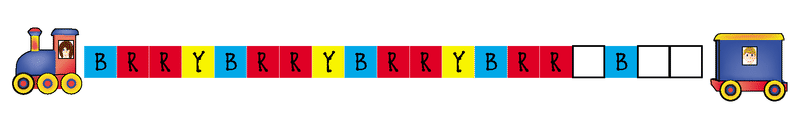

\[Figure 6\]

</article>

### 1.4 Teeter-Tottering

<article>

**Teeter Tottering - Balance**

**Teacher Notes**

Presented with a picture of two animals on a teeter totter, students identify the animal that is heavier, lighter or decide if the two animals weigh the same. They describe how they figured it out from the picture of the teeter totter. Teacher questioning uses the following format:

1. Look at the picture.

Tell me what you see.

2. Verify that students are correctly identifying the animals by having them point to the figures after they are named.

3. Present the question:

Who weighs more?/Who is heavier?

Who weighs less?/Who is lighter?

Do they weigh the same?

4. Request a description of the decision making process, “How can you tell from the picture?”

**Teeter Tottering 1**

")

\[Figure 2\]

**Teacher Questions**

1. Look at the picture.

What do you see?

_(2 animals on a teeter totter: a rabbit and a kitty.)_

2. Point to Katey the Kitty.

_(Good)_

3. Point to Robbie the Rabbit.

_(Good)_

4. Who is heavier?

_(Robbie)_

5. How can you tell from the picture?

_(The rabbit’s side is lower because he weighs more.)_

**Teeter Tottering 2**

")

\[Figure 4\]

**Teacher Questions**

1. Look at the picture.

What do you see?

_(2 animals on a teeter totter: a squirrel and a rabbit.)_

2. Point to Sam the Squirrel.

_(Good)_

3. Point to Robbie the Rabbit.

_(Good)_

4. They weigh the same. How can you tell from the picture?

_(The teeter totter is level.)_

**Teeter Tottering 3**

")

\[Figure 6\]

**Teacher Questions**

1. Look at the picture.

What do you see?

_(2 animals on a teeter totter: a giraffe and a lion.)_

2. Point to Geoffrey the Giraffe.

_(Good)_

3. Point to Lester the Lion.

_(Good)_

4. Who weighs more?

_(Geoffrey the Giraffe)_

How can you tell from the picture?

_(The giraffe’s side is lower because he weighs more.)_

5. Who weighs less?

_(Lester the Lion)_

How can you tell from the picture?

_(The lion’s side is higher because he weighs less.)_

**Teeter Tottering 4**

")

\[Figure 8\]

**Teacher Questions**

1. Look at the picture.

What do you see?

_(2 animals on a teeter totter: an otter and a camel.)_

2. Point to Orly the Otter.

_(Good)_

3. Point to Cassie the Camel.

_(Good)_

4. Who weighs more?/Who is heavier?

_(Cassie the Camel)_

How can you tell from the picture?

_(Cassie is at the bottom of the teeter totter.)_

5. Who weighs less?/Who is lighter?

_(Orly the Otter)_

How can you tell from the picture?

_(Orly is at the top of the teeter totter.)_

**Teeter Tottering 5**

")

\[Figure 10\]

**Teacher Questions**

1. Look at the picture.

What do you see?

_(2 animals on a teeter totter: a baby elephant and a donkey.)_

2. Point to Ellie the Elephant.

_(Good)_

3. Point to Derrick the Donkey.

_(Good)_

4. They weigh the same. How can you tell from the picture?

_(The teeter totter is level.)_

**Teeter Tottering 6**

")

\[Figure 12\]

**Teacher Questions**

1. Look at the picture.

What do you see?

_(2 animals on a teeter totter: a hippopotamus and an aardvark.)_

2. Point to Harry the Hippopotamus.

_(Good)_

3. Point to Andrea the Aardvark.

_(Good)_

4. Who weighs less?/Who is lighter?

_(Andrea the Aardvark)_

How can you tell from the picture?

_(The aardvark is at the top of the teeter totter.)_

5. Who weighs more?/Who is heavier?

_(Harry the Hippopotamus)_

How can you tell from the picture?

_(The hippopotamus is at the bottom of the teeter totter.)_

</article>

### 1.5 Packing Bags

<article>

**Packing Bags - Proportional Reasoning**

**Teacher Notes**

Given pictures of two, three, or four bags, one of which is filled with circles, squares or triangles, students use their tiles to fill the other bags to look the same. They then identify the total number of tiles of each shape. Patterns for cutting tiles from heavy stock paper are supplied at the end of this activity. If you have shape tiles, students may use those.

For each Packing Bags, problem, always begin by asking students to identify the contents of the “filled” bag, describing or naming the shapes, and counting to determine the number of each.

For your convenience, each packing bags problem is reduced in size and shown along with questions and directions for you to follow to engage students in the activity. The pictures only are available for you to duplicate to give to each student.

**Packing Bags 1**

")

\[Figure 2\]

**Teacher Questions**

Look at the picture.

What do you see?

_(2 bags. One bag has 2 circles and one triangle. The other bag is empty.)_

Point to the bag with the triangle.

How many triangles are in the bag? (1)

Point to the circles.

How many circles are in the bag? (2)

This is Ann’s bag.

Use your shape tiles.

Put one triangle into the empty bag.

Put 2 circles into the empty bag.

Count the shapes.

How many circles in all? (2)

How many triangles in all? (4)

**Packing Bags 2**

")

\[Figure 4\]

**Teacher Questions**

Look at the picture.

What do you see?

_(2 bags. One bag has 2 triangles, 1 circle and one square. The other bag is empty.)_

Point to the bag with the triangles.

How many triangles are in the bag? (2)

Point to the circles.

How many circles are in the bag? (1)

Point to the square.

How many squares are in the bag? (1)

This is Ted’s bag.

Use your shape tiles.

Put 2 triangles into the empty bag.

Put 1 circle into the empty bag.

Put 1 square into the empty bag.

Count the shapes.

How many triangles in all? (4)

How many circles in all? (2)

How many squares in all? (2)

**Packing Bags 3**

")

\[Figure 6\]

**Teacher Notes**

Look at the picture.

What do you see?

_(3 bags. One bag has 1 circle and 2 squares.. The other two bags are empty.)_

Point to the bag with the shapes.

How many squares are in the bag? (2)

How many circles are in the bag? (1)

This is Bob’s bag.

Use your shape tiles.

Put 2 squares into each empty bag.

Put 1 circle into each empty bag.

Count the shapes.

How many squares in all? (6)

How many circles in all? (3)

**Packing Bags 4**

")

\[Figure 8\]

**Teacher Notes**

Look at the picture.

What do you see?

_(3 bags. One bag has 2 square, 2 triangles, and 1 circle. The other two bags are empty.)_

Point to the bag with the shapes.

How many squares are in the bag? (2)

How many triangles are in the bag? (2)

How many circles are in the bag? (1)

This is Sue’s bag.

Use your shape tiles.

Put 2 squares into each empty bag.

Put 2 triangles into each empty bag.

Put 1 circle into each empty bag.

Count the shapes.

How many squares in all? (6)

How many triangles in all? (6)

How many circles in all? (3)

**Packing Bags 5**

")

\[Figure 10\]

**Teacher Notes**

Look at the picture.

What do you see?

_(3 bags. One bag has 4 circles, 1 triangle and 1 square. The other two bags are empty.)_

Point to the bag with the shapes.

How many circles are in the bag? (3)

How many triangles are in the bag? (1)

How many squares are in the bag? (1)

This is Sue’s bag.

Use your shape tiles.

Put 3 circles into each empty bag.

Put 1 triangle into each empty bag.

Put 1 square into each empty bag.

Count the shapes.

How many circles in all? (9)

How many triangles in all? (3)

How many circles in all? (3)

**Packing Bags 6**

")

\[Figure 12\]

**Teacher Notes**

Look at the picture.

What do you see?

_(4 bags. One bag has 2 triangles, 1 circle and 2 squares. The other three bags are empty.)_

Point to the bag with the shapes.

How many triangles are in the bag? (2)

How many circles are in the bag? (1)

How many squares are in the bag? (2)

This is Debbie’s bag.

Use your shape tiles.

Put 2 triangles into each empty bag.

Put 1 circle into each empty bag.

Put 2 squares into each empty bag.

Count the shapes.

How many triangles in all? (8)

How many circles in all? (4)

How many squares in all? (2)

")

\[Figure 14\]

\[Figure 15\]

</article>

### 1.6 Using Clues

<article>

**Using Clues - Deductive Reasoning**

**Teacher Notes**

Students are shown three pictures and clues to identify the character being described.

To conduct this activity, cut out each picture and mount it on cardboard. Place the three pictures in the order indicated by the letters on the bottom left of each picture, A, B, C. After reading the first clue, point to each picture and ask if the picture matches the clue. If it does, leave it in the same position. If it does not match, remove it from view. Read the second clue, and follow the same “matching” procedure. When there is only one picture left, have students tell you about the remaining picture matching the items and number of items as described in the clues.

He is wearing eyeglasses.

Who is Mr. Rippledandy?

_(Face C)_

Peter’s pumpkin has a mouth.

Which pumpkin is Peter Palooka’s pumpkin?

_(Pumpkin B)_

It has one triangle.

Which umbrella is Mr. Liketysplitity’s umbrella?

_(Umbrella A)_

His book has 3 spiders on the cover.

Which book is Mr. Bobbity’s book?

_(Book A)_

Her balloon has 4 stars.

Which balloon is Anna’s balloon?

_(Balloon B)_

Her purse has 5 squares.

Which purse is Mrs. Starglitter’s purse?

_(Purse C)_

</article>

## 2.0 CK-12 Algebra Explorations, Kindergarten

<article>

</article>

### 2.1 Introduction

<article>

This algebra module has been designed to introduce kindergarten students to basic concepts of algebra and to enhance their problem solving skills. Each of the six sections of problems focuses on a key algebraic thinking strategy. Within each section, problems are sequenced by difficulty

This module may be used to complement the existing instructional program. It is particularly useful to reinforce concepts of number (counting, quantifying and comparing) and measurement (weight comparisons), as well as to develop problem solving skills.

**The Key Algebraic Concepts**

**Equality/Inequality:** In this module, students explore equal and unequal relationships by interpreting and reasoning about pictures of teeter totters with animals, one at each end of each teeter totter. Their job is to determine which animal is heavier, heaviest, lighter, lightest, or if the animals have the same weight.

**Proportional Reasoning:** A major reasoning method for solving algebraic problems is by reasoning proportionally. Proportional reasoning is sometimes called “multiplicative reasoning,” because it requires application of multiplication. In this module, students are introduced to proportional relationships when they “fill” glasses with straws (2 or 5 straws per glass), and count by 2s or 5s to figure out the total number of straws.

**Interpret Representations:** Mathematical relationships can be displayed in a variety of ways including with words, tables, graphs, diagrams and symbols. Having students interpret these types of displays and use the data in the displays to solve problems is critical to success with the study of algebra. In this module, students interpret pan balances, picture graphs, towers of numbers, letter patterns, and pictures of T-shirts with geometric shapes.

**Reason Deductively:** Students compare pictures to clues in order to figure out the one picture that fits all of the clues. They then describe the matching picture. For all problems, four pictures are presented. Given number towers with some numbers missing, students supply the missing numbers.

**Reason Inductively:** Presented with three rows of letters of a pattern, students identify the pattern and continue it by supplying the next two rows of letters.

**The Problem Solving Five-Step Model**

The model that we recommend to help students in all grades move through the solution problems has five steps. At the Pre-Kindergarten level, the focus is on **Describe, Solve and Check**.

**Describe** focuses students’ attention on the information in the problem display. In some cases, the display is a diagram. Other times it is a pictograph or model. Having students tell what they see will help them interpret the problem and figure out what to do to solve the problem.

**My Job** helps students focus on the task by having them tell what they have to do, that is, rephrase the problem in their own words.

**Plan** requires identification of the steps to follow to solve the problem and helps students focus on the first step. Knowing where to start is often the most difficult part of the solution process.

**Solve** is putting the plan to work and showing the steps.

**Check** is used to verify the answer.

**We recommend that you “model” these steps in your instruction and that you encourage your students to follow the steps when solving the problems in this module and when describing their solution processes to others.**

</article>

### 2.2 Number Towers

<article>

**Number Towers - Number Relationships**

**Teacher Notes:** Given towers and sets of numbers in clouds, students use the numbers to fill in the cubes so that the numbers are arranged from the least on top to the greatest on the bottom. Notice that numbers are not always consecutive. Complete problems 1 and 2 with the students so that they understand what they are to do.

**Solutions:**

1.  
    
    \[Figure 1\]
    
2.  
    
    \[Figure 2\]
    
3.  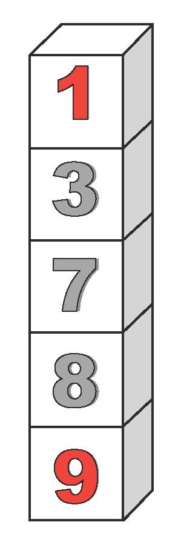
    
    \[Figure 3\]
    
4.  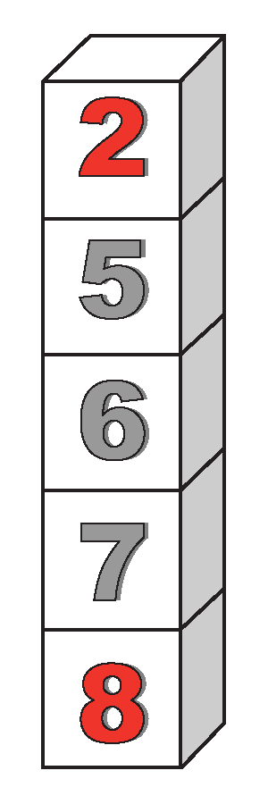
    
    \[Figure 4\]
    
5.  
    
    \[Figure 5\]
    
6.  
    
    \[Figure 6\]
    
7.  
    
    \[Figure 7\]
    
8.  
    
    \[Figure 8\]
    
9.  
    
    \[Figure 9\]
    

**Number Towers 1**

Use the numbers in the clouds. Fill in cubes with numbers.

The least number is on the top and the greatest is on the bottom.

Use the numbers in the clouds. Fill in cubes with numbers.

The least number is on the top and the greatest is on the bottom.

Use the numbers in the clouds. Fill in cubes with numbers.

The least number is on the top and the greatest is on the bottom.

Use the numbers in the clouds. Fill in cubes with numbers.

The least number is on the top and the greatest is on the bottom.

Use the numbers in the clouds. Fill in cubes with numbers.

The least number is on the top and the greatest is on the bottom.

Use the numbers in the clouds. Fill in cubes with numbers.

The least number is on the top and the greatest is on the bottom.

Use the numbers in the clouds. Fill in cubes with numbers.

The least number is on the top and the greatest is on the bottom.

Use the numbers in the clouds. Fill in cubes with numbers.

The least number is on the top and the greatest is on the bottom.

Use the numbers in the clouds. Fill in cubes with numbers.

The least number is on the top and the greatest is on the bottom.

\[Figure 18\]

</article>

### 2.3 Straws and Glasses

<article>

**Straws and Glasses - Proportional Reasoning**

Students draw 2 or 5 straws in each glass. They count to tell the number of straws in all. Encourage students to count by 2s or by 5s to figure out the total. Provide crayons or markers for drawing. You may want to do problems 1, 2 and 3,that focus on counting by 2s, as a class exploration. Likewise, 7, 8 and 9, that focus on counting by 5s, may be good to complete as a whole class activity.

**Solutions**

1.  
    
    \[Figure 1\]
    
2.  
    
    \[Figure 2\]
    
3.  
    
    \[Figure 3\]
    
4.  
    
    \[Figure 4\]
    
5.  
    
    \[Figure 5\]
    
6.  
    
    \[Figure 6\]
    
7.  
    
    \[Figure 7\]
    
8.  
    
    \[Figure 8\]
    
9.  
    
    \[Figure 9\]
    
10. 
    
    \[Figure 10\]
    
11. 
    
    \[Figure 11\]
    
12. 
    
    \[Figure 12\]
    

**Draw 2** 

**Count the straws.**

**How many straws in all?**

1. 

2. 

3. 

**Draw 2** 

**Count the straws.**

**How many straws in all?**

4. 

5. 

6. 

**Draw 5** 

**Count the straws.**

**How many straws in all?**

7. 

8. 

9. 

**Draw 5** 

**Count the straws.**

**How many straws in all?**

10. 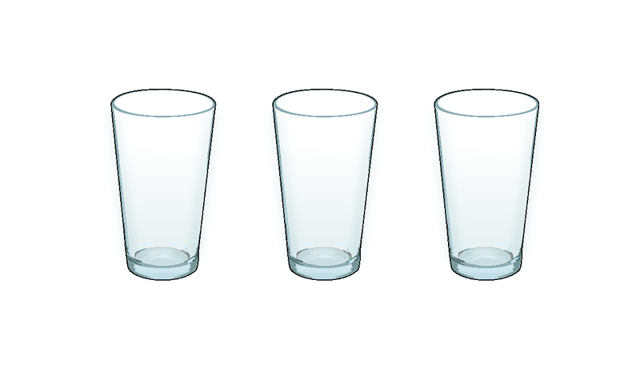

11. 

12. 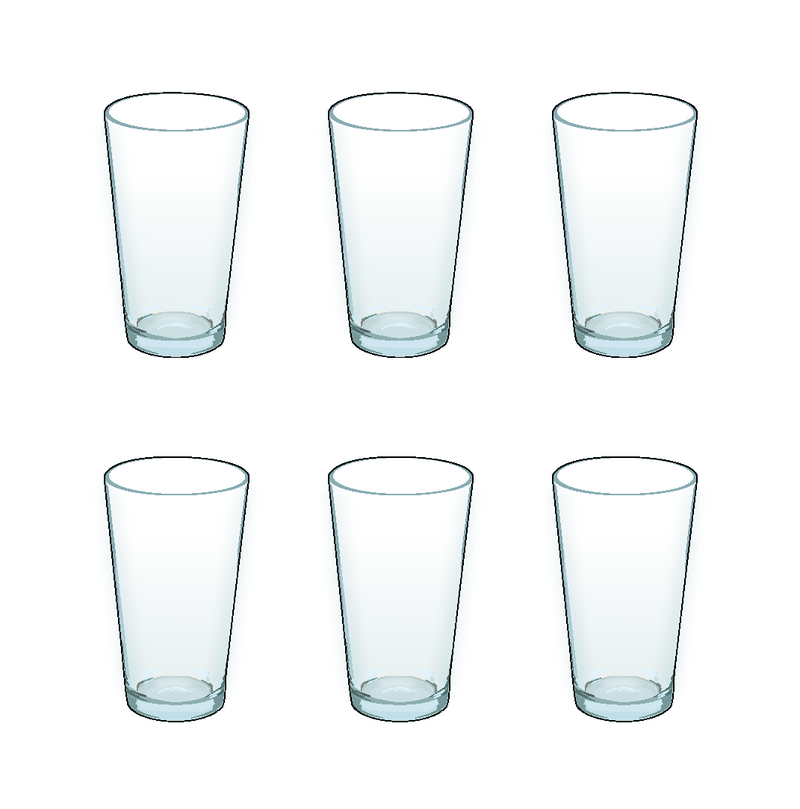

</article>

### 2.4 Teeter Totter

<article>

**Teeter Totter - Balance**

**Teacher Notes**

Students are given two pictures showing animals on teeter totters. In one picture the two animals are shown in balance (they weigh the same). In the other pictures, animals are shown off balance (they have different weights). Give each child a copy of the pictures A and B. On your copy, keep the set of questions. Answers are in parentheses.

Students answer questions about the perceived weights of the animals, and then determine who weighs the most and the least.

**Teeter Totter 1**

")

\[Figure 2\]

1.  Tell me what you see.
2.  When I name the animals, I want you to point to them. Cynthia the squirrel. Bob the bat. Leonard the lion.
3.  Which picture shows two animals that weigh the same? _(A)_ How can you tell from the picture? _(The balance is not tipped.)_
4.  Which animal weighs more in Picture B? (_Leonard the lion._) How can you tell from the picture? _(The lion side of the teeter totter is lower.)_
5.  Who weighs the most? _(Leonard the lion.)_ How did you decide? _(The squirrel and the bat weigh the same. The lion weighs more than the squirrel, so he also weighs more than the bat. The lion weighs the most.)_

**Teeter Totter 2**

")

\[Figure 4\]

1.  Tell me what you see.
2.  When I name the animals, I want you to point to them. Kit the cat. Donald the dog. Rafael the raccoon.
3.  Which picture shows that Kit the cat weighs less than Donald the dog? _(B)_ How can you tell from the picture? (_Donald the dog is on the bottom of the teeter totter and Kit the cat is on the higher side._)
4.  Which picture shows that Rafael the Racoon weighs the same as Donald the Dog? (_A_) How can you tell from the picture? (_The teeter totter is not tipped._)
5.  Who weighs the least? (_Kit the cat._) How did you decide? (_The cat weighs less than the dog. Since the raccoon and the dog weigh the same, the cat also weighs less than the raccoon._)

**Teeter Totter 3**

")

\[Figure 6\]

1.  Tell me what you see.
2.  When I name the animals, I want you to point to them. Horace the hippo. Ollie the otter. Wally the walrus.
3.  Which two animals weigh the same? (_Wally the walrus and Horace the hippo_) Which picture show that they weigh the same? (_B_)
4.  Which animal weighs less than Horace the hippo? (_Ollie the otter_) How can you tell from the picture? (_Ollie’s side of the balance beam is higher._)
5.  Who weighs the least? (_Ollie the otter_) How can you tell? (_Since the walrus weighs the same as the hippo, and the he hippo weighs more than the otter, then the walrus weighs more than the otter. So the otter weighs the least._)

**Teeter Totter 4**

")

\[Figure 8\]

1.  Tell me what you see.
2.  When I name the animals, I want you to point to them. Roosevelt the rhinoceros. Donald the deer. Bernice the bear.
3.  Which picture shows that Roosevelt the rhinoceros weighs less than Bernice the bear? (_A_) How can you tell from the picture? (_The rhinoceros is on the upper side of the teeter totter and the bear is on the lower side._)
4.  Which picture shows that Roosevelt the rhinoceros weighs the same as Donald the deer? (_B_) How can you tell from the picture? _(The teeter totter is not tipped.)_
5.  Who weighs the most? (_Bernice the bear_) How did you decide? (_The rhinoceros and the deer weigh the same. Since the bear wears more than the rhinoceros, then the bear weighs more than the deer. So, the bear weighs the most._)

</article>

### 2.5 T-Shirt Mystery

<article>

**T-Shirt Mystery - Reason Deductively**

Students use clues to figure out who owns the T-shirt.

All clues are about the number of sides and corners of polygons pictured on T-shirts.

To begin the activity, cut out the four pictures for problem 1, and arrange them face-up, in a row in the order, A, B, C, D. (You may want to back them with cardboard to make them easier to handle.) After you read each, have students identify all pictures that match that clue. If a picture doesn’t match, turn it face down. When only one picture remains, have students describe the shapes on the T-shirt and point to and count the sides and corners of the polygon.

**Solutions**

1.  D
2.  B
3.  A
4.  C

**T-Shirt Mystery 1**

**Which T-shirt belongs to Lucy Goosie?**

")

\[Figure 2\]

")

\[Figure 4\]

")

\[Figure 6\]

")

\[Figure 8\]

**Clues: Lucy Goosie’s T-shirt has:**

* **One square (****_excludes B_****)**
* **A shape with 3 sides (****_excludes C_****)**
* **One shape with exactly 5 corners (****_excludes A_****)**

**T-Shirt Mystery 2**

**Which T-shirt belongs to Edna Elephant?**

")

\[Figure 10\]

")

\[Figure 12\]

")

\[Figure 14\]

")

\[Figure 16\]

**Clues: Edna Elephant’s T-shirt has:**

* **One shape with exactly 4 sides (****_excludes D_****)**
* **Two shapes with 3 corners (****_excludes A_****)**
* **Exactly one circle (****_excludes C_****)**

**T-Shirt Mystery 3**

**Which T-shirt belongs to Sam Snake?**

")

\[Figure 18\]

")

\[Figure 20\]

")

\[Figure 22\]

")

\[Figure 24\]

**Clues: Sam Snake’s T-shirt has:**

* **Only one shape with exactly 5 corners (****_excludes D_****)**
* **Only one shape with 4 sides (****_excludes C_****)**
* **No triangles (****_excludes B_****)**

**T-Shirt Mystery 4**

**Which T-shirt belongs to Pansy Pelican?**

")

\[Figure 26\]

")

\[Figure 28\]

")

\[Figure 30\]

")

\[Figure 32\]

**Clues: Pansy Pelican’s T-shirt has:**

* **Three shapes with exactly 4 sides (****_excludes A_****)**
* **Two shapes with 6 corners (****_excludes D_****)**
* **One circle (****_excludes B_****)**

</article>

### 2.6 Sports Balls

<article>

**Sports Balls - Interpret Picture Graphs**

**Teacher Notes**

Given picture graphs showing names of students across the horizontal axis and items stacked above the names, students have to interpret the graphs and describe the relationships in order to answer the questions. Relationships include greatest number, least number, more than, less than and the same number of.

For each problem, an instructional sequence of directions and questions is provided. After each question, answers are shown in parentheses.

Prior to beginning the problems, duplicate copies of the picture graph, one for each child. Provide red, blue, yellow and green crayons for coloring.

**Sports Balls 1**

Student page

")

\[Figure 2\]

Teacher page

1. This picture graph shows four students and the tennis balls they have. The circles stand for tennis balls. Point to each name as I say the name: Ella, Ann, Bob, Sam.

2. Bob has the greatest number of tennis balls. How many tennis balls does Bob have? (_6_) Color Bob’s tennis balls green.

How can you tell from looking at the graph that Bob has the greatest number of tennis balls? _(His stack of balls is the tallest.)_

3. Ann has the least number of tennis balls. How many does Ann have? (_2_) Color Ann’s tennis balls yellow.

How can you tell from looking at the graph that Ann has the least number of tennis balls? _(Her stack is the shortest.)_

4. Sam has one more tennis ball than Ann. How many tennis balls does Sam have? (_3_) Color Sam’s tennis balls blue.

5. Look at the stack of balls that you haven’t colored. These are Ella’s tennis balls. How many tennis balls does Ella have? (5) Color Ella’s tennis balls red.

**Sports Balls 2**

Student page

")

\[Figure 4\]

Teacher page

1. This picture graph shows four students and the ping pong balls they have. The circles stand for ping pong balls. Point to each name as I say the name: Todd, Dina, Matt, Carol.

2. Matt has the least number of ping pong balls. How many ping pong balls does Matt have? (_1_). Color Matt’s ping pong balls blue.

How can you tell from the graph that Matt has the least number of ping pong balls? _(His stack is the shortest.)_

3. Todd and Carol have the same number of ping pong balls. How many ping pong balls do they each have? (_3_) Color their ping pong balls yellow.

How can you tell from the graph that Todd and Carol have the same number of ping pong balls? (_Their stacks are the same height._)

4. Dina has the greatest number of ping pong balls. How many ping pong balls does she have? (_5_) Color Dina’s ping pong balls red.

How can you tell from the graph that Dina has the greatest number of ping pong balls? _(Her stack is the highest.)_

**Sports Balls 3**

Student page

")

\[Figure 6\]

Teacher page

1. This picture graph shows four students and the basketballs they have. The circles stand for basketballs. Point to each name as I say the name: Jeff, Roz, Pedro, Cindy.

2. How many basketballs does Roz have? (0)

How can you tell from the graph that Roz has zero basketballs? _(They are no circles above her name.)_

3. Who has the greatest number of basketballs? _(Jeff)_ How many basketballs does Jeff have? (_6_). Color Jeff’s basketballs red.

4. Pedro has 2 less basketballs than Jeff. How many basketballs does Pedro have? (_4_) Color Pedro’s basketballs green.

5. Cindy has 2 more basketballs than Roz. How many basketballs does Cindy have? (_2_) Color Cindy’s basketballs yellow.

**Sports Balls 4**

Student page

")

\[Figure 8\]

Teacher page

1. This picture graph shows four students and the golf balls they have. The circles stand for golf balls. Point to each name as I say the name: Ang, Beth, Don, Eric.

2. Who has the greatest number of golf balls? (_Eric_) How many golf balls does Eric have? (_8_) Color Eric’s golf balls red.

3. Don has 6 less golf balls than Eric. How many golf balls does Don have? (_2_) Color Don’s golf balls yellow.

4. Beth has twice as many golf balls as Don. How many golf balls does Beth have? (_4_) Color Beth’s golf balls blue.

5. Ang has 3 more golf balls than Beth. How many golf balls does Ang have? (_7_) Color Ang’s golf balls green.

</article>

### 2.7 Peculiar Patterns

<article>

**Peculiar Patterns - Extend Patterns**

**Teacher Notes**

Students identify the pattern among rows of a letter tower and then continue the pattern to complete the next two rows. Patterns require students to know the sequence of letters in the alphabet and to be able to print those letters. Complete patterns 1 and 2 with the students, before having them complete the remaining patterns on their own.

**Solutions:**

1. K L M N

K L M N O

2. C D E F G

C D E F G H

3. F G H I J K

F G H I J K L

4. D E E E E

E F F F F F

5. K K L

M M N

6. S O O O O D

S O O O O O D

7. X Y Z Z Z Z Z

X Y Z Z Z Z Z Z

8. M M M M O O N

M M M M O O O N

9. R D D D D R

R E E E E E R

10. T P P P P T

T Q Q Q Q Q T

**Peculiar Patterns 1**

Complete the next two rows.

Write the letters.

**K**

**K L**

**K L M**

**K** \_\_\_\_\_\_\_\_\_\_\_\_\_\_\_\_

**K** \_\_\_\_\_\_\_\_\_\_\_\_\_\_\_\_

**Peculiar Patterns 2**

Complete the next two rows.

Write the letters.

**C D**

**C D E**

**C D E F**

\_\_\_\_\_\_\_\_\_\_\_\_\_\_\_\_

\_\_\_\_\_\_\_\_\_\_\_\_\_\_\_\_

**Peculiar Patterns 3**

Complete the next two rows.

Write the letters.

**F G H**

**F G H I**

**F G H I J**

\_\_\_\_\_\_\_\_\_\_\_\_\_\_\_\_

\_\_\_\_\_\_\_\_\_\_\_\_\_\_\_\_

**Peculiar Patterns 4**

Complete the next two rows.

Write the letters.

**A B**

**B C C**

**C D D D**

**D** \_\_\_\_\_\_\_\_\_\_\_\_\_\_\_\_\_\_\_

**E** \_\_\_\_\_\_\_\_\_\_\_\_\_\_\_\_\_\_\_

**Peculiar Patterns 5**

Complete the next two rows.

Write the letters.

**E E F**

**G G H**

**I I J**

\_\_\_\_\_\_\_\_\_\_\_\_\_\_\_\_\_\_\_

\_\_\_\_\_\_\_\_\_\_\_\_\_\_\_\_\_\_\_

**Peculiar Patterns 6**

Complete the next two rows.

Write the letters.

**S O D**

**S O O D**

**S O O O D**

\_\_\_\_\_\_\_\_\_\_\_\_\_\_\_\_\_\_\_

\_\_\_\_\_\_\_\_\_\_\_\_\_\_\_\_\_\_\_

**Peculiar Patterns 7**

Complete the next two rows.

Write the letters.

**X Y Z Z**

**X Y Z Z Z**

**X Y Z Z Z Z**

**X** \_\_\_\_\_\_\_\_\_\_\_\_\_\_\_\_\_\_\_

**X** \_\_\_\_\_\_\_\_\_\_\_\_\_\_\_\_\_\_\_

**Peculiar Patterns 8**

Complete the next two rows.

Write the letters.

**M O O N**

**M M O O N**

**M M M O O N**

**M**\_\_\_\_\_\_\_\_\_\_\_\_\_\_\_\_\_\_\_

**M**\_\_\_\_\_\_\_\_\_\_\_\_\_\_\_\_\_\_\_

**Peculiar Patterns 9**

Complete the next two rows.

Write the letters.

**R A R**

**R B B R**

**R C C C R**

**R** \_\_\_\_\_\_\_\_\_\_\_\_\_\_\_\_

**R** \_\_\_\_\_\_\_\_\_\_\_\_\_\_\_\_

**Peculiar Patterns 10**

Complete the next two rows.

Write the letters.

**T M T**

**T N N T**

**T O O O T**

\_\_\_\_\_\_\_\_\_\_\_\_\_\_\_\_\_\_\_

\_\_\_\_\_\_\_\_\_\_\_\_\_\_\_\_\_\_\_

</article>

## 3.0 CK-12 Algebra Explorations, Grade 1

<article>

</article>

### 3.1 Introduction

<article>

This algebra module has been designed to introduce grade 1 students to ten key concepts of algebra and to enhance their problem solving skills. Each section begins with a brief description of the problem set and the concepts and skills developed. This is followed by the solutions to problems in the problem set. The first problem in each set is the “teaching problem.” It is completed following the five-step problem solving model and is designed to be used by teachers as the centerpiece of the instructional program. The teaching problem, to be completed by students with the teacher’s guidance, is followed by problems to be completed by the students working on their own or in pairs.

This module may be used as an algebra unit to complement the existing instructional program. It also may be used to show connections between algebra and the strands of number and measurement, to provide practice of number computational algorithms, and to reinforce problem solving skills.

The _Extra for Experts_ provides additional opportunities for students to apply newly learned concepts and skills to the solution of problems like those developed in this Algebra module.

**The Key Algebraic Concepts**

**Equality/Inequality:**

In this module, students explore equal and unequal relationships by interpreting and reasoning about pictures of pan balances. Their job is to figure out which boxes to place in an empty pan to balance the weight in the other pan. This is preparation for the study of variables as unknowns in equations, and reinforcing the concept that there are often multiple solutions to a problem.

**Variables as unknowns:**

Variables may be letters, geometric shapes, or objects that stand for a number of things. When used to represent an _unknown_, the variable has only one value. For example, in the equation, $t + 5 = 7$, the variable $t$ is an unknown and it stands for the number 2. When $t$ is replaced with 2 in the equation, the expression to the left of the equal symbol names the same number as the expression to the right of the equal symbol; $2 + 5$ is another name for 7. In this module, students explore the skill of replacement of variables with their values in order to determine the total weight of collections of various types of blocks, sand solve for unknowns in two-by-two grids representing systems of equations.

**Variables as varying quantities:**

In some equations, variables can take on more than one value. For example, in the equation $q = 2 + r$, if the value of $q$ is 5, then the value of $r$ is 3. Or, if the value of $r$ is 9, the value of $q$ is 11. So, in this case $q$ can be any number. However, once you choose a value for $q$, then the value for $r$ is fixed. Likewise, once you choose a value for $r$, then the value of $q$ is fixed. Variables as varying quantities appear in functions and formulas. In this module, students complete tables of values for one-step (e.g., $y = 2z$) functions, and continue patterns in which elements of the pattern vary based on position.

**Proportional Reasoning:**

A major method for solving algebraic problems is by reasoning proportionally. Proportional reasoning is sometimes called “multiplicative reasoning,” because it requires application of multiplication or its inverse, division. In this module, students reason proportionally when, given the price of one silly sticker, they compute the cost of multiple sets of the stickers.

**Interpret Representations:**

Mathematical relationships can be displayed in a variety of ways including with text, tables, graphs, diagrams and with symbols. Having students interpret these types of displays and use the data in the displays to solve problems is critical to success with the study of algebra. In this module, students interpret pan balances, circle and arrow grid diagrams, tables of values, and weight scales.

**Write Equations:**

Although an equation is a symbolic representation of a mathematical relationship, the writing of an equation is a key algebraic skill and one that requires separate attention and instruction. In this module, students learn to write letter and number equations for the various collections of weights that can balance the pans.

**The Problem Solving Five-Step Model**

The model that we recommend to help students move through the solution problems has five steps:

**Describe** focuses students’ attention on the information in the problem display. In some cases, the display is a diagram. Other times it is a table, graph, equation, or model, or a combination of any of these. Having students tell what they see will help them interpret the problem and identify key facts needed to proceed with the solution method.

**My Job** helps students focus on the task by having them tell what they have to do, that is, rephrase the problem in their own words.

**Plan** requires identification of the steps to follow to solve the problem and helps students focus on the first step. Knowing where to start is often the most difficult part of the solution process.

**Solve** is putting the plan to work and showing the steps.

**Check** is used to verify the answer.

We recommend that you “model” these steps in your instruction with the first problem in each problem set and that you encourage your students to follow the steps when solving the problems and when relating their solution processes to others.

**Note:** Although the instructional pages show only one solution plan, many of the problems have more than one correct solution path. These problems provide excellent opportunities for engaging your students in algebraic conversations about how their solutions are the same, how they differ, and perhaps, which solution method is “most elegant.

</article>

### 3.2 Balance the Pans

<article>

**Balance the Pans – Balance-Equality**

**Teacher Notes**

Given a two-pan balance with one pan empty and a weight in the other pan, students determine the boxes that can be placed in the empty pan to balance the pans. Since there are an unlimited number of boxes of each type, there are more than one set of boxes that make the pans balance. In other words, all problems have multiple solutions.

To identify and check the sets of boxes that balance the pans, students will add with more than two addends, all single 0 digit numbers 8 or less. Alternatively, students can count up to find sums. All sums are 18 or less.

**Solutions**

**Balance the Pans 1**

$C+ C = 6 \ pounds$

$D + D + D + D + D + D = 6 \ pounds$

$C + D + D + D = 6 \ pounds$

**Balance the Pans 2**

$F + F + F = 9 \ pounds$

$F + E + E + E = 9 \ pounds$

**Balance the Pans 3**

$G + G + G + G + G = 5 \ pounds$

$H + G + G + G = 5 \ pounds$

$H + H + G = 5 \ pounds$

**Balance the Pans 4**

$J + J + J + J + J = 10 \ pounds$

$I + J + J + J = 10 \ pounds$

$I + I + J = 10 \ pounds$

**Balance the Pans 5**

$K + K + K + K = 12 \ pounds$

$L + L = 12 \ pounds$

$L + K + K = 12 \ pounds$

**Balance the Pans 6**

$M + M + M + M = 16 \ pounds$

$N + N = 16 \ pounds$

$N + M + M = 16 \ pounds$

**(Teacher Page) – You have lots of these boxes.**

**Make the pans balance.**

**Which boxes will you use?**

**Can you do it another way?**

$$
\begin{align*}
& \mathbf{Describe:} && \text{There are 2 pans.}\\
&&& \text{One pan holds a box. The box weighs 8 pounds.}\\
&&& \text{The other pan is empty.}\\
&&& \text{Box}\ A \ \text{weighs 4 pounds.}\\
&&& \text{Box}\ B \ \text{weighs 2 pounds.}\\
&&& \text{There are lots of boxes.}\\
& \mathbf{My \ Job:} && \text{Figure out which boxes to put in the pan.}\\
&&& \text{The boxes have to weigh 8 pounds in all.}\\
& \mathbf{Plan:} && \text{Try to make 8 pounds using}\ \text{A} \ \text{boxes only.}\\
&&& \text{Try using}\  B \ \text{boxes only.}\\
&&& \text{Try using both}\  A \ \text{and}\ B \ \text{boxes.}\\
&\mathbf{Solve:} && \text{These will make the pans balance:}\\
&&& 2 \ A \ \text{boxes weigh 8 pounds.}\\
&&& 4 \ B \ \text{boxes weigh 8 pounds.}\\
&&& \text{One}\ A \ \text{box and}\ 2 \ B \ \text{boxes weigh 8 pounds.}\\
& \mathbf{Check:} && 4 + 4 = 8\\
&&& 2 + 2 + 2 + 2 = 8\\
&&& 4 + 2 + 2 = 8
\end{align*}
$$

**Balance the Pans 1**

**You have lots of these boxes.**

**Make the pans balance.**

**Which boxes will you use?**

**Can you do it another way?**

**Balance the Pans 2**

**You have lots of these boxes.**

**Make the pans balance.**

**Which boxes will you use?**

**Can you do it another way?**

**Balance the Pans 3**

**You have lots of these boxes.**

**Make the pans balance.**

**Which boxes will you use?**

**Can you do it another way?**

**Balance the Pans 4**

**You have lots of these boxes.**

**Make the pans balance.**

**Which boxes will you use?**

**Can you do it another way?**

**Balance the Pans 5**

**You have lots of these boxes.**

**Make the pans balance.**

**Which boxes will you use?**

**Can you do it another way?**

**Balance the Pans 6**

**You have lots of these boxes.**

**Make the pans balance.**

**Which boxes will you use?**

**Can you do it another way?**

**Extras for Experts: Balance the Pans – Balance-Equality**

**Solutions**

**Extra for Experts: Balance the Pans 1**

$P + P + P + P + P = 15 \ pounds$

$Q + P + P + P = 15 \ pounds$

$Q + Q + P = 15 \ pounds$

**Extra for Experts: Balance the Pans 2**

$R + R + R + R + S = 11 \ pounds$

$R + S + S + S = 11 \ pounds$

**Extra for Experts: Balance the Pans 3**

$Z + Z + Z + Z + Z + Z = 18 \ pounds$

$Y + Y + Y + Z = 18 \ pounds$

**Extra for Experts: Balance the Pans 1**

**You have lots of these boxes.**

**Make the pans balance.**

**Which boxes will you use?**

**Can you do it another way?**

**Extra for Experts: Balance the Pans 2**

**You have lots of these boxes.**

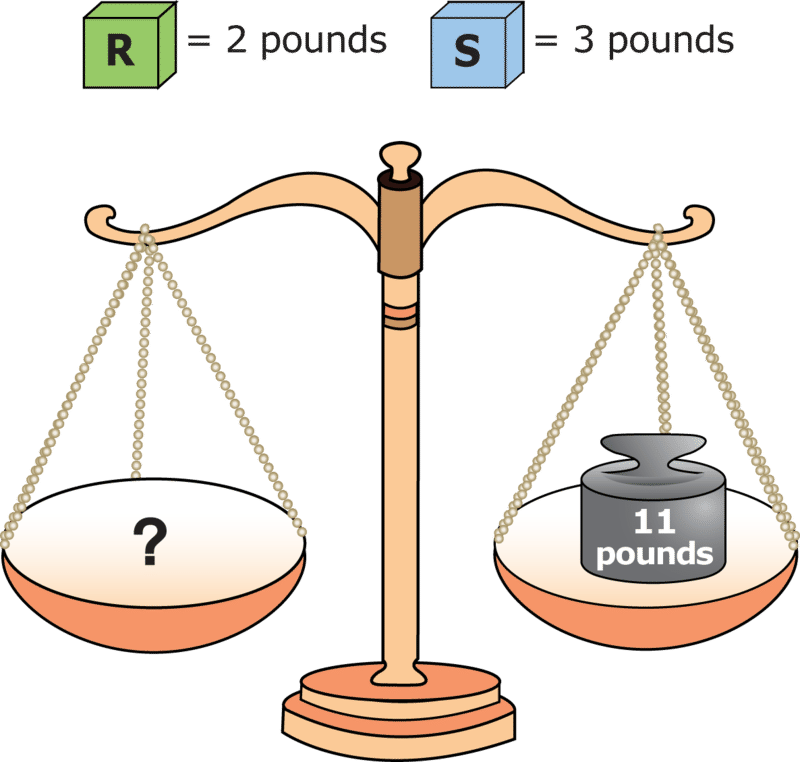

**Make the pans balance.**

**Which boxes will you use?**

**Can you do it another way?**

**Extra for Experts: Balance the Pans 3**

**You have lots of these boxes.**

**Make the pans balance.**

**Which boxes will you use?**

**Can you do it another way?**

</article>

### 3.3 How Many Pounds

<article>

**How Many Pounds? – Equation Solving: Replace Variables with Their Values**

**Teacher Notes**

Given the weights of two blocks, students determine the total weight of various collections of these blocks. The key algebraic idea is that of replacement. To figure out the total weight of a collection of blocks, students record the weight of each block on that block (i.e. replacing it with its value), and then add to determine the total weight. These problems prepare students for the skill of substitution which is a major problem solving technique in the solution of algebraic equations.

**Solutions**

**How Many Pounds? 1**

1.  7 pounds
2.  11 pounds
3.  14 pounds

**How Many Pounds? 2**

1.  12 pounds
2.  15 pounds
3.  18 pounds

**How Many Pounds? 3**

1.  20 pounds
2.  18 pounds
3.  22 pounds

**How Many Pounds? 4**

1.  20 pounds
2.  19 pounds
3.  30 pounds

**How Many Pounds?**

(Teacher Page)

\begin{align*}
\begin{aligned}& \mathbf{Describe:} && \text{Three scales with blocks.}\\
&&& \mathbf{A:} \ \text{one cube is} \ 4 \ \text{pounds.}\\
&&& \mathbf{B:} \ \text{one cylinder is} \ 2 \ \text{pounds.}\\
&&& \mathbf{C:} \ \text{one cube and} \ 2 \ \text{cylinders. No number of pounds.}\\
& \mathbf{My \ Job:} && \text{Figure out the total number of pounds for scale} \ C.\\
& \mathbf{Plan:} && \text{Write the numbers of pounds on the blocks on} \ C.\\
&&& \text{Add to figure out the total number of pounds.}\\
& \mathbf{Solve:}\end{aligned}
\end{align*}
$$

\begin{align*}
\begin{aligned} \mathbf{Check:} && 4 + 2 + 2 = 8 \end{aligned}
\end{align*}
$$

**How Many Pounds 1**

Write the number on the scale.

1.  
    
    \[Figure 5\]
    
2.  
    
    \[Figure 6\]
    
3.  
    
    \[Figure 7\]
    

**How Many Pounds 2**

Write the number on the scale.

1.  
    
    \[Figure 9\]
    
2.  
    
    \[Figure 10\]
    
3.  
    
    \[Figure 11\]
    

**How Many Pounds? 3**

Write the number on the scale.

1.  
    
    \[Figure 13\]
    
2.  
    
    \[Figure 14\]
    
3.  
    
    \[Figure 15\]
    

**How Many Pounds? 4**

Write the number on the scale.

1.  
    
    \[Figure 17\]
    
2.  
    
    \[Figure 18\]
    
3.  
    
    \[Figure 19\]
    

**Extras for Experts: How Many Pounds?**

**Solutions**

**Extra for Experts: How Many Pounds? 1**

1.  30 pounds
2.  23 pounds
3.  40 pounds

**Extra for Experts: How Many Pounds? 2**

1.  19 pounds
2.  20 pounds
3.  26 pounds

**Extra for Experts: How Many Pounds? 1**

Write the number on the scale.

1.  
    
    \[Figure 21\]
    
2.  
    
    \[Figure 22\]
    
3.  
    
    \[Figure 23\]
    

**Extra for Experts: How many pounds? 2**

Write the number on the scale.

1.  
    
    \[Figure 25\]
    
2.  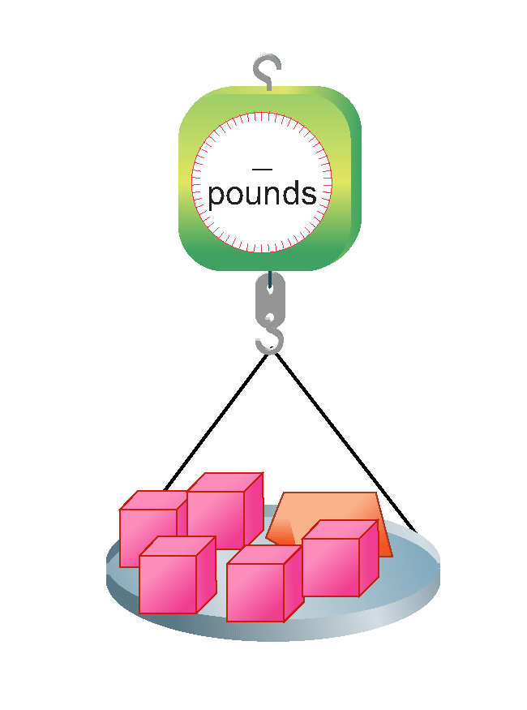
    
    \[Figure 26\]
    
3.  
    
    \[Figure 27\]

</article>

### 3.4 Circles and Arrows

<article>

**Circles and Arrows – Solve for Unknowns**

In these problems, students are presented two-by-two grids containing circles and arrows. Circles contain numbers or letters that represent unknown quantities. Arrows point to sums of rows and columns. Each row and column represents an equation. For example, a row showing $A$, $A$ and an arrow pointing to 4, can also be represented by the equation: $A + A = 4$. Students use the grid relationships to figure out the values of the letters. There are often several ways to begin to solve each problem. Encourage students to consider and talk about alternative approaches. All sums in the first set of problems are 10 or less. In the Extras for Experts, sums are 18 or less.

**Solutions**

1.  $C = 3, D = 1$
2.  $E = 5, F = 2$
3.  $G = 4, H = 1$
4.  $J =  1, K = 5$
5.  $L = 2, M = 3$
6.  $N = 5, P = 3$
7.  $Q = 2, R = 4$
8.  $S = 4, T = 2$
9.  $U = 4, V = 6$
10. $W = 2, X = 3$

**Figure out the value of each letter.**

\begin{align*}
& \mathbf{Describe:} && \text{Two rows and two columns with numbers and letters.}\\
&&& \text{Arrows point to sums.}\\
& \mathbf{My \ Job:} && \text{Figure out the values of letters} \ A \ \text{and} \ B.\\
& \mathbf{Plan:} && \text{Start with the first row. Solve for} \ A.\\
&&& \text{Then figure out} \ B.\\
& \mathbf{Solve:} && A+A=4, \ \text{so} \ A=2,\\
&&& \text{In the first column,} \ A+B=5\\
&&& \text{Replace} \ A \ \text{with} \ 2.\\
&&& \text{Then} \ 2+B=5. \ B=5-2, \ \text{or} \ 3.\\
& \mathbf{Check:} && \text{Replace all} \ A\text{s with} \ 2.\\
&&& \text{Replace all} \ B\text{s with} \ 3.\\
&&& \text{Add rows and columns. Check with sums.}\\
&&& \text{Row} \ 1: 2+2=4 \qquad \text{Column} \ 1: 2+3=5\\
&&& \text{Row} \ 2: 3+6=9 \qquad \text{Column} \ 2: 2+6=8
\end{align*}
$$

1. **Figure out the value of each letter.**

\[Figure 11\]

</article>

### 3.5 Circles and Arrows Extras

<article>

**Extra for Experts: Circles and Arrows - Solve for Unknowns**

1. **Figure out the value of each letter.**

1.  $A = 5, B = 3$
2.  $C = 2, D = 4$
3.  $E = 5, F = 4$
4.  $G = 4, H = 5$
5.  $J = 8, K = 6$
6.  $L = 9, M =5$
7.  $N = 5, P = 3$
8.  $Q = 2, R = 9$

</article>

### 3.6 Function Machines

<article>

**Function Machines – Complete one-step function tables**

For these problems, students follow rules presented in words and with symbols to complete two-column function tables. Each of the rules requires one computational step. Problems 1-8 use addition. Problems 9 – 12 use subtraction.

**Solutions**

1.

| **_In_** | **_Out_** |
| --- | --- |
| 2   | 3   |
| 6   | 7   |
| 0   | 1   |
| 8   | 9   |
| 4   | 5   |

2.

| **_In_** | **_Out_** |
| --- | --- |
| 4   | 7   |
| 5   | 8   |
| 1   | 4   |
| 2   | 5   |
| 7   | 10  |

3.

| **_In_** | **_Out_** |
| --- | --- |
| 1   | 6   |
| 4   | 9   |
| 5   | 10  |
| 3   | 8   |
| 2   | 7   |

4.

| **_In_** | **_Out_** |
| --- | --- |
| 6   | 10  |
| 0   | 4   |
| 3   | 7   |
| 4   | 8   |
| 5   | 9   |

5.

| **_In_** | **_Out_** |
| --- | --- |
| 7   | 9   |
| 5   | 7   |
| 8   | 10  |
| 3   | 5   |
| 6   | 8   |

6.

| **_In_** | **_Out_** |
| --- | --- |
| 5   | 9   |
| 2   | 6   |
| 6   | 10  |
| 8   | 12  |
| 3   | 7   |

7.

| **_In_** | **_Out_** |
| --- | --- |
| 0   | 6   |
| 6   | 12  |
| 2   | 8   |
| 3   | 9   |
| 4   | 10  |

8.

| **_In_** | **_Out_** |
| --- | --- |
| 2   | 9   |
| 7   | 14  |
| 1   | 8   |
| 5   | 12  |
| 3   | 10  |

9.

| **_In_** | **_Out_** |
| --- | --- |
| 5   | 4   |
| 3   | 2   |
| 7   | 6   |
| 4   | 3   |
| 9   | 8   |

10.

| **_In_** | **_Out_** |
| --- | --- |
| 7   | 5   |
| 3   | 1   |
| 8   | 6   |
| 6   | 4   |
| 5   | 3   |

11.

| **_In_** | **_Out_** |
| --- | --- |
| 6   | 1   |
| 10  | 5   |
| 8   | 3   |
| 7   | 2   |
| 9   | 4   |

12.

| **_In_** | **_Out_** |
| --- | --- |
| 5   | 2   |
| 8   | 5   |
| 4   | 1   |
| 3   | 0   |
| 7   | 4   |

\begin{align*}
\begin{aligned}& \mathbf{Describe:} && \text{The box is an} \ \mathbf{Add \ 2} \ \text{machine. The table has} \ \mathbf{IN} \ \text{numbers and} \ \mathbf{OUT}\\
&&& \text{numbers. Some OUT numbers are missing.}\\
& \mathbf{My \ Job:} && \text{Fill in the other OUT numbers.}\\
& \mathbf{Plan:} && \text{Add} \ 2 \ \text{to each} \ \mathbf{IN} \ \text{number to get the} \ \mathbf{OUT} \ \text{number.}\\
& \mathbf{Solve:}\end{aligned}
\end{align*}
$$

| **_In_** | **_Out_** |
| --- | --- |
| 1   | 3   |
| 4   | 6   |
| 3   | 5   |
| 0   | 2   |
| 5   | 7   |

$$
\begin{align*}
\begin{aligned}& \mathbf{Check:} && \text{Start with the IN number. Count up:} \ 4, 5, 6\\
&&& \qquad \qquad \qquad \qquad \qquad \qquad \qquad \qquad \ \ 3, 4, 5\\
&&& \qquad \qquad \qquad \qquad \qquad \qquad \qquad \qquad \ \ 0, 1, 2\\
&&& \qquad \qquad \qquad \qquad \qquad \qquad \qquad \qquad \ \ 5, 6, 7\end{aligned}
\end{align*}
$$

Follow the rules. Complete the tables.

")

\[Figure 3\]

")

\[Figure 5\]

")

\[Figure 7\]

")

\[Figure 9\]

")

\[Figure 11\]

")

\[Figure 13\]

</article>

### 3.7 Function Machines Extras

<article>

**Extra for Experts: Function Machines - Complete one-step function tables**

Follow the rules. Complete the tables.

")

\[Figure 2\]

")

\[Figure 4\]

")

\[Figure 6\]

")

\[Figure 8\]

**Solutions**

1.

| **_In_** | **_Out_** |
| --- | --- |
| 4   | 9   |
| 8   | 13  |
| 3   | 8   |
| 6   | 11  |
| 9   | 14  |

2.

| **_In_** | **_Out_** |
| --- | --- |
| 3   | 9   |
| 9   | 15  |
| 5   | 11  |
| 8   | 14  |
| 4   | 10  |

3.

| **_In_** | **_Out_** |
| --- | --- |
| 1   | 10  |
| 5   | 14  |
| 2   | 11  |
| 9   | 18  |
| 4   | 13  |

4.

| **_In_** | **_Out_** |
| --- | --- |
| 2   | 10  |
| 8   | 16  |
| 4   | 12  |
| 7   | 15  |
| 9   | 17  |

5.

| **_In_** | **_Out_** |
| --- | --- |
| 9   | 5   |
| 10  | 6   |
| 7   | 3   |
| 8   | 4   |
| 15  | 11  |

6.

| **_In_** | **_Out_** |
| --- | --- |
| 8   | 2   |
| 12  | 6   |
| 9   | 3   |
| 10  | 4   |
| 14  | 8   |

7.

| **_In_** | **_Out_** |
| --- | --- |
| 10  | 3   |
| 8   | 1   |
| 14  | 7   |
| 9   | 2   |
| 15  | 8   |

8.

| **_In_** | **_Out_** |
| --- | --- |
| 10  | 1   |
| 13  | 4   |
| 9   | 0   |
| 17  | 8   |
| 12  | 3   |

</article>

### 3.8 Silly Stickers

<article>

**Silly Stickers – Reason Proportionally**

**Teacher Notes**

Given the price of one sticker, students compute the cost of 2 to 12 stickers. To do the computation, students can either use repeated addition or skip count. Sticker prices are 2, 5 or 10 cents in this set of problems. In the Extras for Experts, individual stickers are 3, 4, or 6 cents

Encourage students to record the cost of a sticker on each of the stickers in each set. This will facilitate the skip counting or use of repeated addition.

**Solutions**

**Silly Stickers: Hats**

1. 15

2. 10

3. 30

4. 25

5. 35

6. 45

7. 50

8. 60

**Silly Stickers: Faces**

9. 4

10. 10

11. 6

12. 8

13. 12

14. 16

15. 14

16. 20

**Silly Stickers: Shoes**

17. 30

18. 60

19. 50

20. 90

21. 40

22. 80

23. 70

24. 100 or $1

**Silly Stickers: Hats**

\begin{align*}
\begin{aligned}& \mathbf{Describe:} && \text{One silly sticker is} \ 5 \cancel{\text{c}}\\
&&& \text{There are} \ 8 \ \text{stickers.}\\
&&& \text{The} \ 8 \ \text{stickers don't have a price.}\\
& \mathbf{My \ Job:} && \text{Figure out how many cents for} \ 8 \ \text{stickers.}\\
& \mathbf{Plan:} && \text{Write} \ 5 \cancel{\text{c}} \ \text{on each sticker.}\\
&&& \text{Count by} \ 5 \text{s to get the number of cents.}\\
& \mathbf{Solve:}\end{aligned}
\end{align*}
$$

\begin{align*}
\begin{aligned}&&& 8 \ \text{stickers cost} \ 40 \cancel{\text{c}}\\
& \mathbf{Check:} && \text{Add each row:}\\
&&& 5+5+5+5 = 20 \cancel{\text{c}}\\
&&& 5+5+5+5 = 20 \cancel{\text{c}}\\
&&& 20+20 = 40 \cancel{\text{c}}\end{aligned}
\end{align*}
$$

**Silly Stickers: Hats**

1. ")

\[Figure 6\]

3. ")

\[Figure 8\]

**Silly Stickers: Hats**

5. ")

\[Figure 11\]

7. ")

\[Figure 13\]

**Silly Stickers: Faces**

9. ")

\[Figure 16\]

11. ")

\[Figure 18\]

**Silly Stickers: Faces**

13. ")

\[Figure 21\]

15. ")

\[Figure 23\]

**Silly Stickers: Shoes**

17. ")

\[Figure 26\]

19. ")

\[Figure 28\]

**Silly Stickers: Shoes**

21. ")

\[Figure 31\]

23. ")

\[Figure 33\]

**Extras for Experts Silly Stickers: Masks**

1. ")

\[Figure 36\]

3. ")

\[Figure 38\]

**Extras for Experts Silly Stickers: Masks**

5. ")

\[Figure 41\]

7. ")

\[Figure 43\]

**Extras for Experts Silly Stickers: Masks**

9. ")

\[Figure 46\]

11. ")

\[Figure 48\]

**Extras for Experts Silly Stickers: Masks**

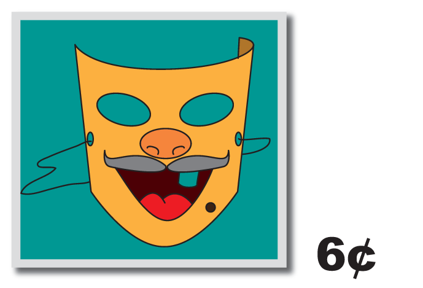

13. ")

\[Figure 51\]

15. ")

\[Figure 53\]

**Extras for Experts Silly Stickers: Masks**

**Solutions**

1.  6
2.  12
3.  18
4.  21
5.  24
6.  30
7.  36
8.  60
9.  16
10. 20
11. 36
12. 24
13. 18
14. 30
15. 24
16. 60

</article>

### 3.9 Stars and Moons

<article>

**Stars and Moons - Extend Patterns**

**Teaching Notes**

Students identify patterns of stars and moons on three cards and make drawings on the next three cards to continue the pattern. Star patterns may differ from moon patterns. For example, the number of stars may remain constant while the number of moons increases by 1. To facilitate the drawing of stars and moons, suggest that students use an asterisk $(*)$ to represent a star and the capital letter C to represent the moon.

**Solutions**

1.  
    
    \[Figure 1\]
    
2.  
    
    \[Figure 2\]
    
3.  
    
    \[Figure 3\]
    
4.  
    
    \[Figure 4\]
    

**Stars and Moons**

\begin{align*}
\begin{aligned}& \mathbf{Describe:} && \text{There are} \ 6 \ \text{cards.}\\
&&& \text{Card} \ 1:2 \ \text{stars and} \ 1 \ \text{moon}\\
&&& \text{Card} \ 2:3 \ \text{stars and} \ 2 \ \text{moons}\\
&&& \text{Card} \ 3:4 \ \text{stars and} \ 3 \ \text{moons}\\
&&& \text{Card} \ 4,5 \ \text{and} \ 6 \ \text{are empty.}\\
& \mathbf{My \ Job:} && \text{Figure out the pattern.}\\
&&& \text{Make drawings on the empty cards.}\\
& \mathbf{Plan:} && \text{Look at the card numbers. Figure out the pattern of starts}\\
&&& \text{Look at the card numbers. Figure out the pattern of moons.}\\
&&& \text{Make the drawings.}\\
& \mathbf{Solve:}\end{aligned}
\end{align*}
$$

\begin{align*}
\begin{aligned}& \mathbf{Check:} && \text{The number of moons is always the same as the card number.}\\
&&& \text{The number of stars is one more than the moon number.}\end{aligned}
\end{align*}
$$

**Stars and Moons 1**

\[Figure 10\]

</article>

### 3.10 Stars and Moons Extras

<article>

**Extras for Experts: Stars and Moons - Extend Patterns**

**Solutions**

1. Card 4: \[ART: 7 stars, 4 moons\]

Card 5: \[ART: 8 stars, 5 moons\]

Card 6: \[ART: 9 stars; 6 moons\]

2. Card 4: \[ART: 5 stars, 8 moons\]

Card 5: \[ART: 6 stars, 10 moons\]

Card 6: \[ART: 7 stars; 12 moons\]

**Stars and Moons 1**

\[Figure 2\]

</article>

## 4.0 Algebra Explorations, Grade 2

<article>

</article>

### 4.1 Introduction

<article>

This algebra module has been designed to introduce grade 2 students to ten key concepts of algebra and to enhance their problem solving skills. Each section begins with a brief description of the problem set and the concepts and skills developed. This is followed by the solutions to problems in the problem set. The first problem in each set is the “teaching problem.” It is completed following the five-step problem solving model and is designed to be used by teachers as the centerpiece of the instructional program. The teaching problem, to be completed by students with the teacher’s guidance, is followed by problems to be completed by the students working on their own or in pairs.

This module may be used as an algebra unit to complement the existing instructional program. It also may be used to show connections between algebra and the strands of number and measurement, to provide practice of number computational algorithms, and to reinforce problem solving skills.

The _Extra for Experts_ provides additional opportunities for students to apply newly learned concepts and skills to the solution of problems like those developed in this Algebra module.

**The Key Algebraic Concepts**

**Equality/Inequality:**

In this module, students explore equal and unequal relationships by interpreting and reasoning about pictures of pan balances. Their job is to figure out which boxes to place in an empty pan to balance the weight in the other pan. This is preparation for the study of variables as unknowns in equations, and reinforcing the concept that there are often multiple solutions to a problem.

**Variables as unknowns:**

Variables may be letters, geometric shapes, or objects that stand for a number of things. When used to represent an _unknown_, the variable has only one value. For example, in the equation, $t + 5 = 7$, the variable $t$ is an unknown and it stands for the number 2. When $t$ is replaced with 2 in the equation, the expression to the left of the equal symbol names the same number as the expression to the right of the equal symbol; $2 + 5$ is another name for 7. In this module, students solve for the weights of blocks on scales, and for unknowns in two-by-two grids representing systems of equations.

**Variables as varying quantities:**

In some equations, variables can take on more than one value. For example, in the equation $q = 2 + r$, if the value of $q$ is 5, then the value of $r$ is 3. Or, if the value of $r$ is 9, the value of $q$ is 11. So, in this case $q$ can be any number. However, once you choose a value for $q$, then the value for $r$ is fixed. Likewise, once you choose a value for $r$, then the value of $q$ is fixed. Variables as varying quantities appear in functions and formulas. In this module, students complete tables of values for two-step (e.g., _Add 5 and then subtract 2_) functions, and continue patterns in which the elements vary based on their position in the pattern.

**Proportional Reasoning:**

A major method for solving algebraic problems is by reasoning proportionally. Proportional reasoning is sometimes called “multiplicative reasoning,” because it requires application of multiplication or its inverse, division. In this module, students reason proportionally as they trade “critters” as well as compute the unit costs of items in order to determine the better buy.

**Interpret Representations:**

Mathematical relationships can be displayed in a variety of ways including with text, tables, graphs, diagrams and with symbols. Having students interpret these types of displays and use the data in the displays to solve problems is critical to success with the study of algebra. In this module, students interpret pan balances, circle and arrow grid diagrams, tables of values, weight scales and patterns of geometric shapes.

**Write Equations:**

Although an equation is a symbolic representation of a mathematical relationship, the writing of an equation is a key algebraic skill and one that requires separate attention and instruction. In this module, students learn to write letter and number equations for the various collections of weights that can balance the pans.

**The Problem Solving Five-Step Model**

The model that we recommend to help students move through the solution problems has five steps:

**Describe** focuses students’ attention on the information in the problem display. In some cases, the display is a diagram. Other times it is a table, graph, equation, or model, or a combination of any of these. Having students tell what they see will help them interpret the problem and identify key facts needed to proceed with the solution method.

**My Job** helps students focus on the task by having them tell what they have to do, that is, rephrase the problem in their own words.

**Plan** requires identification of the steps to follow to solve the problem and helps students focus on the first step. Knowing where to start is often the most difficult part of the solution process.

**Solve** is putting the plan to work and showing the steps.

**Check** is used to verify the answer.

We recommend that you “model” these steps in your instruction with the first problem in each problem set and that you encourage your students to follow the steps when solving the problems and when relating their solution processes to others.

**Note:** Although the instructional pages show only one solution plan, many of the problems have more than one correct solution path. These problems provide excellent opportunities for engaging your students in algebraic conversations about how their solutions are the same, how they differ, and perhaps, which solution method is “most elegant.

</article>

### 4.2 Which Boxes

<article>

**Which Boxes? – Balance-Equality**

**Teacher Notes**

Given a two-pan balance with one pan empty and a weight in the other pan, students determine which boxes from a set of two or three boxes when placed in the empty pan will cause the pans to balance. Since there is an unlimited number of boxes of each type, there is more than one set of boxes that make the pans balance. So, all problems have multiple solutions.

**Solutions**

**Which Boxes? 1**

$H + H + H = 9 \ pounds$

$H + L + L + L = 9 \ pounds$

$G + H + L = 9 \ pounds$

**Which Boxes? 2**

$F + F + F + F + F = 5 \ pounds$

$F + F +  F + E = 5 \ pounds$

$E + E + F = 5 \ pounds$

$E + D = 5 \ pounds$

$D + F + F = 5 \ pounds$

**Which Boxes? 3**

$J + J + J + J + J + J = 12 \ pounds$

$K + K + K + K = 12 \ pounds$

$J + J + J + K + K = 12 \ pounds$

$J + L +  L = 12 \ pounds$

$J + J + K + L = 12 \ pounds$

**Which Boxes? 4**

$R + R + R + R + R = 15 \ pounds$

$R + R + R + S = 15 \ pounds$

$R + S + S = 15 \ pounds$

$R + R + Q = 15 \ pounds$

$Q + S = 15 \ pound$

**(Teacher Page) – You have lots of these boxes.**

**Make the pans balance.**

**Which boxes will you use?**

**Can you use a different set of boxes? Explain.**

$$
\begin{align*}
& \mathbf{Describe:} && \text{Two pans. One pan is empty. Other pan has a 10-pound box.}\\
&&& \text{There are three other types of boxes.}\\
&&& A \ \text{is 2 pounds.}\\
&&& B \ \text{is 3 pounds.}\\
&&& C \ \text{is 4 pounds.}\\
&&& \text{There are lots of each type of box.}\\
& \mathbf{My \ Job:} && \text{Figure out which boxes will make the pans balance.}\\
& \mathbf{Plan:} && \text{Try to make 10 pounds with:}\\
&&& \qquad \text{Only} \ A \ \text{boxes}\\
&&& \qquad \text{Only} \ B \ \text{boxes}\\
&&& \qquad \text{Only} \ C \ \text{boxes}\\
&&& \qquad \text{Then try combinations:}\\
&&& \qquad \qquad \ A \text{s and} \ B \text{s}\\
&&& \qquad \qquad \ A \text{s and} \ C \text{s}\\
&&& \qquad \qquad \ B \text{s and} \ C \text{s}\\
&&& \qquad \qquad \ A \text{s}, \ B \text{s and} \ C \text{s}\\
& \mathbf{Solve:} && 5 \ A \ \text{boxes weigh 10 pounds}\\
&&& 2 \ A \ \text{and} \ 2 \ B \ \text{boxes weigh 10 pounds}\\
&&& \text{One} \ A \ \text{box and} \ 2 \ C \ \text{boxes weigh 10 pounds}\\
&&& 2 \ B \ \text{boxes and one} \ C \ \text{box weigh 10 pounds}\\
& \mathbf{Check:} && 2 + 2 +2 + 2 + 2 = 10\\
&&& 2 + 2 + 3 + 3 = 10\\
&&& 2 + 4 + 4 = 10\\
&&& 3 + 3 + 4 = 10
\end{align*}
$$

**Which Boxes? 1**

**Make the pans balance.**

**Which boxes will you use?**

**Can you use a different set of boxes? Explain.**

**Which Boxes? 2**

**Make the pans balance.**

**Which boxes will you use?**

**Can you use a different set of boxes? Explain.**

**Which Boxes? 3**

**Make the pans balance.**

**Which boxes will you use?**

**Can you use a different set of boxes? Explain**

**Which Boxes? 4**

**Make the pans balance.**

**Which boxes will you use?**

**Can you use a different set of boxes? Explain**

**Extras for Experts: Which Boxes? – Balance-Equality**

**Solutions**

**Extra for Experts: Which Boxes? 1**

$W + W + W + W = 16 \ pounds$

$Y + Y = 16 \ pounds$

$W + X + X = 16 \ pounds$

$W + W + Y = 16 \ pounds$

**Extra for Experts: Which Boxes? 2**

$P + P + P + P + P  + P + P = 14 \ pounds$

$N + P + P + P + P + P = 14 \ pounds$

$N + N + P + P + P = 14 \ pounds$

$N + N + N + P = 14 \ pounds$

$M + M + P + P = 14 \ pounds$

$M + M + N = 14 \ pounds$

**Extras for Experts: Which Boxes? 1**

**Make the pans balance.**

**Which boxes will you use?**

**Can you use a different set of boxes? Explain.**

**Extras for Experts: Which Boxes? 2**

**Make the pans balance.**

**Which boxes will you use?**

**Can you use a different set of boxes? Explain.**

</article>

### 4.3 What's the Weight

<article>

**What’s the Weight? – Solve for Unknowns**

**Teacher Notes**

Given two scales, each holding one, two, or three blocks of two different types, students have to figure out the weights of the individual blocks. They do this by first identifying the scale that holds only one type of block (one unknown) and solving for the weight of that block. Next, students replace that block with its weight on the other scale, and then solve for the weight of the second block.

These problems provide introduction to the solution of systems of two equations with two unknowns. Each scale represents one equation, and can be represented symbolically. For example, a scale that shows two cubes with a total weight of 4 pounds can be displayed as $x + x = 4$.

**Solutions**

**What’s the Weight? 1**

1.  Cube is 5 pounds; sphere is 1 pound
2.  Sphere is 8 pounds; cylinder is 2 pounds

**What’s the Weight? 2**

1.  Triangular prism is 6 pounds; cylinder is 9 pounds
2.  Sphere is 5 pounds; triangular prism is 8 pounds

**What’s the Weight? 3**

1.  Triangular prism is 7 pounds; cube is 2 pounds
2.  Cylinder is 6 pounds; sphere is 1 pound

**What’s the Weight? 4**

1.  Cube is 5 pounds; sphere is 3 pounds
2.  Cylinder is 7 pounds; triangular prism is 2 pounds

**What’s the Weight?**

**(Teacher page)**

\begin{align*}
& \mathbf{Describe:} && \text{Two scales}\\
&&& A: \ \text{2 cubes weigh 40 pounds}\\
&&& B: \ \text{1 cube and 1 cylinder weigh 6 pounds}\\
& \mathbf{My \ Job:} && \text{Figure out the weight of one cube and one cylinder.}\\
& \mathbf{Plan:} && \text{Start with} \ A. \ \text{Figure out the weight of one cube.}\\
&&& \text{In} \ B, \ \text{replace the cube with its weight.}\\
&&& \text{Figure out the weight of the cylinder.}\\
& \mathbf{Solve:} && A: \ \text{cube + cube = 4 pounds, so one cube is half of 4, or 2 pounds.}\\
&&& B: \ \text{Replace cube with 2.}\\
&&& \text{Then 2 + cylinder = 6 pounds.}\\
&&& \text{Cylinder = 6 - 2, or 4 pounds.}\\
& \mathbf{Check:} && \text{Replace each cube with 2 pounds.}\\
&&& \text{Replace the cylinder with 4 pounds.}\\
&&& \text{Check with the scale weights.}\\
&&& A: \ \text{2 + 2 = 4 pounds} \quad B: \ \text{2 + 4 = 6 pounds}
\end{align*}
$$

**What’s the Weight? 1**

Figure out the weight of each block.

")

\[Figure 3\]

**What’s the Weight? 2**

Figure out the weight of each block.

")

\[Figure 5\]

**What’s the Weight? 3**

Figure out the weight of each block.

")

\[Figure 7\]

**What’s the Weight? 4**

Figure out the weight of each block.

")

\[Figure 9\]

**Extra for Experts: What’s the Weight? – Solve for Unknowns**

**Solutions**

**Extra for Experts: What’s the Weight? 1**

1.  Cylinder is 3 pounds; sphere is 9 pounds
2.  Cube is 1 pound; cylinder is 8 pounds

**Extra for Experts: What’s the Weight? 2**

1.  Triangular prism is 2 pounds; sphere is 6 pounds
2.  Cube is 3 pounds; triangular prism is 7 pounds

**Extra for Experts: What’s the Weight? 1**

")

\[Figure 11\]

**Extra for Experts: What’s the Weight? 2**

")

\[Figure 13\]

</article>

### 4.4 Circles and Arrows

<article>

**Circles and Arrows – Solve for Unknowns**

Circles and Arrows show grids with two rows and three columns. In each grid, circles contain numbers or letters. Letters represent unknown quantities. Arrows point to sums of rows and columns. All rows and columns represent equations. For example, a row that shows $A, A$, 4 and a sum of 10, can be represented as $A + A + 4 = 10$. Students use the grid relationships to figure out the values of the letters. There are often several ways to begin to solve each problem. Encourage students to consider alternative solution approaches and to talk about them.

**Solutions**

1.  $C = 5, D = 4$
2.  $E = 3, D = 8$
3.  $G = 2, H = 5$
4.  $J = 6, K = 4$
5.  $K = 8, M = 4$
6.  $N = 3, P = 7$
7.  $Q = 4, R = 2$
8.  $S = 6, T = 5$
9.  $U = 3, V = 8$
10. $W = 9, X = 4$

**Figure out the value of each letter.**

\begin{align*}
& \mathbf{Describe:} && \text{There are two rows and three columns of numbers and letters.}\\
&&& \text{Arrows point to sums.}\\
& \mathbf{My \ Job:} && \text{Figure out the value of the letters} \ A \ \text{and} \ B.\\
& \mathbf{Plan:} && \text{Start with column 3. Solve for}\ B.\\
&&& \text{Replace}\ B \ \text{with its value in Column 2. Solve for}\ A.\\
& \mathbf{Solve:} && \text{Column} \ 3: B + B = 12. \ \text{So}, \ B = 6.\\
&&& \text{Column} \ 2: A + 6 = 9. \ \text{So}, \ A = 9 - 6, \ \text{or}\ 3.\\
& \mathbf{Check:} && \text{Replace all}\ A\text{s with 3. Replace all}\ B\text{s with 6.}\\
&&& \text{Add rows and columns. Check with the sums.}\\
&&& \text{Row} \ 1: 3 + 3 + 6 = 12 \quad \text{Column} \ 1: 3 + 5 = 8\\
&&& \text{Row} \ 2: 5 + 6 + 6 = 17 \quad \text{Column} \ 2: 3 + 6 = 9\\
&&& \qquad \qquad \qquad \qquad \qquad \quad \text{Column} \ 3: 6 + 6 = 12
\end{align*}
$$

")

\[Figure 3\]

")

\[Figure 5\]

")

\[Figure 7\]

")

\[Figure 9\]

")

\[Figure 11\]

**Extras for Experts: Circles and Arrows – Solve for Unknowns**

**Figure out the value of each letter.**

")

\[Figure 13\]

")

\[Figure 15\]

")

\[Figure 17\]

")

\[Figure 19\]

**Solutions**

1.  $A = 8; B = 4$
2.  $c = 5; D = 9$
3.  $E = 1; F = 7$
4.  $G = 6; H = 2$
5.  $J = 4; K = 3$
6.  $L = 2; M = 8$
7.  $N = 7; P = 5$
8.  $Q = 6; R = 9$

</article>

### 4.5 Better Buy

<article>

**Better Buy – Proportional Reasoning**

**Teacher Notes**

Given the costs of items at two stores, Mac’s and Zac’s, students determine the unit price, or price for one, and compare the prices. In the first set of problems, one of the stores gives the unit price. The other store gives prices for 2 or 3 of the items.

In the Extras for Experts, two of the four problems, require students to figure out the unit price at both stores.

For all problems, students identify the store with the better buy and describe their solution process. They also compute the cost of multiple items at one of the two stores in the first set of problems, and in the Extras for Experts, they compute the costs of multiple items at both stores.

**Solutions**

**Better Buy 1**

1.  Mac’s
2.  Mac’s: 1 gallon is $4. Zac’s: 1 gallon is half of $10, or $5. $\$4 < \$5$
3.  $\$4 + \$4$, or $8

**Better Buy 2**

1.  Zac’s
2.  Mac’s: 1 bottle is $2. Zac’s: Since 3 bottles cost $3, 1 bottle is $1. $\$1 < \$2$
3.  $\$2 + \$2 + \$2$, or $6

**Better Buy 3**

1.  Mac’s
2.  Mac’s: 1 pound is half of 40 ¢., or 20¢... Zac’s: 1 pound is 30¢. 20¢ < 30¢.
3.  60¢

**Better Buy 4**

1.  Zac’s
2.  Mac’s: 1 plant is $12. Zac’s: Since 3 plants cost $30, 1 plant is $10. $\$10 < \$12$
3.  $\$12 + \$12 + \$12$, or $36

**Better Buy**

**How did you figure it out?**

$$
\begin{align*}
& \mathbf{Describe:} && \text{Mac's and Zac's sell noodles.}\\
&&& \text{Mac's: 1 box is \$5}\\
&&& \text{Zac's: 2 boxes are \$8}\\
& \mathbf{My \ Job:} && \text{Figure out the cost of one box of noodles at Mac's and at Zac's.}\\
&&& \text{Then tell which costs less.}\\
& \mathbf{Plan:} && \text{At Mac's, one box is \$5.}\\
&&& \text{At Zac's, 2 boxes are \$8.}\\
&&& \text{To figure out the cost of one box, take half of \$8.}\\
&&& \text{Then compare the prices.}\\
& \mathbf{Solve:} && \text{Half of \$8 is \$4. So, one box of noodles at Zac's is \$4.}\\
&&& \text{One box of noodles costs less at Zac's than at Mac's.}\\
& \mathbf{Check:} && \text{\$4 is less than \$5}
\end{align*}
$$

**Better Buy 1**

2.  **How did you decide?**
3.  **How much would it cost to buy 2 gallons of milk at Mac’s?**

**Better Buy 2**

2.  **How did you decide?**
3.  **How much would it cost to buy 3 bottles of water at Mac’s?**

**Better Buy 3**

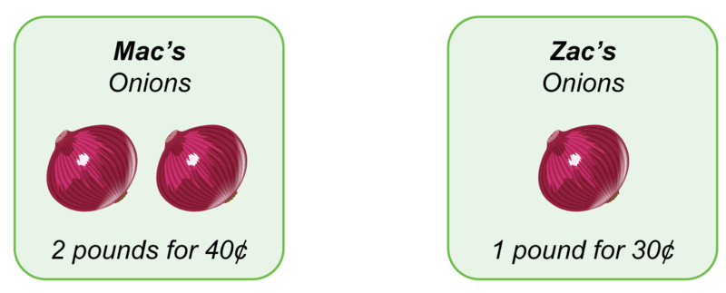
2.  **How did you decide?**
3.  **How much would it cost to buy 2 pounds of onions at Zac’s?**

**Better Buy 4**

2.  **How did you decide?**
3.  **How much would it cost to buy 3 cactus plants at Mac’s?**

**Extras for Experts: Better Buy – Proportional Reasoning**

**Solutions:**

**Extra for Experts Better Buy 1**

1. Zac’s

2. Mac’s: 1 box is half of $6, or $3

Zac’s: 1 sack is half of $8, or $4.

$\$3 < \$4$

3. Mac’s: $12

Zac’s: $16

**Extra for Experts Better Buy 2**

1. Zac’s

2. Mac’s: 1 sack is half of $12, or $6

Zac’s: 1 sack is one-third of $15, or $5.

$\$5 < \$6$

3. Mac’s: $24

Zac’s: $20

**Extra for Experts Better Buy 1**

2. **How did you decide?**

3. **How much would it cost to buy 4 boxes of strawberries at:**

**Mac’s?** \_\_\_\_\_\_\_\_\_\_\_\_\_\_\_\_\_\_\_\_\_\_\_\_\_\_\_\_\_\_\_\_

**Zac’s?** \_\_\_\_\_\_\_\_\_\_\_\_\_\_\_\_\_\_\_\_\_\_\_\_\_\_\_\_\_\_\_\_\_

**Extra for Experts Better Buy 2**

2. **How did you decide?**

3. **How much would it cost to buy 4 sacks of oranges at:**

**Mac’s?** \_\_\_\_\_\_\_\_\_\_\_\_\_\_\_\_\_\_\_\_\_\_\_\_\_\_\_\_\_\_\_

**Zac's?** \_\_\_\_\_\_\_\_\_\_\_\_\_\_\_\_\_\_\_\_\_\_\_\_\_\_\_\_\_\_\_

</article>

### 4.6 Critter Trades

<article>

**Critter Trades – Proportional Reasoning**

Students reason proportionally as they trade critters (e.g., 1 scorpion for 4 wasps.) All trades are 1 for 2, 3, 4 or 5. As they trade, students record numbers on the traded items, and then skip count or use repeated addition to solve the problems.

In the Extras for Experts, the trading is “backwards,” that is, many to one. For example, if you can get 2 ants for 1 bee, then to get 6 ants, how many bees will you need?

**Solutions**

**Critter Trades 1**

1. 6

2. Write 2 on each spider.

Then, $2 + 2 + 2 = 6$.

**Critter Trades 2**

1. 20

2. Write 5 on each grasshopper

Then, $5 + 5 + 5 + 5  = 20$.

**Critter Trades 3**

1. 15

2. Write 3 on each fly.

Then, $3 + 3 + 3 + 3 + 3 = 15$.

**Critter Trades 4**

1. 40

2. Write 4 on each scorpion.

Then, $4 +  4 + 4 + 4 + 4 + 4 + 4 + 4 + 4 + 4 = 40$

**Critter Trades: Centipedes and Moths**

$$
\begin{align*}
& \mathbf{Describe:} && \text{There are two different critters.}\\
&&& \text{For 1 centipede I get 3 moths.}\\
& \mathbf{My \ Job:} && \text{Figure out how many moths I can get for 4 centipedes.}\\
& \mathbf{Plan:} && \text{Write 3 on each of the 4 centipedes.}\\
&&& \text{Then add the 3s.}\\
& \mathbf{Solve:} && \text{(ART: Show the 4 centipedes in a row with the number 3 written on each)}\\
&&& \text{For 4 centipedes, I will get 12 moths.}\\
& \mathbf{Check:} && 3 + 3 + 3 + 3 = 12
\end{align*}
$$

**Critter Trades 1: Spiders and Bees**

2.  **How did you figure it out?**

**Critter Trades 2: Grasshoppers and Butterflies**

2.  **How did you figure it out?**

**Critter Trades 3: Flies and Ants**

2.  **How did you figure it out?**

**Critter Trades 4: Scorpions and Wasps**

2.  **How did you figure it out?**

**Extras for Experts: Critter Trades – Proportional Reasoning**

**Solutions**

**Extra for Experts: Critter Trades 1**

1. 3

2. 1 daddy long legs is 2 worms.

1 daddy long legs is 2 worms.

1 daddy long legs is 2 worms.

You need $1 + 1 + 1$, or 3 daddy long legs to get $2 + 2 + 2$, or 6 worms.

**Extra for Experts: Critter Trades 2**

1. 4

2. 1 lizard is 5 ants.

1 lizard is 5 ants.

1 lizard is 5 ants.

1 lizard is 5 ants.

You need $1 + 1 + 1 + 1$, or 4 lizards to get $5 + 5 + 5 + 5$, or 20 ants.

**Extra for Experts Critter Trades 1: Daddy Long Legs and Worms**

2.  **How did you figure it out?**

**Extra for Experts Critter Trades 1: Lizards and Ants**

2.  **How did you figure it out?**

</article>

### 4.7 Function Machines

<article>

**Function Machines – Complete two-step function tables**

For these problems, students follow rules presented in words and with symbols to complete two-column function tables. Each of the rules requires two computational steps. Problems 1-12 use addition followed by subtraction. Problems 13 -20 mix the sequence of addition then subtraction and subtraction then addition.

**Solutions**

1.

| **_In_** | **_Out_** |
| --- | --- |
| 5   | 8   |
| 3   | 6   |
| 0   | 3   |
| 6   | 9   |
| 4   | 7   |

2.

| **_In_** | **_Out_** |
| --- | --- |
| 4   | 5   |
| 8   | 9   |
| 5   | 6   |
| 2   | 3   |
| 9   | 10  |

3.

| **_In_** | **_Out_** |
| --- | --- |
| 1   | 3   |
| 5   | 7   |
| 2   | 4   |
| 7   | 9   |
| 8   | 10  |

4.

| **_In_** | **_Out_** |
| --- | --- |
| 4   | 8   |
| 6   | 10  |
| 3   | 7   |
| 1   | 3   |
| 5   | 9   |

5.

| **_In_** | **_Out_** |
| --- | --- |
| 6   | 14  |
| 4   | 12  |
| 1   | 9   |
| 2   | 10  |
| 8   | 16  |

6.

| **_In_** | **_Out_** |
| --- | --- |
| 5   | 10  |
| 7   | 12  |
| 2   | 7   |
| 8   | 13  |
| 6   | 11  |

7.

| **_In_** | **_Out_** |
| --- | --- |
| 2   | 3   |
| 8   | 9   |
| 5   | 6   |
| 4   | 5   |
|     | 8   |

8.

| **_In_** | **_Out_** |
| --- | --- |
| 2   | 9   |
| 0   | 7   |
| 3   | 10  |
| 5   | 12  |
| 1   | 8   |

9.

| **_In_** | **_Out_** |
| --- | --- |
| 4   | 13  |
| 7   | 16  |
| 2   | 11  |
| 9   | 18  |
| 5   | 14  |

10.

| **_In_** | **_Out_** |
| --- | --- |
| 8   | 16  |
| 3   | 11  |
| 9   | 17  |
| 5   | 13  |
| 7   | 15  |

11.

| **_In_** | **_Out_** |
| --- | --- |
| 2   | 8   |
| 5   | 11  |
| 7   | 13  |
| 1   | 7   |
| 8   | 14  |

12.

| **_In_** | **_Out_** |
| --- | --- |
| 8   | 15  |
| 2   | 9   |
| 6   | 13  |
| 4   | 11  |
| 1   | 8   |

13.

| **_In_** | **_Out_** |
| --- | --- |
| 4   | 3   |
| 8   | 7   |
| 5   | 4   |
| 2   | 1   |
| 7   | 6   |

14.

| **_In_** | **_Out_** |
| --- | --- |
| 4   | 2   |
| 2   | 0   |
| 8   | 6   |
| 6   | 4   |
| 3   | 1   |

15.

| **_In_** | **_Out_** |
| --- | --- |
| 9   | 16  |
| 12  | 19  |
| 5   | 12  |
| 10  | 17  |
| 8   | 15  |

16.

| **_In_** | **_Out_** |
| --- | --- |
| 7   | 15  |
| 3   | 11  |
| 9   | 17  |
| 2   | 10  |
| 5   | 13  |

17.

| **_In_** | **_Out_** |
| --- | --- |
| 1   | 6   |
| 7   | 12  |
| 4   | 9   |
| 9   | 14  |
| 2   | 7   |

18.

| **_In_** | **_Out_** |
| --- | --- |
| 2   | 6   |
| 5   | 9   |
| 9   | 13  |
| 3   | 7   |
| 0   | 4   |

19.

| **_In_** | **_Out_** |
| --- | --- |
| 16  | 12  |
| 10  | 6   |
| 9   | 5   |
| 11  | 7   |
| 14  | 10  |

20.

| **_In_** | **_Out_** |
| --- | --- |
| 4   | 11  |
| 7   | 14  |
| 11  | 18  |
| 5   | 12  |
| 9   | 16  |

\begin{align*}
& \mathbf{Describe:} && \text{There are two rules. Add 2. Then subtract 1.}\\
&&& \text{The table is missing} \ \mathbf{OUT} \ \text{numbers.}\\
& \mathbf{My \ Job:} && \text{Follow the add and subtract rules.}\\
&&& \text{Figure out the} \ \mathbf{OUT} \ \text{numbers. Finish the table.}\\
& \mathbf{Plan:} && \text{Add 2 to an IN number. Then subtract 1 from the sum.}
\end{align*}
$$

**Solve:**

| **_In_** | **_Out_** |
| --- | --- |
| 4   | 5   |
| 7   | 6   |
| 2   | 3   |
| 0   | 1   |
| 6   | 7   |

$$
\begin{align*}
& \mathbf{Check:} && 7 + 2 = 9, 9 - 1 = 8\\
&&& 2 + 2 = 4, 4 - 1 = 3\\
&&& 0 + 2 = 2, 2 - 1 = 1\\
&&& 6 + 2 = 8, 8 - 2 = 7
\end{align*}
$$

Follow the rules.

Complete the tables.

")

\[Figure 3\]

")

\[Figure 5\]

")

\[Figure 7\]

")

\[Figure 9\]

")

\[Figure 11\]

")

\[Figure 13\]

")

\[Figure 15\]

")

\[Figure 17\]

")

\[Figure 19\]

")

\[Figure 21\]

**Extra for Experts: Function Machines – Complete two-step function tables**

")

\[Figure 23\]

")

\[Figure 25\]

")

\[Figure 27\]

")

\[Figure 29\]

")

\[Figure 31\]

")

\[Figure 33\]

**Solutions**

1.

| **_In_** | **_Out_** |
| --- | --- |
| 6   | 12  |
| 2   | 8   |
| 8   | 14  |
| 1   | 7   |
| 9   | 15  |

2.

| **_In_** | **_Out_** |
| --- | --- |
| 7   | 13  |
| 4   | 10  |
| 5   | 11  |
| 9   | 15  |
| 3   | 9   |

3.

| **_In_** | **_Out_** |
| --- | --- |
| 2   | 5   |
| 5   | 8   |
| 0   | 3   |
| 6   | 9   |
| 4   | 7   |

4.

| **_In_** | **_Out_** |
| --- | --- |
| 7   | 10  |
| 3   | 6   |
| 9   | 12  |
| 4   | 7   |
| 1   | 4   |

5.

| **_In_** | **_Out_** |
| --- | --- |
| 6   | 5   |
| 8   | 7   |
| 3   | 2   |
| 9   | 8   |
| 4   | 3   |

6.

| **_In_** | **_Out_** |
| --- | --- |
| 3   | 0   |
| 8   | 5   |
| 6   | 3   |
| 5   | 2   |
| 7   | 4   |

7.

| **_In_** | **_Out_** |
| --- | --- |
| 2   | 3   |
| 5   | 6   |
| 0   | 1   |
| 6   | 7   |
| 4   | 5   |

8.

| **_In_** | **_Out_** |
| --- | --- |
| 7   | 10  |
| 3   | 6   |
| 9   | 12  |
| 4   | 7   |
| 1   | 4   |

9.

| **_In_** | **_Out_** |
| --- | --- |
| 6   | 10  |
| 2   | 6   |
| 10  | 14  |
| 8   | 12  |
| 5   | 9   |

10.

| **_In_** | **_Out_** |
| --- | --- |
| 0   | 3   |
| 3   | 6   |
| 7   | 10  |
| 9   | 12  |
| 4   | 7   |

11.

| **_In_** | **_Out_** |
| --- | --- |
| 1   | 5   |
| 9   | 13  |
| 6   | 10  |
| 8   | 12  |
| 7   | 11  |

12.

| **_In_** | **_Out_** |
| --- | --- |
| 10  | 7   |
| 8   | 5   |
| 12  | 9   |
| 6   | 3   |
| 9   | 6   |

</article>

### 4.8 GEO Patterns

<article>

**GEO Patterns – Extend Patterns**

Students identify patterns of circles, triangles and rectangles on three cards, extend the patterns to complete the next two cards in the pattern, and answer questions about the $10^{th}$ card. Shape patterns may differ. For example, the number of circles may remain constant while the number of triangles increases by 1 and the number of rectangles increases by 2. In lieu of drawing the figures, you may want to have students identify the number of shapes of each type on each of the empty cards.

**Solutions**

GEO Pattern 1

1. Card 5: 1 circle, 1 triangle, 5 rectangles

Card 6: 1 circle, 1 triangle, 6 rectangles

2. Card 10: 1 circle, 1 triangle, 10 rectangles

GEO Pattern 2

1. Card 5: 1 circle, 6 triangles, 6 rectangles

Card 6: 1 circle, 7 triangles, 7 rectangles

2. Card 10: 1 circle, 11 triangles, 11 rectangles

GEO Pattern 3

1. Card 5: 4 circles, 2 triangles, 10 rectangles

Card 6: 5 circles, 2 triangles, 12 rectangles

2. Card 10: 9 circles, 2 triangles, 20 rectangles

GEO Pattern 4

1. Card 5: 4 circles, 4 triangles, 10 rectangles

Card 6: 5 circles, 5 triangles, 12 rectangles

2. Card 10: 9 circles, 9 triangles, 20 rectangles

Draw the shapes on Cards 5 and 6.

**Think about it.**

2. On card 10,

\begin{align*}
& \mathbf{Describe:} && \text{There \ are \ 6 \ cards. \ Cards \ 1-4 \ have \ circles, \ triangles \ and \ rectangles.}\\
&&& \text{Cards \ 5 \ and \ 6 \ are \ empty.}\\
& \mathbf{My \ Job:} && \text{Figure \ out \ the \ patterns \ of \ circles, \ triangles \ and \ rectangles.}\\
&&& \text{Draw \ shapes \ on \ cards \ 5 \ and \ 6. \ Answer \ questions \ about \ Card \ 10.}\\
& \mathbf{Plan:} && \text{Count \ the \ number \ of \ circles \ on \ each \ card. \ Look \ for \ a \ pattern. \ Draw}\\
&&& \text{circles \ on \ Cards \ 5 \ and \ 6.}\\
&&& \text{Count \ the \ number \ of \ triangles \ on \ each \ card. \ Look \ for \ a \ pattern. \ Draw}\\
&&& \text{triangles \ on \ Cards \ 5 \ and \ 6.}\\
&&& \text{Count \ the \ number \ of \ rectangles \ on \ each \ card. \ Look \ for \ a \ pattern.}\\
&&& \text{Draw \ rectangles \ on \ Cards \ 5 \ and \ 6.}\\
&&& \text{Extend \ the \ patterns. \ Answer \ questions \ about \ Card \ 10.}\\
& \mathbf{Solve:} && \text{ART: \ Show \ cards \ 5 \ and \ 6. \ Card \ 5 \ has \ one \ red \ circle \ next \ to \ a \ stack \ of}\\
&&& \text{5 \ green \ triangles, \ next \ to \ a \ stack \ of \ 6 \ blue \ rectangles. \ Card \ 6 \ has \ one}\\
&&& \text{red \ circle \ next \ to \ a \ stack \ of \ 6 \ green \ triangles, \ next \ to \ a \ stack \ of \ 7 \ blue}\\
&&& \text{rectangles.}\\
&&& \text{Card \ 10 \ has \ one \ red \ circle, \ 10 \ green \ triangles, \ and \ 11 \ blue \ rectangles.}\\
& \mathbf{Check:} && \text{There \ is \ always \ one \ red \ circle.}\\
&&& \text{The \ number \ of \ green \ triangles \ is \ the \ same \ as \ the \ card \ number.}\\
&&& \text{The \ number \ of \ blue \ rectangles \ is \ always \ one \ more \ than \ the \ card \ number.}
\end{align*}
$$

**GEO Pattern 1**

Draw the shapes on Cards 5 and 6.

**Think about it.**

2. On card 10,

Draw the shapes on Cards 5 and 6.

**Think about it.**

2. On card 10,

Draw the shapes in Cards 5 and 6.

**Think about it.**

2. On card 10,

Draw the shapes on Cards 5 and 6.

**Think about it.**

2. On card 10,

**GEO Pattern 1**

Draw the shapes in Cards 5 and 6.

**Think about it.**

2. On card 10,

Draw the shapes on Cards 5 and 6.

**Think about it.**

2. On card 10,

**GEO Pattern 1**

1. Card 5: 7 circles, 6 triangles, 5 rectangles

Card 6: 8 circles, 7 triangles, 6 rectangles,

2. Card 10: 12 circles, 11 triangles, 10 rectangles

**GEO Pattern 2**

1. Card 5: 1 circle, 5 triangles, 16 rectangles

Card 6: 1 circle, 6 triangles, 18 rectangles

2. Card 10: 1 circle, 10 triangles, 26 rectangles

</article>

## 5.0 Algebra Explorations, Grade 3

<article>

</article>

### 5.1 Introduction

<article>

This algebra module has been designed to introduce grade 3 students to ten key concepts of algebra and to enhance their problem solving skills. Each section begins with a brief description of the problem set and the concepts and skills developed. This is followed by the solutions to problems in the problem set. The first problem in each set is the “teaching problem.” It is completed following the five-step problem solving model and is designed to be used by teachers as the centerpiece of the instructional program. The teaching problem, to be completed by students with the teacher’s guidance, is followed by problems to be completed by the students working on their own.

This module may be used as an algebra unit to complement the existing instructional program. It also may be used to show connections between algebra and the strands of number and measurement, to provide practice of number computational algorithms, and to reinforce problem solving skills.

The _Extra for Experts_ provides additional opportunities for students to apply newly learned concepts and skills to the solution of problems like those developed in this Algebra module.

**The Key Algebraic Concepts**

**Equality/Inequality:**

In this module, students explore equal and unequal relationships by interpreting and reasoning about pictures of pan balances containing various objects. Their job is to determine which object is heavier, lighter, or which of three objects is the heaviest or lightest. This is preparation for the study of variables as unknowns in equations and as varying quantities in functions.

**Variables as unknowns:**

Variables may be letters, geometric shapes, or objects that stand for a number of things. When used to represent an _unknown_, the variable has only one value. For example, in the equation, $t + 5 = 7$, the variable $t$ is an unknown and it stands for the number 2. When $t$ is replaced with 2 in the equation, the expression to the left of the equal symbol names the same number as the expression to the right of the equal symbol; $2 + 5$ is another name for 7. In this module, students solve for the weights of blocks on scales, and for unknowns in two-by-two grids representing systems of equations.

**Variables as varying quantities:**

In some equations, variables can take on more than one value. For example, in the equation $q = 2 + r$, if the value of $q$ is 5, then the value of $r$ is 3. Or, if the value of $r$ is 9, the value of $q$ is 11. So, in this case $q$ can be any number. However, once you choose a value for $q$, then the value for $r$ is fixed. Likewise, once you choose a value for $r$, then the value of $q$ is fixed. Variables as varying quantities appear in functions and formulas. In this module, students complete tables of values for one-step functions (e.g., $y=2z$) and determine the rule by identifying the relationship between inputs and outputs.

**Proportional Reasoning:**

A major method for solving algebraic problems is by reasoning proportionally. Proportional reasoning is sometimes called “multiplicative reasoning,” because it requires application of multiplication or its inverse, division. In this module, students reason proportionally when they determine better buys (e.g., unit cost or price for one), or interpret pictographs ( e.g., picture of one book stands for 10 books in the graph) to solve comparison problems.

**Interpret Representations:**

Mathematical relationships can be displayed in a variety of ways including with text, tables, graphs, diagrams and with symbols. Having students interpret these types of displays and use the data in the displays to solve problems is critical to success with the study of algebra. In this module, students interpret pan balances, circle and arrow grid diagrams, tables of values, weight scales and weigh equations, better-buy signs, and pictographs.

**Write Equations:**

Although an equation is a symbolic representation of a mathematical relationship, the writing of an equation is a key algebraic skill and one that requires separate attention and instruction. In this module, students learn to write “block equations” for weights of blocks picture on scales. Students explore ways to record multiple copies of the same blocks as both the sum of separate units and as a product. For examples, (Art: square) + (Art: square) + (Art: square) can be represented as 3 (Art: square). They also write rules to represent tables of data related functionally.

**The Problem Solving Five-Step Model**

The model that we recommend to help students move through the solution problems has five steps:

**Describe** focuses students’ attention on the information in the problem display. In some cases, the display is a diagram. Other times it is a table, graph, equation, or model, or a combination of any of these. Having students tell what they see will help them interpret the problem and identify key facts needed to proceed with the solution method.

**My Job** helps students focus on the task by having them tell what they have to do, that is, rephrase the problem in their own words.

**Plan** requires identification of the steps to follow to solve the problem and helps students focus on the first step. Knowing where to start is often the most difficult part of the solution process.

**Solve** is putting the plan to work and showing the steps.

**Check** is used to verify the answer.

We recommend that you “model” these steps in your instruction with the first problem in each problem set and that you encourage your students to follow the steps when solving the problems and when relating their solution processes to others.

**Note:** Although the instructional pages show only one solution plan, many of the problems have more than one correct solution path. These problems provide excellent opportunities for engaging your students in algebraic conversations about how their solutions are the same, how they differ, and perhaps, which solution method is “most elegant.”

</article>

### 5.2 Jars and Jars

<article>

**Jars and Jars - Interpret relationships to compare weights**

In each problem, two pan balances are shown with jars of different types. All jars of the same type have the same weight. Students have to figure out the relative weights of objects from the relationships displayed in the pan balances. To begin, be sure that students recognize differences in the types of jars. Draw students’ attention to the position of the pans. If the two pans are not at the same level, then one pan–the lower one is heavier. If the pans are level, then they hold equal weight. One of the difficulties students often experience is recognizing that if one block (call it $A$) has the same weight as, for example, two others, $(B + B)$, then the one block $(A)$ is heavier. Point out to students that $lb$ stands for pounds, and that all jars with the same letter are the same number of pounds.

**Solutions**

1.  $m$ is more than 5 pounds.
2.  $t$ is more than 6 pounds.
3.  $j$ is more than 3 pounds
4.  $z$ is less than 4 pounds
5.  $v$ is more than 3 pounds
6.  $t$ is less than 8 pounds

\begin{align*}
& \mathbf{Describe} && \text{I see two pan balances. I see two jars} \ x \ \text{and} \ z.\\ 
&&& \text{Pan Balance} \ A: \ \text{The pans are not balanced}.\\ 
&&& \text{Pan Balance} \ B: \ \text{The pans are balanced. One pan has a} \ 12 \ \text{pound jar}.\\
& \mathbf{My \ Job} && \text{Figure out a weight for} \ x. \ \text{Are other weights possible?}\\
& \mathbf{Plan} && \text{Pan Balance} \ A: \ \text{The pan with} \ z \ \text{is lower so,} \ z \ \text{is heavier than} \ x.\\
&&& \text{Pan Balance} \ B: \ 3 \ z \ \text{weigh} \ 12 \ \text{pounds. Start with the fact.}\\
& \mathbf{Solve} && \text{Pan Balance} \ B: \ z + z + z = 12 \ \text{pounds, so} \ z = 4 \ \text{pounds}.\\
&&& \text{Pan Balance} \ A: \ x \ \text{has to weigh less than} \ 4 \ \text{pounds}.\\
&&& \qquad \qquad \qquad \ \ \ \ \ x \ \text{could be} \ 1, 2 \ \text{or} \ 3 \ \text{pounds}.\\
&&& \text{Pan Balance} \ A: \ \text{The picture shows that} \ z \ \text{is heavier than} \ x.\\
& \mathbf{Check} && \text{Pan Balance} \ B: \ 4 + 4 + 4 = 12 \ \text{pounds}.\\
&&& \qquad \qquad \qquad \qquad  \ z=4 \ \text{pounds}.\\
&&& \qquad \qquad \qquad \qquad  \ 1, 2, \ \text{and} \ 3 \ \text{are all less than} \ 4. \ \text{So} \ x \ \text{can be} \ 1, 2, \ \text{or} \ 3 \ \text{pounds}.
\end{align*}
$$

What could be the weight? Tell how you figured it out.

")

\[Figure 3\]

")

\[Figure 5\]

")

\[Figure 7\]

</article>

### 5.3 Jars and Jars Extras

<article>

**_Extras for Experts_** **\- Jars and Jars – Interpret relationships to compare weights**

")

\[Figure 2\]

")

\[Figure 4\]

</article>

### 5.4 Circles and Arrows

<article>

**Circles and Arrows - Solve for Unknowns**

Circles and Arrows show grids in which circles contain numbers and letters that represent unknown quantities. Arrows point to sums of rows and columns. For example, in the top row, $3 + A + B = 11$. In the first column, $3 + A + 7 = 12$. Students use the grid relationships to figure out the values of the letters. Although only one approach is shown, there are often several ways to begin to solve each problem. Encourage students to consider alternative approaches for each problem.

**Solutions**

1.  $C = 3; D = 5$
2.  $F =6; G = 8$
3.  $H = 7; J = 9$
4.  $K = 8; L = 5$
5.  $M = 9; N = 7$
6.  $P = 8; Q = 6$

The arrows point to the sum of each row or column. Figure out the value of each letter.

\begin{align*}
& \mathbf{Describe} && \text{I see rows and columns with numbers and letters}.\\ 
&&& \text{The arrows point to sums}.\\ 
& \mathbf{My \ Job} && \text{Figure out the value of each letter}.\\
& \mathbf{Plan} && \text{In the second row, all letters are the same}.\\
&&& \text{I'll start with that row}.\\
&&& \text{Then I'll do the bottom row and find the value of} \ B.\\
& \mathbf{Solve} && \text{Middle Row:} \ A + A + A = 6, \text{so} \ A = 2.\\
&&& \text{Bottom Row:} \ 7 + 5 = 12. \ 18 - 12 = 6, \text{so} \ B = 6.\\
& \mathbf{Check} && \text{Top Row:} \ 3 + 2 + 6 = 11; \text{Middle Row:} \ 2 + 2 + 2 = 6; \text{Bottom Row:} \ 7 + 5 + 6 = 18\\
&&& \text{Left Column:} \ 3 + 2 + 7 = 12; \text{Middle Column:} \ 2 + 2 + 5 = 9; \text{Right Column:} \ 6 + 2 + 6 = 14
\end{align*}
$$

")

\[Figure 3\]

")

\[Figure 5\]

")

\[Figure 7\]

</article>

### 5.5 Circles and Arrows Extras

<article>

**_Extras for Experts_** **\- Circles and Arrows – Solve for Unknowns**

The arrows point to the sum of each row or column. Figure out the value of each letter.

")

\[Figure 2\]

")

\[Figure 4\]

**Solutions**

1.  $A = 5; B = 8$
2.  $C =4; D = 6$
3.  $F = 3; G = 7$
4.  $H = 7; J = 4$

</article>

### 5.6 Follow the Rule

<article>

**Follow The Rule - Complete one-step function tables**

In these problems, students follow rules presented in words and with symbols to complete two-column function tables. Each of the rules requires one computational step. For some rows in the tables, students have to apply inverse operations to figure out the value of the variable. Problems 1-6 use addition or subtraction. Problems 7-12 use multiplication or division.

**Solutions**

1.

| $r$ | $v = r - 2$ |
| --- | --- |
| 7   | 5   |
| 3   | 1   |
| 9   | 7   |
| 10  | 8   |
| 15  | 13  |
| 36  | 34  |
| 20  | 18  |
| 29  | 27  |
| 54  | 52  |

2.

| $q$ | $w=q+20$ |
| --- | --- |
| 5   | 25  |
| 8   | 28  |
| 6   | 26  |
| 4   | 24  |
| 19  | 39  |
| 53  | 73  |
| 20  | 40  |
| 48  | 68  |
| 69  | 89  |

3.

| $b$ | $a=b-100$ |
| --- | --- |
| 538 | 438 |
| 810 | 710 |
| 662 | 562 |
| 626 | 526 |
| 149 | 49  |
| 479 | 379 |
| 905 | 805 |
| 700 | 600 |
| 568 | 468 |

4.

| $m$ | $p=m-200$ |
| --- | --- |
| 741 | 541 |
| 800 | 600 |
| 306 | 106 |
| 449 | 249 |
| 530 | 330 |
| 361 | 161 |
| 427 | 227 |
| 936 | 736 |
| 958 | 758 |

5.

| $a$ | $q = 3 \times a$ |
| --- | --- |
| 2   | 6   |
| 5   | 15  |
| 9   | 27  |
| 4   | 12  |
| 3   | 9   |
| 10  | 30  |
| 1   | 3   |
| 8   | 24  |
| 7   | 21  |

6.

| $d$ | $r=d \div 2$ |
| --- | --- |
| 8   | 4   |
| 12  | 6   |
| 10  | 5   |
| 4   | 2   |
| 18  | 9   |
| 2   | 1   |
| 20  | 10  |
| 16  | 8   |
| 14  | 7   |

7.

| $z$ | $m=5 \times z$ |
| --- | --- |
| 3   | 15  |
| 7   | 35  |
| 8   | 40  |
| 2   | 10  |
| 9   | 45  |
| 4   | 20  |
| 1   | 5   |
| 5   | 25  |
| 6   | 30  |

8.

| $y$ | $b=10 \times y$ |
| --- | --- |
| 5   | 50  |
| 2   | 20  |
| 7   | 70  |
| 3   | 30  |
| 8   | 80  |
| 9   | 90  |
| 1   | 10  |
| 4   | 40  |
| 6   | 60  |

$s$ stands for a number.

Follow the rule.

Complete the table.

\begin{align*}
& \mathbf{Describe} && \text{I see a table with two columns}.\\ 
&&& \text{The letter} \ s \ \text{stands for a number}.\\ 
&&& \text{The rule tells me to add} \ 6 \ \text{to} \ s \ \text{to get} \ t.\\
& \mathbf{My \ Job} && \text{Figure out the missing numbers to fill in the table}.\\
& \mathbf{Plan} && \text{I'll start by figuring out} \ t. \ \text{That's rows} \ 1., 2., \ \text{and} \ 5. \ \text{in the table}.\\
&&& \text{For rows} \ 3. \ \text{and} \ 4., \text{I will subtract} \ 6 \ \text{from} \ t \ \text{to get} \ s.
\end{align*}
$$

")

\[Figure 4\]

")

\[Figure 6\]

")

\[Figure 8\]

")

\[Figure 10\]

</article>

### 5.7 Follow the Rule Extras

<article>

**_Extra for Experts_** **\- Follow the Rule – Complete one-step function tables**

Complete the tables.

")

\[Figure 2\]

")

\[Figure 4\]

")

\[Figure 6\]

")

\[Figure 8\]

**Solutions**

1.

| $a$ | $b = a + 30$ |
| --- | --- |
| 8   | 38  |
| 2   | 32  |
| 10  | 40  |
| 6   | 36  |
| 20  | 50  |
| 45  | 15  |
| 60  | 90  |
| 57  | 87  |
| 29  | 59  |

2.

| $m$ | $n = m \div 5$ |
| --- | --- |
| 30  | 6   |
| 15  | 3   |
| 10  | 2   |
| 5   | 1   |
| 45  | 9   |
| 25  | 5   |
| 40  | 8   |
| 50  | 10  |
| 35  | 7   |

3.

| $f$ | $g = f - 5$ |
| --- | --- |
| 38  | 33  |
| 10  | 5   |
| 62  | 57  |
| 26  | 21  |
| 49  | 44  |
| 79  | 74  |
| 100 | 95  |
| 150 | 145 |
| 195 | 190 |

| $h$ | $i = h + 50$ |
| --- | --- |
| 36  | 86  |
| 49  | 99  |
| 61  | 111 |
| 108 | 158 |
| 43  | 93  |
| 20  | 70  |
| 50  | 100 |
| 26  | 76  |
| 12  | 62  |

5.

| $j$ | $k = 2 \times j$ |
| --- | --- |
| 3   | 6   |
| 8   | 16  |
| 2   | 4   |
| 5   | 10  |
| 1   | 2   |
| 6   | 12  |
| 4   | 8   |
| 7   | 14  |
| 9   | 18  |

6.

| $d$ | $r = d \div 2$ |
| --- | --- |
| 8   | 4   |
| 12  | 6   |
| 10  | 5   |
| 4   | 2   |
| 18  | 9   |
| 2   | 1   |
| 20  | 10  |
| 16  | 8   |
| 14  | 7   |

7.

| $p$ | $r = p \div 2$ |
| --- | --- |
| 12  | 6   |
| 10  | 5   |
| 18  | 9   |
| 20  | 10  |
| 14  | 7   |
| 8   | 4   |
| 2   | 1   |
| 4   | 2   |

8.

| $q$ | $s = 6 \times q$ |
| --- | --- |
| 4   | 24  |
| 2   | 12  |
| 5   | 30  |
| 3   | 18  |
| 10  | 60  |
| 7   | 42  |
| 1   | 6   |
| 8   | 48  |

</article>

### 5.8 What's My Rule

<article>

**What's My Rule? - Write Rules For One-Step Function Tables**

Students identify relationships between the input and output in two-column tables, and write rules that describe the relationship. Rules may be written in words or symbols or both ways. All functions involve one computational step, addition, subtraction, multiplication, or division.

**Solutions**

1.

|     | $u$ | $v$ |
| --- | --- | --- |
|     | 7   | 9   |
|     | 4   | 6   |
|     | 1   | 3   |
|     | 0   | 2   |
| 1.  | 2   | 4   |
| 2.  | 9   | 11  |
| 3.  | 3   | 5   |
| 4.  | 8   | 10  |
| 5   | Rule: $v=u+2$ |     |

2.

|     | $w$ | $y$ |
| --- | --- | --- |
|     | 10  | 6   |
|     | 15  | 11  |
|     | 13  | 9   |
|     | 5   | 1   |
| 1.  | 8   | 4   |
| 2.  | 14  | 10  |
| 3.  | 7   | 3   |
| 4.  | 16  | 12  |
| 5   | Rule: $y=w-4$ |     |

3.

|     | $z$ | $a$ |
| --- | --- | --- |
|     | 7   | 37  |
|     | 10  | 40  |
|     | 18  | 48  |
|     | 45  | 75  |
| 1.  | 31  | 61  |
| 2.  | 14  | 44  |
| 3.  | 8   | 38  |
| 4.  | 29  | 59  |
| 5   | Rule: $a=z+30$ |     |

4.

|     | $b$ | $c$ |
| --- | --- | --- |
|     | 48  | 28  |
|     | 50  | 30  |
|     | 28  | 8   |
|     | 42  | 22  |
| 1.  | 67  | 47  |
| 2.  | 59  | 39  |
| 3.  | 75  | 55  |
| 4.  | 34  | 14  |
| 5   | Rule: $c=b-20$ |     |

5.

|     | $d$ | $e$ |
| --- | --- | --- |
|     | 3   | 12  |
|     | 8   | 32  |
|     | 2   | 8   |
|     | 5   | 20  |
| 1.  | 1   | 4   |
| 2.  | 7   | 28  |
| 3.  | 6   | 24  |
| 4.  | 9   | 54  |
| 5   | Rule: $e=4 \times d$ |     |

6.

|     | $f$ | $g$ |
| --- | --- | --- |
|     | 10  | 2   |
|     | 40  | 8   |
|     | 25  | 5   |
|     | 5   | 1   |
| 1.  | 15  | 3   |
| 2.  | 35  | 7   |
| 3.  | 20  | 4   |
| 4.  | 45  | 9   |
| 5   | Rule: $g=f \div 5$ |     |

7.

|     | $h$ | $j$ |
| --- | --- | --- |
|     | 2   | 18  |
|     | 5   | 45  |
|     | 7   | 63  |
|     | 1   | 9   |
| 1.  | 4   | 36  |
| 2.  | 3   | 27  |
| 3.  | 6   | 54  |
| 4.  | 9   | 81  |
| 5   | Rule: $j=9 \times h$ |     |

8.

|     | $k$ | $m$ |
| --- | --- | --- |
|     | 21  | 7   |
|     | 18  | 6   |
|     | 6   | 2   |
|     | 27  | 9   |
| 1.  | 9   | 3   |
| 2.  | 24  | 8   |
| 3.  | 12  | 4   |
| 4.  | 30  | 10  |
| 5   | Rule: $m=k \div 3$ |     |

$p$ **_and_** $t$ stand for numbers.

Write the rule. Complete the table.

\begin{align*}
& \mathbf{Describe} && \text{I see a table with two columns}.\\ 
&&& p \ \text{and} \ t \ \text{stand for numbers}.\\ 
& \mathbf{My \ Job} && \text{Figure out the rule}.\\
&&& \text{What do I have to do to} \ p \ \text{to get} \ t?\\ 
&&& \text{Then complete rows} \ 1, 2, 3 \ \text{and} \ 4.\\ 
& \mathbf{Plan} && \text{I can add, subtract, mulitply or divide. I have to use the same operation on}\\
&&& \text{all} \ p \ \text{numbers to get the} \ t \ \text{numbers}.\\
& \mathbf{Solve} && \text{All} \ t \ \text{numbers are} \ 3 \ \text{times} \ p \ \text{numbers}.\\
&&& \text{The rule is multiply} \ p \ \text{by} \ 3 \ \text{to get} \ t. \ \text{I can write} \ t = 3 \times p\\
& \mathbf{Check}
\end{align*}
$$

")

\[Figure 4\]

")

\[Figure 6\]

")

\[Figure 8\]

")

\[Figure 10\]

</article>

### 5.9 What's My Rule Extras

<article>

**_Extra for Experts_** **\- What's My Rule – Rules for One-Step Function Tables**

Write the rule. Complete the tables.

")

\[Figure 2\]

")

\[Figure 4\]

**Solutions**

1.

|     | $u$ | $v$ |
| --- | --- | --- |
|     | 5   | 14  |
|     | 8   | 17  |
|     | 3   | 12  |
|     | 6   | 15  |
| 1.  | 9   | 18  |
| 2.  | 4   | 13  |
| 3.  | 2   | 11  |
| 4.  | 7   | 16  |
| 5.  | Rule: $v = u + 9$ |     |

2.

|     | $w$ | $y$ |
| --- | --- | --- |
|     | 45  | 15  |
|     | 68  | 38  |
|     | 36  | 6   |
|     | 50  | 20  |
| 1.  | 61  | 31  |
| 2.  | 34  | 4   |
| 3.  | 72  | 42  |
| 4.  | 56  | 26  |
| 5.  | Rule: $y = w - 30$ |     |

3.

|     | $z$ | $a$ |
| --- | --- | --- |
|     | 3   | 15  |
|     | 8   | 40  |
|     | 5   | 25  |
|     | 6   | 30  |
| 1.  | 1   | 5   |
| 2.  | 7   | 35  |
| 3.  | 4   | 20  |
| 4.  | 2   | 10  |
| 5.  | Rule: $a = 5 \times z$ |     |

4.

|     | $b$ | $c$ |
| --- | --- | --- |
|     | 12  | 3   |
|     | 24  | 6   |
|     | 20  | 5   |
|     | 36  | 9   |
| 1.  | 16  | 4   |
| 2.  | 8   | 2   |
| 3.  | 28  | 7   |
| 4.  | 4   | 1   |
| 5.  | $c = b \div 4$ |     |

</article>

### 5.10 Weight Problems

<article>

**Weighty Problems - Solve for Values Unknowns**

Each problem shows two scales, their contents, and their weights. Students use the data provided in the display as clues to determine the weight of each block. The two scales represent a set of two equations with two unknowns.

**Solutions**

")

\[Figure 2\]

")

\[Figure 5\]

")

\[Figure 7\]

")

\[Figure 9\]

</article>

### 5.11 Weight Problems Extras

<article>

**_Extras for Experts_** **\- Weighty Problems – Solve for Values of Unknowns**

Figure out the weights of the blocks.

")

\[Figure 2\]

")

\[Figure 4\]

")

\[Figure 6\]

**Solutions**

\[Figure 7\]

</article>

### 5.12 Write Equations

<article>

**Write Equations - Write and Solve Equations with Blocks as Unknowns**

Students are presented with two scales, their contents, and their weights, and explore ways to represent relationships shown in the scales by writing block equations. They gain experience matching equations to scale pictures, and then solving sets or systems of equations without the pictures. It is in this section that students are introduced to the idea that sets of the same type of block can be represented as either the sum of that number of blocks (e.g., $n + n + n$) or as a product (e.g., $3 \ n$).

**Solutions**

1. ")

\[Figure 2\]

3. ")

\[Figure 4\]

5. ")

\[Figure 6\]

7. ")

\[Figure 8\]

9. ")

\[Figure 10\]

11. ")

\[Figure 12\]

13. c

14. b

15. c

16. a

17. ")

\[Figure 14\]

19. ")

\[Figure 16\]

")

\[Figure 18\]

Try these. Write equations. Figure out the weights of the blocks.

")

\[Figure 20\]

")

\[Figure 22\]

")

\[Figure 24\]

")

\[Figure 27\]

")

\[Figure 29\]

")

\[Figure 31\]

Circle the equation that matches the scale.

")

\[Figure 33\]

")

\[Figure 35\]

Eric wrote these equations from pictures of scales.

Use Eric’s equations. Find the weight of each block.

")

\[Figure 37\]

")

\[Figure 39\]

</article>

### 5.13 Write Equations Extras

<article>

**_Extras for Experts_** **\- Write Equations – Write and Solve Equations with Blocks as Unknowns**

Write the block equation for each scale. Figure out the weights of the blocks.

")

\[Figure 2\]

\[Figure 4\]

</article>

### 5.14 Better Buy: Unit Price

<article>

**Better Buy: Unit Price - Proportional Reasoning**

In **Better Buy: Unit Price**, two signs showing prices for multiple items of the same type at two stores are displayed. Students reason proportionally to first determine the price for one toy (unit price) at each store. Then they compare prices to identify the better buy, that is the item of lesser price. To determine unit price, students divide. All division computations in this section involve basic facts.

**Solutions**

1.  Jim’s Sports; $\$20 \div 4$ or $5 for one paddle and ball ($\$18 \div 3$, or $6 at A-One Athlete).
2.  A-One Athlete; $\$10 \div 5$, or $2 for one Frisbee ($\$6 \div 2$, or $3 at Jim’s Sports).
3.  Jim’s Sports; $\$36 \div 6$, or $6 for one badminton racquet ($\$28 \div 4$, or $7 at A-One Athlete).
4.  A-One Athlete; $\$30 \div 10$, or $3 for one golf ball ($\$24 \div 6$, or $4 at Jim’s Sports).
5.  A-One Athlete; $\$18 \div 9$, or $2 for one birdie ($\$12 \div 4$, or $3 at Jim’s Sports).
6.  Jim’s Sports; $\$15 \div 3$, or $5 for one can of tennis balls ($\$30 \div 5$ or $6 at A-One Athlete).

$$
\begin{align*}
& \mathbf{Describe} && \text{I see signs for yo-yos at two stores.}\\ 
&&& \text{Terry's Toys} : \ 3 \ \text{yo-yos for} \ \$12\\
&&& \text{Geena's Gifts} : \ 5 \ \text{yo-yos for} \ \$15. 
& \mathbf{My \ Job} && \text{Decide which store has the better buy for one yo-yo.}\\
&&& \text{Better buy means it costs less.}\\
& \mathbf{Plan} && \text{I'll figure out the price for one yo-yo at each store.} \\
&&& \text{Then  I will compare the prices.}\\
& \mathbf{Solve} && \text{Terry's Toys}: \ \$12 \div 3 = \$4 \ \text{for one yo-yo}\\
&&& \text{Geena's Gifts}: \ \$15 \div 5 = \$3 \ \text{for one yo-yo}\\
&&& \text{Geena's Gifts has the better buy}\\
& \mathbf{Check} && \$3 < \$4 \ \text{so one yo-yo costs less at Geena's.}
\end{align*}
$$

**How much is the paddle and ball at that store?**

**How much is one Frisbee at that store?**

**How much is one racquet at that store?**

**How much is one golf ball at the store?**

**How much is one birdie at the store?**

**How much is one can at that store?**

</article>

### 5.15 Better Buy: Unit Price Extras

<article>

**_Extra for Experts_** **\- Better Buy: Unit Price**

**How did you decide?**

**How did you figure it out?**

**How did you figure it out?**

**How did you figure it out?**

**How did you figure it out?**

**How did you figure it out?**

**Solutions**

**Better Buy**

1.  Sun’s Stationery; $\$15 \div 5 = \$3$ for one box of pencils at Sun’s Stationery, and $\$10 \div 2 = \$5$ for one box of pencils at Nature’s Notes.
2.  Nature’s Notes; $\$30 \div 6 = \$5$ for one notebook at Nature’s Notes, and $\$24 \div 4  = \$6$ for one notebook at Sun’s Stationery.
3.  Nature’s Notes; $\$24 \div 8 = \$3$ for one box of paperclips at Nature’s Notes, and $\$20 \div 5 = \$4$ for one box of paper clips at Sun’s Stationery.
4.  Harry’s Hardware; $\$49 \div 7 = \$7$ for one box of nails at Harry’s Hardware, and $\$27 \div 3 = \$9$ for one box of nails at HomeMart.
5.  HomeMart; $\$21 \div 3 = \$7$ for one stool at HomeMart, and $\$16 \div 2 = \$8$ for one step stool at Harry’s Hardware.
6.  HomeMart; $\$64 \div 8 = \$8$ for one hose at HomeMart, and $\$40 \div 4 = \$10$ for one hose at Harry’s Hardware.

</article>

### 5.16 Better Buy: Buying More than One

<article>

**Better Buy: Buying More than One - Reason Proportionally**

As in the previous section, in **Better Buys: Price for More than One**, students first compute the unit price of an item at two different stores. (Note that students may use other methods.) Then they use that data to compute and compare costs of multiple items from the stores, and determine the savings. An important concept is that to determine the better buy, either the number of items must be the same so that the prices can be compared or the prices must be the same so that the number of items can be compared. This latter concept should be highlighted throughout the grades.

1. $2 less at Morsel’s Market

$6 for 2 gallons of milk at Morsel’s Market (Unit price is $3/gallon)

$8 for 2 gallons of milk at Flynn’s Foods (Unit price is $4/gallon)

2. $3 less at Flynn’s Foods

$15 for 3 bottles of orange juice at Flynn’s Foods (Unit price is $5/bottle)

$18 for 3 bottles of orange juice at Morsel’s Market (Unit price is $6/bottle)

3. $8 less at Flynn’s Foods

$8 for 4 ice cream bars at Flynn’s Foods (Unit price is $2/ice cream bar)

$16 for 4 ice cream bars at Morsel’s Market (Unit price is $4/ice cream bar)

4. $5 less at Flynn’s Foods

$10 for 5 boxes of crackers at Flynn’s Foods (Unit price is $2/box)

$15 for 5 boxes of crackers at Morsel’s Market (Unit price is $3/box)

5. $8 less at Morsel’s Market

$24 for 4 bags of oranges at Morsel’s Market (Unit price is $6/bag)

$32 for 4 bags of oranges at Flynn’s Foods (Unit price is $8/bag)

6. $7 less at Morsel’s Market

$42 for 7 watermelons at Morsel’s Market (Unit price is $6/watermelon)

$49 for 7 watermelons at Flynn’s Food (Unit price is $7/watermelon)

**How much less are 2 boxes of cereal at that store?**

$$
\begin{align*}
& \mathbf{Describe} && \text{I see signs for boxes of cereal at two stores.}\\ 
&&& \text{Borson's Foods} : \ 4 \ \text{boxes for} \ \$12\\
&&& \text{Saferoad Market} : \ 5 \ \text{boxes for} \ \$20. 
& \mathbf{My \ Job} && \text{Figure out which store has the better price for two boxes of cereal.}\\
&&& \text{Then compare prices to find out how much less.}\\
& \mathbf{Plan} && \text{I'll figure out the price of one box at each store. Then I can find the price for two}\\
&&&\text{boxes and compare the total prices.} \\
& \mathbf{Solve} && \text{Borson's Foods} : \ 4 \ \text{boxes for} \ \$12 \ \text{is} \ 12 \div 4, \ \text{or} \ \$3 \ \text{for one box and} \ \$6 \ \text{for} \ 2 \ \text{boxes.}\\
&&& \text{Saferoad Market} : \ 5 \ \text{boxes for} \ \$20 \ \text{is} \ 20 \div 5, \ \text{or} \ \$4 \ \text{for one box and} \ \$8 \ \text{for} \ 2 \ \text{boxes.}\\
&&& \$8 - \$6 = \$2. \ \text{I will save} \ \$2 \ \text{by buying cereal at Borson's Foods.}\\
& \mathbf{Check} && \text{Borson's Foods} : \ \$12 \div 4 = \$3 \ \text{and} \ 2 \times \$3 = \$6\\
&&& \text{Saferoad Market} : \ \$20 \div 5 = \$4 \ \text{and} \ 2 \times \$4 = \$8\\
&&& \$8 - \$6 = \$2
\end{align*}
$$

**How much less are 2 gallons of milk at that store?**

**How much less are 3 bottles of orange juice at that store?**

**How much less are 4 ice cream bars at that store?**

**How much less are 5 boxes of crackers at that store?**

**How much less are 4 bags of oranges at that store?**

**How much less are 7 watermelons at that store?**

</article>

### 5.17 Better Buy: Buying More than One Extras

<article>

**_Extra for Experts_** **\- Better Buy: Buying More Than One**

**How much less are 2 mugs at that store?**

**How much less are 3 soup bowls at that store?**

**How much less are 5 water bottles?**

**Solutions**

**Better Buy: Buying More Than One**

1.  **Kitchen Place; $\$36 \div 6 = \$6$ for one mug at KitchenPlace, and $\$28 \div 4 - \$7$ for one mug at Dane’s Dishes. The difference in price of one mug is $1 so 2 mugs would be $2 less.**
2.  **Dane’s Dishes; $\$45 \div 5 = \$9$ for one soup bowl at Dan’s Dishes, and $\$50 \div 5 = \$10$ for one soup bowl at KitchenPlace. The difference in price of one soup bowl is $1, so 2 bowls would be $2 less.**
3.  **Dane’s Dishes; $\$42 \div 7 = \$6$ for one water bottle at Dane’s Dishes, and $\$72 \div 9 = \$8$ for one water bottle at KitchenPlace. The difference in price of one water bottle is $2, so 5 water bottles would be $10 less.**

</article>

### 5.18 Pictographs

<article>

**Pictographs - Interpret Pictographs**

**Teacher Notes for Pictographs**

Students learn to interpret mathematical relationships shown in pictographs and solve problems using the pictograph data. For each problem, the key showing the one-to-many relationship is provided and students compute actual numbers of objects from the symbols.

**Solutions**

1.  24; There are 4 fewer symbols after Sam’s name than after Wendy’s name, so Sam has $4 \times 6$, or 24 fewer pencils than Wendy.
2.  36; There are 4 more symbols after Ralph’s name than after Vince’s name, so Ralph has $4 \times 9$, or 36 more markers than Vince.
3.  40; There are 5 fewer symbols after Karen’s name than after James’ name, so Karen has $5 \times 8$, or 40 fewer pens than James.

")

\[Figure 4\]

\[Figure 5\]

</article>

### 5.19 Pictographs Extras

<article>

**_Extras for Experts_** **\- Pictographs – Interpret Pictographs**

Try these. Tell how you figured out the differences.

")

\[Figure 2\]

")

\[Figure 4\]

")

\[Figure 6\]

**Solutions**

1.  9; There are 3 more symbols after Kyle’s name than after Jan’s name. Each symbol stands for 3 board games, so Kyle has $3 \times 3$, or 9 more board games than Jan.
2.  20; There are 4 more symbols after Olya’s name than after Nat’s name. Each symbol stands for 5 puzzles, so Olya has $4 \times 5$, or 20 more puzzles than Nat.
3.  40; There are 4 fewer symbols after Vinny’s name than after Toni’s name. Each symbol stands for 10 blocks, so Vinny has $4 \times 10$, or 40 fewer blocks than Toni.
4.  8; There are 2 more symbols after Bea’s name than after Dawn’s name. Each symbol stands for 4 toy cars, so Bea has $2 \times 4$, or 8 more toy cars than Dawn.
5.  6; There are 3 fewer symbols after Sue’s name than after Tara’s name. Each symbol stands for 2 golf balls, so Sue has $3 \times 2$, or 6 fewer golf balls than Tara.
6.  60; There are 3 more symbols after Hap’s name than after Gus’s name. Each symbol stands for 20 marbles, so Hap has $3 \times 20$, or 60 more marbles than Gus.

</article>

### 5.20 Pictograph Keys

<article>

**Pictographs Keys - Interpret Pictographs Keys**

**Teacher Notes for Pictograph Keys**

In this section, students are presented with pictographs but the key is not provided. By analyzing the FACT and the relationships supplied by the pictograph, students deduce the value of the key.

**Solutions**

1.  2; There are 3 fewer symbols after Gary’s name than after Ellen’s name. The FACT tells us that Gary has 6 fewer stuffed animals than Ellen. So 3 symbols equal 6 animals. Each symbol stands for $6 \div 3$, or 2 stuffed animals.
2.  4; There are 4 more symbols after Kent’s name than after Leroy’s name. The FACT tells us that Kent has 16 more fish than Leroy. So 4 symbols equal 16 fish. Each symbol stands for $16 \div 4$, or 4 fish.
3.  10; There are 4 fewer symbols after Ned’s name than after Patty’s name. The FACT tells us that Ned has 40 fewer stickers than Patty. So 4 symbols equal 40 stickers. Each symbol stands for $40 \div 4$, or 10 stickers.

")

\[Figure 2\]

Try these.

")

\[Figure 4\]

\[Figure 5\]

</article>

### 5.21 Pictograph Keys Extras

<article>

**_Extras for Experts_** **\- Pictograph keys – Interpret Pictograph Keys**

Try these. Tell how you figured out the keys.

")

\[Figure 2\]

1.  5; There are 3 fewer symbols after the Jet’s name than after the Lion’s name. The FACT tells us that the Jets have 15 fewer basketballs than the Lions. So 3 symbols equal 15 basketballs. Each symbol stands for $15 \div 3$, or 5 basketballs.
2.  2; There are 4 more symbols after Faye’s name than after Don’s name. The FACT tells us that Faye has 8 more balloons than Don. So 4 symbols equal 8 balloons. Each symbol stands for $168 \div 4$, or 2 balloons.
3.  10; There are 3 more symbols after Ken’s name than after Henry’s name. The FACT tells us that Ken has 30 more bugs than Henry. So 3 symbols equal 30 bugs. Each symbol stands for $30 \div 3$, or 10 bugs.

</article>

## 6.0 Algebra Explorations, Grade 4

<article>

</article>

### 6.1 Introduction

<article>

This algebra module has been designed to develop grade 4 students understanding of ten key concepts of algebra and to enhance their problem solving skills. Each section begins with a brief description of the problem set and the concepts and skills developed. This is followed by the solutions to problems in the problem set. The first problem in each set is the “teaching problem.” It is completed following the five-step problem solving model and is designed to be used by teachers as the centerpiece of the instructional program. The teaching problem is followed by problems to be completed by the students working on their own.

This module may be used as an algebra unit to complement the existing instructional program. It also may be used to show connections between algebra and the strands of number and measurement, to provide practice of number computational algorithms, and to reinforce problem solving skills.

The _Extra for Experts_ provides additional opportunities for students to apply newly learned concepts and skills to the solution of problems like those developed in this Algebra module.

**The Key Algebraic Concepts**

**Equality/Inequality:**

In this module, students explore equal and unequal relationships by interpreting and reasoning about pictures of pan balances containing various objects. Their job is to determine possible weights of objects. This is preparation for the study of variables as unknowns in equations and as varying quantities in functions.

**Variables as unknowns:**

Variables may be letters, geometric shapes, or objects that stand for a number of things. When used to represent an _unknown_, the variable has only one value. For example, in the equation, $t + 5 = 7$, the variable $t$ is an unknown and it stands for the number 2. When $t$ is replaced with 2 in the equation, the expression to the left of the equal symbol names the same number as the expression to the right of the equal symbol; $2 + 5$ is another name for 7. In this module, students solve for the weights of blocks on scales, and for unknowns in two-by-two grids representing systems of equations.

**Variables as varying quantities:**

In some equations, variables can take on more than one value. For example, in the equation $q = 2 + r$, if the value of $q$ is 5, then the value of $r$ is 3. Or, if the value of $r$ is 9, the value of $q$ is 11. So, in this case $q$ can be any number. However, once you choose a value for $q$, then the value for $r$ is fixed. Likewise, once you choose a value for $r$, then the value of $q$ is fixed. Variables as varying quantities appear in functions and formulas. In this module, students complete tables of values for one-step (e.g., $y = 2z$) as well as two-step functions (e.g., $y = 2z + 1$).

**Proportional Reasoning:**

A major method for solving algebraic problems is by reasoning proportionally. Proportional reasoning is sometimes called “multiplicative reasoning,” because it requires application of multiplication or its inverse, division. In this module, students reason proportionally when they go bargain shopping and determine better buys, or interpret map scales and bar graphs to solve problems.

**Interpret Representations:**

Mathematical relationships can be displayed in a variety of ways including with text, tables, graphs, diagrams and symbols. Having students interpret these types of displays and use the data in the displays to solve problems is critical to success with the study of algebra. In this module, students interpret pan balances, circle and arrow grid diagrams, tables of values, weight scales, better-buy signs, maps, and bar graphs.

**Write Equations:**

Although an equation is a symbolic representation of a mathematical relationship, the writing of an equation is a key algebraic skill and one that requires separate attention and instruction. In this module, students learn to write equations using letters to represent weights of blocks pictured on scales.

**The Problem Solving Five-Step Model**

The model that we recommend to help students move through the solution problems has five steps:

**Describe** focuses students’ attention on the information in the problem display. In some cases, the display is a diagram. Other times it is a table, graph, equation, or model, or a combination of any of these. Having students tell what they see will help them interpret the problem and identify key facts needed to proceed with the solution method.

**My Job** helps students focus on the task by having them tell what they have to do, that is, rephrase the problem in their own words.

**Plan** requires identification of the steps to follow to solve the problem and helps students focus on the first step. Knowing where to start is often the most difficult part of the solution process.

**Solve** is putting the plan to work and showing the steps.

**Check** is used to verify the answer.

We recommend that you “model” these steps in your instruction with the first problem in each problem set and that you encourage your students to follow the steps when solving the problems and when relating their solution processes to others.

**Note:** Although the instructional pages show only one solution plan, many of the problems have more than one correct solution path. These problems provide excellent opportunities for engaging your students in algebraic conversations about how their solutions are the same, how they differ, and perhaps, which solution method is “most elegant.”

</article>

### 6.2 Boxes and Boxes

<article>

**Boxes and Boxes - Interpret pan balances to determine values of variables**

**Teacher Notes**

In each problem, two pan balances are shown with boxes of different types. All boxes of the same type have the same weight and all are whole numbers of pounds. Students figure out the relative weights of objects from the relationships displayed by the pan balances. To begin, be sure that students recognize differences in the types of boxes. Draw students’ attention to the positions of the pans. If the two pans are not at the same level, then one pan, the lower one, is heavier. If the pans are level, then they hold equal weight. One of the difficulties students often experience is recognizing that if one box (call it $A$) has the same weight as, for example, two others, ($B + B$), then the one box ($A$) is heavier. Point out to students that $lb$ stands for pounds, and that all boxes with the same letter weigh the same number of pounds.

**Solutions**

$$
1. \quad n = 8 \ \text{pounds}; \ p = 1, 2, \ \text{or} \ 3 \ \text{pounds}.\!\\
{\;} \quad \ \text{From} \ D \ \text{Box} \ n \ \text{weighs} \ 8 \ \text{pounds}.\!\\ 
{\;} \quad \ \text{From} \ C, \ \text{since} \ 2p \ \text{is less than} \ 8, \ \text{then} \ p \ \text{is less than} \ 4. \ \text{So} \ p = 1, 2, \ \text{or} \ 3 \ \text{pounds}.
$$

$$
2. \quad s = 1 \ \text{or} \ 2 \ \text{pounds}; \ r = 3 \ \text{or} \ 6 \ \text{pounds}.\!\\
{\;} \quad \ \text{From} \ F, \ 4s < 12, \ \text{so} \ s < 3 \ \text{or} \ 1 \ \text{or} \ 2 \ \text{pounds}.\!\\
{\;} \quad \ \text{From} \ E, \ r = 3s, \ \text{so} \ r = 3 \ \text{or} \ 6 \ \text{pounds}.
$$

$$
3. \quad q = 2 \ \text{pounds}; \ t = 4 \ \text{pounds}\!\\
{\;} \quad \ \text{From} \ G, \ 3q = 6, \ \text{so} \ q = 2 \ \text{pounds}.\!\\
{\;} \quad \ \text{From} \ H, \ 4q = 4 \times 2, \ \text{or} \ 8 \ \text{pounds}.\!\\
{\;} \quad \ \text{So} \ 2t = 8 \ \text{and} \ t = 4 \ \text{pounds}.
$$

$$
4. \quad v = 6 \ \text{pounds}; \ u = 1 \ \text{pound}\!\\
{\;} \quad \ \text{From} \ J, \ 2v = 12, \ \text{so} \ v = 6 \ \text{pounds}.\!\\
{\;} \quad \ \text{From} \ K, \ \text{since} \ v \ \text{is heavier than} \ 3u, 3u < 6, \ \text{and} \ u < 2. \ \text{So} \ u = 1 \ \text{pound}.
$$

$$
5. \quad x = 1 \ \text{or} \ 2; w = 2 \ \text{or} \ 4 \ \text{pounds}\!\\
{\;} \quad \ \text{From} \ L, 3x < 9 \ \text{and} \ x < 3. \ \text{So} \ x = 1 \ \text{or} \ 2 \ \text{pounds}.\!\\
{\;} \quad \ \text{From} \ M, w = 2x. \ \text{Since} \ x = 1 \ \text{or} \ 2, w = 2 \ \text{or} \ 4 \ \text{pounds}.
$$

$$
6. \quad y = 5 \ lb; \ z = 1 \ \text{or} \ 2 \ \text{pounds}\!\\
{\;} \quad \ \text{From} \ N, 3y = 15, \ \text{so} \ y = 5 \ \text{pounds}.\!\\
{\;} \quad \ \text{From} \ P, y > 2z, \ \text{so} \ 5 > 2z. \ \text{Then} \ z = 1 \ \text{or} \ 2 \ \text{pounds}.
$$

What could be the weights of Boxes $m$ and $r$?

$$
\begin{align*}
& \mathbf{Describe} && \text{There are two pan balances,} \ \text{A} \ \text{and} \ \text{B}.\!\\ 
&&& \text{A}: \text{The pans are level.}\!\\
&&& \text{B}: \text{The pans are not level.}\!\\ 
&&& \text{There are two different boxes,} \ m \ \text{and} \ r. \ \text{There is a} \ 6 \ \text{pound box on} \ \text{B}.\\
& \mathbf{My \ Job} && \text{Figure out the weights of} \ m \ \text{and} \ r. \ \text{Decide if other weights are possible}.\!\\
& \mathbf{Plan} && \text{A}: \ 3 \ r \ \text{weighs the same as} \ m.\!\\
&&& \text{B}: \text{The pan with} \ m \ \text{weighs less than} \ 6 \ \text{pounds}.\!\\
&&& \qquad \text{Start with this fact}.\!\\
& \mathbf{Solve} && \text{B}: \ m < 6 \ \text{pounds so} \ m = 1, 2, 3, 4, \ \text{or} \ 5 \ \text{pounds}\!\\
&&& \text{A}: \ \text{Since} \ m = 3r, \ \text{then} \ m \ \text{is a multiple of} \ 3. \ \text{So} \ m = 3 \ \text{and} \ r = 1.\!\\
& \mathbf{Check} && \text{A}: \ 3 = 1 + 1 + 1\!\\
&&& \text{B}: \ 6 > 3
\end{align*}
$$

What could be the weights? Tell how you figured it out.

All weights are whole numbers of pounds.

")

\[Figure 3\]

What could be the weights? Tell how you figured it out.

All weights are whole numbers of pounds.

")

\[Figure 5\]

What could be the weights? Tell how you figured it out.

All weights are whole numbers of pounds.

")

\[Figure 7\]

</article>

### 6.3 Boxes and Boxes Extras

<article>

**_Extras for Experts_** **\- Boxes and Boxes – Interpret pan balances to determine values of variables**

**Solutions**

$$
1. \quad t = 2 \ \text{pounds}; \ u = 4 \ \text{pounds}\!\\
{\;} \quad \ \text{From} \ D, 3u = 12, \ \text{so} \ u = 4 \ \text{pounds}.\!\\
{\;} \quad \ \text{From} \ C, 2t = 4, \ \text{so} \ t = 2 \ \text{pounds}.
$$

$$
2. \quad v = 3 \ \text{pounds}; w = 1 \ \text{pounds}\!\\
{\;} \quad \ \text{From} \ H, v < 5 \ \text{or} \ 1, 2, 3 \ \text{or} \ 4 \ \text{pounds}.\!\\
{\;} \quad \ \text{From} \ G, v = 3w, \ \text{so} \ v \ \text{must be a multiple of} \ 3.\!\\
{\;} \quad \ \text{Then} \ 3 = 3w \ \text{and} \ w \ \text{is} \ 1 \ \text{pound}.
$$

$$
3. \quad y = 4, 8, \ \text{or} \ 12 \ \text{pounds}; z = 1, 2, \ \text{or} \ 3 \ \text{pounds}\!\\
{\;} \quad \ \text{From} \ J, y < 16 \ \text{or} \ 1, 2, 3, ..., 15 \ \text{pounds}.\!\\
{\;} \quad \ \text{From} \ K, y = 4z, \ \text{so} \ y = \ \text{must be a multiple of} \ 4.\!\\
{\;} \quad \ \text{The possible multiples of} \ 4 \ \text{that are less than} \ 16 \ \text{are} \ 4, 8, \ \text{and} \ 12.\!\\
{\;} \quad \ \text{If} \ y = 4, 8, \ \text{or} \ 12, \ \text{then} \ z = 1, 2, \ \text{or} \ 3 \ \text{pounds}.
$$

$$
4. \quad r = 1, 2 \ \text{or} \ 3 \ \text{pounds}; s = 10 \ \text{pounds}\!\\
{\;} \quad \ \text{From} \ B, 2s = 20, \ \text{so} \ s = 10 \ \text{pounds}.\!\\
{\;} \quad \ \text{From} \ A, 3r < 10, \ \text{or} \ 1, 2, 3, ..., 9 \ \text{pounds. So} \ r = 1, 2, \ \text{or} \ 3 \ \text{pounds}.
$$

All weights are whole numbers of pounds.

What could be the weights? Tell how you figured it out.

")

\[Figure 2\]

All weights are whole numbers of pounds.

What could be the weights? Tell how you figured it out.

")

\[Figure 4\]

</article>

### 6.4 Circles and Arrows

<article>

**Circles and Arrows - Solve for Unknowns**

**Teacher Notes**

Circles and Arrows show grids in which circles contain numbers and letters that represent unknown quantities. Arrows point to sums of rows and columns. For example, in the top row, $6 + A + B =13$. In the first column, $6 + B + B = 16$. Students use the grid relationships to figure out the values of the letters. Each grid contains three different letters and one number.

**Solutions**

1.  $D = 4, \ E = 1, \ F = 10$
2.  $G = 7, \ H = 3, \ J = 6$
3.  $K = 8, \ M = 4, \ N = 3$
4.  $P = 6, \ R = 2, \ S = 8$
5.  $Q = 5, \ T = 7, \ U =4$
6.  $V = 3, \ W = 9, \ Z = 5$

The arrows point to the sum of each row or column. Figure out the value of each letter.

")

\[Figure 2\]

$$
\begin{align*}
& \mathbf{Describe} && \text{There are rows and columns with numbers and letters.}\!\\ 
&&& \text{Arrows point to sums}.\!\\ 
&&& \text{There are three different letters}.\!\\
& \mathbf{Job} && \text{Figure out the value of each letter,} \ a, b, \ \text{and} \ c.\!\\
& \mathbf{Plan} && \text{In the first column, there are} \ 2 \ \text{Bs and} \ 6.\!\\
&&& \text{Start with that column.}\!\\
& \mathbf{Solve} && \text{Column} \ 1: \ 6 + B + B = 16, \ \text{so} \ B + B = 10 \ \text{and} \ B = 5.\!\\
&&& \text{Row} \ 1 \ \text{has} \ 6, B \ \text{and} \ A. \ \text{Replace} \ B \ \text{with} \ 5 \ \text{and solve for} \ A, 6 + A + 5 = 13, \ \text{so} \ A + 11 =\!\\
&&& 13 \ \text{and} \ A = 2.\!\\
&&& \text{Column} \ 2: \ \text{replace} \ A \ \text{and} \ B \ \text{with their values, and find} \ C. \ 2 + 5 + C = 15, \ \text{so} \ 7 + C\!\\
&&& =15, \ \text{and} \ C = 8.\!\\
& \mathbf{Check} && \text{Rows top to bottom}: \ \ 6 + 2 + 5 = 13 \ \text{Columns left to right}: \ 6 + 5 + 5 = 16\!\\
&&& \qquad \qquad \qquad \qquad \qquad \ 5 + 5 + 8 = 18 \qquad \qquad \qquad \qquad \qquad \ \ 2 + 5 + 8 = 15\!\\
&&& \qquad \qquad \qquad \qquad \qquad \ 5 + 8 + 2 = 15 \qquad \qquad \qquad \qquad \qquad \ \ 5 + 8 + 2 = 15
\end{align*}
$$

The arrows point to the sum of each row or column. Figure out the value of each letter.

")

\[Figure 4\]

The arrows point to sum of each row or column. Figure out the value of each letter.

")

\[Figure 6\]

The arrows point to the sum of each row or column. Figure out the value of each letter.

")

\[Figure 8\]

</article>

### 6.5 Circles and Arrows Extras

<article>

**_Extras for Experts_** **\- Circles and Arrows – Solve for Unknowns**

**Solutions**

1.  $X = 3, \ Y = 4, \ Z = 7$
2.  $A = 2, \ B = 9, \ C = 5$
3.  $D = 8, \ W = 3, \ F = 6$
4.  $G = 7, \ H = 4, \ J = 1$

The arrows point to the sum of each row or column. Figure out the value of each letter.

")

\[Figure 2\]

The arrows point to the sum of each row or column. Figure out the value of each letter.

")

\[Figure 4\]

</article>

### 6.6 Follow the Rule

<article>

**Follow the Rule - Complete one-step function tables**

**Teacher Notes**

In these problems, students follow rules presented in words and with symbols to complete two-column function tables. Each of the rules requires one computational step. For some rows in the tables, students have to apply inverse operations to figure out the value of the input variable.

**Solutions**

1.

|     | $c$ | $d$ |
| --- | --- | --- |
|     | 7   | 35  |
| 1.  | 4   | 20  |
| 2.  | 2   | 10  |
| 3.  | 9   | 45  |
| 4.  | 1   | 5   |
| 5.  | 3   | 15  |
| 6.  | 6   | 30  |
| 7.  | 5   | 25  |

2.

|     | $e$ | $f$ |
| --- | --- | --- |
|     | 12  | 4   |
| 1.  | 6   | 2   |
| 2.  | 18  | 3   |
| 3.  | 15  | 5   |
| 4.  | 9   | 3   |
| 5.  | 24  | 8   |
| 6.  | 3   | 1   |
| 7.  | 27  | 9   |

3.

|     | $g$ | $h$ |
| --- | --- | --- |
|     | 24  | 33  |
| 1.  | 30  | 49  |
| 2.  | 41  | 60  |
| 3.  | 20  | 39  |
| 4.  | 23  | 42  |
| 5.  | 48  | 67  |
| 6.  | 42  | 61  |
| 7.  | 65  | 84  |

4.

|     | $j$ | $k$ |
| --- | --- | --- |
|     | 6   | 54  |
| 1.  | 3   | 27  |
| 2.  | 1   | 9   |
| 3.  | 9   | 81  |
| 4.  | 5   | 45  |
| 5.  | 7   | 63  |
| 6.  | 2   | 18  |
| 7.  | 4   | 36  |

5.

|     | $m$ | $n$ |
| --- | --- | --- |
|     | 8   | 32  |
| 1.  | 4   | 16  |
| 2.  | 7   | 28  |
| 3.  | 2   | 8   |
| 4.  | 5   | 20  |
| 5.  | 1   | 4   |
| 6.  | 0   | 0   |
| 7.  | 3   | 12  |

6.

|     | $p$ | $r$ |
| --- | --- | --- |
|     | 40  | 8   |
| 1.  | 10  | 2   |
| 2.  | 35  | 7   |
| 3.  | 15  | 3   |
| 4.  | 20  | 4   |
| 5.  | 45  | 9   |
| 6.  | 30  | 6   |
| 7.  | 0   | 0   |

7.

|     | $q$ | $s$ |
| --- | --- | --- |
|     | 50  | 20  |
| 1.  | 40  | 10  |
| 2.  | 70  | 40  |
| 3.  | 55  | 25  |
| 4.  | 33  | 3   |
| 5.  | 38  | 8   |
| 6.  | 42  | 12  |
| 7.  | 64  | 34  |

8.

|     | $t$ | $u$ |
| --- | --- | --- |
|     | 6   | 42  |
| 1.  | 3   | 21  |
| 2.  | 5   | 35  |
| 3.  | 2   | 14  |
| 4.  | 9   | 63  |
| 5.  | 7   | 49  |
| 6.  | 1   | 7   |
| 7.  | 8   | 56  |

Follow the rule.

Complete the table.

$$
\begin{align*}
& \mathbf{Describe} && \text{The table has two columns.}\!\\
&&& \text{The letters} \ a \ \text{and} \ b \ \text{stand for numbers.}\!\\
&&& \text{The rule is: Multiply} \ a \ \text{by} \ 3 \ \text{to get} \ b.\!\\
& \mathbf{Job} && \text{Figure out the numbers for} \ a \ \text{and} \ b \ \text{to complete the table.}\!\\
& \mathbf{Plan} && \text{I'll start by \ figuring out} \ b \ \text{for Rows} \ 3 \ \text{and} \ 5.\!\\
&&& \text{For Rows} \ 2, 4, \ \text{and} \ 6, \ \text{I will divide} \ b \ \text{by} \ 3 \ \text{to get} \ a.
\end{align*}
$$

")

\[Figure 4\]

")

\[Figure 6\]

")

\[Figure 8\]

")

\[Figure 10\]

</article>

### 6.7 Follow the Rule Extras

<article>

**_Extra for Experts_** **\- Follow the Rule – Complete one-step function tables**

**Solutions**

1.

|     | $a$ | $b$ |
| --- | --- | --- |
|     | 7   | 42  |
| 1.  | 5   | 30  |
| 2.  | 0   | 0   |
| 3.  | 2   | 12  |
| 4.  | 8   | 48  |
| 5.  | 3   | 18  |
| 6.  | 1   | 6   |
| 7.  | 9   | 54  |

2.

|     | $c$ | $d$ |
| --- | --- | --- |
|     | 14  | 7   |
| 1.  | 6   | 3   |
| 2.  | 18  | 9   |
| 3.  | 12  | 6   |
| 4.  | 2   | 1   |
| 5.  | 10  | 5   |
| 6.  | 8   | 4   |
| 7.  | 16  | 8   |

3.

|     | $e$ | $f$ |
| --- | --- | --- |
|     | 10  | 39  |
| 1.  | 20  | 49  |
| 2.  | 41  | 70  |
| 3.  | 70  | 99  |
| 4.  | 40  | 69  |
| 5.  | 25  | 54  |
| 6.  | 15  | 44  |
| 7.  | 36  | 65  |

4.

|     | $g$ | $h$ |
| --- | --- | --- |
|     | 6   | 48  |
| 1.  | 3   | 24  |
| 2.  | 0   | 0   |
| 3.  | 9   | 72  |
| 4.  | 1   | 8   |
| 5.  | 7   | 56  |
| 6.  | 4   | 32  |
| 7.  | 5   | 40  |

5.

|     | $j$ | $k$ |
| --- | --- | --- |
|     | 20  | 5   |
| 1.  | 12  | 3   |
| 2.  | 28  | 7   |
| 3.  | 8   | 2   |
| 4.  | 24  | 6   |
| 5.  | 36  | 9   |
| 6.  | 24  | 6   |
| 7.  | 16  | 4   |

6.

|     | $m$ | $n$ |
| --- | --- | --- |
|     | 51  | 30  |
| 1.  | 31  | 10  |
| 2.  | 61  | 40  |
| 3.  | 41  | 20  |
| 4.  | 70  | 49  |
| 5.  | 40  | 19  |
| 6.  | 30  | 9   |
| 7.  | 62  | 41  |

7.

|     | $p$ | $r$ |
| --- | --- | --- |
|     | 36  | 4   |
| 1.  | 18  | 2   |
| 2.  | 45  | 5   |
| 3.  | 81  | 9   |
| 4.  | 27  | 3   |
| 5.  | 54  | 6   |
| 6.  | 72  | 8   |
| 7.  | 63  | 7   |

8.

|     | $s$ | $t$ |
| --- | --- | --- |
|     | 12  | 2   |
| 1.  | 30  | 5   |
| 2.  | 48  | 8   |
| 3.  | 36  | 6   |
| 4.  | 24  | 4   |
| 5.  | 60  | 10  |
| 6.  | 54  | 9   |
| 7.  | 42  | 7   |

Complete the tables.

")

\[Figure 2\]

")

\[Figure 4\]

")

\[Figure 6\]

")

\[Figure 8\]

</article>

### 6.8 Follow the Rules in Order

<article>

**Follow the Rules in Order - Complete two-step function tables**

**Teacher Notes**

In these problems, students complete two-column function tables for rules that require two computational steps. For each problem, the first step is always multiplication or division. The second step is always addition or subtraction.

**Solutions**

1.

|     | $n$ | $s$ |
| --- | --- | --- |
|     | 3   | 5   |
| 1.  | 7   | 13  |
| 2.  | 5   | 9   |
| 3.  | 10  | 19  |
| 4.  | 2   | 3   |
| 5.  | 4   | 7   |
| 6.  | 9   | 17  |

2.

|     | $a$ | $p$ |
| --- | --- | --- |
|     | 6   | 40  |
| 1.  | 2   | 20  |
| 2.  | 8   | 50  |
| 3.  | 3   | 25  |
| 4.  | 7   | 45  |
| 5.  | 1   | 15  |
| 6.  | 10  | 60  |

3.

|     | $c$ | $r$ |
| --- | --- | --- |
|     | 30  | 7   |
| 1.  | 80  | 12  |
| 2.  | 20  | 6   |
| 3.  | 90  | 13  |
| 4.  | 40  | 8   |
| 5.  | 60  | 10  |
| 6.  | 10  | 5   |

4.

|     | $f$ | $m$ |
| --- | --- | --- |
|     | 5   | 17  |
| 1.  | 2   | 8   |
| 2.  | 8   | 26  |
| 3.  | 6   | 20  |
| 4.  | 9   | 29  |
| 5.  | 3   | 11  |
| 6.  | 10  | 32  |

5.

|     | $h$ | $b$ |
| --- | --- | --- |
|     | 4   | 9   |
| 1.  | 7   | 18  |
| 2.  | 9   | 24  |
| 3.  | 2   | 3   |
| 4.  | 5   | 12  |
| 5.  | 1   | 0   |
| 6.  | 8   | 21  |

6.

|     | $i$ | $j$ |
| --- | --- | --- |
|     | 30  | 4   |
| 1.  | 15  | 1   |
| 2.  | 45  | 7   |
| 3.  | 50  | 8   |
| 4.  | 20  | 2   |
| 5.  | 40  | 6   |
| 6.  | 35  | 5   |

7.

|     | $q$ | $m$ |
| --- | --- | --- |
|     | 12  | 5   |
| 1.  | 20  | 9   |
| 2.  | 6   | 2   |
| 3.  | 8   | 3   |
| 4.  | 18  | 8   |
| 5.  | 4   | 1   |
| 6.  | 10  | 4   |

8.

|     | $k$ | $s$ |
| --- | --- | --- |
|     | 4   | 11  |
| 1.  | 6   | 15  |
| 2.  | 3   | 9   |
| 3.  | 2   | 7   |
| 4.  | 1   | 5   |
| 5.  | 9   | 21  |
| 6.  | 0   | 3   |

Complete the table.

$$
\begin{align*}
& \mathbf{Describe} && \text{The table has two columns. }\!\\
&&& \text{The rule is: Multiply} \ p \ \text{by} \ 2 \ \text{and add} \ 1 \ \text{to get} \ q.\!\\
& \mathbf{My \ Job} && \text{Figure out} \ q \ \text{numbers and complete the table.}\!\\
& \mathbf{Plan} && \text{Start with a number in the} \ p \ \text{column. First, multiply it by} \ 2.\!\\
&&& \text{Then add} \ 1 \ \text{to that product.}
\end{align*}
$$

")

\[Figure 4\]

")

\[Figure 6\]

")

\[Figure 8\]

")

\[Figure 10\]

</article>

### 6.9 Follow the Rules in Order Extras

<article>

**_Extra for Experts_** **\- Follow the Rules in Order – Complete two-step function tables**

**Solutions**

1.

|     | $t$ | $u = 5 \times t - 2$ |
| --- | --- | --- |
|     | 4   | 18  |
| 1.  | 3   | 13  |
| 2.  | 1   | 3   |
| 3.  | 2   | 4   |
| 4.  | 7   | 33  |
| 5.  | 9   | 43  |
| 6.  | 6   | 28  |
| 7.  | 8   | 38  |

2.

|     | $v$ | $w = v \div 2 + 1$ |
| --- | --- | --- |
|     | 16  | 9   |
| 1.  | 8   | 5   |
| 2.  | 14  | 8   |
| 3.  | 20  | 11  |
| 4.  | 10  | 6   |
| 5.  | 6   | 4   |
| 6.  | 12  | 7   |
| 7.  | 18  | 10  |

3.

|     | $s$ | $y = 5 \times s - 10$ |
| --- | --- | --- |
|     | 7   | 25  |
| 1.  | 3   | 5   |
| 2.  | 8   | 30  |
| 3.  | 5   | 15  |
| 4.  | 2   | 0   |
| 5.  | 9   | 35  |
| 6.  | 6   | 20  |
| 7.  | 4   | 10  |

4.

|     | $z$ | $a = z \times 10 - 1$ |
| --- | --- | --- |
|     | 5   | 49  |
| 1.  | 2   | 19  |
| 2.  | 8   | 79  |
| 3.  | 4   | 39  |
| 4.  | 1   | 9   |
| 5.  | 7   | 69  |
| 6.  | 9   | 89  |
| 7.  | 6   | 59  |

Follow the rules in order. Complete the tables.

")

\[Figure 2\]

")

\[Figure 4\]

</article>

### 6.10 Weighing Weights

<article>

**Weighting weights - Solve the Values of Unknowns**

**Teacher Notes**

Each problem shows three scales, their contents, and their weights. Students use the data provided in the display as clues to determine the weight of each block in whole number of pounds. The three scales represent a set of three equations with three unknowns.

**Solutions**

")

\[Figure 2\]

")

\[Figure 5\]

")

\[Figure 8\]

\[Figure 9\]

</article>

### 6.11 Weighing Weights Extras

<article>

**_Extras for Experts_** **\- Weighing Weights – Solve for Values of Unknowns**

**Solutions**

")

\[Figure 3\]

")

\[Figure 5\]

")

\[Figure 7\]

</article>

### 6.12 Equations with Letters

<article>

**Equations with Letters - Write and Solve Equations**

**Teacher Notes**

Students are presented with three scales, their contents, and their weights. They represent relationships shown in the scales by writing equations using letters to represent unknown weights of blocks. In the next section, they solve sets or systems of equations without pictures. It is in this section that students represent sets of the same type of block as a product rather than as a sum (e.g., $3n$ _instead of_ $n + n + n$).

**Solutions**

$$
1. \quad 5 + y = 7;  \ y + z = 6;  \ z + z + x = 13\!\\
{\;} \quad \ x = 5 \ \text{pounds}; \ y = 2  \ \text{pounds}; \ z = 4  \ \text{pounds}
$$

$$
2. \quad 10 + z = 15; \ x + z + z = 17; \ x + y + z = 15\!\\
{\;} \quad \ x = 7 \ \text{pounds}; \ y = 3 \ \text{pounds}; \ z = 5 \ \text{pounds}
$$

$$
3. \quad 7 + x = 13; \ x + x + y = 16; \ x + y + z = 17\!\\
{\;} \quad \ x = 6 \ \text{pounds}; \ y = 4 \ \text{pounds}; \ z = 9 \ \text{pounds}
$$

$$
4. \quad x + x + y = 9; \ y + y + z = 13; \ 9 + z = 12\!\\
{\;} \quad \ x = 2 \ \text{pounds}; \ y = 5 \ \text{pounds}; \ z = 3 \ \text{pounds}
$$

$$
5. \quad x + z + z = 18; \ 6 + z = 14; \ x + y + z = 17\!\\
{\;} \quad \ x = 2 \ \text{pounds}; \ y = 7 \ \text{pounds}; \ z = 8 \ \text{pounds}
$$

$$
6. \quad 4 + y + y = 16; \ x + y = 11; \ x + y + z = 19\!\\
{\;} \quad \ x = 5 \ \text{pounds}; \ y = 6 \ \text{pounds}; \ z = 8 \ \text{pounds}
$$

$7. \ x = 7 \ \text{pounds}; \ y = 4 \ \text{pounds}; \ z = 6 \ \text{pounds}$

$8. \ x = 9 \ \text{pounds}; \ y = 8 \ \text{pounds}; \ z = 3 \ \text{pounds}$

$9. \ x = 4 \ \text{pounds}; \ y = 3 \ \text{pounds}; \ z = 5 \ \text{pounds}$

$10. \ x = 4 \ \text{pounds}; \ y = 6 \ \text{pounds}; \ z = 8 \ \text{pounds}$

$11. \ x = 3 \ \text{pounds}; \ y = 11 \ \text{pounds}; \ z = 6 \ \text{pounds}$

$12. \ x = 5 \ \text{pounds}; \ y = 4 \ \text{pounds}; \ z = 9  \ \text{pounds}$

\begin{align*}
& \mathbf{Describe} && \text{There are three scales with blocks. }\!\\
&&& \text{Scale} \ A \ \text{has an} \ 8 \ \text{pound weight and one} \ x \ \text{block. They weigh} \ 13 \ \text{pounds.}\!\\
&&& \text{Scale} \ B \ \text{has one} \ y \ \text{block and} \ 2 \ x \ \text{blocks. They weigh} \ 14 \ \text{pounds.}\!\\
&&& \text{Scale} \ C \ \text{has one} \ x \ \text{block, one} \ y \ \text{block, and one} \ z \ \text{block. They weigh} \ 15 \ \text{pounds.}\!\\
& \mathbf{My \ Job} && \text{Figure out the weights of the blocks.}\!\\
& \mathbf{Plan} && \text{Write an equation for each scale.}\!\\
&&& \text{Scale} \ A: 8 + x = 13\!\\  
&&& \text{Scale} \ B: y + x + x = 14.\!\\
&&& \text{Scale} \ C: x + y + z = 15.\!\\
& \mathbf{Solve} && A: 8 + x = 13. \ \text{Then} \ x = 13 - 8, \ \text{or} \ 5 \ \text{pounds.}\!\\ 
&&& B: y + x + x = 14. \ \text{Replace each} \ x \ \text{with its value so} \ y + 5 + 5 = 14, \ \text{and} \ y = 4 \ \text{pounds.}\!\\ 
&&& C: x + y + z = 12. \ \text{Replace each} \ x \ \text{and} \ y \ \text{with the value,}\!\\
&&& \text{so} \ 5 + 4 + z = 15, \ \text{and} \ z = 6 \ \text{pounds.}\!\\
& \mathbf{Check} && \text{Replace each block with its weight.}\!\\ 
&&& \text{Scale} \ A: 8 + 5 = 13 \ \text{Scale} \ B: 4 + 5 + 5 = 14 \ \text{Scale} \ C: 5 + 4 + 6 = 15.
\end{align*}
$$

Write equations. Figure out the weights of the blocks.

")

\[Figure 3\]

")

\[Figure 5\]

")

\[Figure 7\]

Eric wrote these equations from pictures of blocks on scales.

Use Eric’s equations. Find the weight of each block.

$$
7. \quad 5 + x = 12\!\\
{\;} \quad \ x + y = 11\!\\
{\;} \quad \ x + z = 13\!\\
{\;} \quad \ x = \underline{\;\;\;\;\;\;} \ \text{pounds}\!\\
{\;} \quad \ y = \underline{\;\;\;\;\;\;} \ \text{pounds}\!\\
{\;} \quad \ z = \underline{\;\;\;\;\;\;} \ \text{pounds}
$$

$$
8. \quad 7 + y = 15\!\\
{\;} \quad \ y + z = 11\!\\
{\;} \quad \ z + x = 12\!\\
{\;} \quad \ x = \underline{\;\;\;\;\;\;} \ \text{pounds}\!\\
{\;} \quad \ y = \underline{\;\;\;\;\;\;} \ \text{pounds}\!\\
{\;} \quad \ z = \underline{\;\;\;\;\;\;} \ \text{pounds}
$$

$$
9. \quad z + 6 = 11\!\\
{\;} \quad \ x + z = 9\!\\
{\;} \quad \ x + y + z = 12\!\\
{\;} \quad \ x = \underline{\;\;\;\;\;\;} \ \text{pounds}\!\\
{\;} \quad \ y = \underline{\;\;\;\;\;\;} \ \text{pounds}\!\\
{\;} \quad \ z = \underline{\;\;\;\;\;\;} \ \text{pounds}
$$

$$
10. \ 1 + 2x = 9\!\\
{\;} \quad \ x + y = 10\!\\
{\;} \quad \ x + y + z = 18\!\\
{\;} \quad \ x = \underline{\;\;\;\;\;\;} \ \text{pounds}\!\\
{\;} \quad \ y = \underline{\;\;\;\;\;\;} \ \text{pounds}\!\\
{\;} \quad \ z = \underline{\;\;\;\;\;\;} \ \text{pounds}
$$

$$
11. \ 8 + 2z = 20\!\\
{\;} \quad \ z + x = 9\!\\
{\;} \quad \ x + y + z = 20\!\\		
{\;} \quad \ x = \underline{\;\;\;\;\;\;} \ \text{pounds}\!\\
{\;} \quad \ y = \underline{\;\;\;\;\;\;} \ \text{pounds}\!\\	
{\;} \quad \ z = \underline{\;\;\;\;\;\;} \ \text{pounds}
$$

$$
12. \ 2y + 3 = 11\!\\
{\;} \quad \ y + z = 13\!\\
{\;} \quad \ 2x + z = 19\!\\
{\;} \quad \ x = \underline{\;\;\;\;\;\;} \ \text{pounds}\!\\
{\;} \quad \ y = \underline{\;\;\;\;\;\;} \ \text{pounds}\!\\
{\;} \quad \ z = \underline{\;\;\;\;\;\;} \ \text{pounds}
$$

</article>

### 6.13 Equations with Letters Extras

<article>

**_Extras for Experts_** **\- Equations with Letters – Write and Solve Equations**

**Solutions**

$$
1. \quad 8 + x + x = 16; \ x + x + y + y = 18; \ x + y + y + z = 20\!\\
{\;} \quad \ x = 4 \ \text{pounds}; \ y = 5 \ \text{pounds}; \ z = 6 \ \text{pounds}
$$

$$
2. \quad 11 + y + y = 17; \ y + z + z = 17; \ x + x + y + z = 20\!\\
{\;} \quad \ x = 5 \ \text{pounds}; \ y = 3 \ \text{pounds}; \ z = 7 \ \text{pounds}
$$

$$
3. \quad 10 + z + z = 20; \ y + y + z + z = 18; \ x + x + y + z + z = 26\!\\
{\;} \quad \ x = 6 \ \text{pounds}; \ y = 4 \ \text{pounds}; \ z = 5 \ \text{pounds}
$$

Write equations. Figure out the weights of the blocks.

")

\[Figure 2\]

\[Figure 3\]

</article>

### 6.14 Bargain Shopping

<article>

**Teacher Notes**

In Bargain Shopping signs show prices for the same item at two different stores. At one store, the price is a multiple of the number of units, so the unit price can be easily determined by dividing. At the other store, the price is not a multiple of the number of units. To determine the better buy, students have to equate the number of items from both stores and compare prices.

**Solutions**

$$
1. \ \text{Art's Supplies; Art's Supplies:} \ 18 \div 2 = \$9/ \text{brush and} \ 3 \times 9 = \$27 \ \text{for} \ 3 \ \text{brushes.}\!\\
{\;} \quad \$27 < \$28.
$$

$$
2. \ \text{Art's Supplies; Art's Supplies:} \ 35 \div 5 = \$7/\text{jar and} \ 6 \times 7 = \$42 \ \text{for} \ 6 \ \text{jars.}\!\\
{\;} \quad \$42 < \$43.
$$

$$
3. \ \text{Picture It; Art's Supplies:} \ 15 \div 3 = \$5/\text{palette and} \ 4 \times 5 = \$20 \ \text{for} \ 4 \ \text{palettes.}\!\\
{\;} \quad \$19 < \$20.
$$

$$
4. \ \text{Picture It; Art's Supplies:} \ 40 \div 5 = \$8/\text{knife and} \ 7 \times 8 = \$56 \ \text{for} \ 7 \ \text{knives.}\!\\
{\;} \quad \$54 < \$56.
$$

$$
5. \ \text{Art's Supplies; Picture It:} \ 60 \div 6 = \$10/\text{pad and} \ 4 \times 10 = \$40 \ \text{for} \ 4 \ \text{pads.}\!\\
{\;} \quad \$37 < \$40.
$$

$$
6. \ \text{Picture It; Picture It:} \ 27 \div 3 = \$9/\text{canvas and} \ 2 \times 9 = \$18 \ \text{for} \ 2 \ \text{canvases.}\!\\
{\;} \quad \$18 < \$23.
$$

**Bargain Shopping - Reason Proportionally**

$$
\begin{align*}
& \mathbf{Describe:} && \text{Two stores sell boxes of pastels.}\!\\
&&& \text{Art's Supplies:} \ 3 \ \text{boxes for} \ \$25\!\\
&&& \text{Picture It:} \ 4 \ \text{boxes for} \ \$28\!\\
& \mathbf{My \ Job:} && \text{Decide which store has the better buy.}\!\\
& \mathbf{Plan:} && \text{I'll start with Picture It.}\!\\  
&&& \text{I can easily figure out the price of one box of pastels at that store.}\!\\  
&&& \text{Then I'll find the cost of} \ 3 \ \text{boxes of pastels at Picture It and compare with Art's Supplies.}\!\\
& \mathbf{Solve:} && \text{Picture It:} \ 4 \ \text{boxes for} \ \$28 \ \text{is} \ 28 \div 4, \ \text{or} \ \$7 \ \text{per box.}\!\\
&&& \qquad \qquad \quad 3 \ \text{boxes at Picture It are} \ 3 \times 7, \ \text{or} \ \$21.\!\\  
&&& \qquad \qquad \quad \$21 \ \text{is less than} \ \$25. \ \text{So Picture It has the better buy.}\!\\
& \mathbf{Check:} && \text{Picture It:} \ \$28 \div 4 = 7 \ \text{and} \ 3 \times 7 = \$21.\!\\
&&& \qquad \qquad \quad \$21 < \$25
\end{align*}
$$

**Use the facts on the signs. Figure out the better buy.**

</article>

### 6.15 Bargain Shopping Extras

<article>

**_Extra for Experts_** **\- Bargain Shopping – Reason Proportionally**

**Use the facts on the signs. Figure out the better buy.**

**Extra for Experts - Bargain Shopping – Reason Proportionally**

**Solutions**

$$
1. \quad \mathbf{Flower \ Mart; Flower \ Mart: \ 25 \div 5 = \$5/carnation, and \ 3 \times 5 = \$15.}\!\\
{\;} \quad \ \mathbf{\$15 < \$16.}
$$

$$
2. \quad \mathbf{Blooms; Flower \ Mart: \ 22 \div 2 = \$11/mum \ plant, and \ 3 \times 11 = \$33.}\!\\
{\;} \quad \ \mathbf{\$31 < \$33.}
$$

$$
3. \quad \mathbf{Blooms; Blooms: \ 32 \div 4 = \$8/bud \ vase, and \ 9 \times 8 = \$72.}\!\\
{\;} \quad \ \mathbf{\$72 < \$79.}
$$

$$
4. \quad \mathbf{Flower \ Mart; Flower \ Mart: \ 48 \div 8 = \$6/pound, and \ 6 \times 6 = \$36.}\!\\
{\;} \quad \ \mathbf{\$36 < \$41.}
$$

$$
5. \quad \mathbf{Blooms; Blooms: \ 70 \div 10 = \$7/bamboo \ shoot, and \ 7 \times 7 = \$49.}\!\\
{\;} \quad \ \mathbf{\$49 < \$50.}
$$

$$
6. \quad \mathbf{Flower \ Mart; \ \frac{1}{2} \ dozen \ is \ 6 \ roses \ and \ 6 \ roses \ for \ \$15 \ means \ 12 \ roses \ for \ \$30.}\!\\
{\;} \quad \ \mathbf{\$30 < \$36.}
$$

</article>

### 6.16 Map Quest

<article>

**Map Quest - Reason Proportionally**

**Teacher Notes**

Map Quest presents maps showing cities and connections between them. Students use the key and reason proportionally to determine distances in miles, and then use the facts to identify the cities. All keys show numbers of miles per inch, and all distances on maps are whole numbers of inches.

**Solutions**

Map Quest 1

A is Bakersville

B is Dayton

C is Akron

D is Zucker

Map Quest 2

A is Medford

B is Dayton

C is Alta

D is Gerard

E is Waban

Map Quest 3

A is Stanton

B is Recker

C is Higley

D is Power City

E is Salt City

Map Quest 4

A is Wood Hill

B is Post

C is Dryville

D is Cave Creek

E is Spider City

Figure out distances in miles between cities.

Then use the facts to name the cities.

**Facts:**

1.  Woodstock to Toledo is 40 miles.
2.  Mesa to Kent is 80 miles.
3.  Rocky Creek to Mesa round trip is 40 miles.
4.  Mesa to Toledo is the same distance as Woodstock to Kent.

A is \_\_\_\_\_\_\_\_\_\_

B is \_\_\_\_\_\_\_\_\_\_

C is \_\_\_\_\_\_\_\_\_\_

D is \_\_\_\_\_\_\_\_\_\_

$$
\begin{align*}
&\mathbf{Describe:} && \text{The map shows} \ 4 \ \text{cities,} \ A, B, C \ \text{and} \ D.\!\\
&&& \text{The key shows that 1 inch stands for} \ 20 \ \text{miles.}\!\\
&&& \text{Facts give information about distances between cities.}\!\\
& \mathbf{My \ Job:} && \text{Use the facts. Name the cities.}\!\\
& \mathbf{Plan:} && \text{Measure distances in inches between cities.}\!\\
&&& \text{Use the key to figure out distances in miles.}\!\\
&&& \text{Decide which clue to use first.}\!\\
& \mathbf{Solve:} && \text{Use Fact} \ 3. \ \text{Round trip of} \ 40 \ \text{miles means} \ 2 \ \text{inches.} \ D \ \text{is} \ 1 \ \text{inch from Mesa}\!\\
&&& \text{so roundtrip is} \ 2 \ \text{inches.} \ D \ \text{is Rocky Creek.}\!\\
&&& \text{Use Fact} \ 2: 80 \ \text{miles is} \ 4 \ \text{inches, so} \ A \ \text{is Kent.}\!\\
&&& \text{Use Fact} \ 4: B \ \text{to} \ A \ \text{is} \ 3 \ \text{inches and} \ C \ \text{to Mesa is} \ 3 \ \text{inches.} \ A \ \text{is Kent, so} \ B\!\\
&&& \text{is Woodstock and} \ C \ \text{must be Toledo.}\!\\
&&& \text{Use Fact} \ 1 \ \text{to check:} \ B \ \text{to} \ C \ \text{is} \ 2 \ \text{inches or} \ 40 \ \text{miles.}\!\\
& \mathbf{Check:} && \text{Fact} \ 1, \ \text{Woodstock to Toledo is} \ 2 \ \text{inches, and} \ 2 \times 20 = 40 \ \text{miles.}\!\\
&&& \text{Fact} \ 2, \ \text{Mesa to Kent is} \ 4 \ \text{inches, and} \ 4 \times 20 = 80 \ \text{miles.}\!\\
&&& \text{Fact} \ 3, \ \text{Rocky Creek to Mesa is} \ 1 \ \text{inch, or} \ 2 \ \text{inches round trip, and} \ 2 \times 20 =\!\\
&&& 40 \ \text{miles.}\!\\
&&& \text{Fact} \ 4, \text{Mesa to Toledo is} \ 3 \ \text{inches or} \ 3 \times 20 = 60 \ \text{miles and Kent to}\!\\
&&& \text{Woodstock is} \ 3 \ \text{inches or} \ 3 \times 20 = 60 \ \text{miles.}
\end{align*}
$$

**Map Quest 1 - Reason Proportionally**

Figure out distances in miles between cities.

Then use the facts to name the cities.

**Facts:**

1.  Bakersville to Zucker is 100 miles.
2.  Zucker to Saugus is 75 miles.
3.  Saugus is halfway between Bakersville and Dayton.
4.  Akron is 50 miles from Saugus.

A is \_\_\_\_\_\_\_\_\_\_

B is \_\_\_\_\_\_\_\_\_\_

C is \_\_\_\_\_\_\_\_\_\_

D is \_\_\_\_\_\_\_\_\_\_

**Map Quest 2 - Reason Proportionally**

Figure out distances in miles between cities.

Then use the facts to name the cities.

**Facts:**

1.  Gentry to Dayton to Alta is 200 miles.
2.  Medford is 50 miles from Dayton.
3.  Waban is 50 miles from Gerard.
4.  Medford to Gerard is 150 miles.

A is \_\_\_\_\_\_\_\_\_\_

B is \_\_\_\_\_\_\_\_\_\_

C is \_\_\_\_\_\_\_\_\_\_

D is \_\_\_\_\_\_\_\_\_\_

E is \_\_\_\_\_\_\_\_\_\_

**Map Quest 3 - Reason Proportionally**

Figure out distances in miles between cities.

Then use the facts to name the cities.

**Facts:**

1.  Baseline to Stanton is 60 miles
2.  Baseline to Stanton to Recker is 180 miles.
3.  Baseline to Salt City to Power City is 120 miles.
4.  Higley is 60 miles from Recker.

A is \_\_\_\_\_\_\_\_\_\_

B is \_\_\_\_\_\_\_\_\_\_

C is \_\_\_\_\_\_\_\_\_\_

D is \_\_\_\_\_\_\_\_\_\_

E is \_\_\_\_\_\_\_\_\_\_

**Map Quest 4 - Reason Proportionally**

Figure out distances in miles between cities.

Then use the facts to name the cities.

**Facts:**

1.  Wood Hill and Spider City are both 15 miles from Fanta.
2.  Wood Hill to Post is 30 miles.
3.  Spider City to Cave Creek to Post is 30 miles.
4.  Dryville is 15 miles from Post and 45 miles from Wood Hill.

A is \_\_\_\_\_\_\_\_\_\_

B is \_\_\_\_\_\_\_\_\_\_

C is \_\_\_\_\_\_\_\_\_\_

D is \_\_\_\_\_\_\_\_\_\_

E is \_\_\_\_\_\_\_\_\_\_

**Extras for Experts: Map Quest 1 – Reason Proportionally**

Figure out distances in miles between cities.

Then use the facts to name the cities.

**Facts:**

1.  Bayside to Culver City is 10 miles.
2.  Lorraine is 40 miles from Bayside.
3.  Culver City to Loon Creek to Alton is 30 miles.
4.  Fernville is 50 miles from Bayside.

A is \_\_\_\_\_\_\_\_\_\_

B is \_\_\_\_\_\_\_\_\_\_

C is \_\_\_\_\_\_\_\_\_\_

D is \_\_\_\_\_\_\_\_\_\_

E is \_\_\_\_\_\_\_\_\_\_

**Extras for Experts: Map Quest 2 – Reason Proportionally**

Figure out distances in miles between cities.

Then use the facts to name the cities.

**Facts:**

1.  Albion to Riverside is 40 miles.
2.  Felton is 120 miles from Riverside and 40 miles from Mentos.
3.  Taco to Mentos to Albion is 200 miles.
4.  Santa Casa is 40 miles from Taco.

A is \_\_\_\_\_\_\_\_\_\_

B is \_\_\_\_\_\_\_\_\_\_

C is \_\_\_\_\_\_\_\_\_\_

D is \_\_\_\_\_\_\_\_\_\_

E is \_\_\_\_\_\_\_\_\_\_

**Extras for Experts: Map Quest 3 – Reason Proportionally**

Figure out distances in miles between cities.

Then use the facts to name the cities.

**Facts:**

1.  Sutton to Fenton is 100 miles more than Sutton to Briars.
2.  Briars to Newton is the same distance as Newton to Waban.
3.  Waban to Newton round trip is 400 miles.
4.  Newton to Malden round trip is 200 miles.

A is \_\_\_\_\_\_\_\_\_\_

B is \_\_\_\_\_\_\_\_\_\_

C is \_\_\_\_\_\_\_\_\_\_

D is \_\_\_\_\_\_\_\_\_\_

E is \_\_\_\_\_\_\_\_\_\_

**Extras for Experts: Map Quest 4 – Reason Proportionally**

Figure out distances in miles between cities.

Then use the facts to name the cities.

**Facts:**

1.  Reston to Florence to Culver to Brazelton is 250 miles.
2.  Brazelton is 50 miles from Reston.
3.  Trenton to Brazelton is 150 miles.
4.  Culter to Menton is twice the distance of Menton to Reston.

A is \_\_\_\_\_\_\_\_\_\_

B is \_\_\_\_\_\_\_\_\_\_

C is \_\_\_\_\_\_\_\_\_\_

D is \_\_\_\_\_\_\_\_\_\_

E is \_\_\_\_\_\_\_\_\_\_

**Extras for Experts: Map Quest**

**Solutions**

Extra for Experts: Map Quest 1

A is Lorraine

B is Fernville

C is Alton

D is Loon Creek

E is Culver City

Extra for Experts: Map Quest 2

A is Santa Casa

B is Taco

C is Mentos

D is Albion

E is Felton

Extra for Experts: Map Quest 3

A is Fenton

B is Waban

C is Newton

D is Malden

E is Briars

Extra for Experts: Map Quest 4

A is Trenton

B is Brazelton

C is Culver

D is Florence

E is Menton

</article>

### 6.17 Map Quest Extras

<article>

**Extras for Experts: Map Quest 1 – Reason Proportionally**

Figure out distances in miles between cities.

Then use the facts to name the cities.

**Facts:**

1.  Bayside to Culver City is 10 miles.
2.  Lorraine is 40 miles from Bayside.
3.  Culver City to Loon Creek to Alton is 30 miles.
4.  Fernville is 50 miles from Bayside.

A is \_\_\_\_\_\_\_\_\_\_

B is \_\_\_\_\_\_\_\_\_\_

C is \_\_\_\_\_\_\_\_\_\_

D is \_\_\_\_\_\_\_\_\_\_

E is \_\_\_\_\_\_\_\_\_\_

**Extras for Experts: Map Quest 2 – Reason Proportionally**

Figure out distances in miles between cities.

Then use the facts to name the cities.

**Facts:**

1.  Albion to Riverside is 40 miles.
2.  Felton is 120 miles from Riverside and 40 miles from Mentos.
3.  Taco to Mentos to Albion is 200 miles.
4.  Santa Casa is 40 miles from Taco.

A is \_\_\_\_\_\_\_\_\_\_

B is \_\_\_\_\_\_\_\_\_\_

C is \_\_\_\_\_\_\_\_\_\_

D is \_\_\_\_\_\_\_\_\_\_

E is \_\_\_\_\_\_\_\_\_\_

**Extras for Experts: Map Quest 3 – Reason Proportionally**

Figure out distances in miles between cities.

Then use the facts to name the cities.

**Facts:**

1.  Sutton to Fenton is 100 miles more than Sutton to Briars.
2.  Briars to Newton is the same distance as Newton to Waban.
3.  Waban to Newton round trip is 400 miles.
4.  Newton to Malden round trip is 200 miles.

A is \_\_\_\_\_\_\_\_\_\_

B is \_\_\_\_\_\_\_\_\_\_

C is \_\_\_\_\_\_\_\_\_\_

D is \_\_\_\_\_\_\_\_\_\_

E is \_\_\_\_\_\_\_\_\_\_

**Extras for Experts: Map Quest 4 – Reason Proportionally**

Figure out distances in miles between cities.

Then use the facts to name the cities.

**Facts:**

1.  Reston to Florence to Culver to Brazelton is 250 miles.
2.  Brazelton is 50 miles from Reston.
3.  Trenton to Brazelton is 150 miles.
4.  Culter to Menton is twice the distance of Menton to Reston.

A is \_\_\_\_\_\_\_\_\_\_

B is \_\_\_\_\_\_\_\_\_\_

C is \_\_\_\_\_\_\_\_\_\_

D is \_\_\_\_\_\_\_\_\_\_

E is \_\_\_\_\_\_\_\_\_\_

**Extras for Experts: Map Quest**

**Solutions**

Extra for Experts: Map Quest 1

A is Lorraine

B is Fernville

C is Alton

D is Loon Creek

E is Culver City

Extra for Experts: Map Quest 2

A is Santa Casa

B is Taco

C is Mentos

D is Albion

E is Felton

Extra for Experts: Map Quest 3

A is Fenton

B is Waban

C is Newton

D is Malden

E is Briars

Extra for Experts: Map Quest 4

A is Trenton

B is Brazelton

C is Culver

D is Florence

E is Menton

</article>

### 6.18 Bar Graphs

<article>

**Teacher Notes**

Students interpret mathematical relationships presented in FACTS and complete bar graphs to match the facts. For each problem, the scale is provided for the vertical axis. Names of people or classes on the horizontal axis are deduced from the facts.

**Solutions**

")

\[Figure 2\]

Use the FACTS and the bar graph to figure out the grade levels.

Write the grade levels on the lines under the bars.

1.  There are twice as many grade 1 students as grade 4 students.
2.  There are 10 more grade 1 students than grade 3 students.
3.  There are half as many grade 5 students as grade 3 students.
4.  The total number of student in the 5 grades is 175.

$$
\begin{align*}
& \mathbf{Describe:} && \text{The graph has} \ 5 \ \text{bars.}\!\\
&&& \text{The bars show numbers of students.}\!\\
&&& \text{The FACTS give information about the number of students in each grade.}\!\\
& \mathbf{My \ Job:} && \text{Use the facts to figure out the grade level represented by each bar.}\!\\
&&& \text{Write the grade levels under the bars.}\!\\
& \mathbf{Plan:} && \text{Use the scale. Figure out the number of students for each bar.}\!\\
&&& \text{Find numbers that fit the FACTS.}\!\\
&&& \text{Label the bars with the grades.}\!\\
& \mathbf{Solve:} && \text{From left to right, the bars stand for} \ 10, 25, 30, 50, \ \text{and} \ 60 \ \text{students.}\!\\
&&& \text{Fact} \ 2: \text{There are} \ 10 \ \text{more students in grade} \ 1 \ \text{than} \ 3.\!\\
&&& \qquad \qquad \text{The numbers} \ 50 \ \text{and} \ 60 \ \text{differ by} \ 10,\!\\
&&& \qquad \qquad \text{so grade} \ 1 \ \text{is} \ 60 \ \text{and grade} \ 3 \ \text{is} \ 50.\!\\
&&& \text{Fact} \ 3: 25 \ \text{is half of} \ 50 \ \text{and grade} \ 3 \ \text{is} \ 50. \ \text{So grade} \ 5 \ \text{is} \ 25.\!\\
&&& \text{Fact} \ 1: 60 \ \text{is twice} \ 30 \ \text{and grade} \ 1 \ \text{is} \ 60. \ \text{So grade} \ 4 \ \text{is} \ 30.\!\\
&&& \text{Fact} \ 4: \text{The only grade left is grade} \ 2, \ \text{so it must be} \ 10, \ \text{and} \ 10 \ \text{added to the total}\!\\
&&& \text{number of students in the other grades equals} \ 175.\!\\
&&& \qquad \qquad \text{Grade} \ 2 (10), \text{grade} \ 5 (25), \text{grade} \ 4 (30), \text{grade} \ 3 (50), \text{grade} \ 1 (60)\!\\
& \mathbf{Check:} && \text{Grade} \ 1 \ \text{is twice grade} \ 4: 2 \times 30 = 60.\!\\
&&& 10 \ \text{more students in grade} \ 1 \ \text{than grade} \ 3: 50 + 10 = 60.\!\\
&&& \text{Half as many in grade} \ 5 \ \text{than in grade} \ 3: 50 \div 2 = 25.\!\\
&&& \text{Total:} \ 10 + 25 + 30 + 50 + 60 = 175.
\end{align*}
$$

1. Use the FACTS and the bar graph to figure out the names.

Write the names on the lines under the bars.

1.  Ella read half as many books as Dora.
2.  Cal read twice as many books as Abe.
3.  Bea didn’t read the greatest number of books.
4.  Together, Bea and Cal read 21 books.

2. Use the FACTS and the bar graph to figure out the names.

Write the names on the lines under the bars.

1.  Jack has half as many markers as Neil.
2.  Together, Jack and Mimi have the same number of markers as Leanne.
3.  Leanne has twice as many markers as Kent

</article>

### 6.19 Bar Graphs Extras

<article>

**_Extras for Experts_** **\- Bar Graphs – Interpret Bar Graphs**

**Solutions**

")

\[Figure 2\]

1. Use the FACTS and the bar graph to figure out the names.

Write the names on the lines under the bars.

1.  Grade 3 has 10 more pets than grade 1.
2.  Grade 5 has half as many pets as grade 4.
3.  Grade 2 has the same number of pets as grades 4 and 5 together.
4.  Grade 3 has the same number of pets as grades 1 and 5 together.

2. Use the FACTS and the bar graph to figure out the names.

Write the names on the lines under the bars.

1.  There are half as many rooms in Earl’s house as in Fran’s house.
2.  Hal’s and Ian’s houses have a total of 12 rooms.
3.  Hal’s house has twice as many rooms as Ian’s house.
4.  There is one more room in Gina’s house than in Earl’s house.
5.  Gina’s house has 2 more rooms than Ian’s house.

</article>

### 6.20 Missing Bars

<article>

**Teacher Notes**

In this section, some of the bars are missing from the graph. Students use the FACTS to deduce the nature of the missing bars.

**Solutions**

")

\[Figure 2\]

Use the FACTS and the bar graph.

Draw the missing bars.

1.  Lily has twice as many markers as Jan.
2.  Bob has 10 fewer markers than Kyle.
3.  Eric has half as many markers as Lily.

$$
\mathbf{Describe:} \qquad \quad \ \text{The bar graph shows numbers of markers.}\!\\
{\;} \qquad \qquad \qquad \qquad \text{Three bars are missing.}\!\\
{\;} \qquad \qquad \qquad \qquad \text{FACTS give information about the missing bars.}\!\\
\mathbf{My \ Job:} \qquad \qquad \text{Use the FACTS. Draw the missing bars.}\!\\
\mathbf{Plan:} \qquad \qquad \quad \ \ \text{Figure out the number of markers for Jan and Kyle. Then use the FACTS.}\!\\
{\;} \qquad \qquad \qquad \qquad \qquad 1. \ \text{Lily's bar: Multiply Jan's number of markers by} \ 2. \ \text{Draw Lily's bar.}\!\\
{\;} \qquad \qquad \qquad \qquad \qquad 2. \ \text{Bob's bar: Subtract} \ 10 \ \text{from Kyle's number of markers. Draw Bob's bar.}\!\\
{\;} \qquad \qquad \qquad \qquad \qquad 3. \ \text{Eric's bar: Divide Lily's number of markers by} \ 2. \ \text{Draw Eric's bar.}\!\\
\mathbf{Solve:}
$$

\mathbf{Check:} \qquad \quad \text{Lily has} \ 2 \times 30, \ \text{or} \ 60 \ \text{markers.}\!\\
{\;} \qquad \qquad \qquad \ \text{Bob has} \ 45 - 10, \ \text{or} \ 35 \ \text{markers.}\!\\
{\;} \qquad \qquad \qquad \ \text{Eric has} \ 60 \div 2, \ \text{or} \ 30 \ \text{markers.}
$$

1. Use the FACTS and the bar graph.

Draw the bars.

1.  Ella has 2 more pens than Abe.
2.  Dora has twice as many pens as Bea.
3.  Cal has half as many pens as Abe.

2. Use the FACTS and the bar graph.

Draw the bars.

1.  Mary has 10 more pencils than Neil.
2.  Lisa has half as many pencils as Mary.
3.  Owen and Patty have 45 pencils altogether.

</article>

### 6.21 Missing Bars Extras

<article>

**_Extras for Experts_** **\- Missing Bars – Interpret Bar Graphs and Reason Deductively**

**Solutions**

")

\[Figure 2\]

1. Use the FACTS and the bar graph.

Draw the bars.

1.  Edna has half as many sports cards as Frank.
2.  Helen has 3 more sports cards than George.
3.  George has twice as many sports cards as Iris.

2. Use the FACTS and the bar graph.

Draw the bars.

1.  Fred has twice as many stickers as Henry.
2.  Gina has half as many stickers as Ida.
3.  Jenny has 30 fewer stickers than Ida.

</article>

## 7.0 Algebra Explorations, Grade 5

<article>

</article>

### 7.1 Introduction

<article>

This algebra module has been designed to develop grade 5 students’ understanding of ten key concepts of algebra and to enhance their problem solving skills. Each section begins with a brief description of the problem set and the concepts and skills developed. This is followed by the solutions to problems in the problem set. The first problem in each set is the “teaching problem.” It is completed following the five-step problem solving model and is designed to be used by teachers as the centerpiece of the instructional program. The teaching problem is followed by problems to be completed by the students working on their own.

This module may be used as an algebra unit to complement the existing instructional program. It also may be used to show connections between algebra and the strands of number and measurement, to provide practice of number computational algorithms, and to reinforce problem solving skills.

The _Extra for Experts_ provides additional opportunities for students to apply newly learned concepts and skills to the solution of problems like those developed in this Algebra module.

**The Key Algebraic Concepts**

**Equality/Inequality:** In this module, students gain greater understanding of equality as they learn about and apply the fundamental order of operations and the distributive property to determine the values of expressions that name the same number. Understanding and using the distributive property is key to working with polynomials in formal courses in algebra.

**Variables as unknowns:** Variables may be letters, geometric shapes, or objects that stand for a number of things. When used to represent an _unknown_, the variable has only one value. For example, in the equation, $t + 5 = 7$, the variable $t$ is an unknown and it stands for the number 2. When $t$ is replaced with 2 in the equation, the expression to the left of the equal symbol names the same number as the expression to the right of the equal symbol; $2 + 5$ is another name for 7. Students solve for the values of unknowns in a variety of settings that model systems of equations.

**Variables as varying quantities:** In some equations, variables can take on more than one value. For example, in the equation $q = 2 + r$, if the value of $q$ is 5, then the value of $r$ is 3. Or, if the value of $r$ is 9, the value of $q$ is 11. So, in this case $q$ can be any number. However, once a value for $q$ is chosen, then the value for $r$ is fixed. Likewise, once a value for $r$ is chosen, then the value of $q$ is fixed. Variables as varying quantities appear in functions and formulas. In this module, students identify and write rules for one-step (e.g., $y = 2z$) functions in words, and apply perimeter and area formulas to solve problems.

**Proportional Reasoning:** A major method for solving algebraic problems is by reasoning proportionally. Proportional reasoning is sometimes called “multiplicative reasoning,” because it requires application of multiplication or its inverse, division. In this module, students reason proportionally when they determine better buys, use coupons for percent discounts, and interpret map scales to solve problems.

**Interpret Representations:** Mathematical relationships can be displayed in a variety of ways including with text, tables, graphs, diagrams and symbols. Having students interpret these types of displays and use the data in the displays to solve problems is critical to success with the study of algebra. In this module, students interpret circle and arrow grid diagrams, weight scales, discount coupons and maps.

**Write Equations:** Although an equation is a symbolic representation of a mathematical relationship, the writing of an equation is a key algebraic skill and one that requires separate attention and instruction. In this module, students learn to write equations using letters to represent weights of blocks pictured on scales.

**The Problem Solving Five-Step Model**

The model that we recommend to help students move through the solution problems has five steps:

**Describe** focuses students’ attention on the information in the problem display. In some cases, the display is a diagram. Other times it is a table, graph, equation, or model, or a combination of any of these. Having students tell what they see will help them interpret the problem and identify key facts needed to proceed with the solution method.

**My Job** helps students focus on the task by having them tell what they have to do, that is, rephrase the problem in their own words.

**Plan** requires identification of the steps to follow to solve the problem and helps students focus on the first step. Knowing where to start is often the most difficult part of the solution process.

**Solve** is putting the plan to work and showing the steps.

**Check** is used to verify the answer.

We recommend that you “model” these steps in your instruction and that you encourage your students to follow the steps when solving the problems in this module and when relating their solution processes to others.

Note: Although the instructional pages show only one solution plan, many of the problems have more than one correct solution path. These problems provide excellent opportunities for engaging your students in algebraic conversations about how their solutions are the same, how they differ, and perhaps, which solution method is “most elegant.”

</article>

### 7.2 Solve for the Unknown

<article>

**Solve for the Unknown - Apply Order of Operations**

**Teacher Notes**

Presented with an equation with one unknown, students follow the rule for the order of operations to solve for the value of the unknown. In all equations, unknowns are presented alone as one of the expressions of the equation. All computations are performed on the other expression. The operations to be performed are those in parentheses first, followed, from left to right, by multiplication and division, and then by addition and subtraction.

**Solutions**

1.  $e =18$
2.  $a = 1$
3.  $c = 15$
4.  $b = 19$
5.  $d = 9$

$$
(3 + 5) \div 2 + 4 \times 6 = a
$$

$$
\mathbf{What's \ the \ value \ of} \ a?
$$

$$
\begin{align*}
& \mathbf{Describe:} && \text{The equation has parentheses and three operations, addition, division, and}\\
&&& \text{multiplication. The variable is} \ a.\\
& \mathbf{My \ Job:} && \text{Do the operations to figure out the value of} \ a.\\
& \mathbf{Plan:} && \text{Follow the rule for the order of operations: parentheses first, then multiplication}\\
&&& \text{and division from left to right, and then addition and subtraction from left to right.}\\
& \mathbf{Solve} && \text{Equation} \qquad \qquad \qquad \qquad (3 + 5) \div 2 + 4 \times 6 = a\\
&&& \text{Parentheses} \qquad \qquad \qquad \quad 8 \div 2 + 4 \times 6 = a\\
&&& \text{Multiplication and} \qquad \qquad 4 + 24 = a\\
&&& \text{Division (left to right)}\\
&&& \text{Addition and} \qquad \qquad \qquad \ 28 = a\\
&&& \text{Subtraction (left to right)}\\
& \mathbf{Check:} && \text{Replace} \ a \ \text{with its value in the equation. Check that the two expressions are the}\\
&&& \text{same.}\\
&&& (3 + 5) \div 2 + 4 \times 6 = 28\\
&&& 8 \div 2 + 4 \times 6 = 28\\
&&& 4 + 24 = 28\\
&&& 28 = 28
\end{align*}
$$

Figure out the value of each variable.

Follow the order of operations:

Parenthesis first

Multiplication and division (left to right)

Addition and subtraction (left to right)

$$
1. \quad 8 - (3 - 1) + 6 \times 2 = e\!\\
\!\\
{\;} \quad \ e = \underline{\;\;\;\;\;\;\;\;\;\;\;\;\;\;}\!\\
\!\\
2. \quad (4 + 6) \div 5 - 3 \div 3 = a\!\\
\!\\
{\;} \quad \ a = \underline{\;\;\;\;\;\;\;\;\;\;\;\;\;\;}\!\\
\!\\
3. \quad 6 \times 7 \div 6 + 8 = c\!\\
\!\\
{\;} \quad \ c = \underline{\;\;\;\;\;\;\;\;\;\;\;\;\;\;}\!\\
\!\\
4. \quad (10 - 2) \div 2 + 5 \times 3 = b\!\\
\!\\
{\;} \quad \ b = \underline{\;\;\;\;\;\;\;\;\;\;\;\;\;\;}\!\\
\!\\
5. \quad 4 + (9 + 6) \div 3 = d\!\\
\!\\
{\;} \quad \ d = \underline{\;\;\;\;\;\;\;\;\;\;\;\;\;\;}
$$

</article>

### 7.3 Solve for the Unknown Extras

<article>

**_Extra for Experts:_** **Solve for the Unknown - Apply Order of Operations**

**Figure out the value of each variable.**

**Follow the order of operations:**

**Parentheses first**

**Multiplication and division, left to right**

**Addition and subtraction, left to right**

$$
1. \quad 12 + 2 \times 3 \div 6 + (7 - 4) = q\!\\
\!\\
{\;} \quad \ q = \underline{\;\;\;\;\;\;\;\;\;\;\;\;\;\;}\!\\
\!\\
2. \quad 4 \times (6 - 2) \div 2 \times 3 = t\!\\
\!\\
{\;} \quad \ t = \underline{\;\;\;\;\;\;\;\;\;\;\;\;\;\;}\!\\
\!\\
3. \quad 2 \times (11 - 1) \div 2 = g\!\\
\!\\
{\;} \quad \ g = \underline{\;\;\;\;\;\;\;\;\;\;\;\;\;\;}\!\\
\!\\
4. \quad 3 \times (12 - 4) - (5 - 2) = m\!\\
\!\\
{\;} \quad \ m = \underline{\;\;\;\;\;\;\;\;\;\;\;\;\;\;}\!\\
\!\\
5. \quad 5 \times (7 + 3) \div 2 + 25 = s\!\\
\!\\
{\;} \quad \ s = \underline{\;\;\;\;\;\;\;\;\;\;\;\;\;\;}
$$

**Solutions**

1.  $q = 16$
2.  $t = 24$
3.  $g = 10$
4.  $m = 21$
5.  $s = 50$

</article>

### 7.4 Distributive Property and Solving for Unknowns

<article>

**Distributive Property and Solving for Unknowns - Apply the Distributive Property**

**Teacher Notes**

Students apply the distributive property $[a \times (b + c) = a \times b + a \times c]$ and the rule for the order of operations to solve for the value of the unknown in each equation. In each problem, the unknown is in the parentheses. Students show the steps performed to identify the value of the unknown.

**Solutions**

$$
1. \quad 5 \times (a + 4) = 40\!\\
{\;} \quad \ 5a + 20 = 40\!\\
{\;} \quad \ 5a = 20\!\\
{\;} \quad  \ a = 4
$$

$$
2. \quad 6 \times (c + 2) = 24\!\\
{\;} \quad \ 6c + 12 = 24\!\\
{\;} \quad \ 6c = 12\!\\
{\;} \quad \ c = 2
$$

$$
3. \quad 3 \times (3 + d) = 36\!\\
{\;} \quad \ 9 + 3d = 36\!\\
{\;} \quad \ 3d = 27\!\\
{\;} \quad \ d = 9
$$

$$
4. \quad 2 \times (4 + e) + 7 \times 4 = 46\!\\
{\;} \quad \ 8 + 2e + 28 = 46\!\\
{\;} \quad \ 36 + 2e = 46\!\\
{\;} \quad \ 2 e = 10\!\\
{\;} \quad \ e = 5
$$

$$
3 \times (6 + b) = 30
$$

$$
\mathbf{What's \ the \ value \ of} \ b?
$$

$$
\begin{align*}
& \mathbf{Describe:} && \text{The equation shows the variable} \ b, \ \text{and two operations.}\\
&&& 6 + b \ \text{is in parentheses and is multiplied by} \ 3.\\
& \mathbf{My \ Job:} && \text{Do the operations to figure out the value of} \ b.\\
& \mathbf{Plan:} && \text{Apply the distributive property. Then solve for} \ b.\\
& \mathbf{Solve:} && \text{Apply the distributive property:} \ 3 \times (6 + b) = 3 \times 6 + 3 \times b\\
&&& \text{Apply the order of operations:} \ 3 \times 6 + 3 \times b = 30\\
&&& \qquad \qquad \qquad \qquad \qquad \qquad \qquad 18 + 3b = 30\\
&&& \qquad \qquad \qquad \qquad \qquad \qquad \qquad 3b =  12\\
&&& \qquad \qquad \qquad \qquad \qquad \qquad \qquad b = 4\\
& \mathbf{Check:} && \text{Replace} \ b \ \text{with 4 in the equation. Check that the expressions name the}\\
&&& \text{same number.}\\
&&& 3 \times (6 + b) = 30\\
&&& 3 \times (6 + 4) = 30\\
&&& 3 \times 10 = 30\\
&&& 30 = 30
\end{align*}
$$

Figure out the value of each variable.

Show the steps.

$$
1. \quad 5 \times (a + 4) = 40\!\\
\!\\
{\;} \quad \ a = \underline{\;\;\;\;\;\;\;\;\;\;\;\;\;\;}\!\\
\!\\
2. \quad 6 \times (c + 2) = 24\!\\
\!\\
{\;} \quad \ c = \underline{\;\;\;\;\;\;\;\;\;\;\;\;\;\;}\!\\
\!\\
3. \quad 3 \times (3 + d) = 36\!\\
\!\\
{\;} \quad \ d = \underline{\;\;\;\;\;\;\;\;\;\;\;\;\;\;}\!\\
\!\\
4. \quad 2 \times (4 + e) + 7 \times 4 = 46\!\\
\!\\
{\;} \quad \ e = \underline{\;\;\;\;\;\;\;\;\;\;\;\;\;\;}
$$

</article>

### 7.5 Distributive Property and Solving for Unknowns Extras

<article>

**Extra for Experts Distributive Property and Solving for Unknowns - Apply the Distributive Property**

**Figure out the value of each variable.**

**Show the steps.**

$$
1. \quad 6 \div 2 \div 3 \times (f + 2) = 11\!\\
\!\\
{\;} \quad \ f = \underline{\;\;\;\;\;\;\;\;\;\;\;\;\;\;}\!\\
\!\\
2. \quad 37 = 3(m + 6) + 4(9-5)\!\\
\!\\
{\;} \quad \ \underline{\;\;\;\;\;\;\;\;\;\;\;\;\;\;} = m\!\\
\!\\
3. \quad (8 + 2) \div 5 \times (g + 4) = 32\!\\
\!\\
{\;} \quad \ g = \underline{\;\;\;\;\;\;\;\;\;\;\;\;\;\;}\!\\
\!\\
4. \quad 70 = 5 \times (9+ t) + 4 \times (t + 4)\!\\
\!\\
{\;} \quad \ \underline{\;\;\;\;\;\;\;\;\;\;\;\;\;\;} = t
$$

**Solutions**

$$
1. \quad 6 \div 2 \div 3 \times (f + 2) = 11\!\\
{\;} \quad \ 1 \times (f + 2) = 11\!\\
{\;} \quad \ f + 2 = 11\!\\
{\;} \quad \ f = 9
$$

$$
2. \quad 37 = 3(m + 6) + 4(9-5)\!\\
{\;} \quad \ 37 = 3m + 18 + 4(9 - 5)\!\\
{\;} \quad \ 37 = 3m + 18 + 4 \times 4\!\\
{\;} \quad \ 37 = 3m + 18 + 16\!\\
{\;} \quad \ 37 = 3m + 34\!\\
{\;} \quad \ 3 = 3m\!\\
{\;} \quad \ 1 = m
$$

$$
3. \quad (8 + 2) \div 5 \times (g + 4) = 32\!\\
{\;} \quad \ 10 \div 5 \times (g + 4) = 32\!\\
{\;} \quad \ 2 \times (g + 4) = 32\!\\
{\;} \quad \ 2g + 8 = 32\!\\
{\;} \quad \ 2g = 24\!\\
{\;} \quad \ g = 12
$$

$$
4. \quad 70 = 5 \times (9 + t) + 4 \times (t + 4)\!\\
{\;} \quad \ 70 = 5 \times 9 + 5t + 4t + 4 \times 4\!\\
{\;} \quad \ 70 = 45 + 5t + 4t + 16\!\\
{\;} \quad \ 70 = 9t + 61\!\\
{\;} \quad \ 9 = 9t\!\\
{\;} \quad \ 1 = t
$$

</article>

### 7.6 Circle Sums

<article>

**Circle Sums - Solve for Values of Unknowns**

**Teacher Notes**

Circle Sums show three-by-three grids of circles that contain either letters that represent unknown quantities or numbers. Arrows point to sums of rows and columns. For example, in Row 1, $A + C + B =14$, and in Column 1, $A + A + B = 17$. Students use grid relationships to figure out the values of the letters. Each grid contains three different letters and one number. Note: There is often more than one solution path.

**Solutions**

1.  $A = 4, \ B = 3, \ C = 5$
2.  $A = 6, \ B = 4, \ C = 8$
3.  $A = 5, \ B = 6, \ C = 3$
4.  $A = 7, \ B = 8, \ C = 6$

The arrows point to the sum of each row or column. Figure out the value of each letter.

\begin{align*}
& \mathbf{Describe} && \text{Rows and columns contain numbers or letters.}\\
&&& \text{Arrows point to sums.}\\
&&& \text{There are three different letters.}\\
&&& \text{No rows or columns contain only one type of letter.}\\
& \mathbf{My \ job} && \text{Figure out the value of each letter,} \ A, \ B, \ \text{and} \ C.\\
& \mathbf{Plan} && \text{Row} \ 3: \ B + A + 4 = 16. \ \text{Figure out the value of} \ A + B.\\
&&& \text{Column} \ 1: A + A + B = 17.\\
&&& \text{Replace} \ A + B \ \text{with its sum to figure out the value of} \ A.\\ 
&&& \text{Then replace all A's with that number and solve for other letters.}\\
& \mathbf{Solve} && \text{Row} \ 3: \ B + A + 4 = 16. \ \text{So} \ B + A = 16 - 4, \ \text{or} \ 12.\\
&&& \text{Column} \ 1: A + A + B = 17. \ \text{Replace} \ A + B \ \text{with} \ 12.\\
&&& \text{Then} \ 12 + A = 17 \ \text{and} \ A = 17 - 12, \ \text{or} \ 5.\\
&&& \text{Column} \ 2: \ \text{Replace}\ A \ \text{with} \ 5. \ \text{Then} \ C + C + 5 = 9, 2C = 9 - 5, \ \text{or} \ 4 \ \text{and} \ C = 2.\\
&&& \text{Column} \ 3: \ \text{Replace}\ C \ \text{with} \ 2. \ \text{Then} \ B + 2 + 4 = 13, \text{and} \ B = 13 - 6, \ \text{or} \ 7.\\
&&& A = 5, B = 7, C = 2.\\
& \mathbf{Check} && \text{Replace letters with their values. Check with the sums.}\\
&&& \text{Rows top to bottom:} \ 5 + 2 + 7 = 14 \ \text{Columns left to right:} \ 5 + 5 + 7 = 17\\
&&& \qquad \qquad \qquad \qquad \quad \ 5 + 2 + 2 = 9 \qquad \qquad \qquad \qquad \qquad \quad 2 + 2 + 5 = 9\\
&&& \qquad \qquad \qquad \qquad \quad \ 7 + 5 + 4 = 16 \qquad \qquad \qquad \qquad \qquad \ 7 + 2 + 4 = 13
\end{align*}
$$

1. The arrows point to the sum of each row or column. Figure out the value of each letter.

\[Figure 5\]

</article>

### 7.7 Circle Sums Extras

<article>

**Extras for Experts: Circle Sums - Solve for Values of Unknowns**

**Solutions**

1.  $A = 7, \ B = 8, \ C = 5$
2.  $A = 10, \ B = 9, \ C = 8$
3.  $A = 9, \ B = 6, \ C = 7$
4.  $A = 8, \ B = 5, \ C = 6$

1. The arrows point to the sum of each row or column. Figure out the value of each letter.

\[Figure 4\]

</article>

### 7.8 Hanging Scales

<article>

**Hanging Scales - Solve for Unknowns**

**Teacher Notes**

Each problem shows three scales, their contents, and their weights. Students use the data provided in the display as clues to determine the weight of each block. All of the scales contain more than one type of block, so weights of blocks cannot be found directly. In all cases, all of the blocks on one of the scales are on a second scale. The second scale contains at least one other block. Students replace the set of blocks with their value in order to find the weight of the other block on the second scale. Once the value of one block is known, urge students to record its value on all blocks of that type on all scales. This will enable students to figure out the weights of the other blocks. Encourage students to check solutions by replacing each block with its weight and comparing the total weight with the scale indicator.

**Solutions**

$$
1. \quad A: x + z = 10; \ B: x + x + z = 13; \ C: x + y + y = 15\!\\
\!\\
{\;} \quad \ x = 3, \ y = 6, \ z = 7\!\\
\!\\
2. \quad D: x + x + y = 9; \ E: x + x + y + y = 14; \ F: x + y + z = 10\!\\
\!\\
{\;} \quad \ x = 2, \ y = 5, \ z = 3\!\\
\!\\
3. \quad G: y + z = 11; \ H: y + y + z = 14; \ I: x + x + z = 16\!\\
\!\\
{\;} \quad \ x = 4, \ y = 3, \ z = 8\!\\
\!\\
4. \quad J: x + x + y + z = 19; \ K: x + x + z + z = 22; \ L: x + y + z = 16\!\\
\!\\
{\;} \quad \ x = 3, \ y = 5, \ z = 8\!\\
\!\\
5. \quad M: y + y + z = 20; \ N: y + z = 14; \ P: x + x + z = 22\!\\
\!\\
{\;} \quad \ x = 7, \ y = 6, \ z = 8\!\\
\!\\
6. \quad Q: x + z + z = 17; \ R: x + x + y = 25; \ S: x + y + z + z = 24\!\\
\!\\
{\;} \quad \ x = 9, \ y = 7, \ z = 4
$$

\begin{align*}
& \mathbf{Describe} && \text{There are three scales with blocks.}\\
&&& A: \ \text{one} \ x \ \text{and} \ 2 \ y \ \text{blocks. They weigh} \ 14 \ \text{pounds.}\\
&&& B: \ \text{one} \ x \ \text{and} \ 3 \ y \ \text{blocks. They weigh} \ 18 \ \text{pounds.}\\
&&& C: \ \text{one} \ y \ \text{and} \ 2 \ z \ \text{blocks. They weigh} \ 14 \ \text{pounds.}\\
&&& \text{All blocks on} \ A \ \text{are also on} \ B.\\
& \mathbf{My \ Job} && \text{Use the scales as clues. Figure out the weights of the blocks.}\\
& \mathbf{Plan} && \text{Write equations, one for each scale.}\\
&&& A: x + y + y = 14; \ B: x + y + y + y = 18; \ C:  \ y + z + z = 14.\\
&&& \text{Solve the equations.}\\
& \mathbf{Solve} && A: x + y + y = 14\\
&&& B: (x + y + y) + y = 18. \ \text{Replace} \ (x + y + y) \ \text{with} \ 14.\\
&&& 14 + y = 18, \ \text{and}\\
&&& y = 18 - 14, \ \text{or} \ 4 \ \text{pounds.}\\
&&& A: \text{Replace} \ y + y \ \text{with} \ 4 + 4, \ \text{or} \ 8.\\
&&& x + 8 = 14, \ \text{and}\\
&&& x = 14 - 8, \ \text{or} \ 6 \ \text{pounds}\\
&&& C: y + z + z = 14. \ \text{Replace} \ y \ \text{with} \ 4. \ \text{Then} \ 4 + z + z = 14.\\
&&& z + z = 14 - 4, \ \text{or} \ 10.\\
&&& z = 10 \div 2, \ \text{or} \ 5 \ \text{pounds.}\\
& \mathbf{Check} && \text{Replace each block with its weight. Check that the total equals the}\\
&&& \text{number of pounds shown on the scales.}\\
&&& A: 6 + 4 + 4 = 14; \ B: 6 + 4 + 4 + 4 = 18; \ C: 4 + 5 + 5 = 14.
\end{align*}
$$

Write equations. Figure out the weights of the blocks.

")

\[Figure 3\]

")

\[Figure 6\]

\[Figure 7\]

</article>

### 7.9 Hanging Scales Extras

<article>

**_Extras for Experts_** **Hanging Scales - Solve for Unknowns**

**Solutions**

$$
1. \quad A: x + z + z = 24; \ B: x + x + z  + z = 30; \ C: x + y + z = 20\!\\
\!\\
{\;} \quad \ x = 6, \ y = 5, \ z = 9\!\\
\!\\
2. \quad D: y + y + z = 21; \  E: y + y + z + z = 26; \ F: x + x + y + z = 27\!\\
\!\\
{\;} \quad \ x = 7, \ y = 8, \ z = 5\!\\
\!\\
3. \quad G: x + y + z = 20; \ H: x + y + y + z = 29; \ I: y + y + z + z = 24\!\\
\!\\
{\;} \quad \ x = 8, \ y = 9, \ z = 3\!\\
\!\\
4. \quad A: x + x + z = 15; \ B: x + y + z = 17; \ C: x + y + z + z = 24\!\\
\!\\
{\;} \quad \ x = 4, \ y = 6, \ z = 7\!\\
\!\\
5. \quad D: x + y + z = 22;  \ E: x + x + y + z = 30; \ F: x + x + z + z = 34\!\\
\!\\
{\;} \quad \ x = 8, \ y = 5, \ z = 9\!\\
\!\\
6. \quad G: y + z + z = 18; \ H: x + x + y + y = 28; \  I: x + y + y = 22\!\\
\!\\
{\;} \quad \ x = 6, \  y = 8, \  z = 5
$$

Write equations. Figure out the weights of the blocks.

")

\[Figure 2\]

")

\[Figure 5\]

\[Figure 6\]

</article>

### 7.10 XYZ

<article>

**XYZ - Solve Systems of Equations**

**Teacher Notes**

Students are presented with three equations with three unknowns. All equations have more than one variable. In all cases, all variables in one equation are in a second equation. The second equation contains at least one other variable. Students learn to replace the set of variables with its value in order to find the value of the other variable in the second equation. Once the value of one variable is known, its value can be used to figure out the values of the other variables. Encourage students to check solutions by replacing variables with their values.

**Solutions**

1.  $x = 4, \ y = 7, \ z = 6$
2.  $x = 6, \ y = 8, \ z = 9$
3.  $x = 3, \ y = 6, \ z = 5$
4.  $x = 5, \ y = 4, \ z = 7$
5.  $x = 9, \ y = 5, \ z = 8$
6.  $x = 8, \ y = 10, \ z = 7$
7.  $x = 12, \ y = 9, \ z = 11$
8.  $x = 7, \ y = 5, \ z = 9$

Eric wrote these equations to represent pictures of scales with blocks. Figure out the value of each unknown.

$$
A: x + y = 12 \qquad \qquad \qquad x = \underline{\;\;\;\;\;\;\;\;\;\;}\\  
B: x + x + y = 19 \ \qquad \qquad y = \underline{\;\;\;\;\;\;\;\;\;\;}\\
C: x + z = 10 \qquad \qquad \qquad z = \underline{\;\;\;\;\;\;\;\;\;\;}
$$

$$
\begin{align*}
& \mathbf{Describe} && \text{There are three equations. There are 3 unknowns.}\\
&&& \text{All equations have more than one unknown.}\\
& \mathbf{My \ Job} && \text{Figure out the values of} \ x, y, \ \text{and} \ z.\\
& \mathbf{Plan} && \text{All equations have more than one unknown.}\\
&&& \text{Equations} \ A \ \text{and} \ B \ \text{are related. In Equation} \ A, x + y = 12\\
&&& \text{That same} \ x + y \ \text{can be replaced by its value} \ 12 \ \text{in Equation} \ B.\\
&&& \text{Replace} \ x + y \ \text{with} \ 12. \ \text{Figure out the value of the extra} \ x.\\
&&& \text{Replace all} \ x's \ \text{with that value in all equations and continue to solve for the}\\
&&& \text{other unknowns.}\\
& \mathbf{Solve} && A: x + y = 12.\\
&&& B: \text{Replace} \ x + y \ \text{with} \ 12. \ x + 12 = 19.\\
&&& \text{So,} \ x = 19 - 12, \ \text{or} \ 7.\\
&&& \text{Replace all} \ x's \ \text{with} \ 7.\\
&&& C:  7 + z = 10, \ \text{so} \ z = 10 - 7, \ \text{or} \ 3.\\
&&& A: 7 + y = 12, \ \text{so} \ y = 12 - 7, \ \text{or} \ 5.\\ 
&&& \text{So} \ x = 7, \ y = 5, \ z = 3\\
& \mathbf{Check} && \text{Replace each variable with its value.}\\
&&& A: 7 + 5 = 12; \ B: 7 + 7 + 5 = 19; \ C: 7 + 3 = 10.
\end{align*}
$$

Eric wrote these equations to represent pictures of scales with blocks. Figure out the value of each unknown.

$$
1. \quad y + z + z = 19 \qquad \qquad \qquad x = \underline{\;\;\;\;\;\;\;\;\;\;}\!\\
{\;} \quad \ y + z = 13 \qquad \qquad \qquad \qquad y = \underline{\;\;\;\;\;\;\;\;\;\;}\!\\
{\;} \quad \ x + y + y = 18 \qquad \qquad \qquad z = \underline{\;\;\;\;\;\;\;\;\;\;}
$$

$$
2. \quad x + x + y = 20 \qquad \qquad \qquad x = \underline{\;\;\;\;\;\;\;\;\;\;}\!\\
{\;} \quad \ y + z + z = 26 \qquad \qquad \qquad \ y = \underline{\;\;\;\;\;\;\;\;\;\;}\!\\
{\;} \quad \ y + z = 17 \qquad \qquad \qquad \qquad z = \underline{\;\;\;\;\;\;\;\;\;\;}
$$

$$
3. \quad x + z = 8 \qquad \qquad \qquad \qquad x = \underline{\;\;\;\;\;\;\;\;\;\;}\!\\   
{\;} \quad \ x + z + z = 13 \qquad \qquad \qquad y = \underline{\;\;\;\;\;\;\;\;\;\;}\!\\
{\;} \quad \ x + y + z = 14 \qquad \qquad \qquad z = \underline{\;\;\;\;\;\;\;\;\;\;}
$$

$$
4. \quad x + z + z = 19 \qquad \qquad \qquad x = \underline{\;\;\;\;\;\;\;\;\;\;}\!\\
{\;} \quad \ y + y + z = 15 \qquad \qquad \qquad y = \underline{\;\;\;\;\;\;\;\;\;\;}\!\\
{\;} \quad \ x + z = 12 \qquad \qquad \qquad \quad \ \ z = \underline{\;\;\;\;\;\;\;\;\;\;}
$$

Eric wrote these equations to represent pictures of scales with blocks. Figure out the value of each unknown.

$$
5. \quad x + y + z = 22 \qquad \qquad \qquad x = \underline{\;\;\;\;\;\;\;\;\;\;}\!\\
{\;} \quad \ x + z = 17 \qquad \qquad \qquad \quad \ \ y = \underline{\;\;\;\;\;\;\;\;\;\;}\!\\
{\;} \quad \ y + z + z = 21 \qquad \qquad \qquad z = \underline{\;\;\;\;\;\;\;\;\;\;}
$$

$$
6. \quad x + y + z = 25 \qquad \qquad \qquad x = \underline{\;\;\;\;\;\;\;\;\;\;}\!\\
{\;} \quad \ y + z = 17 \qquad \qquad \qquad \quad \ \ y = \underline{\;\;\;\;\;\;\;\;\;\;}\!\\
{\;} \quad \ x + x + z = 23 \qquad \qquad \qquad z = \underline{\;\;\;\;\;\;\;\;\;\;}
$$

$$
7. \quad x + x + y = 33 \qquad \qquad \qquad x = \underline{\;\;\;\;\;\;\;\;\;\;}\!\\
{\;} \quad \ x + z + z = 34 \qquad \qquad \qquad \ y = \underline{\;\;\;\;\;\;\;\;\;\;}\!\\
{\;} \quad \ x + y = 21 \qquad \qquad \qquad \quad \ \ z = \underline{\;\;\;\;\;\;\;\;\;\;}
$$

$$
8. \quad y + y + z + z = 28 \qquad \qquad x = \underline{\;\;\;\;\;\;\;\;\;\;}\!\\
{\;} \quad \ x + x + y = 19 \qquad \qquad \quad \ \ y = \underline{\;\;\;\;\;\;\;\;\;\;}\!\\
{\;} \quad \ x + x + y + y = 24 \qquad \qquad z = \underline{\;\;\;\;\;\;\;\;\;\;}
$$

</article>

### 7.11 XYZ Extras

<article>

**_Extras for Experts_** **XYZ - Solve Systems of Equations**

**Solutions**

1.  $x = 5, \ y = 4, \ z = 6$
2.  $x = 5, \ y = 9, \ z = 6$
3.  $x = 7, \ y = 6, \ z = 9$
4.  $x = 8, \ y = 7, \ z = 6$

Eric wrote these equations to represent pictures of scales with blocks. Figure out the value of each unknown.

$$
1. \quad y + y +  z + z = 20 \qquad \quad x = \underline{\;\;\;\;\;\;\;\;\;\;}\!\\
{\;} \quad \ x + x + y = 14 \qquad \quad \quad \ \ y = \underline{\;\;\;\;\;\;\;\;\;\;}\!\\
{\;} \quad \ x + x + y + z = 20 \qquad \ \ \ z = \underline{\;\;\;\;\;\;\;\;\;\;}
$$

$$
2. \quad x + x + y + z = 25 \qquad \quad x = \underline{\;\;\;\;\;\;\;\;\;\;}\!\\
{\;} \quad \ x + y + y = 23 \qquad \qquad \quad y = \underline{\;\;\;\;\;\;\;\;\;\;}\!\\
{\;} \quad \ x + y + z = 20 \qquad \qquad \quad z = \underline{\;\;\;\;\;\;\;\;\;\;}
$$

$$
3. \quad x + y + z + z = 31 \qquad \quad \ x = \underline{\;\;\;\;\;\;\;\;\;\;}\!\\
{\;} \quad \ x + y + z = 22 \qquad \qquad \quad y = \underline{\;\;\;\;\;\;\;\;\;\;}\!\\
{\;} \quad \ x + z = 16 \qquad \qquad \qquad \ \ z = \underline{\;\;\;\;\;\;\;\;\;\;}
$$

$$
4. \quad x + y + z = 21 \qquad \qquad \quad x = \underline{\;\;\;\;\;\;\;\;\;\;}\!\\
{\;} \quad \ x + x + y + z = 29 \qquad \quad \ y = \underline{\;\;\;\;\;\;\;\;\;\;}\!\\
{\;} \quad \ y + y + z = 20 \qquad \qquad \quad z = \underline{\;\;\;\;\;\;\;\;\;\;}
$$

</article>

### 7.12 Rectangle Facts

<article>

**Rectangle Facts - Apply formulas**

**Teacher Notes**

Each problem gives facts about the relationship between the length and the width of a rectangle, and its perimeter. Students use facts and the formula for the perimeter of a rectangle to determine the dimensions of the rectangle. Once the dimensions of the rectangle are determined, students figure out the area of the rectangle.

**Solutions**

1.  Length 10 inches, Width 2 inches, Area 20 square inches
2.  Length 8 inches, Width 5 inches, Area 40 square inches
3.  Length 9 inches, Width 5 inches, Area 45 square inches
4.  Length 8 inches, Width 3 inches, Area 24 square inches
5.  Length 12 inches, Width 4 inches, Area 48 square inches
6.  Length 8 inches, Width 7 inches, Area 56 square inches

\begin{align*}
& \mathbf{Describe} && \text{The length of the rectangle is 5 inches greater than its width. Its}\\
&&& \text{perimeter is 26 inches.}\\
& \mathbf{My \ Job} && \text{Use the facts about the rectangle. Figure out its length and width in}\\
&&& \text{inches.}\\
&&& \text{Then find the area of the rectangle}\\
& \mathbf{Plan} && \text{Draw a rectangle and label the sides} \ c \ \text{and} \ d. \ \text{Since the length is}\\
&&& \text{greater than the width, draw the rectangle to show this.}\\
&&& \text{Use the facts to figure out the values of} \ c \ \text{and} \ d.\\
&&& \text{Figure out the area.}\\
& \mathbf{Solve} && \text{From the facts the length}\\
&&& \text{is} \ 5 \ \text{more than} \ c.\\
&&& \text{So show the width as} \ c.\\
&&& \text{Show the length as} \ c + 5.\\
&&& \text{Perimeter:} \ c + c + 5 + c + c + 5 = 26. \\
&&& \text{So} \ 4c + 10 = 26, \ \text{and} \ 4c = 26 - 10, \ \text{or} \ 16, \ \text{and} \ c = 4 \ \text{inches.}\\ 
&&& \text{Then} \ d = c + 5, \ \text{so} \ d = 4 + 5, \ \text{or} \ 9 \ \text{inches.}\\
&&& \text{The area of Rectangle} \ A \ \text{is} \ 4 \times 9, \ \text{or} \ 36 \ \text{square inches.}
\end{align*}
$$

")

\[Figure 4\]

")

\[Figure 6\]

")

\[Figure 8\]

</article>

### 7.13 Rectangle Facts Extras

<article>

**_Extras for Experts_** **Rectangle Facts - Apply formulas**

**Solutions**

1.  Length 7 inches, Width 4 inches, Area 28 square inches
2.  Length 7 inches, Width 6 inches, Area 42 square inches
3.  Length 8 inches, Width 4 inches, Area 32 square inches
4.  Length 8 inches, Width 6 inches, Area 48 square inches
5.  Length 7 inches, Width 5 inches, Area 35 square inches
6.  Length 11 inches, Width 5 inches, Area 55 square inches

")

\[Figure 2\]

")

\[Figure 4\]

")

\[Figure 6\]

</article>

### 7.14 Growing Patterns

<article>

**Growing Patterns - Patterns and Functions**

**Teacher Notes**

Growing Patterns require students to analyze the first 3 or 4 figures of a pattern, identify relationships between the pattern number and the number of items, describe the $10^{th}$ figure, and write the rule that relates the pattern number and the number of items. Encourage students to make a table to organize their data. The table will help them to observe the relationship and write the rule.

Solutions

1. 12 circles in Figure 10.

Rule: Number of circles is 2 more than the Figure Number.

Rule: Number of Tiles is 4 more than the Figure Number.

Rule: Number of Circles is 1 more than the Figure Number.

Rule: Number of Trapezoids is 3 more than the Figure Number.

Rule: Number of Circles is the Figure Number plus the Figure Number, or 2 times the Figure Number.

Rule: Number of Purple Tiles is 3 times the Figure Number.

Rule: Number of Checkered Tiles is 2 times the Figure Number.

Rule: Number of Square Tiles is 5 times the Figure Number.

Rule: Perimeter in Number of Units is 3 times the Figure Number.

Rule: Perimeter in Number of Units is 4 times the Figure Number.

")

\[Figure 11\]

$$
\begin{align*}
& \mathbf{Describe:} && \text{Each figure is made of square tiles.}\\
&&& \text{Figure} \ 1 \ \text{has} \ 8 \ \text{tiles.}\\
&&& \text{Figure} \ 2 \ \text{has} \ 9 \ \text{tiles.}\\
&&& \text{Figure} \ 3 \ \text{has} \ 10 \ \text{tiles.}\\
&&& \text{The number of square tiles changes only on the left side of the figure.}\\
& \mathbf{My \ Job:} && \text{Determine the number of tiles in Figure} \ 10. \ \text{Write the rule.}\\
& \mathbf{Plan:} && \text{Collect information in a table. Look for the relationship between the Figure}\\
&&& \text{Number and the Number of Tiles}\\
& \mathbf{Solve:}
\end{align*}
$$

{\;} \qquad \quad \mathbf{Check:}\!\\
{\;} \qquad \quad \quad \text{Figure} \ 1: \qquad 1 + 7 = 8 \ \text{tiles}\!\\
{\;} \qquad \quad \quad \text{Figure} \ 2: \qquad 2 + 7 = 9 \ \text{tiles}\!\\
{\;} \qquad \quad \quad \text{Figure} \ 3: \qquad 3 + 7 = 10 \ \text{tiles}\!\\
{\;} \qquad \quad \quad \text{Figure} \ 10: \quad \ 10 + 7 = 17 \ \text{tiles}
$$

Rule: Number of Tiles is 7 more than the Figure Number.

")

\[Figure 14\]

")

\[Figure 16\]

")

\[Figure 18\]

")

\[Figure 20\]

")

\[Figure 22\]

</article>

### 7.15 Growing Patterns Extras

<article>

**_Extras for Experts_** **Growing Patterns - Patterns and Functions**

")

\[Figure 2\]

")

\[Figure 4\]

")

\[Figure 6\]

**Solutions**

1. 12 tiles in Figure 10.

Rule: Number of Square Tiles is 2 more than the Figure Number.

Rule: Number of Circles is 6 more than the Figure Number.

Rule: Number of flowers is 3 times the Figure Number.

Rule: Number of triangles is 8 times the Figure Number.

Rule: Number of Triangles is 4 times the Figure Number.

Rule: Number of Square Tiles is the Figure Number times itself.

\[Figure 12\]

</article>

### 7.16 Smart Shopping

<article>

**Smart Shopping - Reason Proportionally Using Least Common Multiples**

**Teacher Notes**

Smart Shopping shows prices for the same item from two different stores. To determine the better buy, students equate the number of items in order to compare prices. To accomplish this, they 1) identify the least common multiple of number of items, 2) the prices for those numbers of items, and 3) and compare prices to determine the better buy.

**Solutions**

$$
1. \quad \text{Least common multiple of} \ 3 \ \text{and} \ 4 \ \text{is} \ 12.\!\\
{\;} \quad \ \text{Brown's Books has the better buy.}\!\\
\\
{\;} \quad \ \text{Brown:} \ 3 \ \text{for} \ \$5 \ \text{is}\!\\ 
{\;} \quad \quad \ 12 \ \text{for} \ 4 \times \$5 \ \text{or} \ \$20\!\\
{\;} \quad \ \text{Noble:} \ 4 \ \text{for} \ \$7 \ \text{is}\!\\ 
{\;} \quad \quad \ 12 \ \text{for} \ 3 \times \$7, \ \text{or} \ \$21\!\\
{\;} \quad \quad \ \$20 < \$21
$$

$$
2. \quad \text{Least common multiple of} \ 2 \ \text{and} \ 5 \ \text{is} \ 10.\!\\
{\;} \quad \ \text{Brown's Books has the better buy.}\!\\
\\
{\;} \quad \ \text{Brown:} \ 2 \ \text{for} \ \$11 \ \text{is}\!\\ 
{\;} \quad \quad \ 10 \ \text{for} \ 5 \times \$11, \ \text{or} \ \$55\!\\
{\;} \quad \ \text{Noble:} \ 5 \ \text{for} \ \$31 \ \text{is}\!\\ 
{\;} \quad \quad \ 10 \ \text{for} \ 2 \times \$31, \ \text{or} \ \$62\!\\
{\;} \quad \quad \ \$55 < \$62
$$

$$
3. \quad \text{Least common multiple of} \ 5 \ \text{and} \ 3 \ \text{is} \ 15.\!\\
{\;} \quad \ \text{Noble Books has the better buy.}\!\\
\\
{\;} \quad \ \text{Brown:} \ 5 \ \text{for} \ \$59 \ \text{is}\!\\ 
{\;} \quad \quad \ 15 \ \text{for} \ 3 \times \$59, \ \text{or} \ \$177\!\\
{\;} \quad \ \text{Noble:} \ 3 \ \text{for} \ \$34 \ \text{is}\!\\ 
{\;} \quad \quad \ 15 \ \text{for} \ 5 \times \$34, \ \text{or} \ \$170\!\\
{\;} \quad \quad \ \$177 > \$170
$$

$$
\begin{align*}
& \mathbf{Describe:} && \text{At Brown's Books,} \ 2 \ \text{calendars are} \ \$17. \ \text{At Noble Books,} \ 3 \ \text{calendars are} \ \$23.\\  
& \mathbf{Plan:} && \text{First, figure out the least common multiple of the number of calendars,} \ 2 \ \text{and} \ 3.\\
&&& \text{Second, figure out the price for that number of calendars at each store. Last,}\\
&&& \text{compare prices.}\\
& \mathbf{Solve:} && \text{The least common multiple of} \ 2 \ \text{and} \ 3 \ \text{is} \ 6.\\
&&& \text{Brown's:} \qquad \qquad \qquad \qquad \qquad \qquad \qquad \quad \text{Noble:}\\
&&& 2 \ \text{for} \ \$17 \ \text{is} \qquad \qquad \qquad \qquad \qquad \qquad \qquad 3 \ \text{for} \ \$23 \ \text{is}\\
&&& (3 \times 2) \ \text{for} \ (3 \times \$17), \ \text{or} \qquad \qquad \qquad \qquad \ (2 \times 3) \ \text{for} \ (2 \times \$23), \ \text{or}\\
&&& 6 \ \text{for} \ \$51 \qquad \qquad \qquad \qquad \qquad \qquad \qquad \quad 6 \ \text{for} \ \$46\\
&&& \$46 < \$51\\
&&& \text{Noble Books has the better buy.}\\
& \mathbf{Check:} && \text{Brown:} \ 2 \ \text{for} \ \$17 \ \text{is} \ \$17 + \$17 + \$17 \ \text{or} \ \$51 \ \text{for} \ 6 \ \text{calendars}\\
&&& \text{Noble:} \ 3 \ \text{for} \ \$23 \ \text{is} \ \$23 + \$23 \ \text{or} \ \$46 \ \text{for} \ 6 \ \text{calendars}\\
&&& \$46 < \$51
\end{align*}
$$

**Which store has the better buy? How did you figure it out?**

**Which store has the better buy? How did you figure it out?**

**Which store has the better buy? How did you figure it out?**

</article>

### 7.17 Smart Shopping Extras

<article>

**Extra for Experts – Smart Shopping - Reason Proportionally Using Least Common Multiples**

**Solutions**

$$
1. \quad \text{Least common multiple of} \ 4 \ \text{and} \ 5 \ \text{is} \ 20.\!\\
{\;} \quad \ \text{Noble's Books has the better buy.}\!\\
\\
{\;} \quad \ \text{Brown:} \ 4 \ \text{for} \ \$19 \ \text{is}\!\\
{\;} \quad \quad \ 20 \ \text{for} \ 5 \times \$19, \ \text{or} \ \$95\!\\
{\;} \quad \ \text{Noble:} \ 5 \ \text{for} \ \$23 \ \text{is}\!\\ 
{\;} \quad \quad \ 20 \ \text{for} \ 4 \times \$23, \ \text{or} \ \$92\!\\
{\;} \quad \quad \ \$95 > \$92
$$

$$
2. \quad \text{Least common multiple of} \ 2 \ \text{and} \ 4 \ \text{is} \ 4.\!\\
{\;} \quad \ \text{Brown's Books has the better buy.}\!\\
\\
{\;} \quad \ \text{Brown:} \ 2 \ \text{for} \ \$25 \ \text{is}\!\\ 
{\;} \quad \quad \ 4 \ \text{for} \ 2 \times \$25, \ \text{or} \ \$50\!\\
{\;} \quad \ \text{Noble:} \ 4 \ \text{for} \ \$51\!\\
{\;} \quad \quad \ \$50 < \$51
$$

$$
3. \quad \text{Least common multiple of} \ 4 \ \text{and} \ 6 \ \text{is} \ 12.\!\\
{\;} \quad \ \text{Noble's Books has the better buy.}\!\\
\\
{\;} \quad \ \text{Brown:} \ 4 \ \text{for} \ \$37 \ \text{is}\!\\ 
{\;} \quad \quad \ 12 \ \text{for} \ 3 \times 37, \ \text{or} \ \$111\!\\
{\;} \quad \ \text{Noble:} \ 6 \ \text{for} \ \$49 \ \text{is}\!\\ 
{\;} \quad \quad \ 12 \ \text{for} \ 2 \times \$49, \ \text{or} \ \$98\!\\
{\;} \quad \quad \ \$111 > \$98
$$

</article>

### 7.18 Save More

<article>

**Save More - Reason Proportionally with Percents**

**Teacher Notes**

Students are presented with prices of sets of items at two different stores, and a coupon that can be applied to the purchase at both stores. To determine the better buy, students first reason proportionally to figure out the costs of the items at each store. Then, they apply the coupon in order to determine the discounted cost, and compare those costs to figure out the savings.

To determine the total cost after applying the coupon, students may use either a one- or two-step process. On the teaching page, we use the one-step process in the Solve step and the two-step process in the Check step. For example, if an item is discounted 10%, then its new price is 90% of the original price. So, multiplying the original price by 0.9 will give the discounted price using one computational step. For the two-step method, the discount is taken first (10% of the original price is the discount). For the second step, the amount of the discount is subtracted from the original price to get the discounted price.

**Solutions**

$$
1. \quad \text{Gem's;} \ \$.90 \ \text{less}\!\\ 
{\;} \quad \ \text{ABC's:} \ 1 \ \text{comb is} \ \$15 \div 5, \ \text{or} \ \$3\!\\
{\;} \quad \ \text{With the coupon the cost is} \ 0.9 \times \$3, \ \text{or} \ \$2.70\!\\
{\;} \quad \ \text{Gem's:} \ 1 \ \text{comb is} \ \$12 \div 6, \ \text{or} \ \$2\!\\
{\;} \quad \ \text{With the coupon the cost is} \ 0.9 \times \$2, \ \text{or} \ \$1.80\!\\  
{\;} \quad \ \$2.70 - \$1.80 = \$0.90
$$

$$
2. \quad \text{ABC's;} \ \$2.80 \ \text{less}\!\\
{\;} \quad \ \text{ABC's:} \ 6 \ \text{boxes for} \ \$12 \ \text{is} \ 1 \ \text{box for} \ \$2.\!\\
{\;} \quad \ 4 \times \$2 \ \text{is} \ \$8 \ \text{for} \ 4 \ \text{boxes}\!\\
{\;} \quad \ \text{With the coupon the cost is} \ 0.7 \times \$8, \ \text{or} \ \$5.60\!\\
{\;} \quad \ \text{Gem's:} \ 4 \ \text{boxes is half of} \ \$24, \ \text{or} \ \$12\!\\
{\;} \quad \ \text{With the coupon the cost is} \ 0.7 \times \$12, \ \text{or} \ \$8.40\!\\
{\;} \quad \ \$8.40 - \$5.60 = \$2.80
$$

$$
3. \quad \text{ABC's;} \ \$1.60 \ \text{less}\!\\
{\;} \quad \ \text{ABC's:} \ 4 \ \text{boxes for} \ \$12 \ \text{is} \ 2 \ \text{boxes for} \ \$6\!\\
{\;} \quad \ \text{With the coupon, the cost is} \ 0.8 \times \$6 \ \text{or} \ \$4.80\!\\
{\;} \quad \ \text{Gem's:} \ 6 \ \text{boxes for} \ \$24 \ \text{is} \ 2 \ \text{boxes for} \ \$8\!\\
{\;} \quad \ \text{With the coupon, the cost is} \ 0.8 \times 8, \ \text{or} \ \$6.40\!\\
{\;} \quad \ \$6.40 - \$4.80 = \$1.60
$$

$$
\begin{align*}
& \mathbf{Describe:} && \text{Two store signs show the cost for tubes of toothpaste. The coupon gives}\\
&&& 20 \% \ \text{off the price.}\\
& \mathbf{My \ Job:} && \text{Figure out the store that has the better buy for 2 tubes of toothpaste after}\\
&&& \text{using the coupon. Then figure out the difference in cost.}\\
& \mathbf{Plan:} && \text{Figure out the cost of 2 tubes of toothpaste ABC's. Take 20. off of each.}\\
&&& \text{Do the same at Gem's. Subtract to find the difference.}\\
& \mathbf{Solve:} && \text{ABC's:} \ 4 \ \text{tubes are} \ \$6 \ \text{so} \ 2 \ \text{tubes are half the price or} \ \$3.\\
&&& \text{Gem's:} \ 10 \ \text{tubes are} \ \$16 \ \text{so} \ 2 \ \text{tubes are} \ \frac{1}{5} \ \text{of} \ 16, \ \text{or} \ \$16 \div 5, \ \text{or} \ \$3.20.\\
&&& \text{Using the coupon at ABC's,} \ 20 \% \ \text{off means the cost after the coupon is}\\
&&& 80 \% \ \text{of} \ \$3.00, \ \text{or} \ 0.8 \times 3 = \$2.40.\\
&&& \text{Using the coupon at Gem's,} \ 20 \% \ \text{off means the price after the coupon is}\\
&&& 80 \% \ \text{of} \ \$3.20 \ \text{or} \ 0.8 \times 3.20 = \$2.56.\\
&&& \$2.56 - \$2.40 = \$0.16\\
&&& \text{The cost is} \ \$0.16 \ \text{less at ABC's.}\\
& \mathbf{Check:} && \text{At ABC's} \ 2 \ \text{tubes are} \ \$3.00 \ \text{and} \ 20 \% \ \text{off of} \ \$3.00 \ \text{is} \ \$0.60. \ \text{The cost after}\\
&&& \text{using the coupon is} \ \$3.00 - \$0.60, \ \text{or} \ \$2.40.\\
&&& \text{At Gem's} \ 2 \ \text{tubes are} \ \$3.20 \ \text{and} \ 20 \% \ \text{off of} \ \$3.20 \ \text{is} \ \$0.64. \ \text{The cost after}\\
&&& \text{using the coupon is} \ \$3.20 - \$0.64, \ \text{or} \ \$2.56. \ \$2.56 - \$2.40 = \$0.16.
\end{align*}
$$

</article>

### 7.19 Save More Extras

<article>

**Extra for Experts – Save More - Reason Proportionally with Percents**

**Solutions**

$$
1. \quad \text{Gem's;} \ \$0.25 \ \text{less}\!\\
{\;} \quad \ \text{ABC's:} \ 1 \ \text{toothbrush is} \ \$5.25 \div 3, \ \text{or} \ \$1.75, \ \text{so} \ 2 \ \text{toothbrushes are} \ \$3.50\!\\
{\;} \quad \ \text{With the coupon, they are} \ 0.5 \times \$3.50, \ \text{or} \ \$1.75\!\\
{\;} \quad \ \text{Gem's:} \ 2 \ \text{toothbrushes is half of} \ \$6.00, \ \text{or} \ \$3.00\!\\
{\;} \quad \ \text{With the coupon they are} \ 0.5 \times \$3.00, \ \text{or} \ \$1.50\!\\
{\;} \quad \ \$1.75 - \$1.50 = \$0.25
$$

$$
2. \quad \text{ABC's;} \ \$0.28 \ \text{less}\!\\
{\;} \quad \ \text{ABC's:} \ 4 \ \text{bars of soap are} \ \frac{1}{2} \ \text{of} \ \$7.20, \ \text{or} \ \$3.60\!\\
{\;} \quad \ \text{With the coupon, they are} \ 0.7 \times \$3.60, \ \text{or} \ \$2.52\!\\
{\;} \quad \ \text{Gem's:} \ 10 \ \text{bars for} \ \$10 \ \text{is} \ \$1 \ \text{for one bar and} \ \$4 \ \text{for} \ 4 \ \text{bars}\!\\
{\;} \quad \ \text{With the coupon they are} \ 0.7 \times \$4.00, \ \text{or} \ \$2.80\!\\
{\;} \quad \ \$2.80 - \$2.52 = \$0.28
$$

$$
3. \quad \text{Gem's;} \ \$0.24 \ \text{less}\!\\
{\;} \quad \ \text{ABC's: One bottle is} \ \$12.50 \div 5, \ \text{or} \ \$2.50, \ \text{so} \ 4 \ \text{bottles is} \ 4 \times \$2.50, \ \text{or} \ \$10\!\\ 
{\;} \quad \ \text{With the coupon, the bottles are} \ 0.6 \times \$10, \ \text{or} \ \$6.00\!\\
{\;} \quad \ \text{Gem's: One bottle is} \ \$14.40 \div 6, \ \text{or} \ \$2.40, \ \text{so} \ 4 \ \text{bottles} \ 4 \times \$2.40, \ \text{or} \ \$9.60\!\\
{\;} \quad \ \text{With the coupon, the bottles are} \ 0.6 \times \$9.60, \ \text{or} \ \$5.76\!\\
{\;} \quad \ \$6.00 - \$5.76 = \$0.24
$$

</article>

### 7.20 Map Quest

<article>

**Map Quest - Reason Proportionally with Maps**

**Teacher Notes**

Map quest shows scale drawings of maps with keys and facts for identifying cities on the map. Students use the key and reason proportionally to determine actual distances between cities. They use the facts and reason deductively to identify the cities. All keys show number of miles for one inch. Distances between cities on the map are in whole or half inches.

**Solutions**

Map Quest 1

A is Houston

B is Coventry

C is Winston

D is Crowville

E is Browning

F is Dallas

Map Quest 2

A is Portland

B is Ellsworth

C is Granada

D is Felton

E is Dayton

F is Simpson

Map Quest 3

A is Sanford

B is Tulsa

C is Eckard

D is Adams

E is Hoosier

F is Bandoff

Map Quest 4

A is Bedford

B is Sample

C is Readville

D is Antonville

E is Carlton

F is Diablo

Use the facts to name the cities.

Fact 1: Hilton to Time is 20 miles.

Fact 2: Time to North Shore by way of Hilton is 80 miles.

Fact 3: Westway to North Shore is 20 miles less than Westway to Raleigh.

Fact 4: Time to Pepper is 20 miles longer than Pepper to Edmonton.

Fact 5: Edmonton is 80 miles from Raleigh.

A is \_\_\_\_\_\_\_\_\_\_\_\_\_\_\_\_

B is \_\_\_\_\_\_\_\_\_\_\_\_\_\_\_\_

C is \_\_\_\_\_\_\_\_\_\_\_\_\_\_\_\_

D is \_\_\_\_\_\_\_\_\_\_\_\_\_\_\_\_

E is \_\_\_\_\_\_\_\_\_\_\_\_\_\_\_\_

F is \_\_\_\_\_\_\_\_\_\_\_\_\_\_\_\_

$$
\begin{align*}
& \mathbf{Describe:} && \text{The map shows 7 cities. One is Hilton. The key shows that one inch stands for}\\
&&& \text{40 miles. The facts give information about location and distances between cities.}\\
& \mathbf{My \ Job:} && \text{Use the facts. Name the cities.}\\
& \mathbf{Plan:} && \text{Measure distances in inches. Use the key to figure out actual distances. Use the}\\
&&& \text{facts to name the cities.}\\
& \mathbf{Solve:} && \text{Fact} \ 1: \ \ \text{F is Time}\\
&&& \text{Fact} \ 2: \ \ \text{E is North Shore}\\
&&& \text{Fact} \ 3: \ \ \text{D is Westway}\\
&&& \text{Fact} \ 4: \ \ \text{A is Pepper and B is Edmonton}\\
&&& \text{Fact} \ 5: \ \ \text{C is Raleigh}\\
& \mathbf{Check:} && \text{Fact} \ 1: \ \ \text{Hilton to Time is} \ \frac{1}{2} \ \text{inch or} \ 20 \ \text{miles.}\\
&&& \text{Fact} \ 2: \ \ \text{Time to North Shore by way of Hilton is} \ 2 \ \text{inches, or} \  2 \times 40, \ \text{or} \ 80 \ \text{miles.}\\
&&& \text{Fact} \ 3: \ \ \text{Westway to North Shore is} \ 2 \ \text{inches, or} \ 2 \times 40, \ \text{or} \ 80 \ \text{miles.}\\
&&& \qquad \qquad \ \text{Westway to Raleigh is} \ 2 \ \frac{1}{2} \ \text{inches or,} \ 2 \ \frac{1}{2} \times 40, \ \text{or} \ 100 \ \text{miles.}\\
&&& \qquad \qquad \ 100 - 80 = 20 \ \text{miles}\\
&&& \text{Fact} \ 4: \ \ \text{Time to Pepper is} \ 1 \ \text{inch, or} \ 40 \ \text{miles.}\\
&&& \qquad \qquad \ \text{Pepper to Edmonton is} \ \frac{1}{2} \ \text{inch, or} \ 20 \ \text{miles.}\\
&&& \qquad \qquad \ 40 - 20 = 20 \ \text{miles}\\
&&& \text{Fact} \ \ 5: \ \text{Edmonton to Raleigh is} \ 2 \ \text{inches, or} \ 2 \times 40, \ \text{or} \ 80 \ \text{miles.}
\end{align*}
$$

**Map Quest 1**

Use the key and the facts to name the cities.

Fact 1: Girard to Browning by way of Dallas is 125 miles.

Fact 2: Girard to Dallas is the same distance as Crowville to Browning.

Fact 3: Houston to Coventry is 75 miles less than Browning to Girard.

Fact 4: Coventry to Winston is 100 miles.

A is \_\_\_\_\_\_\_\_\_\_\_\_\_\_\_\_

B is \_\_\_\_\_\_\_\_\_\_\_\_\_\_\_\_

C is \_\_\_\_\_\_\_\_\_\_\_\_\_\_\_\_

D is \_\_\_\_\_\_\_\_\_\_\_\_\_\_\_\_

E is \_\_\_\_\_\_\_\_\_\_\_\_\_\_\_\_

F is \_\_\_\_\_\_\_\_\_\_\_\_\_\_\_\_

**Map Quest 2**

Use the key and the facts to name the cities.

Fact 1: Portland to Ellsworth by way of Surrey is 400 miles.

Fact 2: Surrey is 250 miles from Ellsworth.

Fact 3: Felton to Dayton is 50 miles less than Felton to Granada.

Fact 4: Simpson to Dayton round trip is 200 miles.

A is \_\_\_\_\_\_\_\_\_\_\_\_\_\_\_\_

B is \_\_\_\_\_\_\_\_\_\_\_\_\_\_\_\_

C is \_\_\_\_\_\_\_\_\_\_\_\_\_\_\_\_

D is \_\_\_\_\_\_\_\_\_\_\_\_\_\_\_\_

E is \_\_\_\_\_\_\_\_\_\_\_\_\_\_\_\_

F is \_\_\_\_\_\_\_\_\_\_\_\_\_\_\_\_

**Map Quest 3**

Use the key and the facts to name the cities.

Fact 1: Regis to Hoosier round trip is 70 miles less than the round trip from Regis to Bandoff.

Fact 2: Sandford to Tulsa is the same distance as Eckard to Tulsa.

Fact 3: Eckard to Adams is 35 miles more than Adams to Hoosier.

A is \_\_\_\_\_\_\_\_\_\_\_\_\_\_\_\_

B is \_\_\_\_\_\_\_\_\_\_\_\_\_\_\_\_

C is \_\_\_\_\_\_\_\_\_\_\_\_\_\_\_\_

D is \_\_\_\_\_\_\_\_\_\_\_\_\_\_\_\_

E is \_\_\_\_\_\_\_\_\_\_\_\_\_\_\_\_

F is \_\_\_\_\_\_\_\_\_\_\_\_\_\_\_\_

**Map Quest 4**

Use the key and the facts to name the cities.

Fact 1: Sample to Telegraph to Antonville is 180 miles.

Fact 2: Sample to Readville round trip is 100 miles.

Fact 3: Readville is 60 miles from Antonville.

Fact 4: Diablo to Carlton is 15 miles less than Diablo to Bedford.

Fact 5: Bedford to Sample to Readville is 60 miles.

A is \_\_\_\_\_\_\_\_\_\_\_\_\_\_\_\_

B is \_\_\_\_\_\_\_\_\_\_\_\_\_\_\_\_

C is \_\_\_\_\_\_\_\_\_\_\_\_\_\_\_\_

D is \_\_\_\_\_\_\_\_\_\_\_\_\_\_\_\_

E is \_\_\_\_\_\_\_\_\_\_\_\_\_\_\_\_

F is \_\_\_\_\_\_\_\_\_\_\_\_\_\_\_\_

</article>

### 7.21 Map Quest Extras

<article>

**Extra for Experts – Map Quest - Reason Proportionally with Maps**

**Solutions**

Map Quest 1

A is Tempe

B is Superstition

C is Yerba

D is Brio

E is Danyo

F is Littleton

Map Quest 2

A is Wentworth

B is Carlton

C is Leopold

D is Halland

E is New Bertson

F is Trenton

Map Quest 3

A is Grinder

B is Hartman

C is Ringville

D is Snake City

E is Briarwood

F is Riverwalk

Map Quest 4

A is Reston

B is Franklin

C is Nicksville

D is Ballard

E is Whitton

F is Exeter

**Map Quest 1**

Use the key and the facts to name the cities.

Fact 1: Brickyard to Yerba is 300 miles

Fact 2: Yerba to Brio is the same distance as Yerba to Tempe.

Fact 3: Superstition is 30 miles closer to Tempe than to Yerba.

Fact 4: Brickyard to Danyo is 90 miles.

Fact 5: Littleton is 30 miles from Danyo.

A is \_\_\_\_\_\_\_\_\_\_\_\_\_\_\_\_

B is \_\_\_\_\_\_\_\_\_\_\_\_\_\_\_\_

C is \_\_\_\_\_\_\_\_\_\_\_\_\_\_\_\_

D is \_\_\_\_\_\_\_\_\_\_\_\_\_\_\_\_

E is \_\_\_\_\_\_\_\_\_\_\_\_\_\_\_\_

F is \_\_\_\_\_\_\_\_\_\_\_\_\_\_\_\_

**Map Quest 2**

Use the key and the facts to name the cities.

Fact 1: Trenton to Storrs is 20 miles more than Storrs to Wentworth.

Fact 2: Wentworth to Storrs is 20 miles.

Fact 3: Storrs to Leopold round trip is 120 miles

Fact 4: New Bertson to Leopold to Carlton is 70 miles.

Fact 5: Halland to Leopold is 10 miles more than Leopold to Carlton.

A is \_\_\_\_\_\_\_\_\_\_\_\_\_\_\_\_

B is \_\_\_\_\_\_\_\_\_\_\_\_\_\_\_\_

C is \_\_\_\_\_\_\_\_\_\_\_\_\_\_\_\_

D is \_\_\_\_\_\_\_\_\_\_\_\_\_\_\_\_

E is \_\_\_\_\_\_\_\_\_\_\_\_\_\_\_\_

F is \_\_\_\_\_\_\_\_\_\_\_\_\_\_\_\_

**Map Quest 3**

Use the facts to name the cities.

Fact 1: Grinder to Riverwalk to Sienna is 225 miles

Fact 2: Sienna to Riverwalk round trip is 270 miles

Fact 3: Hartman to Grinder is 180 miles.

Fact 4: Snake City to Sienna is the same distance as Sienna to Briarwood.

Fact 5: Ringville to Hartman is 45 miles.

A is \_\_\_\_\_\_\_\_\_\_\_\_\_\_\_\_

B is \_\_\_\_\_\_\_\_\_\_\_\_\_\_\_\_

C is \_\_\_\_\_\_\_\_\_\_\_\_\_\_\_\_

D is \_\_\_\_\_\_\_\_\_\_\_\_\_\_\_\_

E is \_\_\_\_\_\_\_\_\_\_\_\_\_\_\_\_

F is \_\_\_\_\_\_\_\_\_\_\_\_\_\_\_\_

**Map Quest 4**

Use the key and the facts to name the cities.

Fact 1: Calder to Whitton to Ballard is 360 miles.

Fact 2: Ballard roundtrip to Nicksville is 400 miles.

Fact 3: Calder to Exeter is 40 miles more than Exeter to Reston.

Fact 4: Reston to Franklin is 240 miles.

Fact 5: Nicksville to Franklin is 120 miles.

A is \_\_\_\_\_\_\_\_\_\_\_\_\_\_\_\_

B is \_\_\_\_\_\_\_\_\_\_\_\_\_\_\_\_

C is \_\_\_\_\_\_\_\_\_\_\_\_\_\_\_\_

D is \_\_\_\_\_\_\_\_\_\_\_\_\_\_\_\_

E is \_\_\_\_\_\_\_\_\_\_\_\_\_\_\_\_

F is \_\_\_\_\_\_\_\_\_\_\_\_\_\_\_\_

</article>

## 8.0 Algebra Explorations, Grade 6

<article>

</article>

### 8.1 Introduction

<article>

This algebra module has been designed to develop grade 6 students’ understanding of ten key algebraic concepts and to enhance their problem solving skills. Each section begins with a brief description of the problem set and of the concepts and skills that will be developed. This is followed by the solutions to the problems in the problem set. The first problem in each set is the “teaching problem.” It is completed following the five-step problem solving model and is designed to be used by teachers as the centerpiece of the instructional program. The teaching problem is followed by problems that are to be completed by students working on their own.

This module may be used as an algebra unit to complement the existing instructional program. It also may be used to show connections between algebra, strands of number, and measurement, to provide practice of number computational algorithms, and to reinforce problem solving skills.

The _Extra for Experts_ problem sets provide additional opportunities for students to apply newly learned concepts and skills toward solving problems similar to those developed in this algebra module.

**The Key Algebraic Concepts**

**Equality/Inequality:** In this module, students gain greater understanding of equality as they learn about and apply the fundamental order of operations, which include exponentiations and the distributive property, to determine the values of expressions that name the same number. Understanding and using the distributive property is the key to working with polynomials in formal courses in algebra.

**Variables as Unknowns:** Variables may be letters, geometric shapes, or objects that stand for a number of things. When used to represent an _unknown_, the variable has only one value. For example, in the equation, $t + 5 = 7$, the variable $t$ is an unknown and it stands for the number 2. When $t$ is replaced with 2 in the equation, the expression to the left of the equal symbol names the same number as the expression to the right of the equal symbol; $2 + 5$ is another name for 7. Students solve for the values of unknowns in a variety of settings that model systems of equations, including letter grids and hanging scales.

**Variables as Varying Quantities:** In some equations, variables can take on more than one value. For example, in the equation $q = 2 + r$, if the value of $q$ is 5, then the value of $r$ is 3. Or, if the value of $r$ is 9, the value of $q$ is 11. So, in this case $q$ can be any number. However, once a value for $q$ is chosen, then the value for $r$ is fixed. Likewise, once a value for $r$ is chosen, then the value of $q$ is fixed. Variables as varying quantities appear in functions and formulas. In this module, students identify and write rules for two-step (e.g., $y = 2z + 4$) functions in words, and apply perimeter and area formula to solve problems.

**Proportional Reasoning:** A major method for solving algebraic problems is by reasoning proportionally. Proportional reasoning is sometimes called “multiplicative reasoning,” because it requires application of multiplication or its inverse, division. In this module, students reason proportionally when they determine weights of coins in grams.

**Interpret Representations:** Mathematical relationships can be displayed in a variety of ways including with text, tables, graphs, diagrams and symbols. Having students interpret these types of displays and use the data in the displays to solve problems is critical to success with the study of algebra. In this module, students interpret circle and arrow grid diagrams, weight scales, and line graphs.

**Write Equations:** Although an equation is a symbolic representation of a mathematical relationship, the writing of an equation is a key algebraic skill that requires separate attention and instruction. In this module, students write systems of equations using letters to represent weights of blocks pictured on scales, purchases of items, number of shapes in patterns, and distance/time relationships.

**The Problem Solving Five-Step Model**

The model that we recommend to help students move through the problem solving process has five steps:

**Describe** focuses students’ attention on the information in the problem display. In some cases, the display is a diagram. Other times it is a table, graph, equation, model, or a combination of any of these. Having students tell what they see will help them interpret the problem and identify key facts needed to proceed with the solution method.

**My Job** helps students focus on the task by having them explain what they have to do; that is, rephrase the problem in their own words.

**Plan** requires identification of the steps needed to solve the problem and helps students focus on the first step. Knowing where to start is often the most difficult part of the solution process.

**Solve** is putting the plan to work and showing the steps.

**Check** is used to verify the answer.

We recommend that you “model” these steps in your instruction and that you encourage your students to follow the steps when solving the problems in this module and when relating their solution processes to others.

Note: Although the instructional pages show only one solution plan, many of the problems have more than one correct solution path. These problems provide excellent opportunities for engaging your students in algebraic conversations about how their solutions are the same, how they differ, and perhaps, which solution method is “most elegant.”

</article>

### 8.2 What’s the Value

<article>

**What’s the Value? – Solve for Unknowns**

**Teacher Notes**

To solve for values of unknowns in equations, students perform all computations following the order of operations: operations in parentheses first, followed by exponents, then multiplication and division from left to right, and then addition and subtraction from left to right. Operations within parentheses follow the standard order, as well. Encourage students to replace the variable with its value and check to be sure that the two expressions (to the left and to the right of the = symbol) name the same number.

**Solutions:**

$$
1. \ \quad b + 2 \times 3 \times 2^2 \div 3 = 2(5 + 6) - 2\!\\
{\;} \qquad b + 2 \times 3 \times 2^2 \div 3 = 2 \times 11 - 2\!\\
{\;} \qquad b + 2 \times 3 \times 4 \div 3 = 2 \times 11 - 2\!\\
{\;} \qquad b + 8 = 22 - 2\!\\
{\;} \qquad b + 8 = 20\!\\
{\;} \qquad b = 20 - 8\!\\
{\;} \qquad b = 12
$$

$$
2. \ \quad 10^2 - 6(4 + 6) - 3^2 - 3 \times 4 - 1 = d + 50 \div 5^2\!\\
{\;} \qquad 10^2 - 6 \times 10 - 3^2 - 3 \times 4 - 1 = d + 50 \div 5^2\!\\
{\;} \qquad 100 - 6 \times 10 - 9 - 3 \times 4 - 1 = d + 50 \div 25\!\\
{\;} \qquad 100 - 60 - 9 - 12 - 1 = d + 2\!\\
{\;} \qquad 18 = d + 2\!\\
{\;} \qquad 18 - 2 = d\!\\
{\;} \qquad 16 = d
$$

$$
3. \ \quad 4(9 - 5) + h + 3^2 - 2^3 + 4^1 = 3^2 \times 3 - 2 \times 3\!\\
{\;} \qquad 4 \times 4 + h + 3^2 - 2^3 + 4^1 = 3^2 \times 3 - 2 \times 3\!\\
{\;} \qquad 4 \times 4 + h + 9 - 8 + 4 = 9 \times 3 - 2 \times 3\!\\
{\;} \qquad 16 + h + 9 - 8 + 4 = 27 - 6\!\\
{\;} \qquad h + 21 = 21\!\\
{\;} \qquad h = 21 - 21\!\\
{\;} \qquad h = 0
$$

$$
4. \ \quad 2 + 5^2 \div 5 \times 1 + 0 \times 34 = 2y - 7(4 - 3)\!\\
{\;} \qquad 2 + 5^2 \div 5 \times 1 + 0 \times 34 = 2y - 7 \times 1\!\\
{\;} \qquad 2 + 25 \div 5 \times 1 + 0 \times 34 = 2y - 7 \times 1\!\\
{\;} \qquad 2 + 5 + 0 = 2y - 7\!\\
{\;} \qquad 7 = 2y - 7\!\\
{\;} \qquad 7 + 7 = 2y\!\\
{\;} \qquad 14 = 2y\!\\
{\;} \qquad 7 = y
$$

**What’s the Value? – Solve for Unknowns**

$$
6 \times 3^2 \div 2 + z + 4(7 - 3) + 2^3 \div 4 = 3^2 \times 6 + 1
$$

**What is the value of $z$?**

$$
\begin{align*}
& \mathbf{Describe:} && \text{The equation has parentheses, exponents, multiplication, division, and addition.}\\
&&& z \ \text{is the variable.}\\
\\
& \mathbf{My \ Job:} && \text{Apply the order of operations rule to figure out the value of}\ z.\\
\\
& \mathbf{Solve:} && 6 \times 3^2 \div 2 + z + 4(7 - 3) + 2^3 \div 4 = 3^2 \times 6 + 1\\
&&& \mathbf{Parenthesis} \qquad \qquad \quad 6 \times 3^2 \div 2 + z + 4 \times 4 + 2^3 \div 4 = 3^2 \times 6 + 1\\
&&& \mathbf{Exponents} \qquad \qquad \quad \ 6 \times 9 \div 2 + z + 4 \times 4 + 8 \div 4 = 9 \times 6 + 1\\
&&& \mathbf{Multiplication/} \qquad \quad 27 + z + 16 + 2 = 54 + 1\\
&&& \mathbf{Division}\\
&&& \mathbf{(left \ to \ right)}\\
&&& \mathbf{Addition} \qquad \qquad \qquad \ 45 + z = 55\\
&&& \mathbf{(left \  to \ right)} \qquad \qquad \ z = 55 - 45\\
&&& \qquad \qquad \qquad \qquad \qquad \quad z = 10\\
\\
& \mathbf{Check:} && \text{Replace} \ z \ \text{with 10 in the equation. Check that the two expressions}\\
&&&\text{(to the right and to the left of the = symbol) name the same number.}\\
&&& 6 \times 3^2 \div 2 + 10 + 4(7 - 3) + 2^3 \div 4 = 3^2 \times 6 + 1\\
&&& 6 \times 3^2 \div 2 + 10 + 4 \times 4 + 2^3 \div 4 = 3^2 \times 6 + 1\\
&&& 6 \times 9 \div 2 + 10 + 4 \times 4 + 8 \div 4 = 9 \times 6 + 1\\
&&& 27 + 10 + 16 + 2 = 54 + 1\\
&&& 55 = 55
\end{align*}
$$

Follow the order of operations. Show each step.

What is the value of the variable?

$$
1. \quad b + 2 \times 3 \times 2^2 \div 3 = 2(5 + 6) - 2\\
\\
\\
\\
\\
{\;} \qquad b = \underline{\;\;\;\;\;\;\;\;\;\;\;\;\;\;\;\;\;\;\;\;\;\;\;\;\;\;\;\;\;}\\
\\
2. \quad 10^2 - 6(4 + 6) - 3^2 - 3 \times 4 - 1 = d + 50 \div 5^2\\
\\
\\
\\
\\
{\;} \qquad d = \underline{\;\;\;\;\;\;\;\;\;\;\;\;\;\;\;\;\;\;\;\;\;\;\;\;\;\;\;\;\;}\\
\\
3. \quad 4(9 - 5) + h + 3^2 - 2^3 + 4^1 = 3^2 \times 3 - 2 \times 3\\
\\
\\
\\
\\
{\;} \qquad h = \underline{\;\;\;\;\;\;\;\;\;\;\;\;\;\;\;\;\;\;\;\;\;\;\;\;\;\;\;\;\;}\\
\\
4. \quad 2 + 5^2 \div 5 \times 1 + 0 \times 34 = 2y - 7(4 - 3)\\
\\
\\
\\
\\
{\;} \qquad y = \underline{\;\;\;\;\;\;\;\;\;\;\;\;\;\;\;\;\;\;\;\;\;\;\;\;\;\;\;\;\;}
$$

**_Extra for Experts:_** **What’s the Value? – Solve for Unknowns**

Follow the order of operations. Show each step.

What is the value of the variable?

$$
1. \quad 2a + 5(9 - 8) \times 2^2 = 2^2 \times 3^2 + 2\\
\\
\\
\\
\\
{\;} \qquad a = \underline{\;\;\;\;\;\;\;\;\;\;\;\;\;\;\;\;\;\;\;\;\;\;\;\;\;\;\;\;\;}\\
\\
2. \quad 9^2 - 8^2 - 16 + 4^3 + 2^2 = e(5 + 2) - 1\\
\\
\\
\\
\\
{\;} \qquad e = \underline{\;\;\;\;\;\;\;\;\;\;\;\;\;\;\;\;\;\;\;\;\;\;\;\;\;\;\;\;\;}\\
\\
3. \quad 2m + 3 \times 9 \div 3^3 + 4(8 - 3) = 7^2 - 3 \times 6\\
\\
\\
\\
\\
{\;} \qquad m = \underline{\;\;\;\;\;\;\;\;\;\;\;\;\;\;\;\;\;\;\;\;\;\;\;\;\;\;\;\;\;}\\
\\
4. \quad 7^2 \div 7 \times (5^2 - 17) - (2 \times 6) = 4l - 2^2 \times 5\\
\\
\\
\\
\\
{\;} \qquad l = \underline{\;\;\;\;\;\;\;\;\;\;\;\;\;\;\;\;\;\;\;\;\;\;\;\;\;\;\;\;\;}
$$

**Solutions:**

$$
1. \ \quad 2a + 5(9 - 8) \times 2^2 = 2^2 \times 3^2 + 2\!\\
{\;} \quad \quad 2a + 5 \times 1 \times 2^2 = 2^2 \times 3^2 + 2\!\\
{\;} \quad \quad 2a + 5 \times 1 \times 4 = 4 \times 9 + 2\!\\
{\;} \quad \quad 2a + 20 = 36 + 2\!\\
{\;} \quad \quad 2a + 20 = 38\!\\
{\;} \quad \quad 2a = 38 - 20\!\\
{\;} \quad \quad 2a = 18\!\\
{\;} \quad \quad a = 9\!\\
\\
2. \quad \ 9^2 - 8^2 - 16 + 4^3 + 2^2 = e(5 + 2) - 1\!\\
{\;} \quad \quad 9^2 - 8^2 - 16 + 4^3 + 2^2 = e \times 7 - 1\!\\
{\;} \quad \quad 81 - 64 - 16 + 64 + 4= 7e - 1\!\\
{\;} \quad \quad 69 = 7e - 1\!\\
{\;} \quad \quad 69 + 1 = 7e\!\\
{\;} \quad \quad 70 = 7e\!\\
{\;} \quad \quad 10 = e\!\\
\\
3. \quad \ 2m + 3 \times 9 \div 3^3 + 4(8 - 3) = 7^2 - 3 \times 6\!\\
{\;} \quad \quad 2m + 3 \times 9 \div 3^3 + 4 \times 5 = 7^2 - 3 \times 6\!\\
{\;} \quad \quad 2m + 3 \times 9 \div 27 + 4 \times 5 = 49 - 3 \times 6\!\\
{\;} \quad \quad 2m + 1 + 20 = 49 - 18\!\\
{\;} \quad \quad 2m + 21 = 31\!\\
{\;} \quad \quad 2m = 31 - 21\!\\
{\;} \quad \quad 2m = 10\!\\
{\;} \quad \quad m = 5\!\\
\\
4. \quad \ 7^2 \div 7 \times (5^2 - 17) - (2 \times 6) = 4l - 2^2 \times 5\!\\
{\;} \quad \quad 7^2 \div 7 \times (25 - 17) - (2 \times 6) = 4l - 2^2 \times 5\!\\
{\;} \quad \quad 7^2 \div 7 \times 8 - 12 = 4l - 2^2 \times 5\!\\
{\;} \quad \quad 49 \div 7 \times 8 - 12 = 4l - 4 \times 5\!\\
{\;} \quad \quad 56 - 12 = 4l - 20\!\\
{\;} \quad \quad 44 = 4l - 20\!\\
{\;} \quad \quad 44 + 20 = 4l\!\\
{\;} \quad \quad 64 = 4l\!\\
{\;} \quad \quad 16 = l
$$

</article>

### 8.3 Solve for Unknowns

<article>

**Solve for Unknowns – Apply the Distributive Property**

**Teacher Notes**

To solve for values of unknowns in equations, students perform all computations following the order of operations: operations in parentheses first, followed by exponentiation, multiplication and division left to right, then addition and subtraction left to right. When the variable is in parentheses, students must apply the distributive property of multiplication over addition: $a \times (b + c) = a \times b + a \times c$. Encourage students to check by replacing the variable in the equation with its value, perform the computations, and verify that the two expressions (to the left and to the right of the = symbol) name the same number.

**Solutions:**

$$
1. \quad \ (3 + 5)^2 \div 2 - 2 = 2b + 4^2\!\\
{\;} \qquad 8^2 \div 2 - 2 = 2b + 4^2\!\\
{\;} \qquad 64 \div 2 - 2 = 2b + 16\!\\
{\;} \qquad 32 - 2 = 2b + 16\!\\
{\;} \qquad 30 = 2b + 16\!\\
{\;} \qquad 30 - 16 = 2b\!\\
{\;} \qquad 14 = 2b\!\\
{\;} \qquad 7 = b
$$

$$
2. \quad \ 4(c + 2) + 2 = 2 \times 5^2\!\\
{\;} \qquad 4c + 8 + 2 = 2 \times 5^2\!\\
{\;} \qquad 4c + 8 + 2 = 2 \times 25\!\\
{\;} \qquad 4c + 8 + 2 = 50\!\\
{\;} \qquad 4c + 10 = 50\!\\
{\;} \qquad 4c = 50 - 10\!\\
{\;} \qquad 4c = 40\!\\
{\;} \qquad c = 10
$$

$$
3. \quad \ 2 + (16 - 4) \div 3 + d + 2d = 9^2 \div 9 \times 2\!\\
{\;} \qquad 2 + 12 \div 3 + d + 2d = 9^2 \div 9 \times 2\!\\
{\;} \qquad 2 + 12 \div 3 + d + 2d = 81 \div 9 \times 2\!\\
{\;} \qquad 2 + 4 + d + 2d = 18\!\\
{\;} \qquad 6 + 3d = 18\!\\
{\;} \qquad 3d = 18 - 6\!\\
{\;} \qquad 3d = 12\!\\
{\;} \qquad d = 4
$$

$$
4. \quad \ 61 - (9 - 6)^2 = 5(2 + f) - 3^1\!\\
{\;} \qquad 61 - 3^2 = 5 \times 2 + 5f - 3^1\!\\
{\;} \qquad 61 - 9 = 5 \times 2 + 5f - 3\!\\
{\;} \qquad 61 - 9 = 10 + 5f - 3\!\\
{\;} \qquad 52 = 5f + 7\!\\
{\;} \qquad 52 - 7 = 5f\!\\
{\;} \qquad 45 = 5f\!\\
{\;} \qquad 9 = f
$$

**Solve for Unknowns – Apply the Distributive Property**

$$
4 \times 1 + 6(a - 1) - 9 - 2^3 = 2 + 3^2
$$

**What is the value of $a$?**

$$
\begin{align*}
& \mathbf{Describe:} && \text{The} \ a - 1 \ \text{is in parentheses and is multiplied by 6. The 2 has an exponent of 3, and}\\
&&&\text{the 3 has an exponent of 2. The other operations shown are multiplication,}\\
&&&\text{addition, and subtraction.}\\
& \mathbf{My \ Job:} && \text{Apply the distributive property and do the order of operations in order to solve for}\\
&&&\text{the value of} \ a.\\
& \mathbf{Solve:} && 4 \times 1 + 6(a - 1) - 9 - 2^3 = 2 + 3^2\\
&&& \mathbf{Distributive} \qquad \qquad 4 \times 1 + 6a - 6 - 9 - 2^3 = 2 + 3^2\\
&&& \mathbf{property}\\
&&& \mathbf{Exponents} \qquad \qquad \quad 4 \times 1 + 6a - 6 - 9 - 8 = 2 + 9\\
&&& \mathbf{Multiplication/} \qquad \ \ 4 + 6a - 6 - 9 - 8 = 2 + 9\\
&&& \mathbf{Division}\\
&&& \mathbf{(left \ to \ right)}\\
&&& \mathbf{Addition} \qquad \qquad \qquad 6a - 19 = 11\\
&&& \mathbf{(left \ to \ right)} \qquad \qquad 6a = 11 + 19\\
&&& \qquad \qquad \qquad \qquad  \qquad \ \ 6a = 30\\
&&& \qquad \qquad \qquad \qquad  \qquad \ \ a = 5\\
& \mathbf{Check:} && \text{Replace} \ a \ \text{with 5 in the equation. Check that the two expressions (to the right and}\\
&&&\text{to the left of the = symbol) name the same number.}\\
&&& 4 \times 1 + 6(a - 1) - 9 - 2^3 = 2 + 3^2\\
&&& 4 \times 1 + 6(5 - 1) - 9 - 2^3 = 2 + 3^2\\
&&& 4 \times 1 + 6 \times 4 - 9 - 2^3 = 2 + 3^2\\
&&& 4 \times 1 + 6 \times 4 - 9 - 8 = 2 + 9\\
&&& 4 + 24 - 9 - 8 = 2 + 9\\
&&& 11 = 11
\end{align*}
$$

Solve for the unknown.

Follow the order of operations. Show each step.

$$
1. \quad (3 + 5)^2 \div 2 - 2 = 2b + 4^2\\
\\
\\
\\
\\
{\;} \qquad b = \underline{\;\;\;\;\;\;\;\;\;\;\;\;\;\;\;\;\;\;\;\;\;\;\;\;\;\;\;\;\;}\\
\\
2. \quad 4(c + 2) + 2 = 2 \times 5^2\\
\\
\\
\\
\\
{\;} \qquad c = \underline{\;\;\;\;\;\;\;\;\;\;\;\;\;\;\;\;\;\;\;\;\;\;\;\;\;\;\;\;\;}\\
\\
3. \quad 2 + (16 - 4) \div 3 + d + 2d = 9^2 \div 9 \times 2\\
\\
\\
\\
\\
{\;} \qquad d = \underline{\;\;\;\;\;\;\;\;\;\;\;\;\;\;\;\;\;\;\;\;\;\;\;\;\;\;\;\;\;}\\
\\
4. \quad 61 - (9 - 6)^2 = 5 (2 + f) - 3^1\\
\\
\\
\\
\\
{\;} \qquad y = \underline{\;\;\;\;\;\;\;\;\;\;\;\;\;\;\;\;\;\;\;\;\;\;\;\;\;\;\;\;\;}
$$

**_Extra for Experts:_** **Solve for Unknowns – Apply the Distributive Property**

Solve for the unknown.

Follow the order of operations. Show each step.

$$
1. \quad 5h + 3(h - 2) + 2 = 2^2 \times 3\\
\\
\\
\\
\\
{\;} \qquad h = \underline{\;\;\;\;\;\;\;\;\;\;\;\;\;\;\;\;\;\;\;\;\;\;\;\;\;\;\;\;\;}\\
\\
2. \quad 10^2 - 5 \times 8 = 1 + 6(j + 4) + (5^2 + 5) \div 6\\
\\
\\
\\
\\
{\;} \qquad j = \underline{\;\;\;\;\;\;\;\;\;\;\;\;\;\;\;\;\;\;\;\;\;\;\;\;\;\;\;\;\;}\\
\\
3. \quad k + 2(6 + k) + 3^2 = 2^3 \times 3 \times 2 - 3\\
\\
\\
\\
\\
{\;} \qquad k = \underline{\;\;\;\;\;\;\;\;\;\;\;\;\;\;\;\;\;\;\;\;\;\;\;\;\;\;\;\;\;}\\
\\
4. \quad 6^2 + 2^2 = 2(2m + 4m) - 4^2 \times 2\\
\\
\\
\\
\\
{\;} \qquad m = \underline{\;\;\;\;\;\;\;\;\;\;\;\;\;\;\;\;\;\;\;\;\;\;\;\;\;\;\;\;\;}
$$

**Solutions:**

$$
1. \quad \ 5h + 3(h - 2) + 2 = 2^2 \times 3\!\\
{\;} \qquad 5h + 3h - 6 + 2 = 2^2 \times 3\!\\
{\;} \qquad 5h + 3h - 6 + 2 = 4 \times 3\!\\
{\;} \qquad 5h + 3h - 6 + 2 = 12\!\\
{\;} \qquad 8h - 4 = 12\!\\
{\;} \qquad 8h = 12 + 4\!\\
{\;} \qquad 8h = 16\!\\
{\;} \qquad h = 2\!\\
\!\\
2.  \quad \ 10^2 - 5 \times 8 = 1 + 6 (j + 4) + (5^2 + 5) \div 6\!\\
{\;} \qquad 10^2 - 5 \times 8 = 1 + 6 j + 24 + (25 + 5) \div 6\!\\
{\;} \qquad 10^2 - 5 \times 8 = 1 + 6 j + 24 + 30 \div 6\!\\
{\;} \qquad 100 - 5 \times 8 = 1 + 6 j + 24 + 30 \div 6\!\\
{\;} \qquad 100 - 40 = 1 + 6 j + 24 + 5\!\\
{\;} \qquad 60 = 6 j + 30\!\\
{\;} \qquad 60 - 30 = 6 j\!\\
{\;} \qquad 30 = 6 j\!\\
{\;} \qquad 5 = j\!\\
\\
3.  \quad \ k + 2(6 + k) + 3^2 = 2^3 \times 3 \times 2 - 3\!\\
{\;} \qquad k + 12 + 2k + 3^2 = 2^3 \times 3 \times 2 - 3\!\\
{\;} \qquad k + 12 + 2k + 9 = 8 \times 3 \times 2 - 3\!\\
{\;} \qquad k + 12 + 2k + 9 = 48 - 3\!\\
{\;} \qquad 3k + 21 = 45\!\\
{\;} \qquad 3k = 45 - 21\!\\
{\;} \qquad 3k = 24\!\\
{\;} \qquad k = 8\!\\
\\
4.  \quad \ 6^2 + 2^2 = 2(2m + 4m) - 4^2 \times 2\!\\
{\;} \qquad 6^2 + 2^2 = 2 \times 6m - 4^2 \times 2\!\\
{\;} \qquad 36 + 4 = 2 \times 6m - 16 \times 2\!\\
{\;} \qquad 36 + 4 = 12m - 32\!\\
{\;} \qquad 40 = 12m - 32\!\\
{\;} \qquad 40 + 32 = 12m\!\\
{\;} \qquad 72 = 12m\!\\
{\;} \qquad 6 = m
$$

</article>

### 8.4 Circle Sums

<article>

**Circle Sums – Solve for Values of Unknowns**

**Teacher Notes**

Circle Sums show grids in which circles contain letters that represent unknowns. Arrows point to sums of rows and columns. For example, in Row 1, $A + B + C + C = 19$, and in Column 1, $A + B + C = 14$. Students use the grid relationships to figure out the values of the letters. Each grid contains four different letters.

**Solutions:**

1.  $A = 4, \ B = 5, \ C = 8, \ D = 7$
2.  $A = 6, \ B= 7, \ C = 4, \ D = 9$
3.  $A = 7, \ B= 8, \ C = 3, \ D = 6$
4.  $A = 5, \ B = 9, \ C = 7, \ D = 8$

**Circle Sums – Solve for Values of Unknowns**

The arrows point to the sum of each row or column. Figure out the value of each letter.

\begin{align*}
& \mathbf{Describe:} && \text{There are rows and columns with numbers and letters.}\\
&&& \text{Arrows point to sums.}\\
&&& \text{There are four different letters.}\\
\\
& \mathbf{My \ Job:} && \text{Figure out the value of each letter,} \ A, \ B, \ C, \ \text{and} \ D.\\
\\
& \mathbf{Plan:} && \text{All of Column 1 is contained in Row 1.}\\
&&& \text{Replace} \ A, \ B, \ \text{and} \ C \ \text{in Row 1 with its value from Column 1. Find the value of} \ C.\\
&&& \text{Replace each} \ C \ \text{with its value to find the value of} \ D \ \text{in Column 4, and} \ A \ \text{in}\\
&&& \text{Column 3. Replace} \ A \ \text{with its value in Column 2 to find the value of} \ B.\\
\\
& \mathbf{Solve:} && \text{Column} \ 1: \ A + B + C =14.\\
&&& \text{Replace} \ A + B + C \ \text{with 14 in Row 1 to get} \ 14 + C =19.\\
&&& C=5. \ \text{Replace each} \ C \ \text{with 5 everywhere it appears in the grid.}\\
&&& \text{Column} \ 4: \ 5 + 5 + D =1 \ \text{and} \ D =4.\\
&&& \text{Column} \ 3: \ 5 + 5 + A =13 \ \text{and} \ A =3. \ \text{Replace all A's with 3.}\\
&&& \text{Column} \ 2: \ B + B + 3 = 15. \ \text{Then} \ 2B = 12, \ \text{and} \ B =6.\\
&&& \text{So} \ A =3, \ B =6, \ C = 5, \ \text{and} \ D =4.\\
\\
& \mathbf{Check:} && \text{Check rows or columns}\\
&&& \text{Row} \ 1: 3 + 6 + 5 + 5 = 19  \qquad \ \text{Column} \ 1: 3 + 6 + 5 = 14\\
&&& \text{Row} \ 2: 6 + 6 + 5 + 5 = 22 \qquad \ \text{Column} \ 1: 3 + 6 + 5 = 14\\
&&& \text{Row} \ 3: 5 + 3 + 3 + 4 = 15 \qquad \ \text{Column} \ 3: 5 + 5 + 3 = 13\\
&&& \qquad \qquad \qquad \qquad \qquad \qquad \qquad \text{Column} \ 4: 5 + 5 + 4 = 14
\end{align*}
$$

1. The arrows point to the sum of each row or column. Figure out the value of each letter.

1. The arrows point to the sum of each row or column. Figure out the value of each letter.

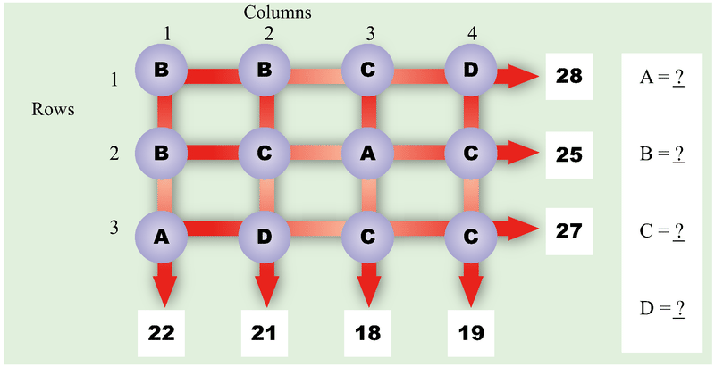

1.  $A = 9, \ B = 6, \ C = 7, \ D = 3$
2.  $A = 8, \ B = 7, \ C = 5, \ D = 9$
3.  $A = 6, \ B = 5, \ C = 8, \ D = 7$
4.  $A = 7, \ B = 8, \ C = 9, \ D = 5$

</article>

### 8.5 Hanging Scales

<article>

**Hanging Scales – Write Equations and Solve for Unknowns**

**Teacher Notes**

Each problem shows three scales, their contents, and their weights. Students use the data provided in the display as clues to determine the weight of each block. All of the scales contain more than one type of block, so weights of blocks cannot be found directly. In all cases, one of the scales has a double set of two blocks. Students figure out the value of a single set of these two blocks. A second scale contains a single set of the same two blocks and one other block. Students must replace the set of blocks with their value in order to find the weight of the other block on the second scale. Once the value of one block is determined, urge students to record its value on all blocks of that type on all scales. This will enable students to figure out the weights of the remaining blocks. Encourage students to check solutions by replacing each block with its weight and comparing the total weight with the scale indicator.

**Solutions:**

$$
1. \quad A: x + z + x + z = 20; \ B: x + y + z = 15; \ C: x + y + y = 14\!\\
{\;} \ \quad x = 4, \ y = 5, \ z = 6\!\\
2. \quad D: x + y + z = 19; \ E: y + z + y + z = 24; \ F: x + x + z = 24\!\\
{\;} \ \quad x= 7, \ y = 2, \ z = 10\!\\
3. \quad G: x + y + z = 20; \ H: x + y + x + y = 26; \ I: z + z + y = 22\!\\
{\;} \ \quad x= 5, \ y = 8, \ z = 7\!\\
4. \quad J: x + y + z = 22; \ K: x + x + y = 25; \ L: x + z + x+ z= 26\!\\
{\;} \ \quad x= 8, \  y = 9, \ z = 5\!\\
5. \quad M: y + x + y + x = 32; \ N: z + z + x = 28; \ P: x+ y+ z = 25\!\\
{\;} \ \quad x= 10, \ y = 6, \ z = 9\!\\
6. \quad Q: x + y + z = 28; \ R: y + z + y+ z= 34; \ S: x + x+ y= 32\!\\
{\;} \ \quad x= 11, \ y = 10, \ z = 7
$$

**Hanging Scales – Write Equations and Solve for Unknowns**

\begin{align*}
& \mathbf{Describe:} && \text{There are three scales with blocks.}\\
&&& \text{A: Two} \ x \ \text{and two} \ y \ \text{blocks. They weigh 26 pounds.}\\
&&& \text{B: One} \ x, \ \text{one} \ y, \ \text{and one} \ z \ \text{block. They weigh 22 pounds.}\\
&&& \text{C: One} \ x \ \text{and two} \ z \ \text{blocks. They weigh 24 pounds.}\\
& \mathbf{My \ Job:} && \text{Use the scales as clues. Figure out the weights of the blocks.}\\
& \mathbf{Plan:} && \text{Write equations, one for each scale.}\\
&&& A: x + y + x + y = 26; \ B: x + y + z = 22; \ C:x + z + z = 24\\
&&& \text{Solve the equations.}\\
& \mathbf{Solve:} && A: x + y + x + y = 26. \ \text{There are two of each block, so} \ x + y = 13\\
&&& \text{B}: (x + y) + z = 22. \ \text{Replace} \ (x + y) \ \text{with} \ 13.\\
&&& \quad \quad 13 + z = 22, \ \text{and}\\
&&& \quad \quad z = 22 - 13, \ \text{or} \ 9 \ \text{pounds.}\\
&&& C: x + z + z = 24. \ \text{Replace each} \ z \ \text{with} \ 9.\\
&&& \quad \quad x + 18 = 24, \ \text{and}\\
&&& \quad \quad x = 24 - 18, \text{or} \ 6 \ \text{pounds}\\
&&& A: x + y = 13. \ \text{Replace} \ x \ \text{with} \ 6. \ \text{Then}\ 6 + y = 13.\\
&&& \quad \quad y = 13 - 6, \ \text{or} \ 7 \ \text{pounds.}\\
& \mathbf{Check:} && \text{Replace each block with its weight. Check that the total equal the number of}\\
&&& \text{pounds shown on the scales.} \\
&&& A: 6 + 7 + 6 + 7 = 26; \ B: 6 + 7 + 9 = 23; \ C: 6 + 9+ 9 = 24.
\end{align*}
$$

Write equations. Figure out the weights of the blocks.

1.  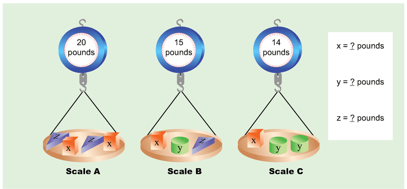
    
    \[Figure 2\]
    
2.  
    
    \[Figure 3\]
    
3.  
    
    \[Figure 4\]
    
4.  
    
    \[Figure 5\]
    
5.  
    
    \[Figure 6\]
    
6.  
    
    \[Figure 7\]
    

**_Extra for Experts:_** **Hanging Scales – Write Equations and Solve for Unknowns**

Write equations. Figure out the weights of the blocks.

1.  
    
    \[Figure 8\]
    
2.  
    
    \[Figure 9\]
    
3.  
    
    \[Figure 10\]
    
4.  
    
    \[Figure 11\]
    
5.  
    
    \[Figure 12\]
    
6.  
    
    \[Figure 13\]
    

**Solutions:**

$$
1. \quad A: x + x + y + y = 36; \ B: x + y + z = 27; \ C: x + z + z = 30\!\\
{\;} \ \quad x= 12, \ y = 6, \ z = 9\!\\
2. \quad D: x + y + z = 24; \ E: z+ z + y + y= 32; \ F: x + x + y = 25\!\\
{\;} \ \quad x= 8, \ y = 9, \ z = 7\!\\
3. \quad G: x + y + y= 29; \ H: x + y + z = 26; \ I: x+ x+ z + z = 32\!\\
{\;} \ \quad x= 9, \ y = 10, \ z = 7\!\\
4. \quad A: x + z + z = 27; \ B: x + y + x + y = 36; \ C: x + y + z = 26\!\\
{\;} \ \quad x= 11, \ y = 7, \ z = 8\!\\
5. \quad D: y + z + y + z = 28; \ E: x + y + z = 26; \ F: x + x + y = 32\!\\
{\;} \ \quad x= 12, \ y = 8, \ z = 6\!\\
6. \quad G: x + y + z = 28; \ H: y + y + z = 25; \ I: x + x + z + z = 42\!\\
{\;} \ \quad x= 10, \ y = 7, \ z = 11
$$

</article>

### 8.6 Equal Costs

<article>

**Equal Costs – Write and Solve Equations for Equal Cost Problems**

**Teacher Notes**

In Equal Costs, students are given information about the purchases of two people who spend the same amount of money for groups of items. In each group some items are the same. Students write an expression for the purchases for each person, and set the expressions equal to one another to represent the equal costs. Students then solve the equation for the value of the unknown. This is the first problem set in which students encounter equations with unknowns and constants on both sides of the equal sign. They add or subtract equal amounts from each side of the equation to figure out the value of the unknown.

**Solutions:**

1.  $2b = b + 4; 2b - b = b + 4 - b; b = 4$; one sandwich costs $4.
2.  $4c + 2 = 3c + 5; 4c + 2 - 3c = 3c + 5 - 3c; c + 2 = 5; c + 2 - 2 = 5 - 2; c = 3;$ one small soda costs $3.
3.  $6d = 4d + 3; 6d - 4d = 4d + 3 - 4d; 2d = 3; d = 1.5$; one muffin costs $1.50.
4.  $5f + 5 = 3f + 29; 5f + 5 - 3f = 3f + 29 - 3f; 2f + 5 = 29; 2f + 5 - 5 = 29 - 5; 2f = 24; f = 12;$ one CD costs $12.
5.  $4g + 2 = 2g + 4 + 3 + 5; 4g + 2 = 2g + 12; 4g + 2 - 2g = 2g + 12 - 2g; 2g + 2 = 12; 2g + 2 - 2 = 12 - 2; 2g = 10; g = 5;$ one movie ticket costs $5.
6.  $10j = 5j + 10; 10j - 5j = 5j + 10 - 5j; 5j = 10; j = 2$; one pound of apples costs $2.

**Equal Costs – Write and Solve Equations for Equal Cost Problems**

Carla bought 3 notebooks and a $2 pen.

Dan bought 2 notebooks and an $8 stapler.

All notebooks cost the same.

They spent the same amount of money.

Use $a$ to stand for the cost of one notebook.

Write an equation to represent the costs of the two people.

Solve for the value of $a$.

Show your work.

What is the cost of one notebook?

$$
\begin{align*}
& \mathbf{Describe:} && \text{Carla:} \ 3 \ \text{notebooks and a} \ \$2 \ \text{pen}\\
&&& \text{Dan:} \ 2 \ \text{notebooks and an} \ \$8 \ \text{stapler}\\
&&& 3 \ \text{notebooks and} \ \$2 \ \text{costs the same as} \ 2 \ \text{notebooks and} \ \$8\\
\\
& \mathbf{My \ job:} && \text{Figure out the cost of one notebook.}\\
\\
& \mathbf{Plan:} && \text{Use} \ a \ \text{to stand for the cost of one notebook.}\\
&&& \text{Write an expression showing the money spent by each person.}\\
&&& \text{Since they spent the same amount of money, the two expressions are equal.}\\
&&& \text{Write the equation.}\\
&&& \text{Solve for} \ a.\\
\\
& \mathbf{Solve:} && \text{Carla's cost:} \ 3a+2\\
&&& \text{Dan's cost:} \ 2a+8.\\
&&& \text{The costs are the same so} \ 3a+2=2a+8. \ \text{Solve the equation.}\\
&&& \qquad \qquad \qquad \qquad \qquad \qquad \qquad \qquad 3a+2=2a+8\\
&&& \text{Subtract} \ 2a \ \text{from each side.} \qquad \qquad 3a+2-2a=2a+8-2a\\
&&& \qquad \qquad \qquad \qquad \qquad \qquad \qquad \qquad \ a+2=8\\
&&& \text{Subtract} \ 2 \ \text{from each side.} \qquad \qquad \ \ a+2-2=8-2\\
&&& \qquad \qquad \qquad \qquad \qquad \qquad \qquad \qquad \ a=6\\
&&& \text{One notebook is} \ \$6.\\
\\
& \mathbf{Check:} && \text{Carla:} \ 3 \ \text{notebooks and} \ \$2 \ \text{pen is} \ 3 \times \$6+\$2, \ \text{or} \ \$20.\\
&&& \text{Dan:} \ 2 \ \text{notebooks and} \ \$8 \ \text{stapler is} \ 2 \times \$6+\$8, \ \text{or} \ \$20.\\
&&& \$20 = \$20
\end{align*}
$$

1. Al bought 2 sandwiches.

Bob bought one sandwich and a $4 large soda.

All sandwiches cost the same.

They spent the same amount of money.

Use $b$ to stand for the cost of one sandwich.

Write an equation to represent the costs of the two people.

Solve for the value of $b$.

Show your work.

What is the cost of one sandwich?

2. Camilla bought 4 small sodas and a $2 cookie.

Darla bought 3 small sodas and a $5 dessert.

All small sodas cost the same.

They spent the same amount of money.

Use $c$ to stand for the cost of one small soda.

Write an equation to represent the costs of the two people.

Solve for the value of $c$.

Show your work.

What is the cost of one small soda?

3. Erin bought 6 muffins

Fred bought 4 muffins and a $3 drink.

All muffins cost the same.

They spent the same amount of money.

Use $d$ to stand for the cost of one muffin.

Write an equation to represent the costs of the two people.

Solve for the value of $d$.

Show your work.

What is the cost of one muffin?

4. Gary bought 5 CDs and a $5 CD case.

Helen bought 3 CDs and a set of $29 earphones.

All CDs cost the same.

They spent the same amount of money.

Use $f$ to stand for the cost of one CD.

Write an equation to represent the costs of the two people.

Solve for the value of $f$.

Show your work.

What is the cost of one CD?

5. Ina bought 4 movie tickets and a $2 soda.

Jen bought 2 movie tickets, a $4 bag of popcorn, a $3 drinks, and a $5 bag of candy. All movie tickets cost the same.

They spent the same amount of money.

Use $g$ to stand for the cost of one movie ticket.

Write an equation to represent the costs of the two people.

Solve for the value of $g$.

Show your work.

What is the cost of one movie ticket?

6. Ken bought 10 pounds of apples.

Larry bought 5 pounds of apples and a $10 jar of honey.

Each pound of apples cost the same.

They spent the same amount of money.

Use $j$ to stand for the cost of one pound of apples.

Write an equation to represent the costs of the two people.

Solve for the value of $j$.

Show your work.

What is the cost of one pound of apples?

**_Extra for Experts_****: Equal Costs – Write and Solve Equations for Equal Cost Problems**

1. Hal bought 2 bagels and a large hot chocolate for $2.50.

Jon bought 4 bagels and a $1.00 cream cheese.

All bagels cost the same.

They spent the same amount of money.

Use $a$ to stand for the cost of one bagel.

Write an equation to represent the costs of the two people.

Solve for the value of $a$.

Show your work.

What is the cost of one bagel?

2. Kaelyn bought 5 pads of paper and a $1.50 box of binder clips.

Lexa bought 2 pads of paper and a $6.00 box of pens.

All pads of paper cost the same.

They spent the same amount of money.

Use $b$ to stand for the cost of one pad of paper.

Write an equation to represent the costs of the two people.

Solve for the value of $b$.

Show your work.

What is the cost of one pad of paper?

3. Mary bought 4 decks of cards and a $2.00 crossword puzzle book.

Nina bought 2 decks of cards and 2 boxes of dominos for $3.50 each.

All card decks cost the same.

They spent the same amount of money.

Use $c$ to stand for the cost of one deck of cards.

Write an equation to represent the costs of the two people.

Solve for the value of $c$.

Show your work.

What is the cost of one deck of cards?

**Solutions:**

1.  $2a + 2.50 = 4a + 1.00; 2a + 2.50 - 2a = 4a + 1.00 - 2a; 2.50 = 2a + 1.00; 2.50 - 1.00 = 2a + 1.00 - 1.00; 1.50 = 2a; 0.75 = a;$ one bagel costs $0.75.
2.  $$
    5b + 1.50 = 2b + 6.00; 5b + 1.50 - 2b = 2b + 6.00 - 2b; 3b + 1.50 = 6.00;
    3b + 1.50 - 1.50 = 6.00 - 1.50; 3b = 4.50; b = 1.50;
    $$
    
     one pad of paper costs $1.50.
3.  $$
    4c + 2.00 = 2c + 2 \times 3.50; 4c + 2.00 = 2c + 7.00; 4c + 2.00 - 2c = 2c + 7.00 - 2c;
    2c + 2.00 = 7.00; 2c + 2.00 - 2.00 = 7.00 - 2.00; 2c = 5.00; c = 2.50;
    $$
    
     one deck of cards costs $2.50.

</article>

### 8.7 Rectangle Facts

<article>

**Rectangle Facts – Apply Measurement Formulas**

**Teacher Notes**

Each problem shows a rectangle separated into four smaller rectangles. The areas for three of the four rectangles are given. Students use the data provided and the formula for the area of a rectangle to figure out the dimensions of each of the three rectangles. Once they have found the dimensions of the three rectangles, they can figure out the dimensions of the fourth rectangle and determine its area.

**Solutions:**

1.  20 square inches
2.  32 square inches
3.  32 square inches
4.  6 square inches
5.  56 square inches
6.  8 square inches

**Rectangle Facts – Apply Measurement Formulas**

Rectangle $ABCD$ is divided into 4 smaller rectangles.

\begin{align*}
& \mathbf{Describe:} && \text{The large rectangle contains} \ 4 \ \text{smaller rectangles. The areas of three of the}\\
&&& \text{rectangles are given.} \ A \ \text{is a square. All dimensions are whole numbers.}\\
\\
& \mathbf{My \ Job:} && \text{Use the given areas. Figure out the area of Rectangle} \ C.\\
\\
& \mathbf{Plan:} && \text{Find common factors of the areas.} \ A \ \text{is a square, so the dimensions can be easily}\\
&&& \text{determined. Figure out the dimensions of Rectangles} \ B \ \text{and} \ D. \ \text{This will give the}\\
&&& \text{dimensions for Rectangle} \ C. \ \text{Use the area formula to figure out the area of}\\
&&& \text{Rectangle} \ C.\\
\\
& \mathbf{Solve:} && A \ \text{is a square, so the dimensions are} \ 4 \ \text{in. by} \ 4 \ \text{in. That means that one of the}\\
&&& \text{dimensions of Rectangle} \ B \ \text{is} \ 4 \ \text{inches. The area is} \ 24 \ \text{square inches, so the other}\\
&&& \text{dimension must be} \ 24 \div 4, \ \text{or} \ 6 \ \text{inches. Likewise, one of the dimensions of}\\
&&& \text{Rectangle} \ D \ \text{is} \ 4, \ \text{so the other is} \ 20 \div 4, \ \text{or} \ 5 \ \text{inches. The dimensions of Rectangle}\\
&&& C \ \text{are} \ 6 \ \text{inches from the shared side with Rectangle} \ B \ \text{and} \ 5 \ \text{inches form the}\\
&&& \text{shared side with Rectangle} \ D. \ \text{The area of} \ C \ \text{is} \ 6 \times 5, \ \text{or} \ 30 \ \text{square inches.}\\
\\
& \mathbf{Check:} && A: 4 \ \text{by} \ 4 \ \text{inches with an area of} \ 16 \ \text{sq in.}\\
&&& B: 4 \ \text{by} \ 6 \ \text{inches with an area of} \ 24 \ \text{sq in.}\\
&&& C: 5 \ \text{by} \ 5 \ \text{inches with an area of} \ 30 \ \text{sq in.}\\
&&& D: 4 \ \text{by} \ 5 \ \text{inches with an area of} \ 20 \ \text{sq in.}
\end{align*}
$$

1. Rectangle $EFGH$ is separated into 4 smaller rectangles.

1. Rectangle $ABCD$ is separated into 4 smaller rectangles.

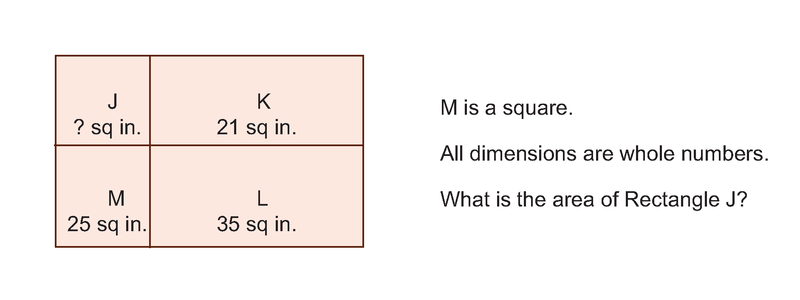

1.  21 square inches
2.  24 square inches
3.  15 square inches
4.  80 square inches
5.  48 square inches
6.  108 square inches

</article>

### 8.8 Two-Step Patterns

<article>

**Two Step Patterns – Identify Patterns and Write Function Rules**

**Teacher Notes**

Two Step Patterns require students to analyze the first 3 or 4 figures of a pattern, identify relationships between the pattern number and the number of items needed to draw the figure, describe the $10^{\text{th}}$ figure, and write the rule (in symbols) that relates the pattern number and the number of items. All rules require two steps: multiplication and either addition or subtraction. Encourage students to make a table to organize their data. The table will help them to observe the relationship and write the rule.

**Solutions:**

$$
1. \ \quad \text{Figure} \ 10 \ \text{has} \ 32 \ \text{tiles}; \ y = 3n + 2\!\\
{\;} \ \ \quad \text{Figure} \ 1 \ \text{has} \ 1 \ \text{row of} \ 3 \ \text{plus} \ 2; \ \text{Figure} \ 2 \ \text{has} \ 2 \ \text{rows of} \ 3 \ \text{plus} \ 2; \ \text{Figure} \ 3 \ \text{has} \ 3 \ \text{rows of} \ 3 \ \text{plus}\!\\
{\;} \ \ \quad 2; \ \text{Figure} \ 4 \ \text{has} \ 4 \ \text{rows of} \ 3 \ \text{plus} \ 2; \ \text{Figure} \ 10 \ \text{will have} \ 10 \ \text{rows of} \ 3 \ \text{plus} \ 2, \ \text{or} \ 32 \ \text{tiles.}\!\\
{\;} \ \ \quad \text{Figure} \ n \ \text{will have} \ n \ \text{rows of} \ 3 \ \text{plus} \ 2, \ \text{or} \ 3n + 2 \ \text{tiles.}\!\\
\\
2. \ \quad \text{Figure} \ 10 \ \text{has} \ 31 \ \text{tiles}; \ y = 3n + 1\!\\
{\;} \ \ \quad \text{Figure} \ 1 \ \text{has} \ 1 \ \text{row of} \ 3 \ \text{plus} \ 1; \ \text{Figure} \ 2 \ \text{has} \ 2 \ \text{rows of} \ 3 \ \text{plus} \ 1; \ \text{Figure} \ 3 \ \text{has} \ 3 \ \text{rows of} \ 3 \ \text{plus}\!\\
{\;} \ \  \quad 1; \ \text{Figure} \ 4 \ \text{has} \ 4 \ \text{rows of} \ 3 \ \text{plus} \ 1; \ \text{Figure} \ 10 \ \text{will have} \ 10 \ \text{rows of} \ 3 \ \text{plus} \ 1, \ \text{or} \ 31 \ \text{tiles.}\!\\
{\;} \ \ \quad \text{Figure} \ n \ \text{will have} \ n \ \text{rows of} \ 3 \ \text{plus} \  1, \ \text{or} \ 3n + 1 \ \text{tiles.}\!\\
\\
3. \ \quad \text{Figure} \ 10 \ \text{has} \ 43 \ \text{tiles}; \ y = 4n + 3\!\\
{\;} \ \ \quad \text{Figure} \ 1 \ \text{has} \ 1 \ \text{row of} \ 4 \ \text{plus} \ 3; \ \text{Figure} \ 2 \ \text{has} \ 2 \ \text{rows of} \ 4 \ \text{plus} \ 3; \ \text{Figure} \ 3 \ \text{has} \ 3 \ \text{rows of} \ 4 \ \text{plus}\!\\
{\;} \ \ \quad 3; \ \text{Figure} \ 4 \ \text{has} \ 4 \ \text{rows of} \ 4 \ \text{plus} \ 3; \ \text{Figure} \ 10 \ \text{will have} \ 10 \ \text{rows of} \ 4 \ \text{plus} \ 3, \ \text{or} \ 43 \ \text{tiles. Figure}\!\\
{\;} \ \ \quad n \ \text{will have} \ n \ \text{rows of} \ 4 \ \text{plus} \ 3, \ \text{or} \ 4n + 3\ \text{tiles.}
$$

**Two Step Patterns – Identify Patterns and Write Function Rule**

\begin{align*}
& \mathbf{Describe:} && \text{Each figure is made of square tiles.}\\
&&& \text{Figure} \ 1 \ \text{has} \ 3 \ \text{tiles.}\\
&&& \text{Figure} \ 2 \ \text{has} \ 5 \ \text{tiles.}\\
&&& \text{Figure} \ 3 \ \text{has} \ 7 \ \text{tiles.}\\
&&& \text{Figure} \ 4 \ \text{has} \ 9 \ \text{tiles.}\\
\\
& \mathbf{My \ job:} && \text{Determine the number of tiles in Figure} \ 10.\\
&&& \text{Write the rule relating the Number of Tiles to the Figure Number.}\\
\\
& \mathbf{Plan:} && \text{Use the diagrams to figure out the relationship between the Figure Number and}\\
&&& \text{the Number of Tiles.}\\
\\
& \mathbf{Solve:} && \text{Figure} \ 1 \ \text{has} \ 1 \ \text{row of} \ 2 \ \text{tiles with one tile on top. That is} \ 2 \times 1+1, \ \text{or} \ 3 \ \text{tiles.}\\
&&& \text{Figure} \ 2 \ \text{has} \ 2 \ \text{rows of} \ 2 \ \text{tiles with one tile on top. That is} \ 2 \times 2+1, \ \text{or} \ 5 \ \text{tiles.}\\
&&& \text{Figure} \ 3 \ \text{has} \ 3 \ \text{rows of} \ 2 \ \text{tiles with one tile on top. That is} \ 2 \times 3+1, \ \text{or} \ 7 \ \text{tiles.}\\
&&& \text{Figure} \ 4 \ \text{has} \ 4 \ \text{rows of} \ 2 \ \text{tiles with one tile on top. That is} \ 2 \times 4+1, \ \text{or} \ 9 \ \text{tiles.}\\
&&& \text{Figure} \ 10 \ \text{will have} \ 10 \ \text{rows of} \ 2 \ \text{tiles with one on top. That is} \ 2 \times 10+1, \ \text{or} \ 21 \ \text{tiles.}\\
&&& \text{Figure} \ n \ \text{will have} \ n \ \text{rows of} \ 2 \ \text{tiles with one on top. That is} \ 2 \times n+1, \ \text{or} \ 2n+1 \ \text{tiles.}\\
&&& \text{The rule is} \ y=2n+1\\
\\
& \mathbf{Check:} && \text{Figure} \ 1: 2 \times 1+1=3\\
&&& \text{Figure} \ 2: 2 \times 2+1=5\\
&&& \text{Figure} \ 3: 2 \times 3+1=7\\
&&& \text{Figure} \ 4: 2 \times 4+1=9
\end{align*}
$$

")

\[Figure 3\]

")

\[Figure 6\]

$$
1. \ \quad  \text{Figure} \ 10 \ \text{has} \ 23 \ \text{tiles}; \ y = 2n + 3\!\\
{\;} \ \ \quad \text{Figure} \ 1 \ \text{has} \ 1 \ \text{column of} \ 2 \ \text{plus} \ 3; \ \text{Figure} \ 2 \ \text{has} \ 2 \ \text{columns of} \ 2 \ \text{plus} \ 3; \ \text{Figure} \ 3 \ \text{has} \ 3\!\\
{\;} \ \ \quad \text{columns of} \ 2 \ \text{plus} \ 3; \ \text{Figure} \ 4 \ \text{has} \ 4 \ \text{columns of} \ 2 \ \text{plus} \ 3; \ \text{Figure} \ 10 \ \text{will have} \ 10 \ \text{columns of} \ 2\!\\
{\;} \ \ \quad \text{plus} \ 3, \ \text{or} \ 23 \ \text{tiles.}\!\\
{\;} \ \ \quad \text{Figure} \ n \ \text{will have} \ n \ \text{columns of} \ 2 \ \text{plus} \ 3, \ \text{or} \ 2n + 3 \ \ \text{tiles.}\!\\
\\
2. \ \quad \text{Figure} \ 10 \ \text{has} \ 24 \ \text{tiles}; \ y = 2n + 4\!\\
{\;} \ \ \quad \text{Figure} \ 1 \ \text{has} \ 1 \ \text{row of} \ 2 \ \text{plus} \ 4; \ \text{Figure} \ 2 \ \text{has} \ 2 \ \text{rows of} \ 2 \ \text{plus} \ 4; \ \text{Figure} \ 3 \ \text{has} \ 3 \ \text{rows of} \ 2 \ \text{plus}\!\\
{\;} \ \  \quad 4; \ \text{Figure} \ 4 \ \text{has} \ 4 \ \text{rows of} \ 2 \ \text{plus} \ 4; \ \text{Figure} \ 10 \ \text{will have} \ 10 \ \text{rows of} \ 2 \ \text{plus} \ 4, \ \text{or} \ 24 \ \text{tiles.}\!\\
{\;} \ \ \quad \text{Figure} \ n \ \text{will have} \ n \ \text{rows of} \ 2 \ \text{plus} \ 4, \ \text{or} \ 2n + 4 \ \text{tiles.}\!\\
\\
3. \ \quad \text{Figure} \ 10 \ \text{has} \ 59 \ \text{tiles}; \ y = 5n + n - 1, \ \text{or} \ 6n - 1\!\\
{\;} \ \ \quad \text{Figure} \ 1 \ \text{has} \ 1 \ \text{house of} \ 5 \ \text{tiles; Figure} \ 2 \ \text{has} \ 2 \ \text{houses of} \ 5 \ \text{tiles plus} \ 1 \ \text{more tile; Figure} \ 3 \ \text{has}\!\\
{\;} \ \ \quad 3 \ \text{houses of} \ 5 \ \text{tiles plus} \ 2 \ \text{more tiles; Figure} \ 4 \ \text{has} \ 4 \ \text{houses of} \ 5 \ \text{tiles plus} \ 3 \ \text{more tiles; Figure}\!\\
{\;} \ \ \quad 10 \ \text{will have} \ 10 \ \text{houses of} \ 5 \ \text{tiles plus} \ 9 \ \text{more tiles, or} \ 59 \ \text{tiles.}\!\\
{\;} \ \ \quad \text{Figure} \ n \ \text{will have} \ n \ \text{houses of} \ 5 \ \text{tiles plus} \ n - 1 \ \text{more tiles, or} \ 5n + n - 1 \ \text{tiles.}
$$

</article>

### 8.9 Coin Stumpers

<article>

**Coin Stumpers – Reason Proportionally with Metric Measurements**

**Teacher Notes**

Students reason proportionally about weights of coins in grams. They use those weights to solve multi-step problems. All weights are given to the nearest tenth of a gram.

The _Extra for Experts_ include the values of the coins as an additional factor to consider in the problem solutions.

**Solutions:**

**Coin Stumpers 1**

2.3 grams

50 nickels are $50 \times 5$ grams, or 250 grams; $273 - 250 = 23$ grams for 10 dimes. One dime is $\frac{23}{10}$, or 2.3 grams.

**Coin Stumpers 2**

80 pennies

20 nickels are $20 \times 5$ grams or 100 grams. $300 - 100 = 200$ grams.

$\frac{200}{2.5} = 80$ pennies.

**Coin Stumpers 3**

20 pennies and 40 dimes

50 grams is $\frac{50}{2.5}$, or 20 pennies. $142 - 50 = 92$ grams.

$\frac{92}{2.3} = 40$ dimes

**Coin Stumpers 4**

20 nickels

20 pennies are $20 \times 2.5$ grams $= 50$ grams; 18 dimes are $18 \times 2.3$ grams $= 41.4$ grams. $191.4 - 91.4 = 100$ grams.

$\frac{100}{5} = 20$ nickels.

**Coin Stumpers – Reason Proportionally with Metric Measurements**

**A pile of 100 pennies weighs 250 grams.**

**A nickel weighs twice as much as a penny.**

**What is the weight of a pile of 300 coins, half pennies and half nickels?**

$$
\begin{align*}
& \mathbf{Describe:} && 100 \ \text{pennies weigh} \ 250 \ \text{grams.}\\
&&& \text{A nickel weighs twice as much as a penny.}\\
&&& \text{A new pile has} \ 300 \ \text{coins. Half of the} \ 300 \ \text{are pennies and half are nickels.}\\
\\
& \mathbf{My \ job:} && \text{Figure out the weight of the pile of} \ 300 \ \text{coins, half pennies and half nickels.}\\
\\
& \mathbf{Plan:} && \text{Compute the weight of a penny and a nickel. Then, use those weights to figure out}\\ &&& \text{the weight of the pile of} \ 300 \ \text{coins, half pennies and half nickels.}\\
\\
& \mathbf{Solve:} && 100 \ \text{pennies are} \ 250 \ \text{grams.}\\
&&& \text{So, one penny is} \ \frac{250}{100}, \ \text{or} \ 2.5 \ \text{grams.}\\
&&& \text{One nickel is} \ 2 \times 2.5, \ \text{or} \ 5 \ \text{grams.}\\
&&& 150 \times 2.5 = 375 \ \text{grams}\\
&&& 150 \times 5.0 = 750 \ \text{grams}\\
&&& \text{The pile of} \ 300 \ \text{coins is} \ 1125 \ \text{grams.}\\
\\
& \mathbf{Check:} && 100 \ \text{pennies are} \ 250 \ \text{grams. Using a proportion, the weight of} \ 150 \ \text{pennies is} \ 1.5\\
&&& \text{times} \ 250, \ \text{or} \ 375 \ \text{grams.}\\
&&& \text{Since} \ 100 \ \text{pennies are} \ 250 \ \text{grams}, \ 100 \ \text{nickels are} \ 2 \times 250 \ \text{or} \ 500 \ \text{grams. So}, \ 150\\
&&& \text{nickels are} \ 1.5 \times 500, \ \text{or} \ 750 \ \text{grams.}\\
&&& 375 + 750 = 1125 \ \text{grams}
\end{align*}
$$

You have already figured out the numbers of grams for a penny and a nickel. Record the number of grams for a dime once you solve problem 1. Then use those weights to solve the other problems on this page and on the page of Extra for Experts.

Show the steps of your solution to each problem.

1. \ \quad \text{The weight of a pile of nickels and dimes is} \ 273 \ \text{grams. There are} \ 60 \ \text{coins in the pile. Fifty}\!\\
{\;} \ \ \quad \text{of the coins are nickels. What is the weight of a dime? Record that number in the list above.}\!\\
\\
\\
\\
2. \ \quad \text{The weight of a pile of pennies and nickels is} \ 300 \ \text{grams. There are} \ 20 \ \text{nickels. How many}\!\\
{\;} \ \ \quad \text{pennies are there?}\!\\
\\
\\
\\
3. \ \quad \text{The weight of a pile of pennies and dimes is} \ 142 \ \text{grams. The total weight of the pennies is} \ 50 \ \text{grams.}\!\\
{\;} \ \ \quad \text{How many pennies and dimes are in the pile?}\!\\
\\
\\
\\
4. \ \quad \text{The total weight of a pile of pennies, nickels and dimes is} \ 191.4 \ \text{grams. There are} \ 20 \ \text{pennies}\!\\
{\;} \ \ \quad \text{in the pile. There are} \ 2 \ \text{fewer dimes than pennies. How many coins are nickels?}\!\\
\\
\\
\\
$$

**_Extra for Experts_****: Coin Stumpers – Reason Proportionally with Metric Measurements**

Use the coin weights to solve these problems.

Show the steps of your solution to each problem.

$$
1. \ \quad \text{The total weight of a pile of pennies and dimes is} \ 96 \ \text{grams. There are} \ 20 \ \text{dimes in the pile.}\!\\
{\;} \ \ \quad \text{What is the total value of the coins?}\!\\
\\
\\
\\
2. \ \quad \text{The total weight of a pile of nickels and pennies is} \ 3000 \ \text{grams. The total value of the nickels}\!\\
{\;} \ \ \quad \text{is} \ \$25. \ \text{How many pennies are in the pile?}\!\\
\\
\\
\\
3. \ \quad \text{A pile of pennies, nickels and dimes weighs} \ 146 \ \text{grams. There are} \ 30 \ \text{pennies in the pile.}\!\\
{\;} \ \  \quad \text{There are} \ 10 \ \text{less dimes than pennies. What is the total value of the nickels in the pile?}\!\\
\\
\\
\\
4. \ \quad \text{A pile of pennies, nickels and dimes weighs} \ 195.5 \ \text{grams. There are} \ 15 \ \text{pennies in the pile.}\!\\
{\;} \ \ \quad \text{There are} \ 12 \ \text{more nickels than pennies. What is the total value of the coins in the pile?}\!\\
\\
\\
\\
$$

**Solutions:**

**Coin Stumpers Extra 1**

$2.20

20 dimes is $20 \times 2.3$ grams, or 46 grams

$96 - 46 = 50$ grams

$\frac{50}{2.5} = 20$ pennies

20 dimes is $2.00

20 pennies is $0.20

$\$2 + \$0.20 = \$2.20$

**Coin Stumpers Extra 2**

200 pennies

$\$25 \times 20$ nickels/dollar $= 500$ nickels

$500 \times 5$ grams $= 2500$ grams of nickels

$3000 - 2500 = 500$ grams of pennies

$\frac{500}{2.5} = 200$ pennies

**Coin Stumpers Extra 3**

$.25

30 pennies is $30 \times 2.5$, or 75 grams.

20 dimes is $20 \times 2.3$, or 46 grams.

$146 - 75 - 46 = 25$ grams of nickels

$\frac{25}{5} = 5$ nickels

5 nickels are $.25

**Coin Stumpers Extra 4**

$2.50

15 pennies is $15 \times 2.5$, or 37.5 grams.

27 nickels is $27 \times 5$, or 135 grams.

$195 - 27.5 - 135 = 23$ grams for dimes.

$\frac{23}{2.3} = 10$ dimes.

15 pennies are $.15, 27 nickels are $1.35, and 10 dimes are $1.00.

$\$.15 + \$1.35 + \$1.00 = \$2.50$

</article>

### 8.10 Trip Functions

<article>

**Trip Functions – Complete Tables and Write Function Rules**

**Teacher Notes**

Students use facts to complete rate tables and write rules in words to describe the relationship between the input and the output. All functions are of the form of $y = a \cdot x + b$, that is, the sum of an initial value (number of miles showing on odometers/pedometers before the start of a trip) and the product of number of hours traveled and average speed in miles per hour.

**Solutions:**

**Trip Functions 1**

**Trip Functions 2**

**Trip Functions – Complete Tables and Write Function Rules**

**Read the facts. Follow the steps.**

**Facts:** Before the start of the cross-country trip, the odometer in Mrs. Wilson’s car showed 4,100 miles. On the trip, she averaged 50 miles per hour.

**First:** Complete the table to show changes in Ms. Wilson’s odometer for the first 6 hours.

**Second:** Write a rule that describes how the number of hours traveled is related to what the car odometer shows.

$$
\begin{align*}
& \mathbf{Describe:} && \text{Before the start of the trip, Ms. Wilson's car odameter showed} \ 4,100\\
&&& \text{miles. On the trip, she drove an average of} \ 50 \ \text{miles each hour. The table}\\
&&& \text{shows} \ 4,100 \ \text{miles at} \ 0 \ \text{hours.}\\
\\
& \mathbf{My \ Job:} && \text{Use the facts to complete the table. Write a rule that shows how the}\\
&&& \text{number of miles on the odometer is related to the number of hours of}\\
&&& \text{travel on the trip.}\\
\\
& \mathbf{Plan:} && \text{Start with the table. Add} \ 50 \ \text{to} \ 4,100 \ \text{for each new hour. Then write the}\\
&&& \text{rule.}
\end{align*}
$$

\begin{align*}
& \mathbf{Solve:} && \text{Rule: Number of miles is the sum of} \ 4,100 \ \text{and the product of number of}\\
&&& \text{hours and} \ 50 \ \text{mph.}\\
\\
& \mathbf{Check:} && \text{Use the rule and to verify the facts.}\\
&&& 4,100 + 1 \times 50=4,150\\
&&& 4,100 + 2 \times 50=4,200\\
&&& 4,100 + 3 \times 50=4,250\\
&&& 4,100 + 4 \times 50=4,300\\
&&& 4,100 + 5 \times 50=4,350\\
&&& 4,100 + 6 \times 50=4,400
\end{align*}
$$

**Trip Functions 1**

**Facts:** Before he left on his trip, Mr. Patterson’s truck odometer showed 23,500 miles. He averaged 40 miles per hour on his drive from Sacramento to San Diego.

**First:** Complete the table to show changes in Mr. Patterson’s truck odometer for the first 6 hours.

**Second:** Write a rule that describes how the number of hours traveled is related to what the truck odometer shows.

**Trip Functions 2**

**Facts:** The Karene City School Bus averaged 30 miles per hour on its trip to the state basketball competition. At the start of the trip, the bus’s odometer showed 72,160 miles.

**First:** Complete the table to show changes in the bus’s odometer for the first 6 hours.

**Second:** Write a rule that describes how the number of hours traveled is related to what the bus odometer shows.

**_Extra for Experts:_** **Trip Functions – Complete Tables and Write Function Rules**

**Trip Functions Extra 1**

**Facts:** Charlie’s pedometer is on his belt. It registers the number of miles walked. Before the hike, the pedometer showed 27 miles. Charlie hiked for several days and averaged 3 miles per hour.

**First:** Complete the table to show changes in Charlie’s pedometer for the first 6 hours.

**Second:** Write a rule that describes how the number of hours traveled is related to what the pedometer shows.

**Trip Functions Extra 2**

**Facts:** Before Brent left on his bike hike, his bike’s odometer showed 62 miles. Brent averaged 8 miles per hour.

**First:** Complete the table to show changes in Brent’s bike odometer for the first 6 hours.

**Second:** Write a rule that describes how the number of hours traveled is related to what the bike odometer shows.

**Solutions:**

**Trip Functions Extra 1**

**Trip Functions Extra 2**

</article>

### 8.11 Drive Away

<article>

**Drive Away – Interpret Graphs and Write Functions Rules**

**Teacher Notes**

Each distance-time graph shows two lines representing the speeds of two drivers. Students first interpret the Fact to identify the driver of interest. Next they complete a Time-Distance table of values for the first 6 hours travelled. By inspecting the table of values and identifying relationships between entries in each line of the table, they write a rule that shows how the Distance $(D)$, or number of miles traveled, relates to the amount of time $(t)$, or number of hours of travel.

**Solutions:**

**Drive Away 1**

1.  15 mph
2.  
    
    \[Figure 1\]
    
3.  $D=15 \ t$

**Drive Away 2**

1.  20 mph
2.  
    
    \[Figure 2\]
    
3.  $D=20 \ t$

**Drive Away – Interpret Graphs and Write Functions Rules**

1.  What was Bush’s speed in miles per hour?
2.  Complete the table to show total number of miles traveled by Bush at that speed.
3.  Let $t$ represent number of hours and $D$ represent distance in number of miles. Write a rule to show how the number of miles $(D)$ is related to number of hours $(t)$.

$D =$ \_\_\_\_\_\_\_\_\_\_\_\_\_\_\_\_\_\_\_\_

$$
\begin{align*}
& \mathbf{Describe:} && \text{The graph shows time in number of hours along the horizontal axis.}\\
&&& \text{Distance in number of miles is shown along the vertical axis. The two}\\
&&& \text{lines on the graph represent the speeds of Axel and Bush. The Fact}\\
&&& \text{indicates that Bush is traveling faster than Axel.}\\
\\
& \mathbf{My \ Job:} && \text{Use the Fact to figure out which line represents Bush. Complete the table}\\
&&& \text{for Bush. Write a rule to describe how the number of miles traveled is}\\
&&& \text{related to the number of hours of driving time.}\\
\\
& \mathbf{Plan:} && \text{Compare the lines with the Fact and decide which line represents Bush. }\\
&&& \text{Determine his average speed. Use that data to complete the table.}\\
&&& \text{Generalize from the data in the table. Construct the rule.}\\
\\
& \mathbf{Solve:} && \text{Bush is line S.}\\
&&& 1. \ \text{He was driving at a speed of} \ 30 \ \text{mph.}\\
&&& 2. \ \text{Complete the table using that speed to figure out the distances.}
\end{align*}
$$

\begin{align*}
& 3. \ D=30 \ t\;\;\;\;\;\;\;\;\;\;\;\;\;\;\;\;\;\;\;\;\;\;\;\;\;\;\;\;\;\;\;\;\;\;\;\;\;\;\;\;\;\;\;\;\;\;\;\;\;\;\;\;\;\;\;\;\;\;\;\;\;\;\;\;\;\;\;\;\;\;\;\;
\end{align*}
$$

$$
\begin{align*}
& \mathbf{Check:} && \text{Use the rule to verify the data in the table.} \;\;\;\;\;\;\;\;\;\;\;\;\;\;\;\;\;\;\;\;\;\;\;\;\;\;\;\;\;\;\;\;\;\;\;\;\;\;\;\;\;\;\;\;\;\;\;\;\;\; \\
&&& D=30 \times 1=30\\
&&& D=30 \times 2=60\\
&&& D=30 \times 3=90\\
&&& D=30 \times 4=120\\
&&& D=30 \times 5=150\\
&&& D=30 \times 6=180
\end{align*}
$$

**Drive Away 1**

1.  What was Harold’s speed in miles per hour?
2.  Complete the table to show total number of miles traveled by Harold at that speed.
3.  Let $t$ represent number of hours and $D$ represent distance in number of miles. Write a rule to show how the number of miles $(D)$ is related to number of hours $(t)$.

$D =$ \_\_\_\_\_\_\_\_\_\_\_\_\_\_\_\_\_\_\_\_

**Drive Away 2**

1.  What was Clark’s speed in miles per hour?
2.  Complete the table to show total number of miles traveled by Clark at that speed.
3.  Let $t$ represent number of hours and $D$ represent distance in number of miles. Write a rule to show how the number of miles $(D)$ is related to number of hours $(t)$.

$D =$ \_\_\_\_\_\_\_\_\_\_\_\_\_\_\_\_\_\_\_\_

**_Extra for Experts:_** **Drive Away – Interpret Graphs and Write Functions Rules**

**Drive Away Extra 1**

1.  What was Marx’s speed in miles per hour?
2.  Complete the table to show total number of miles traveled by Marx at that speed.
3.  Let $t$ represent number of hours and $D$ represent distance in number of miles. Write a rule to show how the number of miles $(D)$ is related to number of hours $(t)$.

$D =$ \_\_\_\_\_\_\_\_\_\_\_\_\_\_\_\_\_\_\_\_

**Drive Away Extra 2**

1.  What was Ellsworth’s speed in miles per hour?
2.  Complete the table to show total number of miles traveled by Ellsworth at that speed.
3.  Let $t$ represent number of hours and $D$ represent distance in number of miles. Write a rule to show how the number of miles $(D)$ is related to number of hours $(t)$.

$D =$ \_\_\_\_\_\_\_\_\_\_\_\_\_\_\_\_\_\_\_\_

**Solutions:**

**Drive Away Extra 1**

1.  25 mph
2.  
    
    \[Figure 9\]
    
3.  $D = 25 \ t$

**Drive Away Extra 2**

1.  50 mph
2.  
    
    \[Figure 10\]
    
3.  $D = 50 \ t$

</article>

## 9.0 Algebra Explorations, Grade 7

<article>

</article>

### 9.1 Introduction

<article>

This algebra module has been designed to develop grade 7 students’ understanding of ten key concepts of algebra and to enhance their problem solving skills. Each section begins with a brief description of the problem set and the concepts and skills developed. This is followed by the solutions to problems in the problem set. The first problem in each set is the “teaching problem.” It is completed following the five-step problem solving model and is designed to be used by teachers as the centerpiece of the instructional program. The teaching problem is followed by problems to be completed by the students working on their own.

This module may be used as an algebra unit to complement the existing instructional program. It also may be used to show connections between algebra and the strands of number and measurement, to provide practice of number computational algorithms, and to reinforce problem solving skills.

The _Extra for Experts_ provides additional opportunities for students to apply newly learned concepts and skills to the solution of problems like those developed in this Algebra module.

**The Key Algebraic Concepts**

**Equality/Inequality**: In this module, students gain greater understanding of equality as they learn about and apply the fundamental order of operations, including exponentiations and the distributive property, to determine the values of expressions that name the same number. Understanding and using the distributive property is key to working with polynomials in formal courses in algebra.

**Variables as unknowns**: Variables may be letters, geometric shapes, or objects that stand for a number of things. When used to represent an _unknown_, the variable has only one value. For example, in the equation, $t + 5 = 7$, the variable $t$ is an unknown and it stands for the number 2. When $t$ is replaced with 2 in the equation, the expression to the left of the equal symbol names the same number as the expression to the right of the equal symbol; $2 + 5$ is another name for 7. Students solve for the values of unknowns in a variety of settings that model systems of equations, including letter grids and hanging scales.

**Variables as varying quantities**: In some equations, variables can take on more than one value. For example, in the equation $q = 2 + r$, if the value of $q$ is 5, then the value of $r$ is 3. Or, if the value of $r$ is 9, the value of $q$ is 11. So, in this case $q$ can be any number. However, once a value for $q$ is chosen, then the value for $r$ is fixed. Likewise, once a value for $r$ is chosen, then the value of $q$ is fixed. Variables as varying quantities appear in functions and formulas. In this module, students identify and write rules for two-step (e.g., $y = 2z + 4$) functions in words, and apply the distance-rate-time formula to solve problems.

**Proportional Reasoning**: A major method for solving algebraic problems is by reasoning proportionally. Proportional reasoning is sometimes called “multiplicative reasoning,” because it requires application of multiplication or its inverse, division. In this module, students reason proportionally when they determine weights or costs of different types of fruits, when they apply the $D=rt$ formula, and when they determine the nature of positions of numbers in a repeating pattern.

**Interpret Representations**: Mathematical relationships can be displayed in a variety of ways including with text, tables, graphs, diagrams and symbols. Having students interpret these types of displays and use the data in the displays to solve problems is critical to success with the study of algebra. In this module, students interpret circle and arrow grid diagrams, weight scales, and line graphs and tables of data.

**Write Equations:** Although an equation is a symbolic representation of a mathematical relationship, the writing of an equation is a key algebraic skill and one that requires separate attention and instruction. In this module, students write systems of equations using letters to represent weights of blocks pictured on scales, relationships between pairs of data in tables, and relationships among distance, rate and time.

**The Problem Solving Five-Step Model**

The model that we recommend to help students move through the solution problems has five steps:

**Describe** focuses students’ attention on the information in the problem display. In some cases, the display is a diagram. Other times it is a table, graph, equation, or model, or a combination of any of these. Having students tell what they see will help them interpret the problem and identify key facts needed to proceed with the solution method.

**My Job** helps students focus on the task by having them tell what they have to do, that is, rephrase the problem in their own words.

**Plan** requires identification of the steps to follow to solve the problem and helps students focus on the first step. Knowing where to start is often the most difficult part of the solution process.

**Solve** is putting the plan to work and showing the steps.

**Check** is used to verify the answer.

We recommend that you “model” these steps in your instruction and that you encourage your students to follow the steps when solving the problems in this module and when relating their solution processes to others.

Note: Although the instructional pages show only one solution plan, many of the problems have more than one correct solution path. These problems provide excellent opportunities for engaging your students in algebraic conversations about how their solutions are the same, how they differ, and perhaps, which solution method is “most elegant.”

</article>

### 9.2 X the Unknown

<article>

**$X$ The Unknown – Solve for Unknowns using the Distributive Property**

**Teacher Notes**

Students apply the distributive property and the rule for order of operations to solve equations involving unknowns. In all problems, students have to find square roots of values. All roots are the positive roots of square numbers. Be sure that students show all computational steps.

**Solutions:**

**$\textbf{\textit{X}}$ The Unknown 1**

$$
x^2 + 4(3 + x) - 3 = 2(2x + 9)\\
x^2 + 12 + 4x - 3 = 4x + 18\\
x^2 + 12 - 3 - 4x = 4x - 4x + 18\\
x^2 + 12 - 3 = 18\\
x^2 + 9 = 18\\
x^2 + 9 - 9 = 18 - 9\\
x^2 = 9\\
x=3
$$

**$\textbf{\textit{X}}$ The Unknown 2**

$$
4(3 - x) + 9^2 = x(x - 4) + 7^2 - 5\\
12 - 4x + 9^2 = x^2 - 4x + 7^2 - 5\\
12 - 4x + 81 = x^2 - 4x + 49 - 5\\
93 - 4x = x^2 - 4x + 44\\
93 - 4x + 4x = x^2 - 4x + 44 + 4\\
93 = x^2 + 44\\
93 - 44 = x^2 + 44 - 44\\
49 = x^2\\
7 = x
$$

**$\textbf{\textit{X}}$ The Unknown 3**

$$
5(x + 8) + 8^2 - (5^2 + 3 \times 13) = x(x+5) + (9-7)^2\\
5x + 40 + 8^2 - (5^2 + 3 \times 13) = x^2 + 5x + (9-7)^2\\
5x + 40 + 8^2 - (25 + 3 \times 13) = x^2 + 5x + 2^2\\
5x + 40 + 64 - (25 + 39) = x^2 + 5x + 4\\
5x + 40 + 64 - 64 = x^2 + 5x + 4\\
5x + 40 = x^2 + 5x + 4\\
5x + 40 - 5x = x^2 + 5x + 4 - 5x\\
40 = x^2 + 4\\
40 - 4 = x^2 + 4 - 4\\
36 = x^2\\
6 = x
$$

$$
2(x + 8) + 2x = x(x + 2^2) + 3^2 - 9
$$

**What is the value of $x$?**

$$
\begin{align*}
&\mathbf{Describe:} && \text{The equation has one unknown}, \ x. \ \text{There are two sets of parentheses.}\\
\\
&\mathbf{My \ Job:} && \text{Do the computations to figure out the value of} \ x.\\
\\
&\mathbf{Plan :} && \text{Follow the order of operations to simplify the equation. Then solve for the value}\\
&&& \text{of} \ x. \ \text{Order of operations: Parentheses first. Apply the distributive property.}\\
&&& \text{Then do all computations inside of the parentheses next, following the rule for the}\\
&&& \text{order of operations.}\\
&&& \qquad \text{Parentheses}\\
&&& \qquad \text{Exponents}\\
&&& \qquad \text{Multiplication and Division, left to right}\\
&&& \qquad \text{Addition and Subtraction, left to right}\\
\\
&\mathbf{Solve:} && \qquad \qquad \qquad \qquad \qquad \qquad \qquad \qquad 2( x  +  8)  +  2x  =  x(x + 2^2) +  3^2 - 9\\
&&& \mathbf{Distributive \ Property} \qquad \qquad \quad 2x + 16 + 2x = x^2 + 4x + 3^2 - 9\\
\\
&&& \mathbf{Exponents} \qquad \qquad \qquad \qquad \qquad \ \ 2x + 16 + 2x = x^2 + 4x + 9 - 9\\
\\
&&& \mathbf{Add \ variables} \qquad \qquad \qquad \qquad \quad 4x + 16 = x^2 + 4x + 9 - 9\\
\\
&&& \mathbf{Subtract} \ ``4x'' \ \mathbf{from \ each \ side} \qquad 4x + 16 - 4x = x^2 + 4x + 9 - 9 - 4x\\
\\
&&& \mathbf{Add/Subtract} \qquad \qquad \qquad \qquad \quad 16 = x^2 + 9 - 9\\
&&& \qquad \qquad \qquad \qquad \qquad \qquad \qquad \qquad 16 = x^2\\
&&& \qquad \qquad \qquad \qquad \qquad \qquad \qquad \qquad 4 = x
\end{align*}
$$

$$
\begin{align*}
&\mathbf{Check :} && \text{Replace} \ x \ \text{with} \ 4 \ \text{in the equation. Check for equality.}\\
&&& \qquad 2(4 + 8) + 2 \times 4 = 4(4 + 2^2) + 3^2 - 9\\
&&& \qquad 2 \times 12 + 2 \times 4 = 4 \times (4 + 4) + 9 - 9\\
&&& \qquad 24 + 8 = 32 + 9 - 9\\
&&& \qquad 32 = 32
\end{align*}
$$

Solve for the value of $x$.

Show all steps.

$$
1. \quad x^2 + 4(3 + x) - 3 = 2(2x + 9)\\
\\
\\
\\
\\
2. \quad 4(3 - x) + 9^2 = x(x - 4) + 7^2 - 5\\
\\
\\
\\
\\
3. \quad 5(x + 8) + 8^2 - (5^2 + 3 \times 13) = x(x+5) + (9-7)^2
\\
\\
\\
\\
$$

**Extra for Experts: $\textbf{\textit{X}}$ the Unknown – Solve for Unknowns using the Distributive Property**

Solve for the value of $x$.

Show all steps.

$$
1. \quad x^2 + 6(x - 1) = 2(3x - 2) + 2^2 - 2. 
\\
\\
\\
\\
2. \quad x^2 + 4(x + 1) = 2(2x +  3^2) + 11\\
\\
\\
\\
\\
3. \quad 3(x + 10) - 1 - 2^2 =  3x + x^2 + 2(3 + 5)
\\
\\
\\
\\
$$

**Solutions:**

$$
1. \ \quad x^2 + 6(x - 1) = 2(3x - 2) + 2^2 - 2\!\\
{\;} \qquad x^2 + 6x - 6 = 6x - 4 + 2^2 - 2\!\\
{\;} \qquad x^2 + 6x - 6 = 6x - 4 + 4 - 2\!\\ 
{\;} \qquad x^2 + 6x - 6 - 6x = 6x - 4 + 4 - 2 - 6x\!\\
{\;} \qquad x^2 + -6 = - 4 + 4 - 2\!\\ 
{\;} \qquad x^2 + -6 = - 2\!\\ 
{\;} \qquad x^2 + -6 + 6 = - 2 + 6\!\\
{\;} \qquad x^2 = 4\!\\
{\;} \qquad x = 2\!\\
\\
2. \quad \  x^2 + 4(x + 1) = 2(2x + 3^2) + 11\!\\
{\;} \qquad x^2 + 4x + 4 = 4x + 2 \times 9 + 11\!\\
{\;} \qquad x^2 + 4x + 4 - 4x = 4x + 2 \times 9 + 11 - 4x \!\\
{\;} \qquad x^2 + 4 = 2 \times 9 + 11\!\\
{\;} \qquad x^2 + 4  = 18 + 11\!\\ 
{\;} \qquad x^2 + 4 - 4 = 18 + 11 - 4\!\\
{\;} \qquad x^2 = 25\!\\
{\;} \qquad x = 5\!\\
\\
3. \quad \  3(x + 10) - 1 - 2^2 = 3x + x^2 + 2(3 + 5)\!\\ 
{\;} \qquad 3x + 30 - 1 - 2^2 = 3x + x^2 + 2 \times 8\!\\ 
{\;} \qquad 3x + 30 - 1 - 4 = 3x + x^2 + 2 \times 8\!\\ 
{\;} \qquad 3x + 30 - 1 - 4 - 3x = 3x + x^2 + 2 \times 8 - 3x \!\\
{\;} \qquad 30 - 1 - 4 = x^2 + 2 \times 8\!\\  
{\;} \qquad 30 - 1 - 4 = x^2 + 16\!\\  
{\;} \qquad 25 = x^2 + 16\!\\
{\;} \qquad 25 - 16 = x^2 + 16 - 16\!\\   
{\;} \qquad 9 = x^2\!\\
{\;} \qquad 3 = x
$$

</article>

### 9.3 Letter Grids 1-4

<article>

**Letter Grids – Solve for Unknowns**

**Teacher Notes**

Letter grids show three rows and four columns of circles, each containing a number or letter. Letters represent unknown values. Same letters have same values. Arrows point to sums of rows and columns. Students use relationships among contents of row and columns to figure out the values of the five unknowns. For each grid, one of the columns is a subset of one of the rows. For example, in the teaching example, Column 4 contains $A, B,$ and $C$. Row 3 also contains $A$, $B$ and $C$, as well as an additional $C$. The $ABC$ in Row 3 can be replaced with its sum (18), and the value of the remaining $C$ can be determined.

Encourage students to record the value of a variable everywhere it appears in the grid, once it has been determined. This will facilitate the solution process by helping students see rows and columns where only one variable remains.

Note: For some problems, there are different solution paths.

**Solutions:**

$$
\mathbf{Letter \ Grid \ 1 :}  \ M = 13, \ P = 10, \ Q = 20, \ T = 6, \ W=2\!\\
\\
\\
\mathbf{Letter \ Grid \ 2 :} \ C = 2, \ D = 4, \ E = 7, \ F = 5, \ G=6\!\\
\\
\\
\mathbf{Letter \ Grid \ 3 :} \ A = 3, \ B = 1, \ X = 11, \ Y = 12, \ Z=4\!\\
\\
\\
\mathbf{Letter \ Grid \ 4 :} \ E = 9, \ G = 7, \ L = 10, \ R = 5, \ S=4\!\\
\\
\\
\mathbf{Letter \ Grid \ 5 :} \ D = 3, \ E = 8, \ F = 5, \ G = 15, \ H=20\!\\
\\
\\
\mathbf{Letter \ Grid \ 6 :} \ S = 1, \ T = 20, \ U = 5, \ X = 12, \ W=9
$$

**Letter Grid**

The arrows point to the sum of each row or column. Same letters stand for same numbers. Figure out the value of each letter

\begin{align*}
&\mathbf{Describe} && \text{There are three rows and four columns.}\\
&&& \text{Circles have letters or numbers.}\\
&&& \text{Sums of rows and columns are in the squares.}\\
&&& \text{Arrows point to sums.}\\
\\
& \mathbf{My \ Job} && \text{Figure out values of letters,} \ A, B, C, D, \ \text{and} \ E.\\
\\
&\mathbf{Plan} && \text{Look for a column that contains all letters shown a row. Replace the group of}\\
&&& \text{same letters with its value and continue.}\\
\\
&\mathbf{Solve} && \text{All of Column} \ 4 \ \text{is contained in Row} \ 3. \ \text{Replace} \ ABC \ \text{in Row} \ 3 \ \text{with} \ 18. \ \text{Then} \ 18 + C = 22,\\
&&& \text{and} \ C = 4. \ \text{Replace all} \ C' \text{s in the grid with} \ 4.\\
&&& \text{Column} \ 3: D + D + 4 = 22. \ \text{So}, \ 2D = 18 \ \text{and} \ D = 9. \ \text{Replace all} \ D' \text{s with} \ 9.\\
&&& \text{Row} \ 1: 2 + A + 9 + A = 27. \ \text{So}, \ 2A + 11 = 27 \ \text{and} \ 2A = 16 \ \text{and} \ A = 8. \ \text{Replace} \ A' \text{s with} \ 8.\\
&&& \text{Column} \ 4: 8 + B + 4 = 18. \ \text{So}, \ B + 12 = 18 \ \text{and} \ B = 6. \ \text{Replace} \ B'\text{s with} \ 6.\\
&&& \text{Column} \ 1: 2 + E + 8 = 11. \ \text{So}, \ E + 10 = 11, \ \text{and} \ E = 1. \ \text{Replace} \ E \ \text{with} \ 1.\\
\\
&\mathbf{Check} && \text{Check rows or columns}\\
&&& \text{Row} \ 1: 2 + 8 + 9 + 8 = 27\\
&&& \text{Row} \ 2: 1 + 8 + 9 + 6 = 24\\
&&& \text{Row} \ 3: 8 + 6 + 4 + 4 = 22
\end{align*}
$$

**Letter Grid 1**

Same letters are same numbers.

Numbers in squares are row and column sums.

Arrows point to the sums.

**What are the values?** $\mathbf{M} = \underline{\;\;\;\;\;\;\;\;} \ \mathbf{P} = \underline{\;\;\;\;\;\;\;\;} \ \mathbf{Q} = \underline{\;\;\;\;\;\;\;\;} \ \mathbf{T} = \underline{\;\;\;\;\;\;\;\;} \ \mathbf{W} = \underline{\;\;\;\;\;\;\;\;}$

**Letter Grid 2**

Same letters are same numbers.

Numbers in squares are row and column sums.

Arrows point to the sums.

**What are the values?** $\mathbf{C} = \underline{\;\;\;\;\;\;\;\;} \ \mathbf{D} = \underline{\;\;\;\;\;\;\;\;} \ \mathbf{E} = \underline{\;\;\;\;\;\;\;\;} \ \mathbf{F} = \underline{\;\;\;\;\;\;\;\;} \ \mathbf{G} = \underline{\;\;\;\;\;\;\;\;}$

**Letter Grid 3**

Same letters are same numbers.

Numbers in squares are row and column sums.

Arrows point to the sums.

**What are the values?** $\mathbf{A} = \underline{\;\;\;\;\;\;\;\;} \ \mathbf{B} = \underline{\;\;\;\;\;\;\;\;} \ \mathbf{X} = \underline{\;\;\;\;\;\;\;\;} \ \mathbf{Y} = \underline{\;\;\;\;\;\;\;\;} \ \mathbf{Z}= \underline{\;\;\;\;\;\;\;\;}$

**Letter Grid 4**

Same letters are same numbers.

Numbers in squares are row and column sums.

Arrows point to the sums.

**What are the values?** $\mathbf{E} = \underline{\;\;\;\;\;\;\;\;} \ \mathbf{G} = \underline{\;\;\;\;\;\;\;\;} \ \mathbf{L} = \underline{\;\;\;\;\;\;\;\;} \ \mathbf{R} = \underline{\;\;\;\;\;\;\;\;} \ \mathbf{S} = \underline{\;\;\;\;\;\;\;\;}$

</article>

### 9.4 Letter Grids 5-6

<article>

**Letter Grid 5**

Same letters are same numbers.

Numbers in squares are row and column sums.

Arrows point to the sums.

**What are the values?** $\mathbf{D} = \underline{\;\;\;\;\;\;\;\;} \ \mathbf{E} = \underline{\;\;\;\;\;\;\;\;} \ \mathbf{F} = \underline{\;\;\;\;\;\;\;\;} \ \mathbf{G} = \underline{\;\;\;\;\;\;\;\;} \ \mathbf{H} = \underline{\;\;\;\;\;\;\;\;}$

**Letter Grid 6**

Same letters are same numbers.

Numbers in squares are row and column sums.

Arrows point to the sums.

**What are the values?** $\mathbf{S} = \underline{\;\;\;\;\;\;\;\;} \ \mathbf{T} = \underline{\;\;\;\;\;\;\;\;} \ \mathbf{U} = \underline{\;\;\;\;\;\;\;\;} \ \mathbf{X} = \underline{\;\;\;\;\;\;\;\;} \ \mathbf{W} = \underline{\;\;\;\;\;\;\;\;}$

</article>

### 9.5 Letter Grids Extra for Experts

<article>

**_Extra for Experts:_** **Letter Grids – Solve for Unknowns**

**Solutions:**

$$
\mathbf{Letter \ Grid \ 1 :} \ K=2, \ L=11, \ M=16, \ P=14, \ X=10. \\
\\
\\
\mathbf{Letter \ Grid \ 2 :} \ C=15, \ E=7, \ G=19, \ L=4, \ P=5. \\
\\
\\
\mathbf{Letter \ Grid \ 3 :} \ M=9, \ S=3, \ T=20, \ V=15, \ W=1. \\
\\
\\
\mathbf{Letter \ Grid \ 4 :} \ B=14, \ H=8, \ R=11, \ X=50, \ Z=10
$$

**Letter Grid 1**

Same letters are same numbers.

Numbers in squares are row and column sums.

Arrows point to the sums.

**What are the values?** $\mathbf{K} = \underline{\;\;\;\;\;\;\;\;} \ \mathbf{L} = \underline{\;\;\;\;\;\;\;\;} \ \mathbf{M} = \underline{\;\;\;\;\;\;\;\;} \ \mathbf{P} = \underline{\;\;\;\;\;\;\;\;} \ \mathbf{X} = \underline{\;\;\;\;\;\;\;\;}$

**Letter Grid 2**

Same letters are same numbers.

Numbers in squares are row and column sums.

Arrows point to the sums.

**What are the values?** $\mathbf{C} = \underline{\;\;\;\;\;\;\;\;} \ \mathbf{E} = \underline{\;\;\;\;\;\;\;\;} \ \mathbf{G} = \underline{\;\;\;\;\;\;\;\;} \ \mathbf{L} = \underline{\;\;\;\;\;\;\;\;} \ \mathbf{P} = \underline{\;\;\;\;\;\;\;\;}$

**Letter Grid 1**

Same letters are same numbers.

Numbers in squares are row and column sums.

Arrows point to the sums.

**What are the values?** $\mathbf{M} = \underline{\;\;\;\;\;\;\;\;} \ \mathbf{S} = \underline{\;\;\;\;\;\;\;\;} \ \mathbf{T} = \underline{\;\;\;\;\;\;\;\;} \ \mathbf{V} = \underline{\;\;\;\;\;\;\;\;} \ \mathbf{W} = \underline{\;\;\;\;\;\;\;\;}$

**Letter Grid 1**

Same letters are same numbers.

Numbers in squares are row and column sums.

Arrows point to the sums.

**What are the values?** $\mathbf{B} = \underline{\;\;\;\;\;\;\;\;} \ \mathbf{H} = \underline{\;\;\;\;\;\;\;\;} \ \mathbf{R} = \underline{\;\;\;\;\;\;\;\;} \ \mathbf{X} = \underline{\;\;\;\;\;\;\;\;} \ \mathbf{Z} = \underline{\;\;\;\;\;\;\;\;}$

</article>

### 9.6 Hanging Scales

<article>

**Hanging Scales – Solve for Unknowns**

**Teacher Notes**

Each problem shows four scales, their contents, and their weights. Students use the data provided in the display as clues to write equations and determine the weight of each block. All scales contain more than one type of block, so weights of blocks cannot be found directly. In some cases, one scale has two sets of the same two blocks and another scale contains that set of blocks and a different block. Students figure out the value of one set of blocks, replace the set of blocks on the other scale with its value, and then determine the weight of the remaining block(s) on the scale.

In other cases, all blocks on one scale are a subset of blocks on a second scale. Students replace the set of blocks with its value in order to find the weight of the other block or blocks on the second scale.

Once the value of one block is determined, urge students to record its value on all blocks of that type on all scales. This will enable students to figure out the weights of the remaining blocks. Encourage students to check solutions by replacing each block with its weight and comparing the total weight with the scale indicator.

**Solutions**

$$
1. \ A: w + x + y + z = 14; \ B: w + w + x = 10; \ C: w + x + y = 9; \ D: w + y + w + y = 10:\!\\
{\;} \quad w = 3 \ pounds, \ x = 4 \ pounds, \ y = 2 \ pounds, \ z = 5 \ pounds\!\\
2. \ A: w + x + y = 16; \ B: w + x + y + z = 24; \ C: w + x + w + x = 24; \ D: x + z + z = 21:\!\\
{\;} \quad w = 7 \ pounds, \ x = 5 \ pounds, \ y = 4 \ pounds, \ z = 8 \ pounds\!\\
3. \ A: y + z + y + z = 28; \ B: x + y + z = 21; \ C: w + w + y = 18; \ D: w + x + y + z = 26:\!\\
{\;} \quad w = 5 \ pounds, \ x = 7 \ pounds, \ y = 8 \ pounds, \ z = 6 \ pounds\!\\
4. \ A: x + x + z = 26; \ B: w + x + z = 23; \ C: x + z + x + z = 34; \ D: w + y + y = 20:\!\\
{\;} \quad w = 6 \ pounds, \ x = 9 \ pounds, \ y = 7 \ pounds, \ z = 8 \ pounds\!\\
5. \ A: y + x + y + x = 26; \ B: x + y + w = 17; \ C: w + x + x = 20; \ D: w + x + y + z = 26:\!\\
{\;} \quad w = 4 \ pounds, \ x = 8 \ pounds, \ y = 5 \ pounds, \ z = 9 \ pounds\!\\
6. \ A: w + y + z = 22; \ B: x + y + z + z = 25; \ C: x + y + z = 20; \ D: w + z + w + z = 26:\!\\
{\;} \quad w = 8 \ pounds, \ x = 6 \ pounds, \ y = 9 \ pounds, \ z = 5 \ pounds
$$

\begin{align*}
& \mathbf{Describe}&& \text{There are four scales with blocks}.\\
&&& A: \ y, x, y, x \ \text{blocks weigh} \ 28 \ \text{pounds}.\\
&&& B: \ x, y, z \ \text{blocks weigh} \ 23 \ \text{pounds}.\\
&&& C: \ w, x, y, z \ \text{blocks weigh} \ 28 \ \text{pounds}.\\
&&& D: \ x, x, z \ \text{blocks weigh} \ 25 \ \text{pounds}.\\
\\
&\mathbf{My \ Job}&& \text{Use the scales as clues. Figure out the weights of the blocks}.\\
\\
&\mathbf{Plan} && \text{Write equations, one for each scale}.\\
&&& A: y+ x+ y+ x= 28; \ B: x+ y+ z= 23;\\
&&& C: w+ x+ y + z = 28; \ D: x+x+z=25.\\
&&& \text{Look for equations that are related}.\\
\\
&\mathbf{Solve}&& A: y+x+y+x=28. \ \text{There are two of each block, so} \ y+x=14\\
&&& B: x+ y+ z = 23. \ \text{Replace} \ x+ y \ \text{with}\ 14.\\
&&& \qquad 14 +z=23, \ \text{and}\\
&&& \qquad z =23 - 14, \  \text{or} \ 9 \ pounds.\\
&&& D: x+ x+ z = 25. \ \text{Replace} \ z \ \text{with} \ 9.\\
&&& \qquad x+x+9=25, \ 2x=25-9, \ \text{or} \ 16, \ \text{and}\\
&&& \qquad x =16 \div 2, \ \text{or}\ 8 \ pounds.\\
&&& A: x+ y= 14. \ \text{Replace} \ x \ \text{with}\ 8. \ \text{Then} \ 8+y=14.\\
&&& \qquad y=14-8, \ \text{or} \ 6 \ pounds.\\
&&& C: w+x+ y+ z = 28. \ \text{From} \ B, \ x+y+z=23. \ \text{Replace} \ x+ y+z \ \text{with} \ 23;\\
&&& \qquad w +23=28, \ \text{and} \ w=28-23, \ \text{or} \ 5 \ pounds.\\
\\
&\mathbf{Check} && \text{Replace each block with its weight. Check that the totals equal the number}\\
&&&\text{of pounds shown on the scales.}\\
&&& A: 6 + 8 + 6 + 8 =28; \ B: 8 + 6 + 9 =23; \ C: 5 + 8 + 6+9 =28;\\
&&& D: 8+8+9=25.
\end{align*}
$$

Write equations. Figure out the weights of the blocks. Same blocks weigh the same.

1. 

2. 

3. 

Write equations. Figure out the weights of the blocks.

4. 

5. 

6. 

</article>

### 9.7 Hanging Scales Extra for Experts

<article>

**_Extra for Experts_** **Hanging Scales – Solve for Unknowns**

**Solutions**

$$
1. \ A: x + z + z = 19; \ B: x + y + z + z = 28; \ C: w + x + z + z = 25; \ D: w + y + w + y = 10\!\\
{\;} \quad w = 6 \ pounds, \ x = 5 \ pounds, \ y = 9 \ pounds, \ z = 7 \ pounds\!\\
2. \ A: w + x + y = 19; \ B: w + x + z = 22; \ C: w + x + y + y = 26; \ D: w + z + w + z = 36:\!\\
{\;} \quad w = 8 \ pounds, \ x = 4 \ pounds, \ y = 7 \ pounds, \ z = 10 \ pounds\!\\
3. \ A: x + y + y = 29; \ B: x + x + y + y = 36; \ C: w + x + y + y = 38; \ D: w + z + z = 25:\!\\
{\;} \quad w = 9 \ pounds, \ x = 7 \ pounds, \ y = 11 \ pounds, \ z = 8 \ pounds
$$

Write equations. Figure out the weights of the blocks. Same blocks weigh the same.

1. 

2. 

3. 

</article>

### 9.8 Speedo

<article>

**Speedo – Use Formulas**

**Teacher Notes**

Students apply the $\text{distance} = \text{rate} \times \text{time} \ (D = rt)$ formula to the solution of problems involving average speeds. For some problems, students will convert feet to miles $(1 \ mile = 5280 \ feet)$ and seconds to minutes to hours. Encourage students to use calculators for the “messy” calculations.

**Solutions**

**Speedo 1**

$$
D = rt\\
D = 264 \ ft/sec \times 0.5 \ sec\\
D = 132 \ ft
$$

**Speedo 2**

$$
D = rt\\
5000 \ ft = 200 \ ft/sec \times t\\
\frac{5000 \ ft}{200 \ ft/sec} = t\\
25 \ seconds = t
$$

**Speedo 3**

$$
D = rt\\
\frac{1}{2} \ mile = \frac{5280}{2}, \ \text{or} \ 2640 \ ft\\
2640 = 37.9 \ ft/sec \times t\\
\frac{2640}{37.9} = t\\
69.7 \ sec = t\\
t \ \text{is about} \ 1 \ \text{minute}.
$$

**The average speed of the winner in the 30-minute bicycle race was 52 feet per second. To the nearest tenth of a mile, how many miles was the race?**

$$
\begin{align*}
&\mathbf{Describe:}&& \text{Speed is 52 feet per second}.\\
&&& \text{Time is 30 minutes}.\\
\\ 
&\mathbf{My \ Job:}&& \text{Figure out the length of the race in miles}.\\
\\
&\mathbf{Plan:} && \text{Speed is another name for rate. Since time is in minutes, figure out the rate}\\
&&& \text{in minutes. Replace} \ t \ \text{and} \ r \ \text{with their values in the formula,} \ D = rt. \ \text{Solve}\\
&&&\text{for} \ D \ \text{in feet. Divide the number of feet by} \ 5280 \ \text{to get the number of}\\
&&&\text{miles}.\\
\\
&\mathbf{Solve:}&& \text{Rate:} \ 52 \ feet/second \ \text{is} \ 52 \times 60 \ seconds/minute, \ \text{or} \ 3120 \ feet/minute.\\
&&& D = rt\\
&&& D = 3120 \ ft/min \times 30 \ min, \ \text{or} \ 93,600 \ ft\\
&&& D = \frac{93,600}{5280 \ ft/mile}\\
&&& D = 17.7 \ miles\\
&&& \text{The race was} \ 17.7 \ miles \ \text{long.}\\
\\
&\mathbf{Check:} && 3120 \ ft/min \ \text{is} \ \frac{3120}{5280}, \ \text{or} \ 0.59 \ miles/min\\
&&&\text{In} \ 30 \ minutes, \ \text{the biker will cover} \ 30 \times 0.59 \ miles, \ \text{or} \ 17.7 \ miles.
\end{align*}
$$

Use the $\textbf{D = \textit{rt}}$ formula.

Solve these problems.

Show the steps.

$$
1. \quad \text{The fastest moving ball in any game is the pelota in the game of Jai-Alai. In one game the}\!\\
{\;} \quad \ \text{pelota was clocked at 264 feet per second. At that speed, how far will the pelota travel in 0.5}\!\\
{\;} \quad \ \text{seconds?}\!\\
\\
\\
\\
\\
2.  \quad \text{A sky diver in free fall sometimes reaches a speed of 200 feet per second. At that speed, how}\!\\
{\;} \quad \ \text{long would it take a sky diver to descend 5000 feet?}\!\\
\\
\\
\\
\\
3. \quad \text{One of the record speeds for a roller skater is 37.9 feet per second. At this speed, about how}\!\\
{\;} \quad \ \text{many minutes would it take to skate} \ \frac{1}{2} \ \text{mile?}
$$

**Extra for Experts: Speedo – Use Formulas**

**Solutions**

**Extra for Experts, Speedo 1**

$$
D= rt\\
100 \ yards = 300 \ ft\\
300 \ ft = 6.65 \ ft/sec \times \textbf{\textit{t}}\\
300 \ ft/6.65 \ ft/sec = \textbf{\textit{t}}\\
\textbf{\textit{t}} \ \text{is about 45 seconds.}
$$

**Extra for Experts, Speedo 2**

$$
D= rt\\
9 \ ft = \textbf{\textit{r}} \times 0.075 \ sec\\
9 \ ft/0.075 \ sec = \textbf{\textit{r}}\\
120 \ ft/sec = \textbf{\textit{r}}
$$

**Extra for Experts, Speedo 3**

$$
D= rt\\
59 \ ft = \textbf{\textit{r}} \times 0.3 \ sec\\
59 \ ft/0.3 \ sec = \textbf{\textit{r}}\\
196.7 \ ft/sec = \textbf{\textit{r}}
$$

**_Extra for Experts:_** **Speedo – Use Formulas**

Use the $\textbf{D= \textit{rt}}$ formula.

Solve these problems.

Show the steps.

$$
1. \quad \text{One of the fastest swimmers swam 100 yards at the rate of 6.65 feet per second. How long}\!\\
{\;} \quad \ \text{did it take the swimmer to swim the 100 yards?}\!\\
\\
\\
\\
\\
2.  \quad \text{A hard hit table tennis ball can travel the length of the 9 foot table in 0.075 second. At that}\!\\
{\;} \quad \ \text{speed, how far would the table tennis ball travel in one second?}\!\\
\\
\\
\\
\\
3.  \quad \text{In 0.3 second, a well hit volley ball can travel 59 feet, the length of a volley ball court. How}\!\\
{\;} \quad \ \text{far could a hard hit volleyball travel in one second?}
$$

</article>

### 9.9 Lines of Numbers

<article>

**Lines of Numbers – Identify Patterns Reason Proportionally**

**Teacher Notes**

In Lines of Numbers, students examine repeating patterns, predict the $n^{\text{th}}$ number in the pattern, and figure out the sum of the first $n$ numbers in the pattern for various values of $n$.

**Solutions**

$$
1. \!\\
{\;}  \quad \text{a}.\ \text{The}\ 25^{\text{th}}\ \text{number is}\ 1: \!\\ 
{\;}  \qquad \ 25 \div 4\ \text{is}\ 6\ \text{with one left over and}\ 4 \times 6 = 24.\ \text{So the}\ 24^{\text{th}}\ \text{number is}\ 4,\ \text{the last number in} \!\\
{\;}  \qquad \ \text{the set. The}\ 25^{\text{th}}\ \text{number is}\ 1,\ \text{the first number in the set}. \!\\
{\;}  \quad \text{b}.\  \text{The}\ 75^{\text{th}}\ \text{number is}\ 3: \!\\
{\;}  \qquad \ 75 \div 4 = 18\ \text{with} \ 3 \ \text{left over and}\ 4 \times 18 = 72.\ \text{So the}\ 72^{\text{nd}}\ \text{number is}\ 4.\!\\
{\;}  \qquad \ \text{The}\ 73^{\text{rd}}\ \text{number is}\ 1,\ \text{the}\ 74^{\text{th}}\ \text{is}\ 2, \ \text{and the}\ 75^{\text{th}}\ \text{is}\ 3. \!\\
{\;}  \quad \text{c}.\ \text{The sum of the first}\ 75\ \text{numbers is}\ 186: \!\\
{\;}  \qquad \ \text{The sum of one set of}\ 1,\ 2,\ 3, \ \text{and}\ 4\ \text{is}\ 10.\ \text{From the answer to question b,\ we know that} \!\\
{\;}  \qquad \ 18\ \text{sets of four numbers ends with}\ 72.\ \text{The sum of the first 72 numbers is} \!\\
{\;}  \qquad \ 10 \times 18,\ \text{or}\ 180.\ \text{The three left over numbers are}\ 1,\ 2,\ \text{and}\ 3,\ \text{and their sum is}\ 6.\ \text{So the} \!\\
{\;}  \qquad \ \text{sum of the first}\ 75\ \text{numbers in the pattern is}\ 180 + 6,\ \text{or}\ 186.\!\\
2. \!\\
{\;}  \quad \text{a}.\ \text{The}\ 40^{\text{th}}\ \text{number is}\ 2: \!\\ 
{\;}  \qquad 40 \div 3\ \text{is}\ 13\ \text{with one left over and}\ 3 \times 13 = 39.\ \text{So the}\ 39^{\text{th}}\ \text{number is}\ 4,\ \text{the last number} \!\\
{\;}  \qquad \text{on the set. The}\ 40^{\text{th}}\ \text{number is}\ 2,\ \text{the first number in the set}. \!\\
{\;}  \quad \text{b}.\ \text{The}\ 110^{\text{th}}\ \text{number is}\ 3: \!\\ 
{\;}  \qquad 110 \div 3 = 36\ \text{with} \ 2 \ \text{left over and}\ 3 \times 36 = 108.\ \text{So the}\  108^{\text{th}}\ \text{number is}\ 4. \!\\ 
{\;}  \qquad \text{The}\ 109^{\text{th}}\ \text{number will be}\ 2,\ \text{and the}\ 110^{\text{th}}\ \text{is}\ 3. \!\\
{\;}  \quad \text{c}.\ \text{The sum of the first}\ 110\ \text{numbers is}\ 329: \!\\ 
{\;}  \qquad \text{The sum of one set of}\ 2,\ 3,\ \text{and}\ 4\ \text{is}\ 9.\ \text{From the answer to question b,\ we know that}\ 36 \!\\
{\;}  \qquad \text{sets of three numbers ends with}\ 108.\ \text{The sum of the first}\ 108\ \text{numbers is}\ 9 \!\\
{\;}  \qquad \times 36,\ \text{or}\ 324.\ \text{The two left over numbers are}\ 2\ \text{and}\ 3,\ \text{and their sum is}\ 5.\ \text{So the sum of the} \!\\
{\;}  \qquad \text{first}\ 110\ \text{numbers in the pattern is}\ 324 + 5,\ \text{or}\ 329.
$$

$$
3. \!\\
{\;}  \quad \text{a}.\ \text{The}\ 70^{\text{th}}\ \text{number is}\ 3: \!\\
{\;}  \qquad \ 70 \div 4\ \text{is}\ 17\ \text{with two left over and}\ 4 \times 17 = 68.\ \text{So the}\ 68^{\text{th}}\ \text{number is}\ 7,\ \text{the last number}\!\\
{\;}  \qquad \ \text{in the set. The}\ 69^{\text{th}}\ \text{number is}\ 1,\ \text{and the}\ 70^{\text{th}}\ \text{is}\ 3. \!\\
{\;}  \quad \text{b}.\ \text{The}\ 175^{\text{th}}\ \text{number is}\ 5: \!\\
{\;}  \qquad \ 175 \div 4 = 43\ \text{with} \ 3 \ \text{left over and}\ 4 \times 43 = 172.\ \text{So the}\ 172^{\text{nd}}\ \text{number is}\ 7. \!\\ 
{\;}  \qquad \ \text{The}\ 173^{\text{rd}}\ \text{number is}\ 1,\ \text{the}\ 174^{\text{th}}\ \text{is}\ 3,\ \text{and the}\ 175^{\text{th}}\ \text{is}\ 5. \!\\
{\;}  \quad \text{c}.\ \text{The sum of the first}\ 175\ \text{numbers is}\ 697: \!\\ 
{\;}  \qquad \text{The sum of one set of}\ 1,\ 3,\ 5,\ \text{and}\ 7\ \text{is}\ 16.\ \text{From the answer to question b, we know that}\!\\
{\;}  \qquad 43\ \text{sets of four numbers ends with}\ 172.\ \text{The sum of the first}\ 172\ \text{numbers is}\!\\
{\;}  \qquad 16 \times 43,\ \text{or}\ 688.\ \text{The three left over numbers are}\ 1,\ 3,\ \text{and}\ 5,\ \text{and their sum is}\ 9.\ \text{So the} \!\\
{\;}  \qquad \text{sum of the first}\ 175\ \text{numbers in the pattern is}\ 688 + 9,\ \text{or}\ 697.\!\\
4. \!\\
{\;}  \quad \text{a}.\ \text{The}\ 47^{\text{th}}\ \text{number is}\ 8: \!\\ 
{\;}  \qquad \ 47 \div 3\ \text{is}\ 15\ \text{with two left over and}\ 3 \times 15 = 45.\ \text{So the}\ 45^{\text{th}}\ \text{number is}\ 9,\ \text{the last number} \!\\
{\;}  \qquad \ \text{in the set. The}\ 46^{\text{th}}\ \text{number is}\ 7,\ \text{the first number in the set, and the}\ 47^{\text{th}}\ \text{number is}\ 8. \!\\
{\;}  \quad \text{b}.\ \text{The}\ 100^{\text{th}}\ \text{number is}\ 7: \!\\ 
{\;}  \qquad \ 100 \div 3 = 33\ \text{with} \ 1 \ \text{left over and}\ 3 \times 33 = 99.\ \text{So the}\ 99^{\text{th}}\ \text{number is}\ 9. \!\\
{\;}  \qquad \ \text{The}\ 100^{\text{th}}\ \text{number is}\ 7. \!\\
{\;}  \quad \text{c}.\ \text{The sum of the first}\ 100\ \text{numbers is}\ 809: \!\\ 
{\;}  \qquad \text{The sum of one set of}\ 7,\ 8,\ \text{and}\ 9\ \text{is}\ 24.\ \text{From the answer to question b, we know that}\ 33 \!\\
{\;}  \qquad \text{sets of three numbers ends with}\ 99.\ \text{The sum of the first}\ 99\ \text{numbers is}\ 33 \!\\
{\;}  \qquad \times 24,\ \text{or}\ 802.\ \text{The}\ 100^{\text{th}}\ \text{number is}\ 7.\ \text{So the sum of the first}\ 100\ \text{numbers in the pattern is}\!\\
{\;}  \qquad 802 + 7,\ \text{or}\ 809.
$$

$$
5. \!\\
{\;}  \quad \text{a}.\ \text{The}\ 27^{\text{th}}\ \text{number is}\ 6: \!\\
{\;}  \qquad \ 27 \div 4\ \text{is}\ 6\ \text{with three left over and}\ 4 \times 6 = 24.\ \text{So the}\ 24^{\text{th}}\ \text{number is}\ 8,\ \text{the last number on} \!\\
{\;}  \qquad \ \text{the set. The}\ 25^{\text{th}}\ \text{number is}\ 4,\ \text{the first number in the set, the}\ 26^{\text{th}}\ \text{number is}\ 4,\ \text{and the}\ 27^{\text{th}} \!\\
{\;}  \qquad \ \text{number is}\ 6. \!\\
{\;}  \quad \text{b}.\ \text{The}\ 78^{\text{th}}\ \text{number is}\ 4: \!\\
{\;}  \qquad \ 78 \div 4 = 19\ \text{with} \ 2 \ \text{left over and}\ 4 \times 19 = 76.\ \text{So the}\ 76^{\text{th}}\ \text{number is}\ 8. \!\\
{\;}  \qquad \ \text{The}\ 77^{\text{th}}\ \text{number is}\ 4,\ \text{and the}\ 78^{\text{th}}\ \text{is}\ 4. \!\\
{\;}  \quad \text{c}.\ \text{The sum of the first}\ 78\ \text{numbers is}\ 426: \!\\
{\;}  \qquad \text{The sum of one set of}\ 4,\ 4,\ 6,\ \text{and}\ 8\ \text{is}\ 22.\ \text{From the answer to question b, we know that} \!\\
{\;}  \qquad 19\ \text{sets of four numbers ends with}\ 76.\ \text{The sum of the first} \ 76\ \text{numbers is} \!\\
{\;}  \qquad 19 \times 22,\ \text{or}\ 418.\ \text{The two left over numbers are}\ 4\ \text{and}\ 4,\ \text{and their sum is}\ 8.\ \text{So the sum of} \!\\
{\;}  \qquad \text{the first}\ 78\ \text{numbers in the pattern is}\ 418 + 8,\ \text{or}\ 426.
$$

$$
6. \!\\
{\;}  \quad 1.\ \text{The}\ 70^{\text{th}}\ \text{number is}\ 3: \!\\
{\;}  \qquad \ 70 \div 4\ \text{is}\ 17\ \text{with two left over and}\ 4 \times 17 = 68.\ \text{So the}\ 68^{\text{th}}\ \text{number is}\ 7,\ \text{the last number}\!\\
{\;}  \qquad \ \text{in the set. The}\ 69^{\text{th}}\ \text{number is}\ 1,\ \text{and the}\ 70^{\text{th}}\ \text{is}\ 3. \!\\
{\;}  \quad 2.\ \text{The}\ 175^{\text{th}}\ \text{number is}\ 5: \!\\ 
{\;}  \qquad \ 175 \div 4 = 43\ \text{with} \ 3 \ \text{left over and}\ 4 \times 43 = 172.\ \text{So the}\ 172^{\text{nd}}\ \text{number is}\ 7. \!\\ 
{\;}  \qquad \text{The}\ 173^{\text{rd}}\ \text{number is}\ 1,\ \text{the}\ 174^{\text{th}}\ \text{is}\ 3,\ \text{and the}\ 175^{\text{th}}\ \text{is}\ 5. \!\\
{\;}  \quad 3.\ \text{The sum of the first}\ 175\ \text{numbers is}\ 697: \!\\ 
{\;}  \qquad \text{The sum of one set of}\ 1,\ 3,\ 5,\ \text{and}\ 7\ \text{is}\ 16.\ \text{From the answer to question 2, we know that} \!\\
{\;}  \qquad 43\ \text{sets of four numbers ends with}\ 172.\ \text{The sum of the first}\ 172\ \text{numbers} \!\\
{\;}  \qquad \text{is}\ 16 \times 43,\ \text{or}\ 688.\ \text{The three left over numbers are}\ 1,\ 3,\ \text{and}\ 5,\ \text{and their sum is}\ 9.\ \text{So the} \!\\
{\;}  \qquad \text{sum of the first}\ 175\ \text{numbers in the pattern is}\ 688 + 9,\ \text{or}\ 697.
$$

\begin{align*}
& \mathbf{Describe:} && \text{The number pattern keeps repeating the numbers}\ 3,\ 4,\ \text{and}\ 4. \\
\\
& \mathbf{My \ job:} && \text{Figure out the}\ 50^{\text{th}}\ \text{and}\ 200^{\text{th}}\ \text{numbers and the sum of the first}\ 200\ \text{numbers}. \\
\\
& \mathbf{Plan:} && \text{The numbers are in sets of three}:\ 3,\ 4,\ \text{and}\ 4. \ \text{For each question,} \\
& && \bullet \text{Find how many sets of three numbers there are and how many numbers are left over}. \\
& && \bullet \text{Then to find the}\ 50^{\text{th}}\ \text{and the}\ 200^{\text{th}}\ \text{numbers}. \\  
& && \bullet \text{To find the sum of the first}\ 200\ \text{numbers,\ multiply the number of sets of three} \\
& && \quad \text{numbers times the sum of the three numbers,\ and add the number left over numbers.} \\
\\
& \mathbf{Solve:} && \text{a}. \quad \text{The}\ 50^{\text{th}}\ \text{number is}\ 4: \\ 
& && \qquad 50 \div 3\ \text{is}\ 16\ \text{with} \ 2 \ \text{left over and}\ 3 \times 16 = 48. \\
& && \qquad \text{So the}\ 48^{\text{th}}\ \text{number is}\ 4,\ \text{the last number in the set}.\\
& && \qquad \text{The}\ 49^{\text{th}}\ \text{number will be}\ 3,\ \text{and the}\ 50^{\text{th}}\ \text{will be}\ 4.
\end{align*}
$$

\begin{align*}
& && \text{b}. \quad \text{The}\ 200^{\text{th}}\ \text{number is}\ 4: \\ 
& && \qquad 200 \div 3 = 66\ \text{with} \ 2 \ \text{left over and}\ 3 \times 66 = 198. \\ 
& && \qquad \text{So the}\ 198^{\text{th}}\ \text{number will be}\ 4.\ \text{The}\ 199^{\text{th}}\ \text{number will}\;\;\;\;\;\;\;\;\;\;\;\;\;\;\;\;\;\;\;\;\\
& && \qquad \text{be}\ 3,\ \text{and the}\ 200^{\text{th}}\ \text{will be}\ 4.
\end{align*}
$$

\begin{align*}
& \;\;\;\;\;\;\;\;\;\;\;\;\;\;\;\;\; && \text{c}.\quad \text{The sum of the first}\ 200\ \text{numbers is}\ 333: \\
& \;\;\;\;\;\;\;\;\;\;\;\;\;\;\;\;\; && \qquad 11. \text{is the sum of one set of}\ 3,\ 4,\ 4 \\
& \;\;\;\;\;\;\;\;\;\;\;\;\;\;\;\;\; && \qquad \text{There are}\ 66\ \text{sets of three numbers ends with}\ 198.\\
& \;\;\;\;\;\;\;\;\;\;\;\;\;\;\;\;\; && \qquad 11 \times 66,\ \text{or}\ 726\ \text{is the sum of the first}\ 198\ \text{numbers}.\ 3 + 4,\ \text{or}\ 7\ \text{is the sum of the} \\
& \;\;\;\;\;\;\;\;\;\;\;\;\;\;\;\;\; && \qquad \text{two left over numbers}. \\
& \;\;\;\;\;\;\;\;\;\;\;\;\;\;\;\;\; && \qquad \text{So},\ 726 + 7,\ \text{or}\ 733\ \text{is the sum of the first}\ 200\ \text{numbers in the pattern}.
\end{align*}
$$

$$
\begin{align*}
& \mathbf{Check:} \\
& && \text{a}.\quad \text{The}\ 1^{\text{st}},\ 4^{\text{th}},\ 7^{\text{th}},\ \text{and so forth numbers are}\ 3'\text{s}.\ \text{All positions one more than a}\\
& && \qquad \text{multiple of}\ 3\ \text{are}\ 3'\text{s}.\ \text{So the}\ 49^{\text{th}}\ \text{number is}\ 3\ \text{and the}\ 50^{\text{th}}\ \text{is}\ 4. \\
& && \text{b}.\quad 199\ \text{is one more than a multiple of}\ 3,\ \text{so the}\ 199^{\text{th}}\ \text{number is}\ 3\ \text{and the}\ 200^{\text{th}}\ \text{is}\ 4. \\
& && \text{c}.\quad \text{There are}\ 66\ \text{sets of} \ 3 \ \text{in}\ 200,\ \text{with two left over. The sum of the first}\\
& && \qquad 66\ \text{sets of three numbers is}\ 11 \times 66,\ \text{or}\ 726,\ \text{and the sum of the two extra numbers} \\
& && \qquad \text{is}\ 7,\ \text{so the sum is}\ 733.
\end{align*}
$$

1.  
    
    \[Figure 4\]
    
2.  
    
    \[Figure 5\]
    
3.  
    
    \[Figure 6\]
    
4.  
    
    \[Figure 7\]
    
5.  
    
    \[Figure 8\]
    
6.  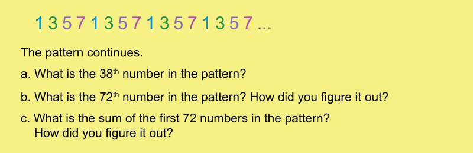
    
    \[Figure 9\]

</article>

### 9.10 Lines of Numbers Extra for Experts

<article>

**_Extras for Experts:_** **Lines of Numbers - Identify Patterns and Reason Proportionally**

**Solutions**

$$
1. \!\\
{\;}  \quad \text{a}.\ \text{The}\ 50^{\text{th}}\ \text{number is}\ 1: \!\\ 
{\;}  \qquad \ 50 \div 6\ \text{is}\ 8\ \text{with} \ 2 \ \text{left over and}\ 8 \times 6 = 48.\ \text{So the}\ 48^{\text{th}}\ \text{number is}\ 3,\ \text{the last number in} \!\\
{\;}  \qquad \ \text{the set. The}\ 50^{\text{th}}\ \text{number is}\ 2,\ \text{the second number in the set}. \!\\
{\;}  \quad \text{b}.\  \text{The}\ 100^{\text{th}}\ \text{number is}\ 3: \!\\
{\;}  \qquad \ 100 \div 6 = 16\ \text{with} \ 4 \ \text{left over and}\ 6 \times 16 = 96.\ \text{So the}\ 96^{\text{th}}\ \text{number is}\ 3.\!\\
{\;}  \qquad \ \text{Then the}\ 100^{\text{th}}\ \text{number is}\ 3.\!\\
{\;}  \quad \text{c}.\ \text{The sum of the first}\ 100\ \text{numbers is}\ 232: \!\\
{\;}  \qquad \ \text{The sum of one set of}\ 1,\ 2,\ 2,\ 3,\ 3,\ \text{and}\ 3\ \text{is}\ 14.\ \text{From the answer to question b,\ we know that} \!\\
{\;}  \qquad \ 16\ \text{sets of six numbers ends with}\ 96.\ \text{The sum of the first 96 numbers is} \!\\
{\;}  \qquad \ 16 \times 14,\ \text{or}\ 224.\ \text{The four left over numbers are}\ 1,\ 2,\ 2,\ \text{and}\ 3,\ \text{and their sum is}\ 8.\ \text{So the} \!\\
{\;}  \qquad \ \text{sum of the first}\ 100\ \text{numbers in the pattern is}\ 224 + 8,\ \text{or}\ 232.\!\\
2. \!\\
{\;}  \quad \text{a}.\ \text{The}\ 70^{\text{th}}\ \text{number is}\ 4: \!\\ 
{\;}  \qquad 70 \div 4\ \text{is}\ 17\ \text{with two left over and}\ 4 \times 17 = 68.\ \text{So the}\ 68^{\text{th}}\ \text{number is}\ 6,\ \text{the last number} \!\\
{\;}  \qquad \text{on the set. The}\ 70^{\text{th}}\ \text{number is}\ 4,\ \text{the second number in the set}. \!\\
{\;}  \quad \text{b}.\ \text{The}\ 125^{\text{th}}\ \text{number is}\ 3: \!\\ 
{\;}  \qquad 125 \div 4 = 31\ \text{with one left over and}\ 4 \times 31 = 124.\ \text{So the}\ 124^{\text{th}}\ \text{number is}\ 6. \!\\ 
{\;}  \qquad \text{The}\ 125^{\text{th}}\ \text{number will be}\ 3.\!\\
{\;}  \quad \text{c}.\ \text{The sum of the first}\ 125\ \text{numbers is}\ 561:\!\\ 
{\;}  \qquad \text{The sum of one set of}\ 3,\ 4,\ 5,\ \text{and}\ 6\ \text{is}\ 18.\ \text{From the answer to question b,\ we know that}\ 31 \!\\
{\;}  \qquad \text{sets of three numbers ends with}\ 124.\ \text{The sum of the first}\ 124\ \text{numbers is}\ 18 \times 31,\!\\
{\;}  \qquad \text{or}\ 558.\ \text{The left over numbers is}\ 3. \ \text{So the sum of the first}\ 125\ \text{numbers in the pattern is}\!\\
{\;}  \qquad 558 + 3,\ \text{or}\ 561.
$$

$$
3. \!\\
{\;}  \quad \text{a}.\ \text{The}\ 67^{\text{th}}\ \text{number is}\ 3: \!\\
{\;}  \qquad \ 67 \div 5 \ \text{is}\ 13\ \text{with two left over and}\ 5 \times 13 = 65.\ \text{So the}\ 65^{\text{th}}\ \text{number is}\ 9,\ \text{the last number}\!\\
{\;}  \qquad \ \text{in the set. The}\ 66^{\text{th}}\ \text{number is}\ 1,\ \text{and the}\ 67^{\text{th}}\ \text{is}\ 3. \!\\
{\;}  \quad \text{b}.\ \text{The}\ 129^{\text{th}}\ \text{number is}\ 7: \!\\
{\;}  \qquad \ 129 \div 5 = 25 \ \text{with} \ 4 \ \text{left over and}\ 5 \times 25 = 125.\ \text{So the}\ 125^{\text{th}}\ \text{number is}\ 7. \!\\ 
{\;}  \qquad \ \text{The}\ 129^{\text{th}}\ \text{is}\ 7,\ \text{the fourth number in the set.}\!\\
{\;}  \quad \text{c}.\ \text{The sum of the first}\ 129 \ \text{numbers is}\ 641: \!\\ 
{\;}  \qquad \text{The sum of one set of}\ 1,\ 3,\ 5,\ 7,\ \text{and}\ 9\ \text{is}\ 25.\ \text{From the answer to question b, we know that}\!\\
{\;}  \qquad 25\ \text{sets of four numbers ends with}\ 125.\ \text{The sum of the first}\ 125\ \text{numbers is}\!\\
{\;}  \qquad 25 \times 25,\ \text{or}\ 625.\ \text{The four left over numbers are}\ 1,\ 3,\ 5, \ \text{and}\ 7,\ \text{and their sum is}\ 16.\ \text{So the} \!\\
{\;}  \qquad \text{sum of the first}\ 129\ \text{numbers in the pattern is}\ 625 + 16,\ \text{or}\ 641.
$$

1.  
    
    \[Figure 1\]
    
2.  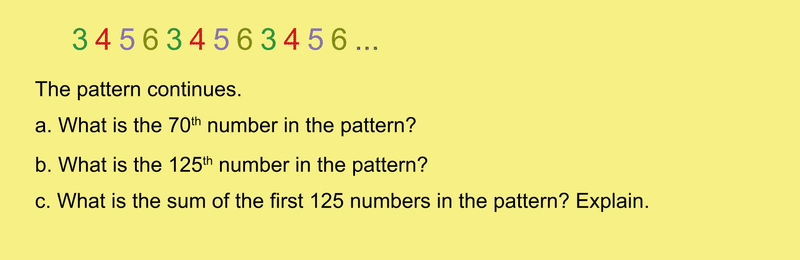
    
    \[Figure 2\]
    
3.  
    
    \[Figure 3\]

</article>

### 9.11 Fruit Confusion

<article>

**Fruit Confusion – Reason Proportionally**

**Teacher Notes**

In each problem, students are presented with a box of fruit labeled with it weight or cost, and a sign giving the cost for one or more pounds of the fruit or the cost of two or more pieces of the fruit. The pieces of fruit are of the same type (eg., all bananas) and are countable. Students use a proportion to figure out the average weight or cost of one piece of fruit. Students may use calculators for the computations.

**Solutions**

1.  $\$0.14; \frac{\$ 0.69}{1\ pound} = \frac{x \ dollars}{1.2\ pounds}$, so $x$ is about $0.83. One orange is $\$0.83 \div 6$ or about $0.14.
2.  $\$3.60; \frac{9 \ pounds}{x \ dollars} = \frac{4 \ avocados}{\$ 2.40}$, so $x = \$5.40$, the cost of 1.5 pounds. The cost of one pound is $\$5.40 \div 1.5$, or $3.60.
3.  0.7 pounds; $\frac{2\ pounds}{\$ 1.00} = \frac{x \ pounds}{\$ 2.10}$, so $x = 4.2$ pounds. One grapefruit weighs $4.2 \div 6$, or about 0.7 pounds.
4.  $\$0.05; \frac{3\ pounds}{\$ 1.20} = \frac{1.5\ pounds}{x \ dollars}$, so $x = \$0.60$, and $\$0.60 \div 12 = \$0.05$.

\begin{align*}
& \mathbf{Describe:} && \text{There are}\ 8\ \text{bananas in a box weighing a total of}\ 3.2\ \text{pounds. A sign shows that}\\
& && 4\ \text{pounds of bananas cost}\ \$2.00. \\
\\
& \mathbf{My \ Job:} && \text{Figure out the cost of one banana. Assume bananas weigh the same.} \\
\\
& \mathbf{Plan:} && \text{Use a proportion to figure out the cost of}\ 3.2\ \text{pounds of bananas}. \\ 
& && \text{Then divide that cost by 8 to get the cost of one banana}. \\
\\
& \mathbf{Solve:} && \frac{4\ pounds}{\$ 2.00} = \frac{3.2\ pounds}{x \ dollars}; 4x = \$2.00 \times 3.2.\ \text{So},\ 4x = \$6.40,\ \text{and}\ \$6.40 \div 4 =  \$1.60. \\
& && \text{One banana costs}\ \$1.60 \div 8,\ \text{or}\ \$0.20. \\
\\
& \mathbf{Check:} && \text{One banana weighs}\ 3.2 \div 8,\ \text{or}\ 0.4\ \text{pounds and costs}\ \$0.20. \\
& && 10\ \text{bananas} \times 0.4\ \text{pounds/banana} = 4\ \text{pounds}. \\
& && 10\ \text{bananas} \times \$0.20/\text{banana} = \$2.00
\end{align*}
$$

1.  
    
    \[Figure 2\]
    
2.  
    
    \[Figure 3\]
    
3.  
    
    \[Figure 4\]
    
4.  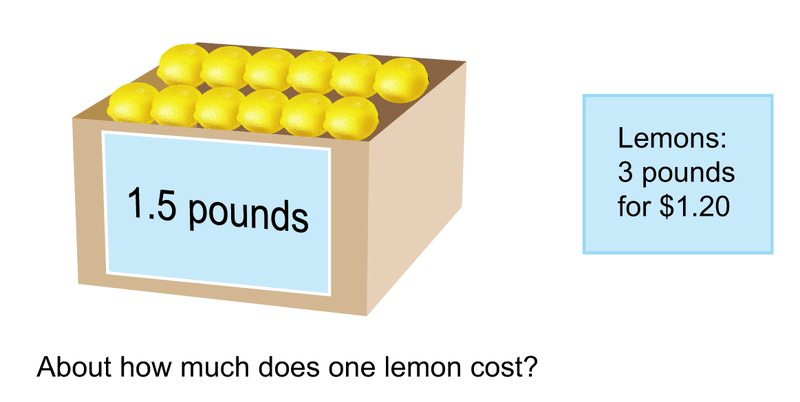
    
    \[Figure 5\]

</article>

### 9.12 Fruit Confusion Extra for Experts

<article>

**_Extra for Experts:_** **Fruit Confusion – Reason Proportionally**

**Solutions**

1.  $10; \frac{3\ pounds}{\$ 0.90} = \frac{4\ pounds}{x \ dollars}$, so $x$ is $\$1.20$, and $\$1.20 \div \$0.12$ is 10.
2.  $21; \frac{4\ pounds}{\$ 5.04} = \frac{5\ pounds}{x \ dollars}$, so $x = \$6.30$, and $\$6.30 \div \$0.30 = 21$

1.  
    
    \[Figure 1\]
    
2.  
    
    \[Figure 2\]

</article>

### 9.13 Yummy Yogurt and Yummy Yogurt Extra for Experts

<article>

**Yummy Yogurt – Write Function Rules**

**Notes to Teachers**

Students use facts on signs to complete tables of related data. They use variables to write rules that relate Number of Scoops to Total Cost. All functions are of the form $y = n(a) + b$. In that function, $\textbf{\textit{y}}$ represents the total cost of a cone of yogurt. The total cost is the sum of the cost of the cone or some other fixed item $\textbf{(\textit{b})}$ and the product of the number of scoops $(n)$, which varies, and the cost of one scoop $\textbf{(\textit{a})}$.

**Solutions**

**Yummy Yogurt 1**

a.

| **Number of Scoops** | **Total Cost** |
| --- | --- |
| 1   | $\$4.50$ |
| 2   | $\$6.00$ |
| 3   | $\$7.50$ |
| 4   | $\$9.00$ |

b. Rule: $\mathbf{T} = \$1.50\textbf{\textit{s}} + \$3.00$

**Yummy Yogurt 2**

a.

| **Number of Scoops** | **Total Cost** |
| --- | --- |
| 1   | $\$5.75$ |
| 2   | $\$8.75$ |
| 3   | $\$11.75$ |
| 4   | $\$14.75$ |

b. Rule: $\mathbf{T} = \$3.00\textbf{\textit{p}} + \$2.75$

**Yummy Yogurt 3**

a.

| **Number of Scoops** | **Total Cost** |
| --- | --- |
| 1   | $\$3.50$ |
| 2   | $\$5.50$ |
| 3   | $\$7.50$ |
| 4   | $\$9.50$ |

b. Rule: $\mathbf{T} = \$2.00\textbf{\textit{n}} + \$1.50$

**Yummy Yogurt 4**

a.

| **Number of Scoops** | **Total Cost** |
| --- | --- |
| 1   | $\$3.25$ |
| 2   | $\$4.50$ |
| 3   | $\$5.75$ |
| 4   | $\$7.00$ |

b. Rule: $\mathbf{T} = \$1.25\textbf{\textit{b}} + \$2.00$

a. Use the information in the sign. Complete the table to show how total cost is related to number of scoops.

b. Write a rule to represent the relationship between number of scoops and total cost. Use $\textbf{\textit{n}}$ for number of scoops and $\textbf{\textit{T}}$ for total cost.

$$
\begin{align*}
& \mathbf{Describe:} && \text{The sign shows the cost of a cone and the cost of one scoop of yogurt}. \\
& && \text{The table has two columns, one for number of scoops and the other for total cost}. \\
\\
& \mathbf{My \ Job:} && \text{Complete the table for}\ 1\ \text{through}\ 4\ \text{scoops of yogurt. Write a function rule} \\
& && \text{to show how total cost is related to number of scoops and the cost of the cone}. \\
\\
& \mathbf{Plan:} && \text{Start with the table. Remember to include the cost of the cone in the total} \\
& && \text{cost. Then write the rule}. \\
\\
& \mathbf{Solve:}
\end{align*}
$$

| **Number of Scoops** | **Total Cost** |
| --- | --- |
| 1   | $\$3.00$ |
| 2   | $\$5.00$ |
| 3   | $\$7.00$ |
| 4   | $\$9.00$ |

$$
\text{Rule}: \textbf{\textit{T}} \textbf{ \ = \$2.00}\textbf{\textit{n}} \textbf{\ + \$1.00} \;\;\;\;\;\;\;\;\;\;\;\;\;\;\;\;\;\;\;\;\;\;\;\;\;\;\;\;\;\;\;\;\;\;\;\;\;\;\;\;\;\;\;\;\;\;\;\;\;\;\;\;\;\;\;\;\;\;\;\;\;\;\;\;\;\;\;\;\;\;\;\;
$$

$$
\begin{align*}
& \mathbf{Check:} && \text{Use the rule to verify the table.} \;\;\;\;\;\;\;\;\;\;\;\;\;\;\;\;\;\;\;\;\;\;\;\;\;\;\;\;\;\;\;\;\;\;\;\;\;\;\;\;\;\;\;\;\;\;\;\;\;\;\;\;\;\;\;\;\;\;\;\;\;\;\;\;\;\;\;\;\;\;\;\;\;\;\;\;\;\;\;\;\;\; \\
\\
& && \$2.00 \times 1 + \$1.00 = \$3.00 \\
& && \$2.00 \times 2 + \$1.00 = \$5.00 \\
& && \$2.00 \times 3 + \$1.00 = \$7.00 \\
& && \$2.00 \times 4 + \$1.00 = \$9.00
\end{align*}
$$

**Yummy Yogurt 1 – Write Function Rules**

a. Use the information in the sign. Complete the table to show how total cost is related to number of scoops.

b. Write a rule to represent the relationship between number of scoops and total cost. Use $\textbf{\textit{s}}$ for number of scoops and $\textbf{\textit{T}}$ for total cost.

**Yummy Yogurt 2 – Write Function Rules**

a. Use the information in the sign. Complete the table to show how total cost is related to number of scoops.

b. Write a rule to represent the relationship between number of scoops and total cost. Use $\textbf{\textit{p}}$ for number of scoops and $\textbf{\textit{M}}$ for total cost.

**Yummy Yogurt 3 – Write Function Rules**

a. Use the information in the sign. Complete the table to show how total cost is related to number of scoops.

b. Write a rule to represent the relationship between number of scoops and total cost. Use $\textbf{\textit{n}}$ for number of scoops and $\textbf{\textit{L}}$ for total cost.

**Yummy Yogurt 4 – Write Function Rules**

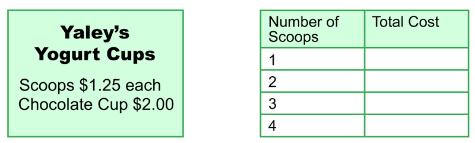

a. Use the information in the sign. Complete the table to show how total cost is related to number of scoops.

b. Write a rule to represent the relationship between number of scoops and total cost. Use $\textbf{\textit{b}}$ for number of scoops and $\textbf{\textit{C}}$ for total cost.

**_Extra for Experts:_** **Yummy Yogurt – Write Function Rules**

**Solutions**

**Extra for Experts: Yummy Yogurt 1**

a.

| **Number of Scoops** | **Total Cost** |
| --- | --- |
| 1   | $\$4.50$ |
| 2   | $\$7.50$ |
| 3   | $\$10.50$ |
| 4   | $\$13.50$ |

b. Rule: $\textbf{\textit{R}} = \$3.00\textbf{\textit{t}} + \$1.50$

**Extra for Experts: Yummy Yogurt 2**

a.

| **Number of Scoops** | **Total Cost** |
| --- | --- |
| 1   | $\$4.00$ |
| 2   | $\$5.25$ |
| 3   | $\$6.50$ |
| 4   | $\$7.75$ |

b. Rule: $\textbf{\textit{V}} = \$1.25\textbf{\textit{q}} + \$2.75$

**Extra for Experts: Yummy Yogurt 1 – Write Function Rules**

a. Use the information in the sign. Complete the table to show how total cost is related to number of scoops.

b. Write a rule to represent the relationship between number of scoops and total cost. Use $\textbf{\textit{t}}$ for number of scoops and $\textbf{\textit{R}}$ for total cost.

**Extra for Experts: Yummy Yogurt 2 – Write Function Rules**

a. Use the information in the sign. Complete the table to show how total cost is related to number of scoops.

b. Write a rule to represent the relationship between number of scoops and total cost. Use $\textbf{\textit{q}}$ for number of scoops and $\textbf{\textit{V}}$ for total cost.

</article>

### 9.14 Pedal Power

<article>

**Pedal Power – Write Functions Rules from Graphs and Tables**

**Teacher Notes**

Presented with line graphs representing two bikers’ speeds and a Fact about their relative speeds, students complete Distance-Time tables for each biker, and write functions to represent the relationship between number of miles and number of hours traveled for each biker. All line graphs show time in number of hours on the horizontal axis and distance in number of miles on the vertical axis.

**Solutions**

|     |     |     |
| --- | --- | --- |Pedal Power 1
| **Time (Number of hours)** | **Spiro Distance (Number of miles)** | **Hendricks Distance (Number of miles)** |
| --- | --- | --- |
| **0** | **0** | **0** |
| **1** | **0** | **6** |
| **2** | **3** | **12** |
| **3** | **6** | **18** |
| **4** | **9** | **24** |
| **5** | **12** | **30** |

**Spiro: $D = 3(t-1)$**

**Hendricks: $D = 6t$**

|     |     |     |
| --- | --- | --- |Pedal Power 2
| **Time (Number of hours)** | **Kelly Distance (Number of miles)** | **Finley Distance (Number of miles)** |
| --- | --- | --- |
| **0** | **0** | **0** |
| **1** | **0** | **6** |
| **2** | **0** | **12** |
| **3** | **8** | **18** |
| **4** | **16** | **24** |
| **5** | **24** | **30** |

**Kelly: $D = 8(t-2)$**

**Finley: $D = 6t$**

**Solutions**

|     |     |     |
| --- | --- | --- |Pedal Power 3
| **Time (Number of hours)** | **Robinson Distance (Number of miles)** | **Cranston Distance (Number of miles)** |
| --- | --- | --- |
| **0** | **0** | **0** |
| **1** | **0** | **10** |
| **2** | **5** | **20** |
| **3** | **10** | **30** |
| **4** | **15** | **40** |
| **5** | **20** | **50** |

**Robinson: $D = 5(t-1)$**

**Cranston: $D = 10t$**

|     |     |     |
| --- | --- | --- |Pedal Power 4
| **Time (Number of hours)** | **Landis Distance (Number of miles)** | **Bricknell Distance (Number of miles)** |
| --- | --- | --- |
| **0** | **0** | **0** |
| **1** | **0** | **4** |
| **2** | **0** | **8** |
| **3** | **0** | **12** |
| **4** | **8** | **16** |
| **5** | **16** | **20** |

**Landis: $D = 8(t-3)$**

**Bricknell: $D = 4t$**

**Pedal Power – Write Functions Rules from Graphs and Tables**

**Use the Fact and the graph. Complete the table for each biker showing distance traveled. Write a function to show the relationship between number of miles traveled $(D)$ and number of hours $(t)$ traveled for each biker.**

\begin{align*}
& \mathbf{Describe:} && \text{The graph is a Distance-Time graph and shows two lines. One line is} \\
& && \text{steeper than the other. One line starts where}\ t = 0.\ \text{The other line starts} \\
& && \text{where}\ t = 1.\ \text{The Fact identifies two bikers, Judson and Connors}. \\
& && \text{Judson left one hour after Connors and rode faster than Connors}. \\
\\
& \mathbf{My \ Job:} && \text{Use the graph and the Fact to figure out which line represents each biker}. \\
& && \text{Use the graph data to complete the table for each biker. Write the function} \\
& && \text{that shows the relationship between Distance and Time for each biker}. \\
\\
& \mathbf{Plan:} && \text{Use the Fact and graph to identify the line that represents Judson} \\
& && \text{Complete the table for Judson using points on the line. Write the} \\
& && \text{function rule. Do the same for Connors}. \\
\\
& \mathbf{Solve:} && \text{Since Judson leaves later than Connors,}\ \mathbf{line\ b}\ \text{represents Judson. Judson's} \\
& && \text{number of hours is one less than the number of hours Connors bikes}. \\
& && \text{Judson's line is steeper. This means that Judson is biking faster than Connors}.
\end{align*}
$$

| **Time (Number of hours)** | **Judson Distance (Number of miles)** | **Connors Distance (Number of miles)** |
| --- | --- | --- |
| 0   | 0   | 0   |
| 1   | 0   | 5   |
| 2   | 10  | 10  |
| 3   | 20  | 15  |
| 4   | 30  | 20  |
| 5   | 40  | 25  |

$$
\begin{align*}
& && \text{Judson}:\ D = 10(t - 1) \\
& && \text{Connors}:\ D = 5t
\end{align*}
$$

$$
\begin{align*}
& \mathbf{Check:} && \text{Replace variables in the functions with their values. Check results}\\
& &&\text{with data in the table}.
\end{align*}
$$

|     | **Judson** $D = 10(t - 1)$ | **Connors** $D = 5t$ |
| --- | --- | --- |
| For $t = 1$ | $0 = 10(1 - 1)$ | $5 = 5 \times 1$ |
| For $t = 2$ | $10 = 10(2 - 1)$ | $10 = 5 \times 2$ |
| For $t = 3$ | $20 = 10(3 - 1)$ | $15 = 5 \times 3$ |
| For $t = 4$ | $30 = 10(4 - 1)$ | $20 = 5 \times 4$ |
| For $t = 5$ | $40 = 10(5 - 1)$ | $25 = 5 \times 5$ |

**Pedal Power 1 – Write Functions Rules from Graphs and Tables**

**Use the Fact and the graph. Complete the table for each biker showing distance traveled. Write a function to show the relationship between number of miles traveled $(D)$ and number of hours $(t)$ traveled for each biker.**

**Use the Fact and the graph. Complete the table for each biker showing distance traveled. Write a function to show the relationship between number of miles traveled $(D)$ and number of hours $(t)$ traveled for each biker.**

**Use the Fact and the graph. Complete the table for each biker showing distance traveled. Write a function to show the relationship between number of miles traveled $(D)$ and number of hours $(t)$ traveled for each biker.**

**Use the Fact and the graph. Complete the table for each biker showing distance traveled. Write a function to show the relationship between number of miles traveled $(D)$ and number of hours $(t)$ traveled for each biker.**

\[Figure 10\]

</article>

### 9.15 Pedal Power Extra for Experts

<article>

**Extra for Experts: Pedal Power – Write Functions Rules from Graphs and Tables**

**Solutions:**

**Extra for Experts, Pedal Power: 1**

| **Time (Number of hours)** | **Jefferson Distance (Number of miles)** | **Richards Distance (Number of miles)** |
| --- | --- | --- |
| **0** | **0** | **0** |
| **1** | **6** | **0** |
| **2** | **12** | **0** |
| **3** | **18** | **18** |
| **4** | **24** | **36** |
| **5** | **30** | **54** |

**Jefferson:** $D = 6t$

**Richards:** $D = 18(t - 2)$

**Extra for Experts, Pedal Power: 2**

| **Time (Number of hours)** | **Prentiss Distance (Number of miles)** | **Jerome Distance (Number of miles)** |
| --- | --- | --- |
| **0** | **0** | **0** |
| **1** | **0** | **8** |
| **2** | **0** | **16** |
| **3** | **16** | **24** |
| **4** | **32** | **32** |
| **5** | **48** | **40** |

**Prentiss:** $D = 16(t - 2)$

**Richards:** $D = 8t$

**Extra for Experts: Pedal Power 1 – Write Functions Rules from Graphs and Tables**

**Use the Fact and the graph. Complete the table for each biker showing distance traveled. Write a function to show the relationship between number of miles traveled $(D)$ and number of hours $(t)$ traveled for each biker.**

**Use the Fact and the graph. Complete the table for each biker showing distance traveled. Write a function to show the relationship between number of miles traveled $(D)$ and number of hours $(t)$ traveled for each biker.**

\[Figure 4\]

</article>

